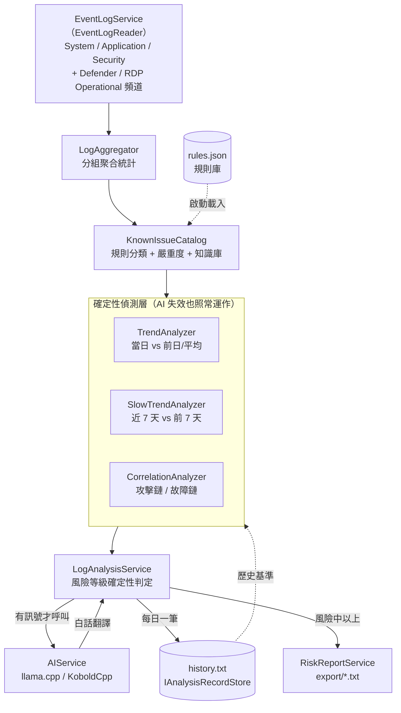

# LogForesight

分析 Windows Server 的 Event Log，**提早發現硬體故障前兆與入侵跡象**，在問題擴大前示警。
偵測與風險判定完全由確定性的規則/趨勢/慢速趨勢/關聯層負責；本機 AI 模型（llama.cpp + Gemma 26B/27B 級
MoE 小模型）只負責把這些結論**翻譯成白話**，讓不懂 Event Log 的人也能一眼看懂狀況該怎麼處理
（2026-07-20 AI 角色轉換，詳見 [docs/AI-ROLE-PLAN.md](docs/AI-ROLE-PLAN.md)）。

## 專案結構

```
LogForesight/          批次分析主程式（console exe）：讀 Event Log、呼叫 AI、體檢、權限監控，
│                       並回報執行紀錄與權限異動明細供 Web 使用（2026-07-21 Phase 1–4 配合項）
├── Program.cs
└── Service/           有狀態、會做 I/O 的服務

LogForesight.Core/     批次與 Web 共用的類別庫（2026-07-21 自批次專案抽出，行為零改變）
├── Analysis/           無狀態的純規則/分析邏輯：規則表、趨勢比對、跨 log 關聯分析、聚合統計、prompt 預算
├── Models/             資料模型：分析紀錄、AI 回應契約與容錯解析、權限快照、
│                        Web 身分/主機/處理狀態/權限異動確認/稽核/執行紀錄
├── Persistence/        持久層抽象：讀寫介面＋現行 JSONL/JSON 檔案格式的預設實作。
│                        換 DB 後端只需新增實作類別，分析邏輯與 Web 皆不需修改
└── Configuration/      appsettings.json 對應的設定類別

LogForesight.Web/      Web 查詢/維護介面（ASP.NET Core MVC，.NET 8，2026-07-21 Phase 0–4 完成）：
│                       儀表板、問題查詢、風險日詳情（含處理狀態/指派）、報表（Chart.js 可下鑽）、
│                       權限異動逐筆確認、規則維護（builtin 可改可回復不可刪）、CSV 匯入、
│                       執行監控、操作稽核。群組制授權（部門↔主機群組）＋JWT（HttpOnly Cookie）。
│                       完整規格與各期實作/驗收紀錄見 docs/WEB-SPEC.md；
│                       前期與批次共用同一資料目錄（Storage.DataRoot 指向批次執行檔目錄），
│                       SQL 後端（Phase 5）待 DB 環境就緒後啟動
└── （appsettings.json 已內含開箱即測的測試登入 svc-lfadmin / LogForesight-dev；
                        正式環境務必依檔內【正式環境需修改】說明改用環境變數與 Ldap，見 docs/WEB-SPEC.md §5）

LogForesight.Tests/    單元測試（xUnit）：五層偵測邏輯、儲存合約測試（JSONL 與未來 SQL 跑同一組案例）、
                        Web 授權範圍/處理流程/規則保護/CSV 匯入
```

C# 專案採檔案掃描（非資料夾對應命名空間），批次與 Core 統一 `namespace LogForesight`
（資料夾純粹是實體檔案的分類）；Web 專案依 ASP.NET 慣例採資料夾對應命名空間（`LogForesight.Web.*`）。

## 架構



每次執行的流程：**權限/角色異動檢查（與歷史回補無關，每次執行都做一次）→
清理過期歷史 → 找出近 14 天缺漏的日子（首次執行 = 全部）→
多個日誌來源（含 Defender/RDP Operational 頻道）平行掃描、一次取回整個區間的事件並按日分桶 → 逐日分析：聚合統計 →
規則標記已知危險訊號（規則命中的問題同時查得靜態知識庫）→ 與歷史做頻率比對
（首次出現/頻率上升自動升級嚴重度）→ 慢速趨勢偵測（近 7 天 vs 前 7 天總量比較）→
風險等級確定性判定 → 低風險日直接寫模板句、其餘連同比對結果與近 14 天歷史組成 prompt →
AI 白話翻譯（JSON 格式/內容檢查未過自動重問）→ 寫回歷史資料庫 → console 示警**。

## 提早發現問題的邏輯

### 核心設計：五層偵測

「偵測」和「判讀」分開，各用擅長的工具（使用的是地端 Gemma 26B/27B 級小模型，
所有能確定性計算的判斷都由程式先做掉，模型只負責把結論翻譯成白話）：

| 層 | 負責 | 為什麼 |
|---|---|---|
| **規則層** (`KnownIssueCatalog`) | 比對已知危險事件（Source + Event ID + 次數門檻），確定性命中；規則命中的問題同時附帶靜態知識庫內容（白話說明／常見原因／處置步驟），不需要 AI 深入分析 | 已知模式用規則抓，100% 召回、零成本，不賭小模型會不會漏看；同一 Event ID 的原因/處置幾乎不變，寫死比每次重新生成更快、更一致、零幻覺 |
| **趨勢層** (`TrendAnalyzer`) | 當日各事件的次數 vs 前一日 vs 近 14 日平均，程式直接算出「首次出現 / 頻率上升 / 重複發生 / 下降」 | 數字比較程式做得又快又準，不該指望模型在腦中做算術 |
| **慢速趨勢層** (`SlowTrendAnalyzer`，2026-07-20 新增) | 近 7 天 vs 前 7 天總量比較，每日、全主機、確定性執行，捕捉躲在趨勢層單日門檻下的緩慢惡化訊號 | 取代原本「每週體檢」找慢速斜線的職責，偵測延遲從最壞 7 天縮到 1 天，且是純算術、可單元測試、進 `--selftest` |
| **關聯層** (`CorrelationAnalyzer`) | 比對「多個獨立事件的已知組合模式」：攻擊鏈、故障連鎖、跨日推進（見下方清單） | 單一事件各自不嚴重、組合起來卻是明確故事——這種跨 log 關聯判讀正是小模型最容易漏掉的，必須程式先比對好 |
| **AI 層** (Gemma) | 把前四層已確定的結論（風險等級、趨勢、關聯訊號）翻譯成白話標題與敘述，讓不懂 Event Log 的人也能看懂該怎麼處理；只有規則未涵蓋的 Other 類問題才由 AI 判讀根因與處置建議 | AI 不是判斷風險或找根因的引擎（那是前四層與靜態知識庫的職責），語意轉譯與白話敘事才是規則做不到、AI 真正擅長的部分 |

五層結論取較嚴重者：規則或關聯鏈命中 Critical → 風險強制「高」；
趨勢層（含慢速趨勢）有頻率異常或關聯層有任何訊號 → 風險至少「中」。AI 判斷只能把風險往上拉、
不能往下壓，即使 AI 判斷輕忽或 AI 服務不可用也不影響告警與處置建議（詳見
[docs/AI-ROLE-PLAN.md](docs/AI-ROLE-PLAN.md)）。

### 關聯層偵測的組合模式（`CorrelationAnalyzer`）

| 模式 | 組合條件 | 意義 |
|---|---|---|
| 【入侵鏈】 | 大量 4625（≥10）＋帳號建立/提權（4720/4732 等）同日 | 暴力破解得手後建立立足點；有時間先後可判斷時會標注時序是否符合攻擊推進 |
| 【破解得手】 | 大量 4625（≥10）＋條件式撈取的 4624（成功登入）與失敗記錄同一組帳號/IP | 比帳號建立/提權更早、更直接的得手證據——暴力破解攻擊者未必馬上建帳號提權，可能先潛伏 |
| 【持久化】 | 帳號異動或攻擊嘗試＋新服務/排程任務（7045/4697/4698）同日 | 入侵後植入後門 |
| 【滅跡】 | 稽核清除/變更（1102/4719/4907）＋同日其他安全事件 | 入侵者清除操作痕跡 |
| 【提權→植入】 | 權限/特權異動（4670/4703 等）＋新服務/排程任務同日 | 先取得權限再植入執行體 |
| 【暴力破解→RDP 得手】 | **昨日**大量 4625（≥10）的來源 IP，**今日**以 RDP 成功登入（21/25/1149）同一 IP | 暴力破解跨日以遠端桌面得手；純以 IP 交集判定，無交集不觸發 |
| 【防護遭關閉→惡意程式】 | Defender 防護被關閉/停用（5001/5010/5012）＋同日惡意程式偵測或攻擊訊號（也含跨日：昨日關防護、今日驗出惡意程式） | 入侵者常在植入前先解除防護；單獨關防護只走規則層、不觸發關聯 |
| 【惡意程式→持久化】 | Defender 惡意程式偵測（1006/1116 等）＋新服務/排程任務同日 | 惡意程式建立持久化立足點 |
| 【跨日入侵鏈】 | **昨日**大量登入失敗＋**今日**帳號/權限/服務異動 | 攻擊者跨日推進，比單日訊號更值得警戒 |
| 【儲存連鎖】 | disk/Ntfs/storahci 三類儲存訊號同日命中 ≥2 類 | 硬碟故障連鎖反應，故障迫在眉睫 |
| 【儲存→當機】 | 儲存錯誤＋非預期關機（41/6008）同日 | 儲存故障已導致系統崩潰 |
| 【儲存持續劣化】 | 儲存錯誤連續兩日出現 | 不是偶發抖動，硬碟剩餘壽命可能以天計 |
| 【硬體不穩】 | WHEA 硬體錯誤＋非預期重開同日 | 硬體劣化已實際影響穩定性 |
| 【崩潰→服務失敗】 | 應用程式崩潰（1000/1026）＋服務異常終止（7031/7034）同日 | 可能為同一應用的崩潰導致服務失敗 |
| 【崩潰循環→資源耗盡】 | 服務高頻異常終止（≥100 次）＋資源耗盡（2004）同日 | 崩潰重啟循環正在拖垮整機 |
| 【時間偏移→驗證失敗】 | 時間同步失敗＋登入失敗同日 | 時鐘偏移造成的假性攻擊訊號（仍需排除真攻擊） |

關聯訊號在 prompt 中以獨立區塊呈現並明確標注「由程式確定性比對，不是猜測」，
console 以紅色🔗區塊顯示，風險報告的整體摘要一併列出，也存入歷史資料庫的 `CorrelationAlerts` 欄位。

### 正常 RDP 使用不會誤報的設計（2026-07 RDP 頻道擴充）

納入 RDP 連線紀錄擴大了入侵偵測面，但**日常遠端維運絕不能被誤判成入侵**。防誤報靠三道設計：
RDP 事件規則一律 Low（不參與風險判定、不觸發「首次出現」告警）、無任何 RDP 單獨告警規則、
入侵訊號一律經由「有錨點」的確定性關聯才成立。下列正常情境保證**不產生任何告警**：

| 情境 | 結果 |
|---|---|
| 管理員每天 RDP 維運（21/24/25/1149 數十筆） | Low 簽章、趨勢 Recurring，零告警、零風險拉升 |
| 新員工第一次 RDP 登入 | 簽章鍵不含帳號，非新簽章，無變化 |
| 同一天大量正常重連（會議室機、跳板機） | 需達「今日 ≥5 且 ≥ 頻道歷史平均 2 倍」才出頻率上升告警（既有 TrendAnalyzer 門檻，且新頻道暖身 3 天內不吵）——RDP 用量真暴增本來就值得看一眼，屬預期而非誤報 |
| 正常成功登入 4624 | 平日完全不收集；只在同日 4625 ≥ 10 的嫌疑日才條件式撈取，且需帳號/IP 交集才成立訊號 |
| 零星登入失敗（< 10 次/日） | 4625 規則門檻 10、未達降級，無關聯錨點 |
| 管理員 RDP 登入後建帳號/裝服務 | **刻意不建**「RDP 登入＋帳號建立」這類無錨點模式——管理員遠端建帳號是日常維運，必誤報 |
| 頻道上線第一天 | 全部趨勢 Unknown、前 3 天暖身期不產生 New/Rising 告警 |

只有兩種有錨點的組合才把 RDP 成功登入判成入侵：**【破解得手】**（同日 4625 ≥ 10 且相同帳號/IP
出現成功登入，成功面現含 RDP 工作階段）與**【暴力破解→RDP 得手】**（昨日暴力破解的來源 IP、
今日以 RDP 成功登入同一 IP）。兩者都需要「暴力破解達門檻」加「帳號/IP 交集」，正常使用不會命中。

### 頻率趨勢比對的判定規則（`TrendAnalyzer`）

每個事件簽章 `(LogName, Source, EventId, EntryType)` 逐一與歷史比對：

| 趨勢 | 判定條件 | 後續動作 |
|---|---|---|
| **首次出現 (New)** | 近 14 日歷史中從未發生 | 嚴重度 High 以上者列入頻率異常告警 |
| **頻率上升 (Rising)** | 今日次數 ≥ 5 **且** ≥ 歷史平均 2 倍 | **嚴重度自動升一級**（High→Critical 會觸發紅色告警），列入頻率異常告警 |
| **重複出現 (Recurring)** | 歷史中出現過、頻率相近 | 附註出現天數與平均次數供 AI 判讀 |
| **頻率下降 (Declining)** | 歷史平均 ≥ 5 且今日次數 ≤ 平均一半 | 附註（問題可能已緩解） |

另外比對**整體錯誤總量**：今日錯誤 ≥ 10 筆且 ≥ 近 14 日平均 2 倍時，即使個別事件都不顯眼也會告警
（多個不同來源同時出錯常是連鎖故障的開端）。

「今日次數 ≥ 5」的最低門檻是為了避免 1 次變 2 次這種統計雜訊觸發告警；
所有比對結果（前一日次數、歷史平均、出現天數）都會附註在 prompt 的事件行上，
並存入歷史紀錄的 `TopIssues` 與 `TrendAlerts` 欄位。

### 為什麼歷史紀錄能「提早」發現問題

很多故障不是突然發生的，而是**訊號頻率逐漸上升**：

- 硬碟壞掉前幾週，`disk` Event 153 / `storahci` Event 129 會從偶發變成每天數十次
- 記憶體劣化時，WHEA corrected error 次數會持續攀升（系統還能自我修正，所以不會當機，但這是換料的最佳時機）
- 暴力破解通常先有低頻率的探測（每天幾次 4625），確認服務存在後才開始大量嘗試

單看一天的 log 看不出這些，所以每天的分析結果（錯誤數、警告數、重點問題簽章與次數、風險等級）
會壓縮成一行 JSON 存入歷史。**這是新問題、重複發生、還是正在惡化**，由 `TrendAnalyzer`
（單日 vs 歷史平均）與 `SlowTrendAnalyzer`（近 7 天 vs 前 7 天總量，2026-07-20 新增）兩層
確定性判定，AI 只負責把已經判定好的結論接續前幾天脈絡講成白話（`trend_story` 欄位）。

### 監控的危險訊號清單

#### 硬體故障前兆（System log）

| 來源 | Event ID | 意義 | 嚴重度 |
|---|---|---|---|
| disk | 7, 11, 51, 52, 153 | 磁碟 I/O 錯誤、壞軌前兆 — **硬碟即將故障最直接的訊號** | Critical |
| Ntfs | 55, 98, 130, 140, 141 | 檔案系統損毀跡象 | Critical |
| storahci / stornvme | 129 | 儲存控制器逾時重置，常見於硬碟劣化、線材或背板異常 | High |
| WHEA-Logger | （全部） | CPU / 記憶體 / PCIe 硬體錯誤；corrected error 上升＝硬體劣化中 | Critical |
| Kernel-Power | 41 | 非預期斷電或當機重開（電源、過熱、硬體不穩） | Critical |
| EventLog | 6008 | 非預期關機 | High |
| Resource-Exhaustion-Detector | 2004 | 虛擬記憶體即將耗盡（可能有程式記憶體洩漏） | High |
| srv | 2013 | 磁碟空間即將不足 | Medium |

#### 入侵跡象（Security log + System log）

| 來源 | Event ID | 意義 | 嚴重度 |
|---|---|---|---|
| Security-Auditing | 4625 | 登入失敗；**單日 ≥10 次**視為暴力破解攻擊 | High |
| Security-Auditing | 4740 | 帳戶被鎖定（通常是暴力破解的結果） | High |
| Security-Auditing | 1102 | **安全稽核日誌被清除 — 入侵者滅跡的典型行為，應立即調查** | Critical |
| Security-Auditing | 4719 | 稽核原則被變更（關閉記錄以躲避偵測） | High |
| Security-Auditing | 4720, 4722, 4724 | 帳戶建立 / 啟用 / 密碼被重設 — 入侵者建立立足點 | High |
| Security-Auditing | 4728, 4732, 4756 | 帳戶被加入特權群組（如 Administrators）— 典型提權手法 | High |
| Security-Auditing | 4729, 4733, 4757 | 帳戶被**移出**特權群組 — 也可能是提權得手後清除紀錄 | High |
| Security-Auditing | 4697, 4698 | 安裝服務 / 建立排程任務 — 常見持久化手法 | High |
| Security-Auditing | 4670 | 檔案/資料夾/登錄物件的**權限 (ACL) 被變更** | High |
| Security-Auditing | 4907 | 物件的**稽核設定 (SACL) 被變更** — 針對性關閉稽核以躲避偵測 | Critical |
| Security-Auditing | 4717, 4718 | 系統存取權限被授予/移除（User Rights Assignment） | High |
| Security-Auditing | 4704, 4705 | 使用者權限指派被新增/移除 | High |
| Security-Auditing | 4703 | 權杖 (token) 特殊權限於執行期間被調整 — 常見提權攻擊手法 | High |
| Security-Auditing | 4735 | 安全群組的內容或權限被變更 | High |
| Security-Auditing | 4739 | 網域原則被變更（僅網域控制站） | High |
| Security-Auditing | 4731, 4734 | 本機安全群組被建立/刪除 | Medium |
| Service Control Manager | 7045 | 安裝新服務 — 非預期時可能是後門植入 | High |

> 上表的權限/角色事件無論是「授予」還是「移除」都收錄——移除同樣值得關注
> （可能是入侵者提權得手後清除操作紀錄）。這些事件都需要 Security log 讀取權限；
> 若無法以系統管理員權限執行，改用下方「權限/角色異動監控」章節的機制。

#### 惡意程式與防護狀態（Microsoft Defender Operational 頻道，2026-07 EventLogReader 遷移後可讀）

| 來源 | Event ID | 意義 | 嚴重度 |
|---|---|---|---|
| Windows Defender | 1006, 1116 | 偵測到惡意程式（偵測本身即明確訊號） | High |
| Windows Defender | 1007, 1117 | 已對惡意程式採取處置（隔離/移除） | Medium |
| Windows Defender | 1008, 1118, 1119 | **處置失敗，惡意程式可能仍活躍** — 應立即隔離主機 | Critical |
| Windows Defender | 5001 | 即時防護被關閉（管理員合法操作 vs 入侵者解除防護，需確認來源） | High |
| Windows Defender | 5010, 5012 | 防毒/掃描被停用（第三方防毒接管屬正常情境） | Medium |
| Windows Defender | 1005 | 排程掃描失敗，防護涵蓋率可能不完整 | Medium |
| Windows Defender | 2001, 2003, 2004 | 病毒碼/引擎更新失敗；**單日 ≥3 次**才升 Medium（偶發網路失敗屬雜訊） | Medium |

> Defender 事件天生低誤報——偵測到惡意程式本身就是訊號。分級的關鍵在「已處置（Medium）vs
> 處置失敗（Critical）」，刻意**不做**「1116 之後沒看到 1117」這類缺席推論（資料不完整時會誤報）。
> 主機未安裝 Defender（如第三方防毒取代）時該頻道不存在，程式申報「不適用」而非錯誤。

#### 遠端桌面連線（RDP TerminalServices Operational 頻道，2026-07 新增）

| 來源 | Event ID | 意義 | 嚴重度 |
|---|---|---|---|
| TerminalServices-LocalSessionManager | 21, 24, 25 | RDP 工作階段登入/中斷/重連 | **Low（收集用，非告警）** |
| TerminalServices-RemoteConnectionManager | 1149 | RDP 驗證成功 | **Low（收集用，非告警）** |

> **這兩條規則刻意設為 Low：正常遠端桌面使用即會產生，本身不是告警訊號。** 收集目的是提供
> 關聯分析（【破解得手】【暴力破解→RDP 得手】需要成功登入的帳號/IP）與趨勢基準。入侵訊號一律
> 經由「有錨點」的確定性關聯（暴力破解達門檻、帳號/IP 交集）才成立，見下方「正常 RDP 使用不會
> 誤報的設計」。RDP 訊息的帳號（`User: DOMAIN\user`）會同時抽出純帳號，才能與 4625 的純帳號對得上。

#### 服務穩定性（System / Application log）

| 來源 | Event ID | 意義 | 嚴重度 |
|---|---|---|---|
| Service Control Manager | 7031, 7034 | 服務異常終止；單日 ≥3 次才升為 Medium（偶發屬正常雜訊） | Medium |
| Service Control Manager | 7000, 7001 | 服務啟動失敗 | Medium |
| Application Error | 1000 | 應用程式反覆崩潰（≥3 次）——服務完全掛掉前的先兆 | Medium |
| .NET Runtime | 1026 | .NET 未處理例外反覆發生（≥3 次） | Medium |

#### 營運健康（備份 / 時間 / 憑證 / 網域）

不是硬體壞、也不是被入侵，但放著不管就會演變成停機或災難的訊號：

| 來源 | Event ID | 意義 | 嚴重度 |
|---|---|---|---|
| Microsoft-Windows-Backup | 517 | **備份失敗**——備份損壞往往到需要還原時才發現 | High |
| VSS | （全部錯誤） | 陰影複製錯誤，會導致備份失敗或不完整 | Medium |
| Time-Service | 29, 36, 47, 50 | 時間同步失敗；偏移 >5 分鐘 Kerberos 驗證全面失敗 | Medium |
| CertificateServicesClient-AutoEnrollment | 64 | **憑證即將到期**——最容易預防的停機原因 | Medium |
| Schannel | 36870 | TLS 憑證私鑰存取失敗（憑證過期或權限異常） | Medium |
| GroupPolicy | 1030, 1058 | 群組原則套用失敗（≥3 次），SYSVOL/DC 連線問題先兆 | Medium |
| NETLOGON | 5719 | 無法連上網域控制站（≥3 次） | Medium |
| DhcpServer | 1020 | DHCP 位址池即將耗盡（僅 DHCP 角色會出現） | Medium |
| WindowsUpdateClient | 20 | 更新安裝失敗，持續失敗累積未修補的安全風險 | Low |

> Security log 的 SuccessAudit 事件量極大（每次登入都記一筆），所以只挑
> `KnownIssueCatalog.SecurityAuditWatchlist` 內的高價值事件納入，其餘忽略。

### 給 AI 判讀的輔助資訊（除了事件本身）

| 資訊 | 來源 | 為什麼需要 |
|---|---|---|
| 發生時段 `FirstSeen`~`LastSeen` | 聚合時計算 | 「4625 x50 集中在凌晨 03:00~03:10」和「分散全天」意義完全不同 |
| 訊息多樣性（相異內容數 + 3 則範例） | 聚合時計算 | 區分「同一服務掛 10 次」（服務有問題）和「10 個服務各掛一次」（系統層問題） |
| Security 事件的帳號/IP 彙總 | 從完整訊息抽取（範例訊息 200 字常截不到這些欄位） | 判斷是「單一 IP 打單一帳號」還是「掃描多帳號」——入侵分析最關鍵的依據 |
| 星期幾 | 日期換算 | 讓模型認出「每週日固定維護重開機」這類正常規律 |
| 非低風險歷史日的當日結論 | 歷史紀錄的 `Summary` | 模型看得到先前判讀脈絡：這問題之前判定過什麼、是否已知原因 |
| 伺服器角色描述 | `Program.cs` 的 `ServerDescription`（自行填寫） | 同一事件在 AD 網域控制站和一般檔案伺服器上的嚴重性不同 |
| 稽核事件總量趨勢 | `TrendAnalyzer` 獨立比對（4625 等稽核事件不計入錯誤數） | 安全事件總量暴增時即使個別簽章不顯眼也會告警 |

> 注意：classic EventLog API 讀取新式 **Critical 等級**事件（如 Kernel-Power 41）時，
> `EntryType` 可能為 0（列舉中沒有 Critical 值）。程式已特別納入這類事件並計入錯誤數，
> 避免最嚴重的事件反而被過濾掉。

## 資料完整性與涵蓋率誠實申報

兩個容易被忽略、卻會讓「沒告警」被誤讀成「沒問題」的情況，程式已明確標注：

- **回補時 Event Log 已被覆蓋**：`EventLogService` 倒序掃描到日誌最舊一筆仍未低於請求區間起點時，
  代表該來源保留的歷史不足以涵蓋整個回補區間（較舊的事件已被系統覆蓋，不是真的沒事件）。
  這幾天的紀錄會標記 `DataIncomplete = true`，`TrendAnalyzer` 計算 14 日基準時排除這些日子，
  避免不完整的一天把平均值墊低/墊高，讓之後的正常量被誤判為異常（或反過來蓋掉真異常）。
- **Security log 本次無法讀取**（無系統管理員權限）：紀錄標記 `SecurityLogAvailable = false`，
  console 與風險報告會逐條列出因此停用的偵測項目（入侵跡象規則表、涉及 Security 的關聯模式、
  4624 破解得手比對、安全稽核事件總量趨勢），而不是一句「讀取失敗」帶過——讓看報告的人知道
  「沒告警 ≠ 沒問題，是沒看」。趨勢基準計算也會排除這些日子的 Security 簽章，避免權限恢復後
  的正常量被誤判成「首次出現」或「頻率上升」。

## 體檢（WeeklyCheckupService，2026-07-20 重設計：due-date 輪巡＋確定性閘門）

除了每日分析，另外做週期性的「期間回顧」。原本「找出單看每天都不明顯、但整週合起來是持續
累積或緩慢惡化的訊號」這件**發現**的工作，已改由每日全主機執行的確定性 `SlowTrendAnalyzer`
（近 7 天 vs 前 7 天總量比較，見上方「五層偵測」）負責——偵測延遲從最壞一整個週期縮短到 1 天。
體檢因此只剩下**講這段期間的故事**：把窗口內已經確定有訊號的日子，接續上次體檢的結論寫成
一段白話回顧。

- **觸發時機（due-date 輪巡，取代原固定星期六）**：`appsettings.json` 的
  `Analysis.CheckupIntervalDays`（預設 7 天）；距上次體檢達此天數即到期執行，不綁定固定星期幾，
  是既有「距上次體檢 > 7 天自動補跑」機制的一般化——單機情境下等同「每 N 天做一次」，
  漏跑（機器關機、排程失敗）時下次執行自動補上，體檢不會因此消失。
- **確定性閘門**：窗口內任一天有風險（非「低」）、趨勢異常或關聯訊號，才呼叫 AI 敘事；
  三層皆無訊號的窗口直接寫固定結論「本期無累積性異常，程式比對通過」，不消耗 AI 呼叫——
  安靜的期間本來就沒有故事可講，這是多主機規模下 AI 時間預算能否成立的關鍵之一
  （詳見 [docs/AI-ROLE-PLAN.md](docs/AI-ROLE-PLAN.md)）。
- **AI 失敗不消耗額度**：閘門判定有訊號、實際呼叫 AI 卻失敗時，該次**不寫入歷史**
  （`WeeklyCheckupResult.Completed = false`），讓下次執行的補跑機制重試，而不是把這一期的
  體檢額度用掉。
- **輸入塑形**：不是把窗口內歷史原樣塞給模型——程式先彙整成「每個問題簽章一行、含期內逐日
  次數」，依嚴重度取前 40 行，控制 prompt 在小模型可負擔的範圍內；同時帶入上次體檢結論，
  讓模型知道「上次說要觀察的那件事後來如何」。
- **輸出**：結論寫入當日歷史紀錄的 `WeeklyCheckup` 欄位；**有發現才**輸出
  `export\{日期}_週檢.txt`（檔名沿用既有慣例），無累積性異常的期間不產生檔案。

## 部署驗證（--selftest / --debug-dump）

換一台主機部署前，建議先跑：

```
LogForesight.exe --selftest
```

不需要設定檔、不呼叫 AI、不讀真實 Event Log、不寫 history，注入合成事件跑完整的規則層/趨勢層/
慢速趨勢層/關聯層純函數邏輯，印出每一條規則、每個趨勢分支、每個關聯模式的「應命中/實際命中」
比對結果，一分鐘內確認五層偵測邏輯在新環境正常，而不是等真的出事才發現某條規則沒動。
exit code 0 = 全部通過。

**2026-07-21 規則外部化後**：`--selftest` 一律**唯讀**載入目前實際生效的規則——資料根目錄
（`Storage.DataRoot`，留空＝執行檔目錄）有
`rules.json` 就驗證它（輸出開頭會標明「驗證對象：{路徑}（seed vX）」），沒有或載入失敗就驗證
內建種子（標明「驗證對象：內建種子」）。**絕不寫入任何檔案**，包括不會幫你建立 `rules.json`
——這個承諾是刻意的：`--selftest` 要能在乾淨環境反覆執行而不留副作用。額外會檢查：規則驗證
有無不合格項目、是否有規則被排序在前面的規則遮蔽（永遠不會命中）、推導出的 Security 稽核
watchlist 是否涵蓋齊全、關聯層引用的事件 ID 是否都存在於目前規則表；`suppressions.json`
存在時也會唯讀列出每筆抑制的到期狀態。**改完 `rules.json` 後的建議 SOP 就是跑一次
`--selftest`，exit code 0 代表這次修改沒有破壞既有的偵測邏輯。**

驗證期需要看到完整 prompt 與 AI 原始回應（平常的診斷 log 刻意不記錄這些，見下方「診斷用檔案
Log」章節）時，加上 `--debug-dump`：

```
LogForesight.exe --debug-dump
```

每次 AI 呼叫（含 JSON 重試的每次嘗試）會各輸出一個檔案到執行檔目錄的 `diag\`，驗證完可以直接
刪除整個資料夾，平常執行不要加這個參數（會持續佔用磁碟空間）。

## 規則庫（rules.json）與抑制設定

2026-07-21 規則外部化：`KnownIssueCatalog` 的規則表（本文件「監控的危險訊號清單」列出的
那些規則）不再寫死在程式碼裡，改成第一次執行時寫入執行檔目錄的 **`rules.json`**，之後直接
編輯這個檔案即可調整規則，**不需要重新編譯部署**。完整設計定案（語意邊界、seed/匯入政策、
未來 DB 映射）見 [docs/RULES-PLAN.md](docs/RULES-PLAN.md)，這裡只說日常維護怎麼做。

### 維護 SOP

1. 用文字編輯器打開 `rules.json`（**務必存成 UTF-8**——內容是中文長文字，記事本存檔時注意
   編碼，否則下次打開會看到亂碼）。
2. 新增規則：複製一條現有規則當模板，改 `Id`（建議 `custom-` 開頭）、`Origin` 設成 `"custom"`、
   填好 `SourcePattern`/`EventIds`/`Category`/`Severity` 與四個知識庫欄位
   （`PlainExplanation`/`Impact`/`LikelyCauses`/`NextSteps`）。
   停用某條規則：把該條的 `Enabled` 改成 `false`（保留在檔案裡，不用刪除）。
3. **改完存檔後跑一次 `LogForesight.exe --selftest`**，exit code 0 就是好的——它會唯讀載入
   你剛改的 `rules.json`，驗證欄位是否合格、有沒有規則彼此遮蔽、關聯層事件 ID 是否仍對得上，
   不需要真的跑一次分析才能確認改壞了沒有。

### 已知限制與注意事項

- 想微調某條 `builtin` 規則的內容（改門檻、改處置文字）？**不要直接改那條**——程式改版後的
  `--import-rules` 可能會覆蓋回去（見下）。正確做法：把該條 `Enabled` 設 `false`，複製一條
  改成 `custom-` 開頭的新規則再修改。
- 規則的比對順序＝檔案裡的陣列順序（第一個命中的規則生效）；`--selftest` 會警告「永遠不會被
  命中」的規則（被排在前面、範圍更廣的規則遮蔽），照提示調整順序或縮小比對範圍即可。
- **停用規則不會讓對應事件從趨勢層/關聯層的偵測中消失**（只是不再有規則命中的分類與知識庫
  說明），這是刻意設計，見 docs/RULES-PLAN.md 的語意邊界說明。

### 匯入程式內建的新規則／更新（`--import-rules`）

程式改版後若內建規則有新增或修訂，啟動時會提示「內建規則有更新（vX→vY）」。要套用：

```
LogForesight.exe --import-rules                          # 預覽：列出將新增/更新/略過/衝突的規則，不寫檔
LogForesight.exe --import-rules --apply                  # 套用：新增缺少的 builtin 規則
LogForesight.exe --import-rules --apply --overwrite-builtin   # 連同「內容被程式更新過」的既有 builtin 規則一併覆蓋
```

你自訂的 `custom` 規則永遠不會被這個指令碰到；`--overwrite-builtin` 覆蓋時也會保留你對該條
`Enabled` 的設定（停用不會被悄悄打開）。

> **既有部署升級到 EventLogReader 版（seed v2）的 SOP**：seed v2 新增了 Defender/RDP 規則。
> 已有 `rules.json`（seed v1）的主機換上新執行檔後，啟動會提示「頻道已啟用但規則表沒有對應規則」
> ——依序執行 `--import-rules`（預覽 v1→v2 差異）→ `--import-rules --apply`（補上 Defender/RDP
> 規則）→ `--selftest`（exit code 0 即完成）。**未匯入前的行為是誠實申報的**：Defender/RDP 的
> Information 等級事件不會被收集（沒有 watchlist），啟動時會警告並在當日申報，不會靜默漏偵測。

### 主機級告警抑制（`--suppress` / `--unsuppress` / `--list-suppressions`）

某條規則在這台主機上已確認是已知雜訊、不想再收到通知，但又不想整條規則永久停用（停用後
其他主機也會跟著沒有分類）時，用抑制：

```
LogForesight.exe --suppress builtin-service-crash-loop-703x --reason "MyApp 重啟屬正常" --days 30
LogForesight.exe --list-suppressions
LogForesight.exe --unsuppress builtin-service-crash-loop-703x
```

**抑制只關掉通知與風險升級，事件仍會照常聚合、命中規則、寫入歷史**——這樣才能在體檢報告與
未來的管理頁看到「這條被抑制的規則本期實際發生了幾次」，暫時關掉的東西不會變成沒人記得的
永久盲區。`--days` 省略則永久生效直到手動 `--unsuppress`；到期後不會自動清理，只是恢復告警，
執行時 console 會提示。設定檔為 `suppressions.json`，同樣建議 UTF-8 存檔。

## NetIQ 主機清單（`--import-hosts` / `--host-list`）

多主機階段要處理哪些主機，由「主機清單」決定。清單有兩個可能的主人，
**同一時間只有一個**（`appsettings.json` 的 `NetIq.HostListSource`）：

| 設定值 | 主人 | 說明 |
|---|---|---|
| `"Txt"`（預設） | `NetIq.HostListDirectory` 下的 txt 檔 | **檔名即 Sentinel 歸屬**（`{Sentinel 名稱}.txt`），一行一台 `IP[,角色描述]`、`#` 開頭為註解 |
| `"Web"` | Web 主機頁 | 由 admin 在畫面上維護，支援批次貼上同樣格式的清單 |

```
LogForesight.exe --host-list      # 列出目前設定下實際會被查詢的主機（含被排除的原因）
LogForesight.exe --import-hosts   # 把 txt 清單匯入主機資料（Txt 模式專用）
```

Txt 模式下**每次執行都會以 txt 覆寫主機清單**：新增的 IP 納入分析，
清單中移除的 IP 停止分析（主機列與既有歷史保留，不刪除）。也因為 txt 是主人，
切換到 Web 之後再跑 `--import-hosts` 會把 Web 上新增的主機當成「已移除」而停用——
所以那個指令在 `HostListSource = "Web"` 時**直接拒絕執行**，這道欄杆防的是交接時的疏忽。

**交接 SOP**：`--import-hosts` → 核對輸出筆數與 Web 主機頁一致 →
設定改成 `"Web"` → 移除 txt 清單。

`--host-list` 會把**不會被查詢的主機逐一列出原因**（尚未確定所屬 Sentinel、IP 與其他主機衝突），
而不是安靜地少幾台——與「沒告警 ≠ 沒問題」是同一個原則：沒查到不等於沒事，畫面上必須看得出來。
IP 衝突時只查最早建立的那一台，行為才可預測。

## 權限/角色異動監控（PermissionMonitorService）

除了 Security log 事件規則，另外用**直接比對當前狀態**的方式監控權限異動——
這是獨立於每日事件分析之外的機制，**每次執行都會做一次**（反映「執行當下」的權限狀態，
不是某個歷史日期的事），與歷史回補流程無關。

### 為什麼不能只靠 Security log

Security log 的權限/角色事件都需要「物件存取稽核」原則有正確配置，而且讀取 Security log
本身就需要系統管理員權限——你的執行環境目前正是沒有這個權限（"Requested registry access
is not allowed"），代表僅靠 Security log 事件規則的話，權限異動偵測完全不會運作。

`PermissionMonitorService` 改用**直接讀取當前狀態並與上次執行的快照比對**，
不依賴稽核原則設定，讀取資料夾 ACL 與群組成員也不需要系統管理員權限（只要對該資料夾
有讀取權限即可）。與 Security log 事件規則是互補關係：兩者都可用時形成雙重確認，
只有一者可用時仍有基本防護。

### 監控範圍

- **本機 Administrators 群組成員**：與上次執行比對，新增成員標記【提權】、
  移出成員標記【權限變更】（移除同樣要關注——可能是入侵者提權得手後清除紀錄）
- **監控資料夾的 ACL**：擁有者變更、任何權限規則的新增或移除，一律列出、不判斷合理性，
  交給人工確認。執行檔自身所在目錄**一律自動監控**（防止程式本身被竄改），
  可在 `appsettings.json` 的 `Permissions.WatchedFolders` 加入其他要監控的資料夾
  （支援環境變數，如 `%ProgramFiles%`）
- 資料夾從「可存取」變成「無法存取」也會告警（可能已被刪除，或權限被鎖死以阻擋存取／掩蓋內容）

### 運作方式

快照存於執行檔目錄的 `permission_snapshot.json`，每次執行讀取目前狀態、與快照比對出異動、
再覆寫快照。首次執行沒有快照可比對，只建立基準、不產生告警。

發現異動時 console 印出洋紅色告警框（與 Critical/頻率異常的紅/黃色區隔），
並輸出 `export\{today}_權限異動.txt`，不含 AI 分析——
這類發現本身已經是明確事實陳述，不需要 AI 解讀，也讓這個檢查完全不依賴 AI 服務是否可用。

**被異動項目明細（人工防護層）**：console 與報告檔的最後都會逐項列出每一筆異動的
「對象／異動類型／異動前／異動後」對照，並附上確認提示
（「此異動是否為您或授權人員的操作？」）。這是獨立於自動檢查之外的一層人工防護——
自動檢查負責「發現有異動」，明細清單讓使用者能逐筆判斷「這筆異動是否正常」，
例如同一筆 ACL 新增，管理員自己設定的就是正常維運，非預期出現的就是入侵訊號，
這個判斷只有了解環境的人做得了。

### 設定

```json
"Permissions": {
  "WatchedFolders": ["C:\\inetpub\\wwwroot", "%ProgramFiles%\\YourApp"]
}
```

預設空陣列（只監控執行檔自身目錄）。建議依實際環境加入：網站根目錄、應用程式安裝目錄、
共享資料夾等重要位置。

### 已知限制

- 目前只監控**本機** Administrators 群組，尚未涵蓋其他特權群組（如 Remote Desktop Users）
  或網域群組——如需要可自行擴充 `PermissionMonitorService`
- Windows 使用者權限指派（如「以服務身分登入」）目前只能透過 Security log 的
  4704/4705/4717/4718 事件偵測，直接比對本機安全性原則（`secedit`）屬於後續加強方向
- 這是本次新加入的功能，建議先手動執行一次確認能正常讀取你環境中的資料夾與群組資訊，
  再排入正式排程

## 小模型（Gemma 27B/31B 級）最大化效能的策略

小模型的限制：context 有效長度短、大海撈針能力弱、格式遵循不穩定、長輸入時容易「迷失在中間」。
對策全部落實在程式裡：

1. **餵摘要不餵原文，且呈現量有硬上限** — `LogAggregator` 把上千筆原始 log 依
   `(LogName, Source, EventId, EntryType)` 分組成最多 50 組統計；主 prompt 呈現層再設上限：
   規則命中問題最多逐項列 12 個（各附 2 則 200 字範例）、其他事件最多 10 個（各 1 則）、
   頻率異常最多 15 行。超出上限的項目**不是折疊消失，而是走前置掃描**（見第 10 點），
   所以主 prompt 有確定的長度上限（約 10KB），又不會有 AI 沒看過的事件。
   平常日通常只有 1~3K token。歷史資料庫與風險報告仍保存完整資訊（每組 3 則範例）。
2. **規則先標記重點** — prompt 中把「規則已命中的問題」和「其他事件」分區呈現，並附上規則的中文說明。
   模型不需要自己知道 Event 153 代表什麼，只需要在已標記的基礎上判讀，大幅降低知識面要求。
3. **歷史壓縮成統計行** — 每天歷史只佔一行（日期、錯誤/警告數、風險、前三大問題簽章），
   14 天歷史約 500 token，趨勢資訊完整但不吃 context。
4. **趨勢數字程式先算好** — LLM 不擅長算術，「昨日幾次、平均幾次、是不是兩倍」由 `TrendAnalyzer`
   預先算好，以「（頻率上升：近14日平均 x2.1、昨日 x3）」的形式附註在事件行上，模型只解讀不計算。
5. **JSON 契約 + grammar 強制 + 低溫度** — prompt 指定回傳
   `{risk_level, headline, story, trend_story, action}` 的 JSON 結構（2026-07-20 AI 角色轉換：
   欄位語意從「AI 判斷結果」改為「AI 的白話翻譯」，risk_level 仍保留但只作為向上拉的安全網），
   並透過 llama.cpp 的 `response_format: json_object`（grammar 約束解碼）從 server 端**保證**
   輸出合法 JSON，temperature 0.2 降低發散。解析端仍有容錯（剝除圍欄、擷取大括號區段），雙保險。
6. **System prompt 限定角色與範圍** — 明確要求「只根據提供的資料判斷、不要臆測」，抑制小模型的幻覺傾向。
7. **單一職責** — 一次呼叫只做一件事（判讀當日 + 對照歷史），不要求模型同時做分類、去重、統計
   （那些程式做得又快又準）。
8. **重大問題永不被截斷** — 聚合結果依嚴重度排序後才取 top 30，Critical 一定進 prompt。
9. **不信任模型的下限** — 規則命中 Critical 時風險強制「高」、趨勢層有頻率異常時至少「中」，模型漏判也不影響告警。
10. **依任務性質拆分呼叫，而不是把 prompt 對半切** — 拆分的原則：
    「逐項判斷是否為雜訊」彼此獨立、可以拆；「全局風險判讀」需要跨訊號關聯、不能拆。
    - **前置掃描**（Other 類事件種類超過主 prompt 上限時才觸發，2026-07-20 限縮）：規則已命中
      的尾巴不再掃描（靜態知識庫已涵蓋處置建議），只掃超出上限的 Other 類項目，分批（每批 20 項）
      給獨立呼叫逐項篩選，值得注意的帶著「掃描意見」回流主分析、其餘以「已檢視 N 項屬雜訊」一行
      帶過；掃描發生在主判斷**之前**，發現的異常能影響當日風險等級。
      低風險日（四層皆無訊號）原則上完全不呼叫 AI，但未分類事件種類達 20 種以上時仍執行掃描——
      那些事件規則層依定義沒看過，不掃就沒有任何一層檢視過它們；掃描若有發現則照常執行主分析，
      讓發現能拉高當日風險等級
    - **主呼叫**（每日一次，低風險日不觸發）：把前四層已確定的結論翻譯成白話標題與敘述
    - **深入分析呼叫**（風險日才觸發，**僅 Other 類別**，2026-07-20 限縮）：只帶該類別已確認的問題＋
      原始 log 證據，聚焦根因與處置；規則已命中的類別改查靜態知識庫，不再呼叫 AI；
      主分析摘要作為全局脈絡帶入，跨類別資訊不遺失
    把 prompt 對半切的做法則不採用：跨訊號關聯（如新服務安裝＋服務崩潰＋帳號建立）
    會被切斷，還要合併兩份可能矛盾的結論。

## 歷史資料庫（history.txt）

檔案：`{Storage.DataRoot}\history.txt`。`DataRoot` 留空＝**執行檔同目錄**
（`AppContext.BaseDirectory`，而非 CurrentDirectory——排程執行時後者可能是 system32），與
`rules.json`／`export\`／`webdata\` 一致，部署時整個資料夾搬移即可；也可在 `appsettings.json`
把 `Storage.DataRoot` 指到建置目錄以外的固定資料夾，資料就不隨重建 exe 而動（Web 端填同一路徑共用）。

> **每台主機一份自己的歷史**：缺日判定（是否已分析過某天）與趨勢基準（近 14 天）都**只看本機
> 自己的紀錄**——批次以「本機主機識別」綁定歷史 store。同一份 `history.txt` 內若含其他主機的紀錄
> （示範資料、或多台共用同一 `DataRoot`），不會害本機被誤判成「已分析過」而整段跳過，也不會混進
> 趨勢基準（未來 DB 後端對應 `WHERE host_id = @本機`）。Web 查詢端本就各自帶主機過濾，不受影響。

### 為什麼選 JSON Lines 而不是 CSV

每天一行 JSON，作為輕量資料庫使用：
- **巢狀結構**：每筆紀錄含 `TopIssues`（一天多個問題、每個問題多個欄位），CSV 塞巢狀資料
  要嘛攤平成不定欄數、要嘛欄位內再塞編碼字串，都難維護；JSON 天生支援
- **免跳脫地獄**：log 訊息常含逗號、引號、換行，CSV 的跳脫規則容易出錯，JSON 序列化器全處理掉
- **append-only**：每日只附加一行，不用讀寫整個檔案，長期執行不會越來越慢
- 仍是純文字，記事本直接開就能看

每行欄位：`Date`、`HostId`（**紀錄與主機的關聯鍵**，取自主機清單 `webdata\hosts.json` 的 PK；
主機日後改名或換 IP，既有紀錄仍歸戶正確。0 = 本欄位問世前寫入的舊紀錄，或本次執行取不到
主機清單時的降級，此時查詢端退回以 `Host` 名稱比對）、`Host`（產生本筆紀錄的主機名稱，
本機為 `Environment.MachineName`，寫入當下的顯示名快照）、
`ErrorCount`、`WarningCount`、`AuditEventCount`、
`TopIssues`（問題簽章，每筆含：來源/EventId/次數/類別/嚴重度、
發生時段 `FirstSeen`~`LastSeen`（判斷集中爆發或全天零星）、
最多 3 則相異範例訊息 `SampleMessages` 與 `DistinctMessageCount`（區分「同一服務掛 10 次」
和「10 個服務各掛一次」）、Security 事件的帳號/IP 彙總 `KeyDetails`、
以及趨勢比對結果 `Trend`/`PreviousDayCount`/`HistoryDailyAverage`/`DaysSeenInHistory`）、
`TrendAlerts`（程式偵測到的頻率異常，含慢速趨勢層告警）、`RiskLevel`、
`Headline`/`Summary`/`TrendAssessment`/`Action`（AI 回傳 JSON 解析後的白話翻譯結構化欄位，
2026-07-20 AI 角色轉換）、`AiAnalyzed`（false = AI 未呼叫或呼叫失敗的降級紀錄，
包含低風險日刻意不呼叫 AI 的情況）、
`ReportFile`（風險「中」以上時輸出的報告檔路徑，無風險為 null）、
`DeepDives`（各類別深入分析的結構化結果，與報告全文並存但獨立於 AI 回應的 JSON 契約，
供未來 DB／查詢直接讀取，不需反解析報告文字；低風險日恆為空清單）。

無風險（低）日寫入時會經 `RecordStorageShaper`（`Persistence/RecordStorageShaper.cs`）精簡：
`TopIssues` 的次數/嚴重度/趨勢數字/發生時段完整保留（趨勢基準計算需要），
只省略 `SampleMessages`/`KeyDetails` 這類體積大戶；風險「中」以上完整保留不精簡。
這個精簡規則是純函數、單點定義，未來 DB 後端會呼叫同一份規則，不會各自維護一套逐漸漂移。

欄位已結構化，後續要接 Email / Telegram / webhook 通知時，直接取
`RiskLevel`、`Headline`、`Summary`、`Action` 組內容即可，不需再解析自然語言。

### 保留策略：90 天，啟動時自動清理

`Program.cs` 的 `RetentionDays = 90`，每次啟動先清除超過 90 天的舊紀錄，檔案不會無限增長。

天數的取捨：趨勢比對只需要 14 天，但保留 90 天的成本極低（每筆約 5~15KB，90 天約 1MB），
換來兩個價值——可觀察月週期性的變化，以及發生資安事件時能回查近一季的異常軌跡。
要調整就改常數，`RetentionDays` 必須 ≥ `TrendWindowDays`。

## 使用方式

```
LogForesight.exe
```

只有一種執行方式，程式自動處理所有情境，**第一次執行就可用**：

1. **清理**：刪除超過 90 天的歷史紀錄
2. **找缺漏**：檢查近 14 天（`TrendWindowDays`）有哪些日子沒有紀錄
   - 首次執行：整個窗口都缺 → 自動建立完整的 14 天歷史基準
   - 平常：只缺昨天；排程漏跑（機器關機、排程失敗）則連缺漏的那幾天一起補，趨勢基準不會斷
3. **一次抓齊**：單次倒序掃描取回整個缺漏區間的事件（不是每個日期各掃一遍），
   且多個日誌來源（System/Application/Security＋Defender/RDP Operational 頻道）**平行掃描**，抓完按日期分桶放記憶體
4. **逐日 AI 分析**：由最舊到最新，**每一天都做完整 AI 分析**（品質優先；
   後面的日期能參照前面累積的歷史）。抓取已全部前置，分析迴圈只等 AI 推論，
   不會「分析完一天才回頭抓下一天」互相等待；趨勢比對依賴前面日期寫入的歷史，
   所以分析本身依序執行

- 已分析過的日期自動跳過，同一天重複執行不會產生重複紀錄。
- 回補能抓到多久以前，取決於各 Event Log 的設定大小，太舊的事件可能已被覆蓋。
- AI 呼叫失敗（如 llama.cpp 未啟動）時該日自動降級為統計模式紀錄（`AiAnalyzed = false`），
  規則與趨勢告警照常運作：規則命中 Critical → 風險「高」+ 紅色橫幅；
  High 問題或頻率異常 → 風險「中」+ 黃色提醒。

發現高風險或 Critical 事件時，console 會以紅色橫幅提醒並列出命中的問題與建議；
頻率異常（首次出現、頻率上升、總量突增）則以黃色列出比對數字。
執行結束會輸出**結果總表**：每個日期的風險等級與對應報告檔，一眼看到該打開哪個檔案。

## 風險報告（export/{日期}_{類別}.txt）

風險等級「中」以上的日期，自動輸出報告檔到**執行檔所在目錄下的 `export`**
（不用 CurrentDirectory，因為排程執行時可能是 system32）。一天一個檔案、
該日所有風險都收在同一份；無風險的日期不產生檔案。報告路徑會回寫到歷史資料庫的 `ReportFile` 欄位。

**檔名標注風險等級與當日發現的問題類別**，掃一眼目錄就知道哪天最重要、出過什麼事：

```
export\
├── 2026-07-12_中風險_服務.txt
├── 2026-07-14_高風險_儲存裝置+安全.txt
└── 2026-07-15_中風險_安全.txt
```

類別共八種：儲存裝置、硬體、安全、服務、備份、設定、資源、其他
（對應 `IssueCategory`，由規則表分類）。

### 報告結構：依類別分區塊，不把所有問題混在一起

```
■ 整體摘要                 ← 跨類別的每日分析結論（風險等級的依據）＋頻率異常＋建議
━━━━━━━━━━━━━━━━━━━
■【儲存裝置】重點問題 N 項   ← 嚴重度最高的類別排最前
   問題清單（嚴重度/時段/趨勢/規則說明）
   ── AI 深入分析（儲存裝置）──   ← 此類別專屬的深入分析呼叫結果
   ── 相關原始 Log ──            ← 只列此類別的 log
━━━━━━━━━━━━━━━━━━━
■【安全】重點問題 N 項
   ...同上
━━━━━━━━━━━━━━━━━━━
■ 前置掃描                  ← 主分析篇幅外的低嚴重度項目篩選結果
```

### 深入分析：規則命中查知識庫，只有 Other 類別才呼叫 AI（2026-07-20 AI 角色轉換）

**規則已命中的類別（儲存裝置、硬體、安全…）直接查 `KnownIssueCatalog` 的靜態知識庫渲染**——
同一 Event ID 的原因/處置幾乎不變，寫死比每次重新生成更快、更一致、零幻覺，AI 服務不可用時
也不會從缺。**只有 Other 類別（未命中規則）才發一次獨立的 AI 深入分析呼叫**，這是規則沒涵蓋、
AI 唯一還需要判讀新型態問題的地方。

**主分析（風險判定）不拆**——跨類別關聯（如「新服務安裝＋帳號建立」）必須在同一次呼叫裡；
Other 類別內的事件本來就是同一個故事該一起看，跨類別的整合判讀已由主分析完成，各類別結果
（不論來自知識庫查表或 AI 深析）是報告中並列的區塊、不需要調和。

重點問題的挑選：嚴重度 High 以上、頻率上升中、或首次出現的 Medium 以上，
每類別最多 4 項；原始 log 總預算 20 筆平均分配給各類別、類別內再按問題分配，
避免單一高頻事件佔滿。Other 類別的深入分析失敗時（模型未啟動），該區塊註明從缺；
規則命中類別因為不呼叫 AI，處置參考、統計資訊與原始 log 永遠正常輸出。

### 排程（正式環境）

用 Windows 工作排程器每天固定時間執行一次：

```
schtasks /create /tn "LogForesight-DailyAnalysis" ^
  /tr "C:\path\to\LogForesight.exe" /sc daily /st 07:00 /ru SYSTEM
```

### 權限

讀取 **Security log 需要系統管理員權限**（或以 SYSTEM 身分排程）。
權限不足時該來源會略過並提示，System / Application 仍正常分析——但入侵偵測會失效，正式環境務必給足權限。

### 設定檔（appsettings.json / nlog.config）

執行檔目錄下的 `appsettings.json`。找不到時使用預設值（開箱即用）；**存在但格式錯誤時直接中止啟動**並印出錯誤位置——設定檔存在代表有明確設定意圖，靜默改用預設值可能把資料寫進錯誤的儲存後端（`--selftest` 不受此限，設定檔壞掉仍可執行）：

```json
{
  "Ai": {
    "BaseUrl": "http://localhost:8080",
    "TimeoutSeconds": 600,
    "RetryCount": 3,
    "RetryDelaySeconds": 10,
    "JsonRetryCount": 2,
    "MaxTokens": 1536,
    "DeepDiveMaxTokens": 8192,
    "FrequencyPenalty": 0.8,
    "PresencePenalty": 0.8,
    "ExtraRequestFields": {
      "chat_template_kwargs": { "enable_thinking": false },
      "rep_pen": 1.3
    }
  },
  "Permissions": {
    "WatchedFolders": []
  },
  "Analysis": {
    "ServerDescription": "",
    "CheckupIntervalDays": 7,
    "Channels": []
  },
  "Storage": {
    "Type": "Jsonl"
  }
}
```

| 設定 | 預設值 | 說明 |
|---|---|---|
| `Ai.BaseUrl` | `http://localhost:8080` | OpenAI 相容 API 位址（實測環境為 KoboldCpp，也適用其他 llama.cpp 系 server） |
| `Ai.TimeoutSeconds` | `600` | 單次 AI 呼叫逾時秒數（本機 27B 級模型單次回應可能需數分鐘） |
| `Ai.RetryCount` | `3` | 網路層失敗重試次數（Polly：連線失敗/HTTP 錯誤/逾時/空回應） |
| `Ai.RetryDelaySeconds` | `10` | 第一次重試等待秒數，之後指數遞增（10 → 20 → 40） |
| `Ai.JsonRetryCount` | `2` | 網路正常但 JSON 格式/內容檢查未過時的額外重問次數 |
| `Ai.MaxTokens` | `1536` | 一般（終端 JSON 較短）呼叫的上限，用於每日總覽分析與前置掃描，`0` = 不設上限。故意抓緊：這類回應正常只有幾百字元，模型退化重複輸出時會一路生成到頂到上限才停，上限越大不會讓成功率變高，只會讓失敗的嘗試多跑幾十秒才觸頂 |
| `Ai.DeepDiveMaxTokens` | `8192` | 深入分析呼叫（`RiskReportService` 逐類別分析）的上限，獨立於 `MaxTokens` 之外——這類回應天生比終端摘要長得多（一次分析多個問題的原因/影響/處置步驟），用同一個上限會逼你在「精簡呼叫失敗時拖太久」和「深入分析被截斷」之間二選一 |
| `Ai.FrequencyPenalty` | `0.8` | 頻率懲罰，對已出現過的 token 依出現次數累加懲罰，抑制「同一段文字反覆重複」的退化輸出（實際觀察到的失敗模式：摘要欄位塞滿 `-1-1-1-1...`、`process 45312 process 45312...` 這類反覆片語）。OpenAI 相容標準欄位，理論上 KoboldCpp 的相容層會轉譯成內部取樣參數；從 0.3 一路調到 0.8 仍未完全根除，實際效果請對照 `Ai.ExtraRequestFields` 的 `rep_pen`（KoboldCpp 原生參數，見下） |
| `Ai.PresencePenalty` | `0.8` | 存在懲罰，跟 FrequencyPenalty 互補，一起抑制退化重複 |
| `Ai.ExtraRequestFields` | 見上 | 原封不動合併進送給 AI 的請求 JSON。**已從實際的 KoboldCpp 啟動設定檔（kcpps）確認**：`chat_template_kwargs.enable_thinking` 是這個模型的聊天範本認得的**布林**思考開關（先前猜測的數字預算 `thinking_budget` 這個 key 範本根本不認得，等於沒作用），伺服器層級預設整台開著（true），故意設 `false` 關閉；`rep_pen` 是 KoboldCpp（KoboldAI 系譜）**原生**的重複懲罰參數名稱，不是原生 llama.cpp server 慣例的 `repeat_penalty`——先前那個 key 這台伺服器很可能不認得。都送不會互相干擾，伺服器不認得的欄位通常直接忽略、不會報錯——換了不同 server/模型時請對照它自己的啟動設定或文件重新確認 |
| `Permissions.WatchedFolders` | `[]` | 額外監控權限異動的資料夾（執行檔自身目錄一律監控，不需加入） |
| `Analysis.ServerDescription` | `""` | 伺服器角色描述，會帶入 prompt 讓 AI 依環境判讀（原為 `Program.cs` 常數，已搬進設定檔） |
| `Analysis.CheckupIntervalDays` | `7` | 體檢間隔天數（2026-07-20 由固定星期六改為 due-date 輪巡）；距上次體檢達此天數即到期，錯過會在下次執行自動補跑，不會消失 |
| `Analysis.Channels` | `[]`（＝預設六頻道） | 要掃描的 Event Log 頻道全名清單。空清單使用預設六頻道：`System`、`Application`、`Security` 三個傳統日誌，加上 `Microsoft-Windows-Windows Defender/Operational` 與兩個 RDP TerminalServices Operational 頻道。主機上不存在的頻道（未安裝 Defender、未啟用 RDP 角色）會自動申報「不適用」而非錯誤。要縮小/擴充範圍時在此列出頻道全名 |
| `Storage.Type` | `Jsonl` | 分析紀錄的儲存後端，目前只有現行 JSONL 檔案格式；未來接 DB 只需新增實作，此設定切換 |

`nlog.config`（同目錄的獨立 XML 檔，NLog 慣例）控制診斷檔案 log 的等級與輪替策略，
預設 Info 以上、單檔 10MB 輪替、最多保留 30 個歸檔，詳見下方「診斷用檔案 Log」章節。

## 正式環境穩定性設計

| 機制 | 說明 |
|---|---|
| **Polly 網路重試** | 連線失敗、HTTP 錯誤、逾時、**空回應**皆自動重試（預設 3 次、指數退避），涵蓋模型剛重啟或瞬間過載等暫時性失敗；console 會印出每次重試 |
| **停用連線池** | `SocketsHttpHandler.PooledConnectionLifetime = TimeSpan.Zero`，每次呼叫都用全新連線。從實際 log 的時間戳確認：「The response ended prematurely.」幾乎都發生在前一次呼叫剛結束後幾十毫秒內，不是生成到一半斷線——這是「連線池裡的連線其實已被對方關閉，用戶端還不知道就拿去重用」的典型特徵。**曾經以為是 HTTP/2 協商問題、加了固定 HTTP/1.1 版本，但實測沒解決**，故已排除該假設並移除；每次呼叫間隔數秒到數十秒、單次又動輒數十秒，重用連線省下的握手成本相對生成時間微乎其微，直接停用連線池換取穩定性更划算 |
| **抑制退化重複輸出** | `FrequencyPenalty`/`PresencePenalty`（預設 0.8）+ `ExtraRequestFields` 的原生 `repeat_penalty`（1.3）送給模型，抑制生成過程中卡進重複迴圈的退化輸出（實際觀察到摘要欄位塞滿 `-1-1-1-1...`、`process 45312 process 45312...` 這類重複垃圾）。從 0.3 一路調到 0.8 仍未完全根除，屬於持續觀察中的調校項目，不是保證解 |
| **依用途分開 token 上限** | 終端 JSON 較短的呼叫（每日總覽、前置掃描）用 `Ai.MaxTokens`（預設 1536，故意抓緊），篇幅天生較長的深入分析用 `Ai.DeepDiveMaxTokens`（預設 8192）。單一全域上限會逼你在「精簡呼叫退化時拖很久才觸頂」和「深入分析被截斷」之間二選一，拆開後兩邊都能設到剛好 |
| **context 預算共用防線** | `PromptBudget`（`Analysis/PromptBudget.cs`）依實測環境 Gemma 4 26B、context 20480 保守估算（CJK 約 1:1、其餘約 3.5 字元 1 token，留 10% 餘裕）。檢查點放在 `AIService.ChatAsync`——所有 AI 呼叫的單一咽喉點，同時知道 prompt 與該次輸出上限，任何一次呼叫送出前若估計會超出可用預算就記 WARN。小模型爆 context 時 server 端行為不可靠（可能靜默截頭、可能報錯），這道防線負責在各呼叫類型自己的截斷（深入分析 16KB 字元硬上限、週體檢 40 行輸入塑形、主分析結構性上限）萬一失效時把問題顯性化，而不是等 server 端悄悄吞掉一段輸入 |
| **回應信封也做容錯 + 記錄原始內容** | `ChatAsync` 先把 HTTP 回應讀成字串再自行解析，不直接 `ReadFromJsonAsync`——曾觀察到 HTTP 狀態碼是成功、但回應本體不是 JSON（`'H' is an invalid start of a value`），可能是中間 proxy/gateway 用 200 回傳純文字/HTML 錯誤頁。解析失敗時記錄回應預覽（此前完全是黑盒，看不到內容）並拋出 `AiEnvelopeParseException` 交給 Polly 重試——原本這類失敗完全沒有走 Polly 重試、直接判定整次呼叫失敗，白白浪費一次 `JsonRetryCount` 名額 |
| **AI JSON 容錯解析** | `AiJson`（`Models/AiAnalysisResult.cs`）用括號配對掃描（正確跳過字串內容中的括號）取出真正的 JSON 物件，比天真的「第一個 `{` 到最後一個 `}`」精準——前言文字混有大括號、或模型多回了一個陣列包裹都能正確抓出。若輸出被 `max_tokens` 攔腰截斷，另外用堆疊追蹤 `{}`/`[]` 的巢狀順序，依正確的後進先出順序補上缺少的收尾符號（只算深度不記順序的話，物件裡包陣列會補錯括號種類，产生語法仍不合法的「修復」）後再解析一次。全部候選都失敗時印出回覆預覽方便診斷，而非直接吞掉黑盒子 |
| **AI JSON 格式/內容重試** | `response_format=json_object` 只保證輸出是「合法 JSON」，不保證是預期的物件形狀——模型可能回傳陣列包多個物件、或欄位塞入異常冗長的重複文字，兩者語法都合法但不符期望。`ChatJsonAsync<T>` 解析後再檢查內容合理性（必填欄位非空、長度未超出正常摘要範圍），檢查未過就重新請求（預設 2 次），失敗原因與嘗試次數皆印出 |
| **System prompt 明確禁止前言** | 兩個系統提示都要求「直接以 `{` 開始輸出，不要有任何前言、推理過程或說明文字」，減少 MoE 模型在正式輸出前先寫一段推理文字、把 `max_tokens` 額度耗在 JSON 本體之外的情況 |
| **失敗降級** | 網路層與 JSON 層重試皆耗盡仍失敗時，當日降級為統計模式紀錄（`AiAnalyzed=false`），規則與趨勢告警照常運作，不會整天沒有紀錄；若有拿到內容只是格式不合格，會保留原文（截斷）供人工參考，不遺失資訊 |
| **結構化錯誤協定** | AI 呼叫回傳 `AiResponse { Success, Content, Error }` / `AiJsonResult<T> { Success, Value, RawContent, Error, Attempts }`，錯誤與正常內容分離，不靠字串前綴判斷 |
| **單一執行個體** | 具名 Mutex（`Global\LogForesight`）：排程與手動執行重疊時後啟動者直接退出，避免兩個程序同時寫歷史檔造成損毀 |
| **Exit code** | 成功 0、失敗 1，且全域 try/catch 保證失敗有訊息；工作排程器可用 LastTaskResult 監控 |
| **無主控台相容** | 排程背景執行時 `Console.OutputEncoding` 設定失敗自動忽略，不會擋下程式 |
| **時鐘回撥容錯** | Event Log 倒序掃描多掃 1 小時緩衝才停止，時間同步回撥造成的事件亂序不會漏抓 |
| **歷史檔容錯** | JSONL 逐行獨立，單行損毀只跳過該行；Prune 時一併清除無法解析的行 |
| **診斷檔案 Log（NLog）** | console 訊息不夠判斷問題細節時（重試原因、AI 回覆內容、完整例外堆疊），到 `logs\logforesight.log` 查——詳見下方獨立章節 |

## 診斷用檔案 Log（NLog）

console 輸出是給人即時看的摘要，遇到需要深入排查的問題（例如「AI 回覆內容未通過檢查」但看不出是哪個欄位、或程式意外中斷但排程執行沒人在看 console）時常常不夠。`logs\logforesight.log`（執行檔同目錄）補這塊，記錄比 console 更細的診斷資訊：

- 每次 AI 呼叫的耗時、回應長度、重試原因
- **JSON 解析/內容檢查失敗時的具體診斷**：解析失敗會記錄回覆預覽（頭尾各一截）；內容檢查沒過（如摘要超長、必填欄位空白）會記錄**解析出的結構化物件本身**，才看得出究竟是哪個欄位不合理——這是 console 完全沒有的資訊
- 每日分析的完整結果（風險等級、各項計數、耗時、報告檔路徑）
- 頻率異常、關聯訊號、權限異動的完整清單
- 未預期例外的**完整堆疊**（含 `AppDomain.UnhandledException` 兜底，背景執行緒的例外也不會無聲消失）

### 刻意不記錄的內容

**完整 prompt 文字**和**完整 Event Log 內容**一律不寫入——只記字元數/筆數等統計數字。原因：
- prompt 每次呼叫可能有數 KB，完整記錄的話 log 檔案大小會隨呼叫次數線性增長，很快就暴增
- Event Log 內容本來就已經完整保存在歷史資料庫（`history.txt`）與風險報告（`export\`），不需要在診斷 log 裡重複一份
- 已經記錄的「短診斷片段」（回覆預覽、解析後的物件、程式產生的告警字串）本身都有長度上限或天然筆數上限，不會無界增長

### 容量控制（雙重防護）

`nlog.config` 設定單檔超過 **10MB** 自動輪替，最多保留 **30 個**歸檔檔案（`logs\archive\`），
即使某個角落不慎記錄了較大內容，磁碟用量仍有明確上限，不會無限增長。

### 層級

只寫 `Info` 以上到檔案（`Debug` 用於更細的追蹤，預設不輸出）。`Warn` 是重試/降級等需要留意但已有備援處理的情況，`Error`/`Fatal` 是分析失敗或程式中斷。要排查問題時建議直接找 `WARN`/`ERROR`/`FATAL` 開頭的行。

### 目錄一定寫在執行檔目錄，不靠 NLog 自己判斷

`nlog.config` 內建的 `${basedir}` 是 NLog 自己判斷的基準目錄，跟專案其他地方（`history.txt`、
`export\`、`appsettings.json`）統一使用的 `AppContext.BaseDirectory` 不是同一套邏輯，
不同啟動方式（捷徑、排程工作、工作目錄不同）可能讓兩者兜不上。`Program.cs` 啟動時
**明確**用 `AppContext.BaseDirectory` 組出 `nlog.config` 的完整路徑載入，並強制覆寫 `logDir`
變數，不依賴 NLog 自動搜尋設定檔或判斷基準目錄。

啟動時也會自我檢查並印到 console：成功會顯示 log 檔案完整路徑，失敗會印出明確警告
（`⚠ 診斷 log 未寫入 ...`），不用再靠猜的。`nlog.config` 也開啟了
`internalLogToConsole="true"`——NLog 自己的設定解析錯誤（例如版本不相容的屬性）會直接印在
console，不會悄悄吞掉；這個機制實際抓到過一個真的 bug：NLog 6.x 的 `FileTarget` 已不支援
`concurrentWrites` 屬性，設定解析會拋例外，已從設定檔移除（本程式用具名 Mutex 保證同時間
只有一個執行個體，本來就不需要這個屬性）。

### llama.cpp / KoboldCpp

程式呼叫 `{BaseUrl}/v1/chat/completions`（OpenAI 相容 API），實測環境是
**KoboldCpp**（llama.cpp-based、但有自己的參數命名與 chat completions adapter，
跟原生 llama.cpp server 不完全相同）。

- **請求佇列**：`AIService` 內建單一併發佇列（`SemaphoreSlim(1,1)`），同一時間只發出一個
  request，其餘呼叫依序排隊——本機推論同時處理多個請求會互搶 GPU 資源，導致全部變慢甚至
  逾時，序列化最穩定；也跟實測 KoboldCpp 設定裡的 `parallelrequests: 1`（伺服器本來就
  一次只處理一個請求）吻合。
- 使用 `response_format: {"type": "json_object"}` 強制 JSON 輸出。
- 27B/31B 級模型單次回應可能需數分鐘。首次執行回補 14 天時每天都呼叫 AI（總覽＋風險日的
  深入分析），總時間可能超過一小時，屬預期行為（品質優先）。
- **判斷模型是否有推理/思考通道外洩**：如果診斷 log 裡的回覆內容混有 `<|channel|>`、
  `<|message|>`、`<|start|>`、`<|return|>` 這類特殊符號，代表模型的思考內容外洩到最終
  輸出裡（可能是 KoboldCpp 的 `chatcompletionsadapter: AutoGuess` 誤判了模型的輸出格式，
  沒有正確拆分思考與正式回答）。**優先檢查伺服器自己的啟動設定檔**（KoboldCpp 是
  `.kcpps`，通常在啟動時也會印出完整參數）找 `jinja_kwargs`——那裡面的 key
  才是這個模型的聊天範本實際認得的思考控制參數，不要用其他家 server 的慣例猜；
  本專案實測的 KoboldCpp 環境認的是 `enable_thinking`（布林），送 `thinking_budget`
  這種其他慣例的數字預算完全沒作用。同理，重複懲罰的原生參數名稱也因 server 而異：
  KoboldCpp 用 `rep_pen`，原生 llama.cpp server 用 `repeat_penalty`，兩者送錯地方
  都是靜默無效、不會報錯，所以效果不彰時不能只靠猜，务必查對方的啟動設定或文件。

## 限制與後續方向

- **AI 角色轉換（2026-07-20 已完成）**：AI 從分析引擎轉為白話翻譯層，規則命中問題改查靜態知識庫，
  完整設計與階段記錄見 [docs/AI-ROLE-PLAN.md](docs/AI-ROLE-PLAN.md)；這是多主機規模下 AI 時間預算
  能否成立的前提，詳見 `docs/PLAN.md` 的時間預算估算。
- **通知管道**：目前只寫 console。排程執行時沒人盯著畫面，建議下一步接 Email / Telegram / Teams webhook，高風險時主動推播；本系統定位為第二層縱深防禦，即時性要求不如第一層監控，見 `docs/PLAN.md`。
- **EventLogReader 讀取新式頻道＋Operational 頻道擴充（2026-07 已完成）**：新增以
  `EventLogReader`（`System.Diagnostics.Eventing.Reader`）讀取 `Microsoft-Windows-*/Operational`
  新式頻道——classic `System.Diagnostics.EventLog` 只能讀傳統三大日誌。預設已納入
  **Microsoft Defender**（惡意程式偵測、防護遭關閉）與 **RDP TerminalServices** 兩類頻道，
  入侵偵測面擴大（見下方「監控的危險訊號清單」新增的 Defender/RDP 章節與「正常 RDP 使用不會誤報
  的設計」）。
  - **採混合式讀取**：**傳統三個日誌（System/Application/Security）仍走 classic `EventLog` API**，
    新式 Operational 頻道才走 `EventLogReader`。原因是實測發現 `EventLogReader.ProviderName`
    回傳完整 manifest 名（如 `Microsoft-Windows-DistributedCOM`），與 classic `EventLogEntry.Source`
    的註冊短來源名（如 `DCOM`）不同——若把三大日誌也改用 reader，聚合鍵 `(LogName, Source,
    EventId, EntryType)` 會全面漂移、舊 `history.txt` 的趨勢比對全數斷成「首次出現」。混合式讓
    既有日誌識別鍵零改變、新頻道又能讀進來；新頻道沒有遷移前的歷史，用完整 provider 名不影響任何舊資料。
  - 新頻道有 **3 天暖身期**（`ChannelCoverage.WarmupDays`）：上線首日所有簽章都是「首次出現」，
    暖身期內不產生 New/Rising 告警、不升級嚴重度，避免切換日的告警風暴；規則層與關聯層不受影響
    （Defender 真驗出病毒照樣拉高風險）。掃描頻道可在 `appsettings.json` 的 `Analysis.Channels`
    調整（見設定表）。
- **規則表維護（2026-07-21 已完成外部化）**：規則表已從程式碼搬到 `rules.json`（見「規則庫
  （rules.json）與抑制設定」章節），觀察一段時間後可直接編輯這個檔案，把貴公司環境特有的
  雜訊（可忽略，或用 `--suppress` 關通知）與重要訊號（新增規則或調嚴重度）補進去，不需要
  重新編譯部署；規則的白話知識庫內容（處置參考）也建議一併調整成貴公司實際的處置流程。
  改完用 `--selftest` 驗證即可，完整設計見 [docs/RULES-PLAN.md](docs/RULES-PLAN.md)。
  `LogForesight.Tests` 仍對內建種子逐條規則自動產生測試案例，新增內建規則時測試自動涵蓋。
- **多台伺服器（NetIQ Sentinel 整合）**：目前是單機直讀。規劃中的下一階段是接上多台 NetIQ Sentinel
  （約 2000 台主機規模，分散於多台 Sentinel、共用查詢帳密）做集中分析——分級分析（規則/趨勢/慢速趨勢/
  關聯全量跑，AI 只判讀有訊號的主機）、體檢 due-date 輪巡、跨主機關聯層、機房總覽報告等設計已在
  `docs/PLAN.md` 中規劃完成，`Persistence/` 的讀寫介面也已預留，實作時不需要更動既有分析邏輯的架構。
- **DB 後端**：`history.txt`／`export\` 目前是唯一實作（`JsonlAnalysisRecordStore`／`FileReportSink`）。
  查詢介面（`IAnalysisRecordReader`/`IReportSink`）已抽出，欄位級 schema 與兩年保留策略已定案於
  `docs/DB-PLAN.md`，未來要接 SQL Server/Oracle 供查詢 UI 使用時，只需新增一個實作類別並在
  `Storage.Type` 切換，不需要異動分析邏輯。規則庫（`IKnownIssueRuleStore`）與抑制設定
  （`ISuppressionStore`）也是同一套 Strategy + Factory 模式，欄位級 DB 映射（正規化的
  1 主表＋3 子表）已定案於 `docs/RULES-PLAN.md`。
