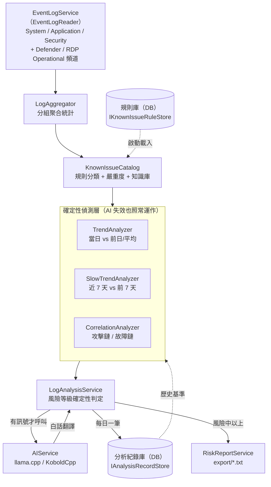

# LogForesight

> 除非必要否則不要讀取 docs/archive/ 內容，避免浪費 token。

分析 Windows Server 的 Event Log 與 Linux 主機的 syslog（經 NetIQ Sentinel 取數，
規則面與取數管線皆已完備，見 [docs/LINUX-RULES.md](docs/LINUX-RULES.md)），
**提早發現硬體故障前兆與入侵跡象**，在問題擴大前示警。
偵測與風險判定完全由確定性的規則/趨勢/慢速趨勢/關聯層負責；本機 AI 模型（llama.cpp + Gemma 26B/27B 級
MoE 小模型）只負責把這些結論**翻譯成白話**，讓不懂 Event Log 的人也能一眼看懂狀況該怎麼處理
（詳見 [docs/archive/HISTORY.md](docs/archive/HISTORY.md)）。

## 專案結構

> 早期版本另有一個批次分析 console exe（`LogForesight` 專案），Web 排程化（Phase 2~4）完成、
> 職責全數搬進 Web 之後，該專案已於 Phase 5（`docs/archive/WEB-SCHEDULER-PLAN.md` §1.5）自解決方案移除。
> **現在唯一的分析執行途徑是 Web 的排程／立即執行**（見下方「使用方式」）。

```
LogForesight.Core/     Web 共用的類別庫（原批次與 Web 共用，批次退場後仍是分析邏輯的所在地）
├── Analysis/           無狀態的純規則/分析邏輯：規則表、趨勢比對、跨 log 關聯分析、聚合統計、prompt 預算
├── Models/             資料模型：分析紀錄、AI 回應契約與容錯解析、權限快照、
│                        Web 身分/主機/處理狀態/權限異動確認/稽核/執行紀錄
├── Persistence/        持久層抽象：讀寫介面＋兩種後端實作（Sqlite/SqlServer，見下）。
│                        `StorageBackend` 是唯一路由點，分析邏輯與 Web 皆不需修改
├── Configuration/      appsettings.json 對應的設定類別
└── Service/            AnalysisOrchestrator（分析主流程單一入口）、排程計算、NetIQ 機房分析
                         pipeline、體檢——Web 排程與立即執行皆呼叫同一份

LogForesight.Web/      唯一的執行與查詢/維護介面（ASP.NET Core MVC，.NET 8）：
│                       排程設定＋立即執行（AnalysisOrchestrator 的呼叫端）、儀表板、問題查詢、
│                       風險日詳情（含處理狀態/指派）、報表（Chart.js 可下鑽）、權限異動待辦
│                       （表格＋篩選/排序/分頁，可依類別批次核准，見 docs/WEB-SPEC.md §9.5）、
│                       規則維護（builtin 可改可回復不可刪）、告警抑制（規則/簽章/關聯/總量四型；
│                       規則型支援主機/群組/全站三種範圍，其餘三型僅單台主機，見 docs/RULES-SPEC.md
│                       範圍矩陣）、CSV／NetIQ 掃描匯入、執行監控、操作稽核、
│                       郵件通知（SMTP，執行摘要/每日每週彙總/高風險即時三路觸發；高風險即時按
│                       收件人聚合一人一次執行一封，寄成功才標記、失敗自動補寄、連續失敗熔斷）、
│                       操作說明書＋AI 問答（僅 Maintain，實驗性）。
│                       群組制授權（部門↔主機群組）＋JWT（HttpOnly Cookie）。
│                       完整規格與各期實作/驗收紀錄見 docs/WEB-SPEC.md；
│                       儲存後端二選一（Sqlite 預設/SqlServer，見 docs/WEB-SPEC.md §10.5）
└── （appsettings.json 已內含開箱即測的測試登入：demo-admin＝全功能測試管理員（自動 seed）、
                        svc-lfadmin＝本地救援帳號（僅維護頁）；正式環境務必依檔內【正式環境需修改】
                        說明改用環境變數與 Provider=Ad（AD 伺服器在設定頁設定），見 docs/WEB-SPEC.md §5）

LogForesight.Tests/    單元測試（xUnit）：五層偵測邏輯、儲存合約測試（SQLite 後端）、
                        Web 授權範圍/處理流程/規則保護/CSV 匯入/排程與立即執行
```

C# 專案採檔案掃描（非資料夾對應命名空間），Core 沿用批次時期的 `namespace LogForesight`
（資料夾純粹是實體檔案的分類）；Web 專案依 ASP.NET 慣例採資料夾對應命名空間（`LogForesight.Web.*`）。

## 架構


```mermaid
flowchart TD
    ELS["EventLogService（EventLogReader）<br/>System / Application / Security<br/>+ Defender / RDP Operational 頻道"]
    AGG["LogAggregator<br/>分組聚合統計"]
    RULES[("規則庫（DB）<br/>IKnownIssueRuleStore")]
    CAT["KnownIssueCatalog<br/>規則分類 + 嚴重度 + 知識庫"]

    subgraph DET["確定性偵測層（AI 失效也照常運作）"]
        direction LR
        TREND["TrendAnalyzer<br/>當日 vs 前日/平均"]
        SLOW["SlowTrendAnalyzer<br/>近 7 天 vs 前 7 天"]
        CORR["CorrelationAnalyzer<br/>攻擊鏈 / 故障鏈"]
    end

    RISK["LogAnalysisService<br/>風險等級確定性判定"]
    AI["AIService<br/>llama.cpp / KoboldCpp"]
    HIST[("分析紀錄庫（DB）<br/>IAnalysisRecordStore")]
    REPORT["RiskReportService<br/>export/*.txt"]

    ELS --> AGG
    AGG --> CAT
    CAT --> DET
    DET --> RISK
    RULES -. 啟動載入 .-> CAT
    HIST -. 歷史基準 .-> DET
    RISK -- 有訊號才呼叫 --> AI
    AI -- 白話翻譯 --> RISK
    RISK -- 每日一筆 --> HIST
    RISK -- 風險中以上 --> REPORT
```

每次執行的流程：**權限/角色異動檢查（與歷史回補無關，每次執行都做一次）→
清理過期歷史 → 找出缺漏的日子（首次執行＝本機歷史全空 → 回補近 120 天；平常＝近 14 天缺漏）→
多個日誌來源（含 Defender/RDP Operational 頻道）平行掃描、一次取回整個區間的事件並按日分桶 → 逐日分析：聚合統計 →
規則標記已知危險訊號（規則命中的問題同時查得靜態知識庫）→ 與歷史做頻率比對
（首次出現/頻率上升自動升級嚴重度）→ 慢速趨勢偵測（近 7 天 vs 前 7 天總量比較）→
風險等級確定性判定 → 低風險日直接寫模板句、其餘連同比對結果與近 14 天歷史組成 prompt →
AI 白話翻譯（JSON 格式/內容檢查未過自動重問）→ 寫回歷史資料庫 → Web 排程作業頁與儀表板示警**。

## 提早發現問題的邏輯 · 監控訊號清單 · 體檢

五層偵測（規則／趨勢／慢速趨勢／關聯／AI）、監控的危險訊號清單（Windows／Linux 各 Event ID
與嚴重度）、RDP 防誤報設計、趨勢與關聯判定規則、給 AI 的輔助資訊、資料完整性誠實申報、
體檢機制——完整內容見 **[docs/DETECTION-SPEC.md](docs/DETECTION-SPEC.md)**。

## 升級注意事項

**升級到本版之前，先到「系統管理 > 設定」確認 `RetentionDays` 與 `DetailRetentionDays`。**

本版之前，資料清理實際上只作用於本機主機——透過 NetIQ 收錄的主機（正式環境的絕大多數）
從來沒有被清過。本版修正後這兩個設定值**第一次真正生效**：升級後第一晚起，超過保留天數的
NetIQ 主機紀錄會開始真的被刪除。如果當初因為「反正沒作用」而把天數設得很短，升級前務必先
改成真正要的值。

積壓量大時會分多次執行清完（單次上限 50,000 筆），執行畫面會申報剩餘筆數與預估還需幾次執行。

**保留天數的下限是 90 天**（六個保留期設定皆同）。已經儲存過的設定值不會被改動，
只有下次在設定頁按儲存時才會要求補到 90 以上；從未存過設定的部署直接吃出廠預設
（風險 log 暫存的出廠預設為 90 天）。

**權限異動的資料維護（自動、各跑一次）**：站台啟動時會重剖既有 NetIQ 權限異動列以補上
物件類型與處理程序名稱（並把 EventId 4670 的非檔案物件改分到「物件權限變更」），
另會刪除沒有明細可展開的舊「權限異動（彙總）」總計列。兩者各自記狀態、只執行一次。

## 部署驗證

沒有獨立的驗證用 CLI 旗標，驗證方式如下：

- **內建規則的合法性**（有無不合格項目、是否有規則被排序在前面的規則遮蔽、推導出的 Security
  稽核 watchlist 是否涵蓋齊全、關聯層引用的事件 ID 是否都存在於種子規則表）：由
  `LogForesight.Tests` 的自動化測試涵蓋（`KnownIssueCatalogTests`、
  `CorrelationAnalyzerRuleAlignmentTests`），換一台主機部署前跑 `dotnet test` 全綠即可。
- **你改過的規則**（透過 Web 規則維護頁新增/修改）：儲存前一律經過 `RuleValidator`（見下方
  「規則庫與抑制設定」），驗證不過直接拒絕寫入，不需要另外手動驗證。
- **AI 呼叫的完整 prompt 與原始回應**（平常的診斷 log 刻意不記錄這些，見下方「診斷用檔案
  Log」章節）：Web「排程作業」頁排程設定卡的「AI 診斷傾印」開關（僅 AI 已設定時顯示），
  開啟後下一次執行會把每次 AI 呼叫的完整內容輸出到資料根目錄的 `diag\`，驗證完記得關閉
  （不會自動關閉，會持續佔用磁碟空間）。

## 規則庫與抑制設定

規則外部化：`KnownIssueCatalog` 的規則表（[docs/DETECTION-SPEC.md](docs/DETECTION-SPEC.md)
「監控的危險訊號清單」列出的那些規則）不再寫死在程式碼裡，調整規則**不需要重新編譯部署**。

**存放位置**：規則與抑制設定存在**資料庫**裡（`lf_blobs` 的 `rules`／
`suppressions` 兩個 key），不是可以直接開啟編輯的檔案——`rules.json`／`suppressions.json`
是 Jsonl 檔案後端時代的產物，該後端已全面退役（詳見 docs/archive/HISTORY.md）。
完整設計定案（語意邊界、seed/匯入政策、DB 映射）見
[docs/RULES-SPEC.md](docs/RULES-SPEC.md)，這裡只說日常維護怎麼做。

**Web 站台啟動時會冪等初始化規則庫**（`rules` blob 不存在才寫入內建種子，已存在只載入不覆寫），
全新環境開站即可直接使用 `/admin/rules`，不需要任何額外步驟，見 docs/WEB-SPEC.md §9.7。

### 維護 SOP：走 Web 規則維護頁

**`/admin/rules`（系統管理 > 規則維護，需 Maintain 能力）是日常維護規則的正式途徑**，
分「Windows規則｜Linux規則｜告警抑制」三個分頁（見 docs/WEB-SPEC.md §9.7）：

1. 清單頁可依類別／嚴重度／來源（內建/自訂）／啟用狀態／有無抑制快速篩選，一眼看出哪些
   規則被改過（「已修改」徽章）、哪些內建規則有新版種子可匯入。
2. 新增規則：填 `Id`（強制 `custom-` 開頭）、類別／嚴重度／門檻／「命中即列為高風險日（重大）」，
   以及四個知識庫欄位（白話說明／影響／常見原因／處置步驟）。比對欄位**依所在分頁自動決定平台**：
   Windows 填來源比對＋Event ID；Linux 填 Program 比對＋訊息子字串（或正規化事件名）。
   平台與 `Origin` 同屬身分欄位，建立後不可變更。
3. 停用規則：清單上直接切換 `Enabled`，不必刪除（保留紀錄才查得回歷史）。
4. **儲存前後端都會跑規則驗證**（欄位合格、遮蔽偵測、關聯層事件 ID 覆蓋，`RuleValidator`），
   驗證不過會拒絕儲存並逐條列出問題。這一層擋的就是實際生效的內容，改完不需要另外跑
   任何驗證步驟。

規則頁本身也是「內建規則有更新時匯入新版種子」的入口（見下面章節）；
告警抑制（主機／主機群組／全站三種範圍）的維護入口是 Web `/admin/rules` 的「告警抑制」
分頁（見下方章節）。

### 已知限制與注意事項

- 想微調某條 `builtin` 規則的內容（改門檻、改處置文字）？**不要直接改那條**——程式改版後若在
  規則頁勾選「覆蓋已修改的內建規則」套用升級，可能會覆蓋回去（見下）。正確做法：把該條停用，
  複製一條改成 `custom-` 開頭的新規則再修改。（規則維護頁的「回復預設」可把改壞的 builtin
  規則還原成原廠內容，含前後對照確認。）
- 規則的比對順序＝清單順序（第一個命中的規則生效）；儲存時的遮蔽偵測會警告「永遠不會被
  命中」的規則（被排在前面、範圍更廣的規則遮蔽），照提示調整順序或縮小比對範圍即可。
  **Windows 與 Linux 規則各自獨立排序**，不會互相遮蔽。Linux 規則要特別留意 program 名稱的
  包含關係（`"sudo"` 包含 `"su"`），具體的要排在泛用的前面。
- **停用規則不會讓對應事件從趨勢層/關聯層的偵測中消失**（只是不再有規則命中的分類與知識庫
  說明），這是刻意設計，見 docs/RULES-SPEC.md 的語意邊界說明。

### 匯入程式內建的新規則／更新

程式改版後若內建規則有新增或修訂，`/admin/rules` 規則維護頁頂端會出現橫幅提示「內建規則有更新
（vX → vY）」。要套用：

1. 按橫幅上的「預覽差異」，對話框會列出將新增/更新/略過/衝突的規則清單，不勾選「覆蓋已修改的
   內建規則」時只會新增缺少的 builtin 規則。
2. 需要連同「內容被程式更新過」的既有 builtin 規則一併覆蓋，勾選「覆蓋已修改的內建規則」——
   預覽會即時重新整理，確認清單無誤後按「套用」。

你自訂的 `custom` 規則永遠不會被這個流程碰到；勾選覆蓋時也會保留你對該條 `Enabled` 的設定
（停用不會被悄悄打開）。**匯入前的行為是誠實申報的**：規則庫版本落後、頻道已啟用但規則表
沒有對應規則時，分析執行會提示並在當日申報，不會靜默漏偵測。

### 告警抑制（主機／主機群組／全站）

某條規則已確認是已知雜訊、不想再收到通知，但又不想整條規則永久停用（停用後其他主機也會
跟著沒有分類）時，用抑制——維護入口是 Web `/admin/rules` 的「告警抑制」分頁（含主機下拉
依規則平台過濾，可新增、查詢、解除）。抑制範圍三選一：**主機**（單台，原有粒度）、
**主機群組**（同類主機批次抑制，避免 2000 台規模下同一條規則要在每台同類主機上各設一次，
逐台設定的維護成本最終只會讓人乾脆停用整條規則）、**全站**（不限主機或群組）。

**抑制只關掉通知與風險升級，事件仍會照常聚合、命中規則、寫入歷史**——這樣才能在體檢報告與
管理頁看到「這條被抑制的規則本期實際發生了幾次」，暫時關掉的東西不會變成沒人記得的
永久盲區。到期天數可省略（永久生效直到手動解除）；到期後不會自動清理，只是恢復告警，
執行時會在分析輸出提示。抑制設定與規則同樣存在資料庫（`lf_blobs` 的 `suppressions` key）。

## NetIQ 主機清單

多主機階段要處理哪些主機，由「主機清單」決定，固定由 **Web 主機頁維護**
（admin 在畫面上新增/停用/批次貼上；docs/archive/HISTORY.md 定案 12）。實際會被查詢的主機清單與
排除原因（尚未確定所屬 Sentinel、IP 與其他主機衝突）顯示在 Web 主機頁——不是安靜地少幾台，
與「沒告警 ≠ 沒問題」是同一個原則：沒查到不等於沒事，畫面上必須看得出來。
IP 衝突時只查最早建立的那一台，行為才可預測。每台主機會標出作業系統（`[Windows]`／`[Linux]`）
——OS 決定這台套哪個平台的規則面，標錯等於整台的偵測面配錯，在清單上看得到才好核對。

### NetIQ 主動探索匯入

Web「NetIQ 維護」頁的「匯入」分頁：選一台已設好探索帳密的 Sentinel、**輸入要掃描的網段**
（前綴如 `192.168.0` 或 CIDR `192.168.0.0/24`／`/16`）→ 掃描 → 依網段勾選 → 指派群組與作業系統
→ **送出即立即新增/更新/孤兒復活**。掃描是「查一個網段」不是盲掃全站——結果只涵蓋掃描窗口
內有事件回報的主機（`repip:{prefix}.*` 前綴萬用字元查詢＋自適應時間窗，完全不碰 ESM API，
細節見 [docs/NETIQ-API-REFERENCE.md](docs/NETIQ-API-REFERENCE.md)），涵蓋範圍（實際掃描窗口、
是否截斷）誠實顯示在掃描結果上方，安靜的主機請改用主機頁手動登錄。結果記入「資料匯入」頁的
匯入紀錄，與負責人 CSV 匯入共用同一份稽核軌跡。當晚的規則檢查與趨勢分析仍要等下次批次執行才有結果——
即時的只是「主機被收進清單」這件事本身，新主機的顯示名稱則在掃描當下就從 Sentinel 的 `sn`
欄位帶入，不用等夜間批次回填。

主機清單很長時的操作：每個網段可整段勾選，超過 20 台的網段預設收合（標題仍顯示總數、
已登錄數與可復活數），另有「全選新主機」（回到預設勾選狀態：新主機與可復活的勾、
既有使用中的不勾）與「全不選」兩個快捷。作業系統預設值取自該台 Sentinel 的設定
（見「NetIQ 維護」頁），只套用在本次**新增**的主機。

**掃描一律真實連線；離線示範資料是顯式開關（§13）**：不論哪個環境，掃描預設都連
真實 Sentinel——沒有可連的 Sentinel 時精靈會誠實回報連線錯誤，而不是默默給假資料。需要離線
跑完整匯入流程（開發／展示）時，到「系統管理 > NetIQ 維護」頁開啟**「使用離線示範資料」**
開關（固定台數／網段數，掃描結果上方會有醒目警告標示，頁面另有常駐徽章）。
**正式環境不允許開啟**：開關只在非 Production 顯示，後端寫入端也會拒絕，DI 選型層同樣不理會
（三道保險，沿用「假資料不得上正式」原則）。

### NetIQ 事件取數與 API 驗證

多主機集中分析從各 Sentinel 取事件（`SentinelClient`／`SentinelFieldMap`／
`SentinelEventMapper`／`SentinelQueryBuilder`，`LogForesight.Core/Analysis/`）；機房 pipeline
本體（`NetiqPipelineService`，`LogForesight.Core/Service/`）在本機分析結束後接機房迴圈，
逐日、批次（≤50 台 IP）向 Sentinel 取事件、映射後餵進與本機路徑相同的分析服務——
**Windows／Linux 主機皆支援**（依主機 `Os` 分組各自建查詢與映射，
Linux 欄位對應與 filter 規則見 [docs/NETIQ-API-REFERENCE.md](docs/NETIQ-API-REFERENCE.md)
§4a）；當日續跑靠既有的缺漏日回補機制。每台主機每次執行最多回補
`NetiqOptions.BackfillDays` 天（預設 1，「系統管理 > NetIQ 維護」頁可調），
多台 Sentinel 依 `NetiqOptions.MaxParallelServers` 平行處理（預設 2，上限 3——分析與網站
同一行程，這是行程架構上限不是效能旋鈕）；同一台 Sentinel 內部，當天要查的主機批次
還可依 `NetiqOptions.MaxParallelQueriesPerServer` 再平行（預設 1＝依序，上限 4）——
兩個維度正交，只有 1～2 台 Sentinel 但主機量大的環境靠後者縮短總耗時。
**放大平行度前先向 Sentinel 管理者確認查詢帳號的併發配額**：兩個上限全開時最多同時有
3×4＝12 個 search job 與 12 個有效 SAML session（每個平行查詢各自獨立登入），Sentinel
對單一帳號的併發 job／session 數通常有上限——撞到配額的症狀不是明確的錯誤訊息，而是
零星查詢失敗被記成主機日失敗（執行監控看起來像網路不穩，實際是配額被擠掉）。

**API 欄位對應驗證**：需要換一套 Sentinel 環境、或懷疑欄位對應跟現場不符時，到「系統管理 >
NetIQ 維護」頁的「診斷」分頁，選一台 Sentinel、選填樣本 IP，按「執行診斷」即可跑一組小規模
驗證查詢並直接複製輸出核對。完整的 API 事實、欄位對應與查詢 payload 見
[docs/NETIQ-API-REFERENCE.md](docs/NETIQ-API-REFERENCE.md)——**Windows／Linux 的欄位對應、
查詢語法已對真實 Sentinel 環境跑過多輪 probe 驗證確認**（非紙上推導）；**尚未完成的是生產
環境長期試點**（登錄 2～3 台實機連續跑數晚，核對 sev 告警門檻、Defender/RDP 頻道覆蓋、
token 有效期等細節），待核對清單見 [docs/BACKLOG.md](docs/BACKLOG.md)。

### 大規模上線 SOP（批次登錄大量主機）

一次登錄大量主機（例如 2000 台）時，若直接開 AI 全速跑歷史回補，27B/31B 級模型序列化處理、
主分析每次 5～15 秒、風險日深入分析另加 15～70 秒（見下方「小模型最大化效能的策略」），
疊上 `BackfillDays` 設高導致的主機日總數，首次全量回補可能拖很久且把 AI 佇列
（`AiFollowupQueue`，容量 200）撐到背壓。建議分三階段：

1. **純統計模式回補歷史基準（建議排週末）**：到「系統管理 > 設定 > AI 服務」頁清空
   `AiBaseUrl` 並存檔——系統會自動短路成統計模式（規則／趨勢／關聯層照常執行，只是不呼叫
   AI，見下方「深入分析」一節），速度快得多。到「系統管理 > NetIQ 維護」頁把
   `BackfillDays` 設為 14（上限是 30，但 `TrendAnalyzer` 只需要 13～14 天可靠歷史，設 14 就夠；設更多只是多查 Sentinel。趨勢分析需要足夠歷史才不會持續
   申報「趨勢基準建立中」），視 Sentinel 環境與網路狀況調整 `MaxParallelServers`／
   `MaxParallelQueriesPerServer`（見「NetIQ 事件取數與 API 驗證」一節）縮短總耗時。完成
   掃描匯入後，到「系統管理 > 排程作業」頁按「立即執行」觸發第一次全量回補。
2. **量測一週，決定夜間執行窗口**：`BackfillDays` 調回正式環境建議值 1，讓系統照日排程
   （仍維持純統計模式）跑滿一週，觀察兩個指標：
   - **非低風險日佔比**：「總覽儀表板」／「報表」頁的風險等級分布 KPI（高／中／低風險日
     天數）——這個比例約等於「開啟 AI 後，每晚實際會呼叫 AI 的主機日比例」（低風險日不
     觸發 AI 分析，見下方「深入分析」一節）。
   - **查詢耗時基準**：「系統管理 > 排程作業」頁的執行紀錄提供每次執行的總耗時，除以主機數
     可概算「平均每主機查詢耗時」，供估算不同批次規模／平行度下的總時間。
   - AI 時間分兩段估，不要把「主分析＋深入分析疊在一起的總耗時」當成「單次呼叫」耗時代入
     （舊版文件曾寫「單次數十秒到一兩分鐘」，那是兩段疊加值，直接代入會把預算高估數倍）：
     「非低風險日佔比 × 主機數 × 主分析呼叫耗時（5～15 秒）」，加上「觸發深入分析的
     主機日佔比 × 主機數 × 深入分析耗時（15～70 秒，只有 Other 類別命中規則外的問題才
     觸發，見「深入分析」一節）」，兩段相加再加上「查詢耗時基準 × 主機數」，反推開啟 AI
     後的每晚總耗時，據此決定「系統管理 > 排程作業」頁的執行窗口（Start/End）。這只是
     規劃初始窗口的估算起點，實際數字仍以執行紀錄裡的真實耗時為準。
3. **開啟 AI，轉入日常排程**：到「系統管理 > 設定 > AI 服務」頁填回 `AiBaseUrl` 並存檔，
   依步驟 2 的量測結果設定執行窗口並啟用排程——之後的缺漏日回補交由既有機制自動處理
   （`BackfillDays=1` 已足夠，不需要再手動調大）。

## 權限/角色異動監控（PermissionMonitorService）

除了 Security log 事件規則，另外用**直接比對當前狀態**的方式監控權限異動——
這是獨立於每日事件分析之外的機制，**每次執行都會做一次**（反映「執行當下」的權限狀態，
不是某個歷史日期的事），與歷史回補流程無關。

### 為什麼不能只靠 Security log

Security log 的權限/角色事件都需要「物件存取稽核」原則有正確配置，而且讀取 Security log
本身就需要系統管理員權限——你的執行環境目前正是沒有這個權限（"Requested registry access
is not allowed"），代表僅靠 Security log 事件規則的話，權限異動偵測完全不會運作。

`PermissionMonitorService` 改用**直接讀取當前狀態並與上次執行的快照比對**，
不依賴稽核原則設定，讀取資料夾 ACL 與群組成員也不需要系統管理員權限（只要對該資料夾
有讀取權限即可）。與 Security log 事件規則是互補關係：兩者都可用時形成雙重確認，
只有一者可用時仍有基本防護。

### 監控範圍

- **本機 Administrators 群組成員**：與上次執行比對，新增成員標記【提權】、
  移出成員標記【權限變更】（移除同樣要關注——可能是入侵者提權得手後清除紀錄）
- **監控資料夾的 ACL**：擁有者變更、任何權限規則的新增或移除，一律列出、不判斷合理性，
  交給人工確認。執行檔自身所在目錄**一律自動監控**（防止程式本身被竄改），
  其他要監控的資料夾在 Web「系統管理 > 設定 > 分析參數」頁加入（一行一個路徑，
  支援環境變數如 `%ProgramFiles%`）
- 資料夾從「可存取」變成「無法存取」也會告警（可能已被刪除，或權限被鎖死以阻擋存取／掩蓋內容）

### 運作方式

快照存於資料庫（blob key `permission_snapshot`），每次執行讀取目前狀態、與快照比對出異動、
再覆寫快照。首次執行沒有快照可比對，只建立基準、不產生告警。

發現異動時「排程作業」頁的執行輸出會標示明顯的異動警示（與風險等級的紅/黃色徽章區隔），
並輸出 `export\{today}_權限異動.txt`，不含 AI 分析——
這類發現本身已經是明確事實陳述，不需要 AI 解讀，也讓這個檢查完全不依賴 AI 服務是否可用。

**被異動項目明細（人工防護層）**：執行輸出與報告檔的最後都會逐項列出每一筆異動的
「對象／異動類型／異動前／異動後」對照，並附上確認提示
（「此異動是否為您或授權人員的操作？」）。這是獨立於自動檢查之外的一層人工防護——
自動檢查負責「發現有異動」，明細清單讓使用者能逐筆判斷「這筆異動是否正常」，
例如同一筆 ACL 新增，管理員自己設定的就是正常維運，非預期出現的就是入侵訊號，
這個判斷只有了解環境的人做得了。

### 設定

```json
"Permissions": {
  "WatchedFolders": ["C:\\inetpub\\wwwroot", "%ProgramFiles%\\YourApp"]
}
```

預設空陣列（只監控執行檔自身目錄）。建議依實際環境加入：網站根目錄、應用程式安裝目錄、
共享資料夾等重要位置。

### 已知限制

- 目前只監控**本機** Administrators 群組，尚未涵蓋其他特權群組（如 Remote Desktop Users）
  或網域群組——如需要可自行擴充 `PermissionMonitorService`
- Windows 使用者權限指派（如「以服務身分登入」）目前只能透過 Security log 的
  4704/4705/4717/4718 事件偵測，直接比對本機安全性原則（`secedit`）屬於後續加強方向
- 這是本次新加入的功能，建議先手動執行一次確認能正常讀取你環境中的資料夾與群組資訊，
  再排入正式排程

## 小模型（Gemma 27B/31B 級）最大化效能的策略

餵摘要不餵原文、規則先標記重點、歷史壓縮成統計行、趨勢數字程式先算、JSON 契約＋grammar
強制、依任務性質拆分呼叫等十項對策——見 **[docs/DETECTION-SPEC.md](docs/DETECTION-SPEC.md)**。

## 使用方式

分析執行由 Web 觸發，兩種方式擇一或並用（見「系統管理 > 排程作業」頁）：

- **排程**：設定每日執行窗口（最多 4 組，支援跨午夜），到點自動觸發一次完整執行。
- **立即執行**：頁面按鈕手動觸發，範圍可選全部主機、網段範圍（僅 NetIQ 主機），或到主機詳情頁
  針對單一主機觸發。

兩者都呼叫同一個 `AnalysisOrchestrator`，行為完全一致、**第一次執行就可用**：

1. **清理**：刪除超過 120 天的歷史紀錄
2. **找缺漏**：檢查有哪些日子沒有紀錄
   - 首次執行（本機歷史資料庫全空，以 `HasAnyRecord()` 判定）：檢查近 120 天
     （`InitialHistoryDays`），自動建立完整的 120 天歷史基準
   - 平常：檢查近 14 天（`TrendWindowDays`），通常只缺昨天；排程漏跑（機器關機、排程失敗）
     則連缺漏的那幾天一起補，趨勢基準不會斷
3. **一次抓齊**：單次倒序掃描取回整個缺漏區間的事件（不是每個日期各掃一遍），
   且多個日誌來源（System/Application/Security＋Defender/RDP Operational 頻道）**平行掃描**，抓完按日期分桶放記憶體
4. **逐日 AI 分析**：由最舊到最新，**每一天都做完整 AI 分析**（品質優先；
   後面的日期能參照前面累積的歷史）。抓取已全部前置，分析迴圈只等 AI 推論，
   不會「分析完一天才回頭抓下一天」互相等待；趨勢比對依賴前面日期寫入的歷史，
   所以分析本身依序執行

- 已分析過的日期自動跳過，同一天重複執行不會產生重複紀錄。
- 回補能抓到多久以前，取決於各 Event Log 的設定大小，太舊的事件可能已被覆蓋。
- AI 呼叫失敗（如 llama.cpp 未啟動）時該日自動降級為統計模式紀錄（`AiAnalyzed = false`），
  規則與趨勢告警照常運作：規則命中「重大」旗標 → 風險「高」；High 問題或頻率異常 → 風險「中」。

發現高風險或「重大」事件時，執行輸出會明顯提醒並列出命中的問題與建議；頻率異常（首次出現、
頻率上升、總量突增）則列出比對數字。執行結束會輸出**結果總表**：每個日期的風險等級與對應
報告檔，於 Web「排程作業」頁可直接查看（點日期看該天每台主機的狀態），一眼看到該打開哪個
檔案；風險等級以紅（高）/黃（中）/灰（低）三色徽章呈現，全站語意色一致（見「Web 部署」與
文件地圖中的 WEB-SPEC.md）。

**行為變更：Low 嚴重度簽章的「頻率上升」不再產生告警文字**。
過去任何嚴重度的簽章一旦判定 Rising（歷史基準兩倍以上且達最低次數），都會列進頻率異常告警、
可能把當天從低風險拉到中風險；現在只有 Medium 以上嚴重度的簽章才會產生告警文字並參與風險
判定，Low 嚴重度的雜訊型簽章（本來就大量存在、頻率本身波動就大）不再能單靠「量的變化」把
一個本質上無關緊要的問題拉成需要人工介入的中風險日。**趨勢判定與嚴重度升級本身不受影響**
（`Trend` 欄位仍正確標示 `Rising`），只是不吵、不拉風險——資訊沒有遺失，只是不再用來吵人。

## 風險報告（export/{日期}_{類別}.txt）

風險等級「中」以上的日期，自動輸出報告檔到**執行檔所在目錄下的 `export`**
（不用 CurrentDirectory，因為排程執行時可能是 system32）。一天一個檔案、
該日所有風險都收在同一份；無風險的日期不產生檔案。報告路徑會回寫到歷史資料庫的 `ReportFile` 欄位。

**檔名標注風險等級與當日發現的問題類別**，掃一眼目錄就知道哪天最重要、出過什麼事：

```
export\
├── 2026-07-12_中風險_服務.txt
├── 2026-07-14_高風險_儲存裝置+安全.txt
└── 2026-07-15_中風險_安全.txt
```

類別共八種：儲存裝置、硬體、安全、服務、備份、設定、資源、其他
（對應 `IssueCategory`，由規則表分類）。

### 報告結構：依類別分區塊，不把所有問題混在一起

```
■ 整體摘要                 ← 跨類別的每日分析結論（風險等級的依據）＋頻率異常＋建議
━━━━━━━━━━━━━━━━━━━
■【儲存裝置】重點問題 N 項   ← 嚴重度最高的類別排最前
   問題清單（嚴重度/時段/趨勢/規則說明）
   ── AI 深入分析（儲存裝置）──   ← 此類別專屬的深入分析呼叫結果
   ── 相關原始 Log ──            ← 只列此類別的 log
━━━━━━━━━━━━━━━━━━━
■【安全】重點問題 N 項
   ...同上
━━━━━━━━━━━━━━━━━━━
■ 前置掃描                  ← 主分析篇幅外的低嚴重度項目篩選結果
```

### 深入分析：規則命中查知識庫，只有 Other 類別才呼叫 AI

**規則已命中的類別（儲存裝置、硬體、安全…）直接查 `KnownIssueCatalog` 的靜態知識庫渲染**——
同一 Event ID 的原因/處置幾乎不變，寫死比每次重新生成更快、更一致、零幻覺，AI 服務不可用時
也不會從缺。**只有 Other 類別（未命中規則）才發一次獨立的 AI 深入分析呼叫**，這是規則沒涵蓋、
AI 唯一還需要判讀新型態問題的地方。

**主分析（風險判定）不拆**——跨類別關聯（如「新服務安裝＋帳號建立」）必須在同一次呼叫裡；
Other 類別內的事件本來就是同一個故事該一起看，跨類別的整合判讀已由主分析完成，各類別結果
（不論來自知識庫查表或 AI 深析）是報告中並列的區塊、不需要調和。

重點問題的挑選：嚴重度 High 以上、頻率上升中、或首次出現的 Medium 以上，
每類別最多 4 項；原始 log 總預算 20 筆平均分配給各類別、類別內再按問題分配，
避免單一高頻事件佔滿。Other 類別的深入分析失敗時（模型未啟動），該區塊註明從缺；
規則命中類別因為不呼叫 AI，處置參考、統計資訊與原始 log 永遠正常輸出。

### 排程（正式環境）

早期版本用 Windows 工作排程器另外排一個批次 exe；批次 console 專案已隨 Phase 5 退場
（docs/archive/WEB-SCHEDULER-PLAN.md §1.5），**現在排程內建在 Web 站台本身**，不需要另外設定
schtasks 或安裝其他執行檔：

1. Web 站台以 Windows 服務或 IIS 常駐執行（見下方「Web 部署」）。
2. 到「系統管理 > 排程作業」頁，設定執行窗口（Start 到點觸發一次完整執行，End 到點對進行中
   的執行發出優雅停止，最多 4 組，支援跨午夜），勾選「啟用排程」並儲存。
3. 需要立即跑一次（驗證部署、補跑缺漏日）時，同頁按「立即執行」手動觸發，不受時間窗限制。

### 權限

讀取 **Security log 需要系統管理員權限**（或以 SYSTEM 身分排程）。
權限不足時該來源會略過並提示，System / Application 仍正常分析——但入侵偵測會大幅失效：
Windows 主機的跨 log 關聯層（`CorrelationAnalyzer`）共 17 種組合模式，其中 9 種的觸發前提
完全建立在 Security log 事件上（暴力破解、帳號/權限異動、稽核清除、跨日入侵鏈等），沒有
Security log 權限這些模式永遠不會命中；系統實質上只剩儲存／硬體／服務崩潰等故障前兆偵測
仍正常運作。正式環境部署前務必確認執行帳號（或排程的 SYSTEM 身分）對 Security log 有讀取權限。

### 設定檔（appsettings.json / nlog.config）

執行檔目錄下的 `appsettings.json`。找不到時使用預設值（開箱即用）；**存在但格式錯誤時直接中止啟動**並印出錯誤位置——設定檔存在代表有明確設定意圖，靜默改用預設值可能把資料寫進錯誤的儲存後端。

**本檔只保留「站台還沒起來、資料庫還沒連上之前就必須知道」的啟動與安全前提**（§12 精簡）：

```json
{
  "Server": { "PathBase": "" },
  "Storage": { "Type": "Sqlite", "DataRoot": "", "ConnectionString": "" },
  "Jwt": { "SecretKey": "<測試值，正式環境以環境變數覆寫>", "ExpireHours": 8 },
  "Auth": {
    "Provider": "Stub",
    "ServerAdmin": { "Account": "svc-lfadmin", "PasswordHash": "<測試值>" }
  },
  "AllowedHosts": "*"
}
```

| 設定 | 預設值 | 說明 |
|---|---|---|
| `Server.PathBase` | `""`（＝掛在網站根目錄） | 站台掛載前綴（例 `/LogForesight`）。**IIS 子 Application 不需要設定**（自動辨識）；只有「Kestrel 直曝＋反向代理加了前綴」或本機要驗證前綴行為時才填 |
| `Storage.Type` | `Sqlite` | 儲存後端二選一，預設 `Sqlite`（測試/開發用單一 `.db` 檔真資料庫）／`SqlServer`（正式環境，2000 台量級）。全部資料走 DB；`StorageBackend` 是唯一路由點，分析邏輯不需異動。詳見 docs/WEB-SPEC.md §10.5 |
| `Storage.DataRoot` | `""`（＝執行檔目錄） | 資料根目錄（決定 SQLite `.db` 落點；export\ 報告全文等交付檔案的所在） |
| `Storage.ConnectionString` | `""` | `Type=SqlServer` 時的連線字串；正式環境建議以環境變數 `Storage__ConnectionString` 覆寫，不寫進版控。`Type=Sqlite` 亦可自訂（留空＝`{DataRoot}\Db\logforesight.db`，子資料夾不存在時自動建立）；未明寫 `Pooling` 時系統自動補 `Pooling=False`——Microsoft.Data.Sqlite 連線池與 EF user function 在併發下會拋「unable to delete/modify user-function due to active statements」 |
| `Jwt.SecretKey` | 公開已知測試值 | HMAC-SHA256 簽章金鑰（≥32 bytes）。正式環境以環境變數 `Jwt__SecretKey` 覆寫，否則 Production 啟動會被擋下 |
| `Auth.Provider` | `Stub` | `Ad`（正式；AD 伺服器等設定在「系統管理 > 設定」頁）或 `Stub`（測試，不驗密碼；Production 啟動會被擋下） |
| `Auth.ServerAdmin` | `svc-lfadmin` | 本地救援帳號（指派 admin 成員、AD 停擺時的入口）。`PasswordHash` 以 `LogForesight.Web.exe --hash-password` 產生，正式環境以環境變數 `Auth__ServerAdmin__PasswordHash` 覆寫 |

**其餘設定都在 Web 的「系統管理 > 設定」頁（資料庫）**，改完即時生效、不必重啟站台：
AI 位址／金鑰與進階參數（逾時、重試、token 上限、取樣懲罰、額外請求欄位）、
權限監控資料夾、分析參數（伺服器角色描述、體檢間隔、掃描頻道）、CSV 匯入上限、
各項保留天數、AD 驗證伺服器。NetIQ 連線與節流參數則在「系統管理 > NetIQ 維護」頁。
（`appsettings.json` 沒有 `Ai`／`Permissions`／`Analysis`／`Import`／`Ui`／`Auth:Ldap` 區段，
這些設定一律以 DB 的設定頁為準——見 docs/WEB-SPEC.md §12。）

`nlog.config`（同目錄的獨立 XML 檔，NLog 慣例）控制診斷檔案 log 的等級與輪替策略，
預設 Info 以上、單檔 10MB 輪替、最多保留 30 個歸檔，詳見下方「診斷用檔案 Log」章節。

## Web 部署（docs/archive/HISTORY.md P1-3）

**只需要部署 `LogForesight.Web` 一個執行檔**——Web 站台本身就是分析執行與查詢介面的
唯一部署單位，沒有另外的批次執行檔要一起部署。

### 以 Windows 服務執行

`Program.cs` 已加 `UseWindowsService()`：一般用 `dotnet run` 或直接執行 `.exe` 完全不受影響，
只有真的被服務控制管理器（SCM）啟動時才切換生命週期管理（開機自動啟動、服務控制台可停/啟/重啟）。

```
sc create LogForesightWeb ^
  binPath= "C:\path\to\LogForesight.Web.exe" ^
  start= auto
sc description LogForesightWeb "LogForesight 查詢介面（Web）"
sc failure LogForesightWeb reset= 86400 actions= restart/60000/restart/60000/restart/60000
sc start LogForesightWeb
```

服務帳號需要對 `Storage:DataRoot`（含資料庫檔案，若用 Sqlite）與自己的 `logs\` 目錄有讀寫權限。

`sc failure` 是必要的，不是加分項：這套系統的用途就是「沒人看的時候幫你看」，
服務自己掛掉卻掛到有人發現為止，等於監控本身變成盲區。上面的設定是三次失敗各隔 60 秒重啟、
失敗計數 24 小時歸零。

**啟動逾時**：SCM 預設只等 30 秒。主機數多時首次啟動要做 schema 確認與背景搬移的判定，
接近或超過 30 秒會被 SCM 直接砍掉，而且症狀是「服務起不來」而非任何錯誤訊息——
唯一線索在 `logs\` 的 nlog 檔裡。真的遇到就調整登錄檔（單位是毫秒，需重開機生效）：

```
reg add "HKLM\SYSTEM\CurrentControlSet\Control" /v ServicesPipeTimeout /t REG_DWORD /d 120000 /f
```

### HTTPS（Kestrel）

正式環境不建議用 `dotnet dev-certs` 的開發憑證。在 `appsettings.json` 加 `Kestrel` 區段綁正式憑證：

```json
{
  "Kestrel": {
    "Endpoints": {
      "Https": {
        "Url": "https://0.0.0.0:8443",
        "Certificate": {
          "Path": "C:\\certs\\logforesight.pfx",
          "Password": ""
        }
      }
    }
  }
}
```

`Certificate:Password` 同樣不要寫進版控——用環境變數 `Kestrel__Endpoints__Https__Certificate__Password` 覆寫。
憑證更新是手動流程：換新 pfx 檔、更新設定裡的路徑/密碼、重啟服務；到期前務必排進 runbook 提醒，
過期當天才發現只會是使用者連不上站台。

### 環境變數（不進版控的機密）

appsettings.json 會進版控，下列欄位在正式環境**一律**用環境變數覆寫（設定檔留空即可）：

| 環境變數 | 對應設定 | 用途 |
|---|---|---|
| `ASPNETCORE_ENVIRONMENT` | — | 設為 `Production`——`WebAppSettings.Validate()` 的多項 fail-fast 檢查（Stub 驗證、已知測試金鑰黑名單）只在 Production 生效 |
| `Jwt__SecretKey` | `Jwt:SecretKey` | JWT 簽章金鑰（≥32 bytes）。appsettings.json 內建的是公開已知的測試值，帶著它上 Production 會被 `Validate()` 擋下啟動 |
| `Auth__ServerAdmin__PasswordHash` | `Auth:ServerAdmin:PasswordHash` | 本地救援帳號密碼雜湊，以 `LogForesight.Web.exe --hash-password` 產生。appsettings.json 內建值同樣是已知測試值，會被擋下 |
| `LF_CRYPTO_KEY` | — | Sentinel 密碼／AI API 金鑰加密用（`CryptoHelper`，base64、解碼後需恰為 32 bytes）。未設定時 fallback 內嵌金鑰＋記警告——正式環境建議設定，**使用雲端 AI provider（OpenAI 官方／Azure OpenAI）時必須設定**：保護的是真實的雲端 API 憑證 |
| `Storage__ConnectionString` | `Storage:ConnectionString` | `Storage:Type=SqlServer` 時的連線字串 |
| `Kestrel__Endpoints__Https__Certificate__Password` | `Kestrel:Endpoints:Https:Certificate:Password` | HTTPS 憑證密碼（見上） |

### 以 IIS 子 Application 部署

站台可以掛在 IIS 網站底下的 Application，網址帶前綴（`http://host/LogForesight/...`）：

1. 主機安裝 **ASP.NET Core Hosting Bundle**（IIS 要靠它託管 .NET 8 應用程式）。
2. `dotnet publish -c Release`——發行輸出會自動含 `web.config`，IIS 靠它啟動應用程式。
3. IIS 管理員：在網站底下「新增應用程式」，別名填 `LogForesight`、實體路徑指向發行目錄。
4. 應用程式集區設為 **無受控程式碼**（.NET CLR 版本），身分需要對 `Storage:DataRoot`
   與 `logs\` 有讀寫權限。

**不需要設定 `Server:PathBase`**——in-process 託管時掛載路徑自動辨識，前端也會跟著
補前綴（見 docs/WEB-SPEC.md §8.1a）；何時才要手動填見設定表該列。

Cookie 的作用範圍會跟著掛載路徑走，因此同一台主機掛正式與測試兩個 Application 時，
兩邊的登入身分不會互相覆蓋。

### 防火牆

內網管理系統用 Kestrel 直曝＋防火牆限縮來源即可（不需要為了轉發而多架一層反向代理）：
只開放 Web 站台埠號（如 8443）給實際會用到的內網範圍，不對外網開放。
組織既有 IIS 站台要統一入口時，改用 IIS 託管，見下方「以 IIS 子 Application 部署」。

### 目錄配置

```
D:\LogForesight\
└─ Web\                    ← LogForesight.Web.exe 與其 appsettings.json
    ├─ Db\                  ← SQLite 檔 logforesight.db（若用 Sqlite；Storage:DataRoot 底下）
    ├─ export\              ← 風險報告全文
    └─ logs\                ← 診斷檔案 log（nlog.config）
```

單一部署單位，`Storage:DataRoot` 留空即可（預設為執行檔目錄），不需要另外規劃第二個目錄
給批次程式使用。

> **升級注意**：舊版把 `logforesight.db` 放在 `Storage:DataRoot` 直下。升級後預設落點改為
> 底下的 `Db\`，站台會在新位置建立空資料庫，舊檔留在原地不動。要沿用既有資料，請在啟動前
> 手動把 `logforesight.db`（連同可能存在的 `-wal`／`-shm`）搬進 `Db\`，或在
> `Storage:ConnectionString` 明寫舊路徑。

## 正式環境穩定性設計

Polly 網路重試、停用連線池、退化重複輸出抑制、context 預算防線、AI JSON 容錯解析、
失敗降級、單一執行個體 gate、歷史併發樂觀鎖等機制——見
**[docs/DETECTION-SPEC.md](docs/DETECTION-SPEC.md)**。

## 診斷用檔案 Log（NLog）

執行輸出（排程作業頁、排程狀態卡）是給人即時看的摘要，遇到需要深入排查的問題（例如「AI 回覆內容未通過檢查」但看不出是哪個欄位）時常常不夠。`logs\web.log`（執行檔同目錄）補這塊，記錄比執行輸出更細的診斷資訊：

- 每次 AI 呼叫的耗時、回應長度、重試原因
- **JSON 解析/內容檢查失敗時的具體診斷**：解析失敗會記錄回覆預覽（頭尾各一截）；內容檢查沒過（如摘要超長、必填欄位空白）會記錄**解析出的結構化物件本身**，才看得出究竟是哪個欄位不合理——這是執行輸出完全沒有的資訊
- 每日分析的完整結果（風險等級、各項計數、耗時、報告檔路徑）
- 頻率異常、關聯訊號、權限異動的完整清單
- 未預期例外的**完整堆疊**（含 `AppDomain.UnhandledException` 兜底，背景執行緒的例外也不會無聲消失）

### 刻意不記錄的內容

**完整 prompt 文字**和**完整 Event Log 內容**一律不寫入——只記字元數/筆數等統計數字。原因：
- prompt 每次呼叫可能有數 KB，完整記錄的話 log 檔案大小會隨呼叫次數線性增長，很快就暴增
- Event Log 內容本來就已經完整保存在分析紀錄資料庫與風險報告（`export\`），不需要在診斷 log 裡重複一份
- 已經記錄的「短診斷片段」（回覆預覽、解析後的物件、程式產生的告警字串）本身都有長度上限或天然筆數上限，不會無界增長

### 容量控制（雙重防護）

`nlog.config` 設定單檔超過 **10MB** 自動輪替，最多保留 **30 個**歸檔檔案（`logs\archive\`），
即使某個角落不慎記錄了較大內容，磁碟用量仍有明確上限，不會無限增長。

### 層級

只寫 `Info` 以上到檔案（`Debug` 用於更細的追蹤，預設不輸出）。`Warn` 是重試/降級等需要留意但已有備援處理的情況，`Error`/`Fatal` 是分析失敗或程式中斷。要排查問題時建議直接找 `WARN`/`ERROR`/`FATAL` 開頭的行。

### 目錄解析交給 ASP.NET Core 的 NLog 整合

`nlog.config` 的 `${basedir}` 由 `NLog.Web.AspNetCore`（`builder.Host.UseNLog()`）正確解析為
本站台的內容根目錄，不受服務啟動方式（SCM、`dotnet run`、工作目錄不同）影響——這正是這個
套件存在的目的，不需要像早期批次 console 版本那樣手動用 `AppContext.BaseDirectory` 組路徑
覆寫（該手動兜底邏輯隨批次專案於 Phase 5 一併退場，docs/archive/WEB-SCHEDULER-PLAN.md §1.5）。

`nlog.config` 開啟了 `internalLogToConsole="true"`——NLog 自己的設定解析錯誤（例如版本不
相容的屬性）會直接印在 console，不會悄悄吞掉；這個機制實際抓到過一個真的 bug：NLog 6.x 的
`FileTarget` 已不支援 `concurrentWrites` 屬性，設定解析會拋例外，已從設定檔移除（本程式用
具名 Mutex 保證同時間只有一個執行個體，本來就不需要這個屬性）。

### llama.cpp / KoboldCpp

程式呼叫 `{BaseUrl}/v1/chat/completions`（OpenAI 相容 API），實測環境是
**KoboldCpp**（llama.cpp-based、但有自己的參數命名與 chat completions adapter，
跟原生 llama.cpp server 不完全相同）。

- **請求佇列**：`AIService` 內建單一併發佇列（`SemaphoreSlim(1,1)`），同一時間只發出一個
  request，其餘呼叫依序排隊——本機推論同時處理多個請求會互搶 GPU 資源，導致全部變慢甚至
  逾時，序列化最穩定；也跟實測 KoboldCpp 設定裡的 `parallelrequests: 1`（伺服器本來就
  一次只處理一個請求）吻合。
- 使用 `response_format: {"type": "json_object"}` 強制 JSON 輸出。
- 27B/31B 級模型實測生成速度約 125 tokens/秒：一般分析呼叫上限 `MaxTokens=2048`
  （純生成理論上限約 16 秒）、深入分析呼叫上限 `DeepDiveMaxTokens=8192`（理論上限約 66 秒）；
  實際回應時間還要加上 prompt 讀取（prefill）與內容本身決定的實際輸出長度。兩者耗時量級不同，
  分開估較準：**主分析呼叫**（每個非低風險主機日都會呼叫一次）實際常見落在 5～15 秒；
  **風險日的深入分析**（只有 Other 類別命中規則外的問題才觸發，見下方「深入分析」一節）
  輸出長很多，另加 15～70 秒——「數十秒到一兩分鐘」是把兩段疊在一起看的舊敘述，拿它當
  「單次 AI 呼叫」的估算基準會把主分析的時間預算高估數倍。首次執行回補 120 天時每天都
  呼叫 AI（總覽＋風險日的深入分析），總時間可能達數小時甚至更久，屬預期行為（品質優先）。
- **判斷模型是否有推理/思考通道外洩**：如果診斷 log 裡的回覆內容混有 `<|channel|>`、
  `<|message|>`、`<|start|>`、`<|return|>` 這類特殊符號，代表模型的思考內容外洩到最終
  輸出裡（可能是 KoboldCpp 的 `chatcompletionsadapter: AutoGuess` 誤判了模型的輸出格式，
  沒有正確拆分思考與正式回答）。**優先檢查伺服器自己的啟動設定檔**（KoboldCpp 是
  `.kcpps`，通常在啟動時也會印出完整參數）找 `jinja_kwargs`——那裡面的 key
  才是這個模型的聊天範本實際認得的思考控制參數，不要用其他家 server 的慣例猜；
  本專案實測的 KoboldCpp 環境認的是 `enable_thinking`（布林），送 `thinking_budget`
  這種其他慣例的數字預算完全沒作用。同理，重複懲罰的原生參數名稱也因 server 而異：
  KoboldCpp 用 `rep_pen`，原生 llama.cpp server 用 `repeat_penalty`，兩者送錯地方
  都是靜默無效、不會報錯，所以效果不彰時不能只靠猜，务必查對方的啟動設定或文件。

## 後續方向

- **通知管道**：目前只在 Web「排程作業」頁與排程狀態卡顯示，需要主動查看才會發現。排程執行時
  沒人盯著畫面，下一步可考慮接 Email / Telegram / Teams webhook，高風險時主動推播；本系統定位
  為第二層縱深防禦，即時性要求不如第一層監控，故未列為優先項。
- **多台伺服器（NetIQ Sentinel 整合）**：連線設定、主機清單管理與跨主機集中分析的取數管線皆已
  完成（見上方「NetIQ 主機清單」章節），**API 欄位對應已對真實 Sentinel 環境多輪 probe 驗證，
  生產環境長期試點（登錄實機連續跑數晚核對）尚未進行**；本機每台主機皆有的體檢 due-date
  輪巡、跨主機（多台之間）關聯層、機房總覽報告等規劃對 NetIQ 主機仍待實作。工程層級的待辦
  細節見 [docs/BACKLOG.md](docs/BACKLOG.md)。

## 文件地圖

`docs/` 目前的現況文件（描述「現在的行為是什麼」，操作者/開發者日常查閱）：

| 文件 | 內容 |
|---|---|
| [docs/DETECTION-SPEC.md](docs/DETECTION-SPEC.md) | 偵測與 AI 內部規格：五層偵測、監控訊號清單、趨勢／關聯判定、體檢、小模型策略、AI 穩定性設計 |
| [docs/WEB-SPEC.md](docs/WEB-SPEC.md) | Web 查詢/維護介面的完整規格：架構、分層、驗證授權、API 慣例、前端慣例、各頁面規格 |
| [docs/DB-SPEC.md](docs/DB-SPEC.md) | 資料庫欄位級規格：資料表設計、索引、保留策略、Schema 升級機制 |
| [docs/NETIQ-API-REFERENCE.md](docs/NETIQ-API-REFERENCE.md) | Sentinel REST API 參考：認證、事件查詢、欄位對應、查詢 payload |
| [docs/RULES-SPEC.md](docs/RULES-SPEC.md) | 規則外部化與告警抑制機制（主機／群組／全站）：語意邊界、規則模型、seed／匯入政策 |
| [docs/LINUX-RULES.md](docs/LINUX-RULES.md) | Linux 規則面現況：規則模型、主機 OS 標記、目前的種子規則清單 |
| [docs/BACKLOG.md](docs/BACKLOG.md) | 現況待辦清單（已知但刻意未做的項目），問題解決後即從文件移除 |

`docs/archive/` 是已完成規劃案與開發歷程的存放處——記錄「當時如何決策、如何實作」，
一般情況不需要打開；要追溯某個現況決策的來龍去脈時才查閱。
