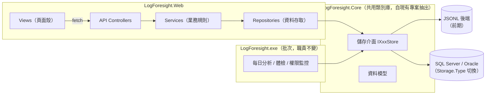

# LogForesight.Web 開發規格文件

> 撰寫日期：2026-07-21。本文件是 Web 查詢/維護介面的**開發依循規格**：架構、分層、
> 驗證授權、API 慣例、前端慣例、頁面規格、CSV 匯入、稽核。
> 資料表欄位級設計以 [DB-PLAN.md](DB-PLAN.md) 為準（本文件新增的表在第 10 節補齊欄位定義，
> 同樣遵守 DB-PLAN 的雙 DB 可移植規則）；規則庫的 DB 映射見 [RULES-PLAN.md](RULES-PLAN.md)。
>
> 專案：`LogForesight.Web`（.NET 8 MVC，已建立）。

## 1. 技術決策總表

| # | 決策 | 內容 |
|---|---|---|
| 1 | UI 框架 | Bootstrap 5 為**基底**（柵格/元件/可及性行為）；頁面外觀採功能取向的自訂設計層，**不受限於 Bootstrap 預設風格**（§8.2） |
| 2 | JavaScript | **原生 JS（ES Modules）**，不使用 jQuery；範本附帶的 jquery / jquery-validation lib 移除 |
| 3 | 主色調 | `#0d6efd`（即 Bootstrap 5 預設 primary；設計 token 與輔助色規範見 §8.2） |
| 4 | 設計原則 | 使用者便利性優先、維護成本最小化（詳見 §8.6 的具體規範，不是口號）；視覺設計服務於「快速抓到問題」（§8.2 視覺層級三原則） |
| 5 | 資料傳遞 | **View 不經 Model 傳資料**：MVC Controller 只回傳頁面殼（View），資料一律由前端 fetch 呼叫 API Controller 取得（JSON） |
| 6 | 分層 | Controllers / Models / Services / Repositories / Auth / Filters / Configuration（§4） |
| 7 | 授權 | Middleware（JWT 驗證身分）＋ ActionFilter（能力檢查）＋ Service 層（資料範圍過濾），三層各司其職（§6、§7） |
| 8 | 驗證方式 | **JWT，存放於 HttpOnly Cookie**（不放 localStorage）；批次 console 不經 API、不需要 JWT（決策理由見 §6.1） |
| 9 | 組態 | 全部參數集中 `appsettings.json`，程式以強型別 `Appsettings` 類別取得（§5） |
| 10 | DI | 內建 DI 容器，介面註冊表見 §4.3；一律建構式注入，不用 Service Locator |
| 11 | 圖表套件 | **Chart.js v4（MIT）**，自架於 wwwroot/lib、經 `core/charts.js` 單點包裝（選型評估與排除清單見 §8.3） |
| 12 | 報表原則 | 主管報表以圖表/統計呈現、**排版優先**；所有圖表元素可點擊下鑽到實際項目（§8.4、§9.6） |

沿用前期規劃已定案的決策（不再重述理由）：群組制授權（使用者群組↔主機群組多對多）、
角色四種（user/dev/manager/admin，能力聯集）、負責人與處理人分離（僅 admin 可指派）、
規則四層保護（builtin 可改可停可回復不可刪）、CSV 三檔匯入（預覽後 all-or-nothing 套用）、
全系統操作稽核（含登入登出）、儲存層單一介面（JSONL 即資料庫，SQL 就緒後切換）、
不做自由文字搜尋。

## 2. 系統全貌



- **批次 exe 職責不變**：分析、寫入紀錄、寫入執行紀錄（`IBatchRunStore`）。不呼叫 Web API。
- **Web 不直接碰檔案或 DB**：只透過 Core 的儲存介面。JSONL 與 SQL 是同一組介面的兩個後端，
  Web 程式碼對後端無感知（前期限制：JSONL 後端下 Web 與批次需部署於同一台機器）。
- **前置作業（Phase 0）**：抽出 `LogForesight.Core` 類別庫（Models、Analysis 不動、
  Persistence 介面與 Jsonl 實作、`RecordStorageShaper`），exe 與 Web 專案共同引用。
  這原是 DB-PLAN 排在 DB 階段的第一步，因「JSONL 即資料庫」決策提前到 Web 開發之前。

### 2.1 console（批次 exe）配合修改總覽

「批次職責不變」指的是**五層偵測與分析邏輯零修改**；持久層與周邊仍有配合項，
集中列於此避免散落各節（各項的失敗容錯原則同 §11-4：新增寫入失敗不得中斷分析）：

| Phase | console 配合修改 | 目的 |
|---|---|---|
| 0 | 參照重構：改引用 `LogForesight.Core`（行為零改變，`--selftest` 與全部單元測試為驗收） | 共用類別庫 |
| 1 | 每次執行 upsert 主機資料（host_name、last_report_at）至 `IHostStore` | 儀表板「無回報主機」的資料來源 |
| 3 | 權限異動明細改**雙軌**：既有 console 告警與 export txt 照舊，另經 `IPermissionChangeStore` 結構化寫入（change_id=GUID） | 頁 9.5 權限異動待辦的資料來源（無此項該頁在 JSONL 前期沒有資料） |
| 4 | 執行紀錄寫入 `IBatchRunStore`（§11-5）；啟動時同步規則種子至 `IRuleSeedStore` | 執行監控頁；規則「回復預設」 |
| 5 | SQL 後端啟用時，寫入路徑以 `CategoryAggregator` 填 `lf_record_categories`（§10.3） | 報表彙總 |

## 3. SOLID 對應（設計自查表）

| 原則 | 本專案的落實方式 |
|---|---|
| **S** 單一職責 | Controller 只做「HTTP ↔ DTO 轉換與呼叫 Service」，不含業務邏輯；Service 只做業務規則，不碰 HttpContext；Repository 只做資料存取，不做授權判斷。稽核、授權、例外處理各自是獨立的 Filter/Middleware，不散落在各 Action 內 |
| **O** 開放封閉 | 儲存後端以 `Storage.Type` 切換實作、不改呼叫端（Strategy + Factory，沿用批次端既有模式）；驗證方式以 `IAuthenticationProvider` 抽換（Stub → AD/Windows）；新增角色能力只改 `RoleCapabilityMap` 一處 |
| **L** 里氏替換 | JSONL 與 SQL 實作必須通過**同一組合約測試**（DB-PLAN 一致性機制 #3），語意寫在介面註解，實作不得偏離——替換後端不允許行為差異 |
| **I** 介面隔離 | 儲存介面按聚合根拆分（`IUserStore`、`IRuleStore`、`IAuditLogStore`…），不做一個巨型 `IRepository`；讀寫需求差異大的（分析紀錄）維持既有的 Reader/Writer 分離 |
| **D** 依賴反轉 | Service 依賴介面而非實作；介面定義在 Core、實作可在 Core（Jsonl/Sql）——依賴方向永遠指向抽象。Controller 與 Service 全部建構式注入 |

**審查基準**：PR 審查時對照此表；違反任一條需在 PR 說明中給出理由。

## 4. 專案結構與分層

### 4.1 資料夾結構

```
LogForesight.Web/
├── Program.cs                    -- 組態載入、DI 註冊、middleware 管線（保持薄，註冊邏輯抽到擴充方法）
├── appsettings.json
├── Configuration/
│   └── Appsettings.cs            -- 強型別組態（§5）
├── Controllers/
│   ├── PagesController.cs        -- MVC：只回傳 View() 頁面殼，一頁一 Action，無資料邏輯
│   └── Api/                      -- API：[ApiController]、[Route("api/...")]、只回傳 JSON
│       ├── AuthController.cs
│       ├── DashboardController.cs
│       ├── RecordsController.cs
│       ├── HostsController.cs
│       ├── PermissionChangesController.cs
│       ├── ReportsController.cs
│       ├── RulesController.cs
│       ├── AdminController.cs    -- 使用者/群組/授權維護
│       ├── ImportsController.cs
│       ├── RunsController.cs     -- 執行監控
│       └── AuditController.cs
├── Models/
│   ├── Dto/                      -- API 請求/回應物件（依 Controller 分子資料夾）
│   └── ApiResponse.cs            -- 統一回應信封（§7.2）
├── Services/                     -- 業務規則層：介面與實作同資料夾（IHandlingService + HandlingService）
├── Repositories/                 -- 資料存取層：組合 Core 儲存介面的查詢（如儀表板聚合）
├── Auth/                         -- IAuthenticationProvider、StubAuthenticationProvider、JwtTokenService、RoleCapabilityMap
├── Filters/                      -- PermissionAttribute/Filter、ApiExceptionFilter
├── Middleware/                   -- CsrfHeaderMiddleware（§6.4）
├── Views/                        -- 頁面殼（.cshtml 內不寫業務邏輯、不用 ViewModel 帶資料）
└── wwwroot/
    ├── css/site.css              -- 主題與元件樣式（§8.2）
    └── js/
        ├── core/                 -- api.js（fetch 包裝）、ui.js（toast/modal/表格）、format.js、charts.js（Chart.js 包裝）
        └── pages/                -- 一頁一模組（dashboard.js、records.js…），與 View 一一對應
```

範本清理清單（Phase 0）：移除 `wwwroot/lib/jquery*`、`_ValidationScriptsPartial.cshtml`、
`Views/Home/Privacy.cshtml`；`HomeController` 改為 `PagesController`。

### 4.2 分層責任邊界（違反即打回）

| 層 | 做 | 不做 |
|---|---|---|
| API Controller | 綁定/驗證 DTO、呼叫單一 Service 方法、回傳信封 | 業務判斷、直接用 Repository、組 SQL/LINQ、try-catch（交給 ExceptionFilter） |
| Service | 業務規則、授權範圍過濾（呼叫 `IVisibilityService`）、稽核寫入、跨 Repository 組合 | 讀 HttpContext（需要目前使用者時注入 `ICurrentUser`）、格式化顯示文字 |
| Repository | 查詢組合、分頁、對 Core 介面的轉接 | 授權判斷、業務規則 |
| View + JS | 呈現、互動、呼叫 API | 權限判斷邏輯（選單顯示依 `/api/auth/me` 回傳的能力，但**真正的防線在後端**） |

### 4.3 DI 註冊表

| 介面 | 實作 | 生命週期 |
|---|---|---|
| `Appsettings` | 組態綁定單例 | Singleton |
| Core 各 `IXxxStore` | `StorageFactory` 依 `Storage.Type` 建立 | Singleton（JSONL 實作內部自行處理檔案鎖） |
| `IAuthenticationProvider` | 依 `Auth.Provider` 註冊（Stub / 未來 Ldap、Windows） | Singleton |
| `IJwtTokenService` | `JwtTokenService` | Singleton |
| `ICurrentUser` | `HttpContextCurrentUser`（自 Claims 讀取） | Scoped |
| `IVisibilityService` | `VisibilityService`（授權主機解析＋每請求快取） | Scoped |
| `IAuditService` | `AuditService` | Scoped |
| 各業務 Service / Repository | 同名實作 | Scoped |

## 5. 組態（appsettings.json ↔ Appsettings.cs）

```json
{
  "Storage": { "Type": "Jsonl", "DataRoot": "..\\LogForesight\\bin\\Debug\\net8.0-windows", "ConnectionString": "" },
  "Jwt": { "Issuer": "LogForesight", "Audience": "LogForesight.Web", "SecretKey": "", "ExpireHours": 8 },
  "Auth": {
    "Provider": "Stub",
    "ServerAdmin": { "Account": "svc-lfadmin", "PasswordHash": "" }
  },
  "Import": { "MaxFileSizeKb": 2048, "MaxRows": 5000 },
  "Ui": { "DefaultPageSize": 50, "DashboardDefaultDays": 7, "RunMatrixDays": 14 }
}
```

- `Appsettings.cs` 是巢狀類別的單一根（`Appsettings.Storage.Type` 這樣取用），
  `Program.cs` 以 `Configuration.Get<Appsettings>()` 綁定並註冊 Singleton，任何類別建構式注入取得。
  **不在程式中直接讀 `IConfiguration`**——組態鍵名只存在於 Appsettings.cs 一處，改名不會有魔法字串漏網。
- **啟動時驗證**：`Appsettings.Validate()` 檢查必填（如 `Jwt.SecretKey` 非空、`Storage.DataRoot`
  存在、`Auth.ServerAdmin` 帳號與雜湊非空、`Auth.Provider=Stub` 時環境不得為 Production），
  不合格直接 fail fast 拋例外，不讓站台帶病啟動——沿用批次端「設定錯誤要顯性化」的原則。
- **與批次設定的一致性**：Web 與批次 exe 各有自己的 appsettings.json，但 `Storage` 區段
  （Type/DataRoot/ConnectionString）**兩邊必須指向同一後端**——欄位定義放 Core 的
  `StorageOptions` 共用類別，語意只有一份；部署文件需註明兩份設定同步調整。
- `Jwt.SecretKey` **不進版控**：開發用 `appsettings.Development.json`（gitignore）或 user-secrets，
  正式環境用環境變數覆寫（`Jwt__SecretKey`）。
- `Storage.DataRoot`：JSONL 後端的資料根目錄＝批次執行檔目錄（`history.txt`、`rules.json` 所在），
  Web 的自有資料寫入其下 `webdata\`（§10.3）。

## 6. 身分驗證

### 6.1 決策：JWT 放 HttpOnly Cookie；console 不需要 JWT

- **瀏覽器（View→API）**：登入成功後簽發 JWT，寫入 **HttpOnly、Secure、SameSite=Strict** 的
  Cookie（名稱 `lf_auth`）。前端 JS **接觸不到 token**（HttpOnly），fetch 同源自動帶上，
  避免 localStorage 存 token 的 XSS 竊取面。View（MVC 頁面殼）與 API 走同一張 Cookie、
  同一套驗證管線——頁面殼本身也要求已驗證（未登入直接 302 到登入頁，而不是空殼進來再被 API 401）。
- **批次 console（LogForesight.exe）**：**不經 Web API、直接走 Core 儲存介面**（§2），
  因此**不需要任何 Web 憑證**。未來若出現「跨機器回報」需求（批次與 Web 不同機、又還沒有共用 DB），
  屆時以 API Key 換發短效 JWT 的 client-credentials 模式擴充，`IJwtTokenService` 介面已可承載，
  現在不實作。
- 需要 HTTPS（Secure cookie 前提）；內網自簽或企業 CA 憑證皆可。

### 6.2 登入流程與 Claims

```
登入頁 POST /api/auth/login { account, password? }
  → IAuthenticationProvider.AuthenticateAsync(account, password)
      serverAdmin 帳號比對（任何 Provider 下優先檢查，見下方專節）
      Stub 實作（第一版）：lf_users 存在且 active 即通過（password 忽略）——僅供開發/前期測試
      正式（已定案）：LdapAuthenticationProvider（AD 帳密 bind 驗證，見下方專節）
  → 成功：查使用者群組 → RoleCapabilityMap 算出能力集合 → 簽發 JWT → Set-Cookie
  → 稽核 login / login_failed（§13）
```

**serverAdmin（本地救援/引導帳號，2026-07-21 定案）**：

- `Auth.ServerAdmin` 定義一個**不存在於 `lf_users`** 的本地帳號，密碼由管理單位
  **封存保管並定期變更**。用途：指派/移除 admin 群組成員——解掉「匯入使用者需要 admin、
  admin 又來自匯入」的引導問題，也是日後 **AD 停擺時的救援入口**（不依賴任何 Provider，
  Stub 或 Ldap 模式下皆可登入）。
- **最小授權**：登入後能力僅 `Maintain`＋`ViewAudit`（使用者/群組/主機維護與稽核查閱），
  **不含任何業務資料檢視**——依「設定 admin 角色成員」的用途給權，不是萬能帳號。
- **密碼以雜湊存放**（PBKDF2，不存明文——設定檔會進備份/複本，明文密碼會跟著擴散）。
  輪替 SOP：產生新雜湊填入 `PasswordHash` 後重啟站台即可，產生指令
  （`LogForesight.Web.exe --hash-password`）隨 Phase 0 提供；已簽發的 JWT 最長 8 小時自然失效。
- **Web 端鎖定**：serverAdmin 連續 5 次登入失敗鎖定 15 分鐘（記憶體計數即可）——
  它是本地帳號、**不受 AD 帳戶鎖定原則保護**，必須自帶防暴力破解；一般 AD 帳號則不做
  Web 端鎖定，交由 AD 原則（見下）。
- 全部操作照常稽核（account=設定的帳號名、user_id NULL）；儀表板登入失敗卡對它的
  失敗嘗試同樣可見。
- 啟動驗證：`ServerAdmin.Account`/`PasswordHash` 為必填（§5）。

**Stub 免密碼（已接受，2026-07-21）**：測試期間環境不含核心重要主機，免密碼風險已評估接受；
`Provider=Stub` 且 `ASPNETCORE_ENVIRONMENT=Production` 時啟動 fail fast 的欄杆維持不變
（防的是「帶著 Stub 上正式環境」的失誤，不是測試期的使用）。

**正式驗證（已定案：AD LDAP）**：`LdapAuthenticationProvider` 以使用者帳密向 AD bind 驗證；
**登入失敗的鎖定交由 AD 帳戶鎖定原則**（驗證失敗即計入網域的失敗次數，達原則門檻自動鎖定），
Web 端不對 AD 帳號另建鎖定機制——一套鎖定原則、一個事實來源。已知副作用：對登入頁
輸入他人帳號亂試可觸發該帳號的 AD 鎖定（內網環境接受此風險，稽核 `login_failed` 含來源 IP 可查）。

JWT Claims：`sub`（user_id）、`account`、`name`、`cap`（能力字串陣列）、`exp`。
**能力進 token、主機授權範圍不進 token**——範圍每次請求由 `IVisibilityService` 即時解析
（群組異動即時生效；能力異動最遲於 token 過期時生效，接受此延遲）。

### 6.3 逾期與登出

- 效期 `Jwt.ExpireHours`（預設 8 小時），不做 refresh token（內網工具，過期重登入即可）。
- **停用即時生效**：`ICurrentUser` 解析時逐請求檢查 `lf_users.active`，停用帳號立即 401，
  不等 token 自然過期（能力異動仍接受 token 效期內的延遲，§6.2；停用是安全事件，不可延遲）。
- API 收到過期/無效 token → 401 ＋ 信封 error code `auth_expired`；前端攔截後導向登入頁。
  過期後首個被拒請求補記稽核 `session_expired`（誠實邊界：無法記錄「過期那一刻」）。
- `POST /api/auth/logout`：清除 Cookie＋稽核 `logout`。

### 6.4 CSRF 防護

SameSite=Strict 已擋跨站帶 Cookie；再加一層防禦深度：`CsrfHeaderMiddleware` 要求所有
**非 GET 的 API 請求**必須帶自訂標頭 `X-Requested-By: LogForesight`（`core/api.js` 統一加上）。
跨站表單無法自訂標頭，兩層皆破才會失守。不用 ASP.NET Antiforgery token（它假設表單 post 模型，
與「全 API」架構不合）。

## 7. 授權與 API 慣例

### 7.1 三層授權

| 層 | 機制 | 回答的問題 |
|---|---|---|
| 1. Middleware | JWT Bearer 驗證（自 Cookie 取 token） | 你是誰？（未登入 → 401） |
| 2. ActionFilter | `[Permission(Capability.X)]` 讀 `cap` claim | 你能不能用這個功能？（不足 → 403 ＋稽核 `denied`） |
| 3. Service | `IVisibilityService.GetVisibleHostIdsAsync()` | 你能看哪些主機的資料？（查詢一律先過濾） |

```csharp
public enum Capability { ViewAll, Handle, Assign, ConfirmPermission, Maintain, DevMonitor, ViewAudit }

// RoleCapabilityMap（單一事實來源；user 沒有 ViewAll，資料範圍由第 3 層決定）
user    → Handle, ConfirmPermission
dev     → ViewAll, DevMonitor
manager → ViewAll
admin   → ViewAll, Handle, Assign, ConfirmPermission, Maintain, DevMonitor, ViewAudit

[HttpPut("api/records/{id}/handling/assign")]
[Permission(Capability.Assign)]
public Task<ApiResponse<HandlingDto>> Assign(long id, AssignRequest req) => ...
```

`PermissionFilter`（`IAsyncAuthorizationFilter`）：能力不足回 403 並寫稽核（result=`denied`）。
**Service 層的資料範圍過濾是不可繞過的最後防線**：即使某個 API 忘了掛 Filter，
查詢仍只回授權範圍的資料。

### 7.2 API 統一慣例

- 路由：`api/{resource}`，資源複數、動作用 HTTP 動詞表達；非 CRUD 動作用子路徑
  （`POST api/rules/{id}/restore`）。
- **風險日的資源識別＝`{hostId}/{date}` 複合鍵**（如 `api/records/17/2026-07-19`）——
  JSONL 後端的紀錄天然以（主機,日期）為鍵、**沒有代理數字 id**；SQL 的 `record_id`
  只是內部主鍵，不暴露到 API。兩後端因此共用同一套路由與處理狀態關連鍵，
  切換後端不改 URL（處理狀態/歷程在 JSONL 端同樣以 host+date 為鍵儲存）。
- **回應信封**（所有 API 一致，前端只寫一次解析邏輯）：

```json
{ "success": true,  "data": { ... }, "error": null }
{ "success": false, "data": null, "error": { "code": "validation_failed", "message": "預計完成日不可早於今天" } }
```

- 錯誤碼固定小寫 snake_case：`auth_expired`、`forbidden`、`not_found`、`validation_failed`、
  `conflict`、`server_error`。`message` 一律是**可直接顯示給使用者的繁體中文**——
  前端不做錯誤碼→文案對照表（維護不動的東西就不要建）。
- **例外處理單點化**：`ApiExceptionFilter` 把未捕捉例外轉成 `server_error` 信封（HTTP 500）、
  完整堆疊寫 Web 端 NLog；業務錯誤由 Service 拋 `DomainException(code, message)`，
  Filter 轉 4xx 信封。Controller/Service 不寫 try-catch 樣板。
- 分頁：請求 `page`（1 起）、`pageSize`（上限 200）；回應 `data: { items, page, pageSize, total }`。
- 日期格式：`yyyy-MM-dd`（date）／ISO 8601（timestamp），前後端一致，不做隱式時區轉換。

## 8. 前端規範

### 8.1 JS 架構（原生 ES Modules）

- `core/api.js`：fetch 包裝的**唯一出口**——組信封解析、錯誤 toast、401 導登入、
  非 GET 自動帶 `X-Requested-By`。頁面模組不得直接呼叫 `fetch`。
- `core/ui.js`：toast（Bootstrap Toast）、確認對話框（Bootstrap Modal 包裝，
  破壞性操作一律經過它）、表格渲染 helper（欄位定義 → `<table>`，含空狀態與載入中列）。
- `core/format.js`：日期、風險等級徽章、狀態徽章的統一格式化（風險/狀態的顯示規則只寫一次）。
- `pages/*.js`：一頁一模組，`_Layout.cshtml` 以 `<script type="module">` 載入對應頁模組；
  頁面需要的初始參數（如 record id）用 `data-*` 屬性放在 View 的根元素上，JS 讀取——
  **cshtml 內不寫 inline script、不用 Razor 內插 JS 變數**。
- 禁止引入前端框架/打包工具（React/Vue/webpack…）——本專案的前端複雜度用「模組化原生 JS」
  就能維護，工具鏈越少、五年後越可能還編得起來（對應決策 #4 的防廢棄考量）。
  第三方 JS 套件僅限白名單：Bootstrap（範本內建）＋ Chart.js（§8.3）；新增套件需符合
  §8.3 的選型限制（開放授權以 MIT 優先、排除中國起源/中國社群主導維護的套件）並更新本文件。

### 8.2 設計系統（Bootstrap 為基底、功能取向的自訂外觀）

Bootstrap 提供柵格、表單元件與可及性行為；**頁面外觀不受限於 Bootstrap 預設風格**。
設計目標只有一個：**維運人員打開頁面 3 秒內看到最該看的東西**，美化是為這個目標服務。

**設計 token（`site.css` 的 `:root` 自訂變數，全站樣式的唯一取值來源）**：

```css
:root {
  --lf-primary: #0d6efd;          /* 主色＝Bootstrap 預設 primary，不覆寫 --bs-primary */
  --lf-sidebar-bg: #1b2a41;       /* 深藍灰側欄 */
  --lf-content-bg: #f4f6f9;       /* 淺灰內容區 */
  --lf-card-bg: #ffffff;          /* 白卡片 */
  --lf-card-radius: .5rem;
  --lf-card-shadow: 0 1px 3px rgba(27,42,65,.08);
  --lf-risk-high: #dc3545;  --lf-risk-mid: #ffc107;  --lf-risk-low: #6c757d;
  /* 圖表分類色盤（8 類風險類型固定對應，見 §8.3） */
}
```

元件樣式只引用 token、不散落 magic value——調整外觀改一處全站生效，這是「不用標準
Bootstrap 風格」與「維護成本最小化」能同時成立的前提。

**視覺層級三原則（所有頁面的排版依據）**：

1. **嚴重度驅動顯著性**：畫面上最醒目的元素必須是當前最嚴重的問題——Critical/高風險卡片
   加粗左紅邊、排序置頂、數字放大；裝飾性元素（icon、插圖、漸層）不得比訊號更搶眼。
   介面本身維持低飽和（灰藍白），紅/黃只保留給風險訊號，異常自然從畫面裡跳出來。
2. **數字優先**：統計卡採「大字數字（2rem+）＋小字標籤＋趨勢箭頭」結構，掃視即得；
   文字說明放次要層級。
3. **語意色全站一致**（`format.js`/`site.css` 單點定義）：
   風險「高」`danger`、「中」`warning`、「低」`secondary`；嚴重度 Critical `danger`、High `warning`、
   Medium `info`、Low `secondary`；處理狀態 open `danger`、in_progress `primary`、resolved `success`、
   wont_fix/false_positive/known_noise `secondary`；執行結果 成功 `success`、有警告 `warning`、
   失敗/中斷 `danger`、未執行 `secondary`。同一個顏色在圖表、徽章、卡片、時間軸中意義相同。

**版面骨架**：深色側欄（依能力顯示選單項）＋淺灰內容區＋白卡片網格；上方麵包屑＋全域
日期/主機篩選。**徽章一律「顏色＋文字」**，不做只靠顏色區分的 UI（色弱可用性；
圖表的對策見 §8.3）。報告全文維持 `<pre class="report-text">` 等寬原樣呈現（含框線符號），
但外層卡片給足留白與工具列（複製、下載 txt），不是把 txt 直接貼在白背景上。

### 8.3 圖表規範（Chart.js）

**選型（2026-07-21 定案）**：

| 候選 | 授權 | 評估 |
|---|---|---|
| **Chart.js v4 ✅ 採用** | MIT | 輕量（單檔 ~200KB、免打包工具，契合 §8.1 無 build 工具鏈的決策）；折線/長條/環圈完全覆蓋本專案圖型需求；`onClick` 事件回傳資料點索引，下鑽（§8.4）天然支援；社群量大、文件完整，主要維護者為國際社群 |
| Plotly.js | MIT | 功能最強但單檔 3.5MB+，主打科學繪圖；本專案圖型簡單，重量不成比例。列為未來需要進階圖型（熱力圖等）時的備選 |
| ApexCharts | MIT | SVG 渲染、預設外觀佳，可接受的替代品；生態與文件量不及 Chart.js，不採 |
| Apache ECharts、AntV/G2 | Apache-2.0 / MIT | **排除**——中國起源且由中國社群主導維護（依 2026-07-21 選型限制） |
| D3 / uPlot | ISC / MIT | D3 太底層（開發成本高）；uPlot 太精簡（無互動配套），皆不採 |

**使用規則**：

1. 自架於 `wwwroot/lib/chartjs/`（內網環境不用 CDN），鎖定版本、升版走 PR。
2. 頁面模組**不直接呼叫 Chart.js**——一律經 `core/charts.js` 包裝層：
   `charts.line(el, spec)`、`charts.bar(...)`、`charts.doughnut(...)`。包裝層統一注入
   設計 token 色盤、字型、tooltip 樣式與點擊下鑽接線。換圖表庫＝只改這一個模組
   （SOLID 的 O；也是防廢棄的保險）。
3. 色彩：風險/嚴重度圖用 §8.2 語意色；8 種風險類型用固定分類色盤（token 定義），
   同一類別在所有圖表中同色。
4. 可及性配套：每張圖卡右上角提供「表格」切換鈕，以資料表格呈現同一份數據
   （色弱/精確讀值/複製需求一次滿足——資料本來就在前端，零後端成本）。

### 8.4 下鑽（drill-down）規則——「報表關連到實際項目」的統一機制

**統計數字不是終點，是入口**。全站任何聚合呈現（圖表資料點、統計卡、排行列）都必須
可點擊，導向帶對應篩選條件的明細頁：

| 來源 | 點擊後導向 |
|---|---|
| 類型分布圖的某一段（如「儲存裝置×Critical」） | `/records?categories=Storage&severity=Critical&from=...&to=...` |
| 趨勢折線的某一個資料點（某日高風險數） | `/records?riskLevels=高&from=該日&to=該日` |
| 儀表板統計卡（逾期未處理 N 件） | `/records?statuses=open,in_progress&overdue=1` |
| 高風險主機排行的一列 | `/hosts/{id}`（時間軸） |
| 執行監控異常彙總的一列 | 該錯誤的執行詳情清單 |

實作依託 §8.6-2 的既有決策（清單頁篩選與 URL 查詢字串同步）——下鑽只是「組出正確的
查詢字串再導頁」，明細頁不需要為下鑽寫任何額外程式碼。`core/charts.js` 的 spec 帶
`drillTo(dataPoint) => url` 回呼，接線集中在包裝層。**驗收標準：主管在報表頁看到任何
一個數字，最多兩次點擊就能看到組成這個數字的實際風險日清單。**

### 8.5 頁面殼與 View 的關係

每個 View 只含：麵包屑、頁面標題、空的容器元素（含 `data-*` 初始參數）。
所有動態內容由頁模組呼叫 API 後渲染。這是決策 #5 的直接推論：**View 沒有資料，就沒有
「同一份資料兩個來源」的維護問題**，頁面行為全部可以從 API 層測試。

### 8.6 使用者便利性規範（決策 #4 的具體化，逐條可驗收）

1. 清單頁的篩選條件記憶於 `localStorage`，回到頁面自動還原（含儀表板時間窗）
2. 所有清單支援欄位排序與 URL 查詢字串同步（篩選結果可以複製網址給同事）
3. 破壞性操作（刪除規則、套用匯入、合併主機）一律二次確認，確認框內**具體描述影響**
   （「將刪除規則 custom-xxx 及其 3 筆抑制設定」，不是「確定嗎？」）
4. 表單錯誤顯示在欄位旁（Bootstrap validation style），API 錯誤 message 直接顯示，不轉譯
5. 空狀態要有指引（「尚無資料。請先於『CSV 匯入』建立使用者與主機」），不留白畫面
6. 載入中一律有視覺回饋（表格 skeleton 列或 spinner），按鈕送出後 disable 防連點
7. 長清單預設分頁 50 筆；表格提供「複製為 CSV」按鈕（前端序列化當前頁，零後端成本）
8. 日期區間提供快捷鈕：今天／近 7 天／近 30 天

## 9. 頁面規格

路由 = MVC 頁面殼路徑；每頁列出：能力要求、內容區塊、主要 API。
（資料語意——主篩選、緊急程度排序、兩層報告等——沿用 DB-PLAN 定案，不重述。）

### 9.0 `/login` 登入
- 匿名可達。帳號＋密碼欄位（Stub 模式密碼欄隱藏）；登入成功導向儀表板或原請求頁。
- API：`POST api/auth/login`、`POST api/auth/logout`、`GET api/auth/me`
  （回傳 display_name、能力集合、所屬群組——側欄選單與功能鈕的顯示依據）。

### 9.1 `/` 總覽儀表板（所有已登入角色；user 只見授權範圍統計）
- 區塊：風險類型統計卡（8 類 × 數量/最高嚴重度/涉及主機數）、高風險主機排行、
  待辦區（未處理/逾期/權限異動 pending 數）、無回報主機、Web 登入失敗 24h 卡（admin 才顯示）。
- 所有統計卡與排行列皆可下鑽（§8.4）；排版遵循 §8.2 視覺層級——有 Critical 時該類別卡
  置頂加紅邊，全綠時首屏顯示「今日無風險訊號」大字狀態（沒事也要一眼確認是真的沒事）。
- API：`GET api/dashboard/summary?days=`（一次回傳全部區塊資料，避免首頁 5 個請求）。

### 9.2 `/records` 問題查詢（全角色）
- 主篩選列：主機（多選，授權範圍）／日期區間／風險層級／風險類型／Event ID／處理狀態。
  預設：近 7 天＋風險中以上。結果列表：日期、主機、風險、headline、類別、處理狀態、處理人。
- API：`GET api/records?hostIds=&from=&to=&riskLevels=&categories=&severity=&eventId=&statuses=&overdue=&page=`
  （`severity`/`overdue` 為下鑽用選用參數，§10.3）

### 9.3 `/records/{hostId}/{date}` 風險日詳情
- 區塊：結構化層（top issues 含趨勢註記、關聯訊號、深入分析、資料完整性申報）、
  報告全文（`<pre>`）、處理面板（負責人唯讀多人／處理人／狀態／預計完成日／說明／歷程 timeline）。
- 處理面板權限：狀態/說明/完成日 = `Handle`（限授權主機）；處理人下拉 = `Assign`（負責人置頂）。
- API（`{key}` = `{hostId}/{date}`，§7.2）：`GET api/records/{key}`、
  `GET api/records/{key}/report`、`PUT api/records/{key}/handling`、
  `PUT api/records/{key}/handling/assign`、`GET api/records/{key}/handling/logs`

### 9.4 `/hosts/{id}` 主機詳情/時間軸（全角色，限授權）
- 風險時間軸（近 N 天色格，點入 9.3）、主機資料（角色描述/IP/Sentinel/負責人/群組）、
  最近體檢結論、權限異動紀錄、生效中抑制清單。
- API：`GET api/hosts/{id}`、`GET api/hosts/{id}/timeline?days=`

### 9.5 `/permission-changes` 權限異動待辦（`ConfirmPermission`）
- pending 清單（對象/類型/前後對照），逐筆「確認為授權操作」/「標記可疑」＋備註；已處理頁籤可查歷史。
- API：`GET api/permission-changes?status=&page=`、`PUT api/permission-changes/{id}/confirm`

### 9.6 `/reports` 報表（全角色；user 限授權範圍）——主管的主要畫面，排版是重點

圖表以 Chart.js 呈現（§8.3），**每一個圖表元素與統計數字皆可下鑽到實際項目**（§8.4）。

**版面結構（由上而下，12 欄網格）**：

```
┌─ 期間選擇列：快捷鈕（本週/本月/近90天）＋自訂區間＋主機群組篩選 ──────────────┐
├─ KPI 統計卡列（4 卡等寬）───────────────────────────────────────────┤
│  告警總數(對比前期±%)│ 高風險日數 │ 未處理件數(逾期紅字) │ 涉及主機數      │
├─ 圖表區（2 欄卡片網格）─────────────────────────────────────────────┤
│  告警數量趨勢（折線，日粒度，        │  風險類型分布（水平堆疊長條：        │
│  高/中風險雙線，語意色）             │  8 類 × 嚴重度，類別固定色盤）        │
│  主機告警排行（水平長條 Top 10）      │  處理狀態總覽（環圈＋逾期明細列）      │
├─ 明細表區（單欄全寬卡片）────────────────────────────────────────────┤
│  期間內風險日清單（分頁表格，即下鑽的目的地內嵌版，含「在問題查詢開啟」鈕）      │
└─ 跨主機同簽章查詢（Event ID 輸入 → 主機×日期分布）──────────────────────┘
```

- KPI 卡帶**與前一期間的對比**（±% 與箭頭）——主管要的不是數字本身，是「變好還是變壞」。
- 每張圖卡：標題＋期間副標＋右上工具鈕（表格切換／下載 PNG，`toBase64Image()` 零成本）。
- **列印/匯出**：`@media print` 樣式（隱藏側欄與工具鈕、卡片不裁切）——主管列印或另存 PDF
  給上級是真實使用情境，排版好看必須含列印版面。
- API：`GET api/reports/summary?from=&to=&hostGroupIds=`（KPI＋四圖一次回傳）、
  `GET api/reports/signature?eventId=&source=`。明細表直接用 `api/records` 既有端點。

### 9.7 `/admin/rules` 規則維護（`Maintain`）
- 清單（Id/類別/嚴重度/Origin/Enabled/已修改徽章/種子有新版標示）；
  編輯表單（builtin 無刪除鈕、有「回復預設」含前後對照確認）；抑制管理頁籤（主機/規則/事由/到期）；
  規則異動史（稽核過濾 `target_kind=rule`）。**儲存前後端執行規則驗證**（欄位合格、遮蔽、關聯層覆蓋——
  自 `--selftest` 抽出的共用驗證邏輯，位於 Core），驗證不過拒絕儲存並逐條顯示問題。
- API：`GET/POST api/rules`、`GET/PUT/DELETE api/rules/{id}`、`POST api/rules/{id}/restore`、
  `PUT api/rules/{id}/enabled`、`GET/POST/DELETE api/rules/{id}/suppressions`

### 9.8 `/admin/users`、`/admin/hosts`、`/admin/groups`（`Maintain`）
- 使用者：清單/編輯/停用、所屬群組指派、個人操作紀錄與最近登入頁籤。
- 主機：清單（名稱/IP/Sentinel/負責人/群組/last_report_at/active）、編輯（role_desc/群組/負責人）、
  新舊主機合併（自停用清單選取→確認→`merged_into` 墓碑）。
- 群組：三頁籤——使用者群組（builtin admin/manager 鎖刪除與 role）、主機群組、
  **授權矩陣**（列=user 角色群組、欄=主機群組、勾選=授權）。
- API：`api/admin/users*`、`api/admin/hosts*`、`api/admin/groups*`、`api/admin/access*`

### 9.9 `/admin/imports` CSV 匯入（`Maintain`）
- 三卡片（使用者/主機/群組授權）：範本下載、格式說明表、上傳 → 預覽（摘要＋逐列動作/錯誤＋
  異動前後展開）→ 套用 → 結果；歷次匯入紀錄清單。
- API：`GET api/imports/{kind}/template`（回 CSV 檔，UTF-8 BOM）、
  `POST api/imports/{kind}/preview`（multipart 上傳，回逐列判定，**不寫入**）、
  `POST api/imports/{kind}/apply`（帶 preview 回傳的 token 套用，防止「預覽 A 檔套用 B 檔」）、
  `GET api/imports/logs`
- CSV 格式（編碼/分隔/upsert 鍵/groups 與 owners 欄語意/自動建群組/all-or-nothing）依前期定案；
  owners 引用帳號必須已存在（先匯使用者再匯主機），負責人無檢視權時預覽出警告不擋。
- **群組授權（全量取代語意）的預覽必須明列「將被移除」的授權清單**——上傳漏列/空檔
  會清掉既有授權，移除項目必須在套用前顯性可見並二次確認，不可只顯示新增與更新。

### 9.10 `/runs` 執行監控（`DevMonitor`）
- 總表（主機×日期色格：成功/警告/失敗/未執行/中斷）、單次執行詳情（統計＋逐條 log，等級篩選、
  exception 展開）、異常彙總（Error/Fatal 按訊息聚合）。
- API：`GET api/runs/matrix?days=`、`GET api/runs/{id}`、`GET api/runs/errors?days=`

### 9.11 `/audit` 操作紀錄（`ViewAudit`）
- 篩選（期間/使用者/動作分類/對象/result，denied 快速鈕）、清單（時間/帳號/summary/result）、
  展開 before/after 對照。
- API：`GET api/audit?from=&to=&userId=&actions=&targetKind=&result=&page=`

## 10. 資料模型與儲存層

### 10.1 本文件新增的表（DB-PLAN 未含；欄位級定義，遵守同一套可移植規則）

前期各輪已定案、集中收錄於此：

```
lf_user_groups        group_id PK / group_name UNIQUE / role('user'|'dev'|'manager'|'admin') / builtin bool / active bool
lf_user_group_members user_id FK + group_id FK，PK(user_id, group_id)
lf_host_groups        group_id PK / group_name UNIQUE / active bool
lf_host_group_members host_id FK + group_id FK，PK(host_id, group_id)
lf_group_access       user_group_id FK + host_group_id FK / granted_at，PK(user_group_id, host_group_id)
lf_host_owners        host_id FK + user_id FK，PK(host_id, user_id)

lf_rule_seeds         rule_id PK / seed_version int / content_json text        -- builtin 規則原廠快照（回復預設用）
（lf_rules 增列 modified_by bigint NULL / modified_at timestamp NULL）

lf_batch_runs         run_id PK / host_id FK / started_at / finished_at NULL / exit_code NULL /
                      app_version / args / days_analyzed / ai_calls / ai_failures / warn_count / error_count
lf_batch_run_logs     log_id PK / run_id FK / logged_at / level / logger / message nvarchar(2000) / exception_text text

lf_import_logs        import_id PK / user_id FK / kind / file_name / added_count / updated_count / detail_json / created_at

lf_audit_logs         audit_id PK / occurred_at / user_id FK NULL / account NOT NULL('(system)'=系統行為) /
                      action / target_kind NULL / target_id nvarchar(100) NULL / summary nvarchar(500) /
                      detail_json text NULL / ip_address nvarchar(45) NULL / result('ok'|'denied'|'failed')
                      索引：(occurred_at)、(user_id, occurred_at)、(action)；append-only，介面僅 Append/Query
```

同時自 DB-PLAN 移除：`lf_user_host_map`、`lf_users.is_admin`（由群組制取代）；
`lf_record_handling.handler_id` 的「自動帶入負責人」規則改為：負責人唯一→自動帶入
（稽核 account=`(system)`），多人或無→留空待 `Assign`。

### 10.2 儲存介面（Core）

| 介面 | JSONL 後端檔案（`DataRoot` 相對） | 寫入者 |
|---|---|---|
| `IAnalysisRecordReader/Writer`（既有） | `history.txt` | 批次 |
| `IReportSink` / 報告讀取（既有＋Web 讀全文） | `export\*.txt` | 批次 |
| `IUserStore` / `IGroupStore` | `webdata\users.json`、`groups.json`、`group_access.json`、`host_owners.json` | Web |
| `IHostStore` | `webdata\hosts.json` | Web＋批次（批次僅 upsert host_name/last_report_at） |
| `IRecordHandlingStore` | `webdata\handling.json`（快照）＋`handling_log.jsonl`（歷程 append） | Web |
| `IPermissionChangeStore` | `rundata\perm_changes.jsonl`（異動明細，change_id=GUID）＋`webdata\perm_confirms.jsonl`（確認狀態，以 change_id 關連） | 批次寫異動、Web 寫確認（各寫各檔，維持單一寫入者） |
| `IRuleStore` / `IRuleSeedStore` / `ISuppressionStore` | `rules.json`、`rule_seeds.json`、`suppressions.json` | Web＋批次 |
| `IBatchRunStore` | `rundata\runs.jsonl`、`run_logs.jsonl` | 批次 |
| `IImportLogStore` | `webdata\import_logs.jsonl` | Web |
| `IAuditLogStore` | `webdata\audit.jsonl` | Web |

### 10.3 資料庫影響檢查（2026-07-21 報表/下鑽設計增補後）

報表與下鑽設計（§8.3、§8.4、§9.6）對 schema 的逐項檢查結論：

| 呈現需求 | 資料來源 | 結論 |
|---|---|---|
| KPI 卡與前期對比、趨勢折線、主機排行 | `lf_daily_records` 日期範圍聚合（既有索引） | 無影響，Repository 查詢期計算 |
| 處理狀態環圈、逾期下鑽 | `lf_record_handling`（`status`/`due_date` 索引既有） | 無影響 |
| 跨主機同簽章查詢 | `lf_top_issues (event_id, source_name)` 索引既有 | 無影響 |
| 登入失敗 24h 卡 | `lf_audit_logs (action)` 索引既有 | 無影響 |
| **類型分布圖（類別×嚴重度堆疊）、severity 下鑽篩選** | `lf_record_categories` 原僅有 `max_severity` | **需修改**（見下） |

**唯一的 schema 修改**：`lf_record_categories` 增列 `critical_count / high_count /
medium_count / low_count` 四個 int 欄（符合「只增不改」，已回寫 DB-PLAN.md）。
不加的話「類別×嚴重度」查詢就得掃 `lf_top_issues` 聚合——正是這張彙總表要避免的事。

**console（批次 exe）影響**：**分析邏輯零修改**。類別彙總本來就是「寫入時由
lf_top_issues 算好」的持久層職責，批次的分析層看不到這張表。落實方式：

- 彙總計算定義為 Core 的**純函數 `CategoryAggregator`**（`List<LogIssueSignature>` →
  各類別含嚴重度分解的彙總列），單元測試直接覆蓋——與 `RecordStorageShaper` 同一套
  單點原則（DB-PLAN 一致性機制 #4：規則不長在單一實作裡，兩個後端呼叫同一份）
- **SQL 後端**（Phase 5）：寫入路徑（批次 exe 執行）呼叫 `CategoryAggregator` 算好入庫
- **JSONL 後端**：不儲存彙總（檔案格式不變、不需資料遷移），Web Repository 查詢期
  對讀回的紀錄呼叫同一個 `CategoryAggregator` 即時聚合——前期單機資料量下成本可忽略，
  且保證兩後端數字逐位一致（合約測試驗證）

**API 影響**：`api/records` 增加兩個選用參數——`severity`（經 `lf_record_categories`
的計數欄過濾）與 `overdue`（join `lf_record_handling.due_date`），§8.4 下鑽表格的
目標 URL 全部由既有＋此二參數覆蓋。

### 10.4 JSONL 後端的既定限制與對策（接受，不繞開）

- 每個檔案**單一主要寫入者**（上表）；Web 與批次唯一交集（`hosts.json`、規則檔）以短暫檔案鎖處理。
- 整檔型 `.json` 的寫入=「寫 temp → `File.Replace` 原子替換」，CSV 匯入的 all-or-nothing 靠此達成。
- 多人高頻寫入的正式情境屬 SQL 後端；JSONL 後端定位為前期單機測試，**但介面語意與合約測試
  兩後端完全一致**（SOLID 的 L；DB-PLAN 一致性機制 #3）。

## 11. 稽核與執行監控寫入規範（開發時逐條遵守）

1. 所有**寫入類** Service 方法完成業務寫入後呼叫 `IAuditService.Append(...)`；動作代碼清單
   依前期定案（auth/handling/perm_confirm/rule/admin/import 六類）。查詢/瀏覽不記。
2. `summary` 在寫入當下組好人話（含對象名稱與前後值摘要）；欄位級對照放 `detail_json`。
3. `PermissionFilter` 攔下的 403 寫 `result='denied'`。
4. **稽核/執行紀錄寫入失敗不得中斷業務操作**——catch 後寫 Web 端 NLog（`logs\web.log`），照常回應。
5. 批次端：啟動先寫 `lf_batch_runs`（finished_at=NULL），結束回填；進 store 的只有
   Warn 以上＋固定 Info 里程碑；訊息自帶脈絡（處理日期＋階段）。NLog 檔案 log 職責不變。
6. 保留：稽核與業務資料同 `DbRetentionDays`(730)；執行紀錄獨立 `RunLogRetentionDays`(90)。

## 12. 測試策略

- **合約測試**：每個新儲存介面一組合約測試基底，JSONL 實作先跑；SQL 實作完成時必須通過同一組
  （沿用 `JsonlAnalysisRecordStoreTests` 的既定路線）。
- **Service 單元測試**：注入 in-memory store 假實作，覆蓋授權範圍過濾（user 看不到未授權主機——
  **每個查詢型 Service 至少一條此測試**）、指派/狀態變更的能力規則、CSV 預覽的錯誤判定、
  規則儲存驗證、稽核有寫入。
- **Filter 測試**：`PermissionFilter` 對能力不足回 403＋稽核。
- 前端不建自動化測試（原生 JS＋薄渲染層，人工驗收；防廢棄考量下不引入 JS 測試工具鏈）。

## 13. 開發順序

| Phase | 內容 | 完成判準 |
|---|---|---|
| 0 ✅ | 抽 `LogForesight.Core`；Web 範本清理（jQuery 移除等）；`Appsettings`＋DI 骨架；JWT 登入（Stub＋Ldap Provider、serverAdmin 比對與鎖定、`--hash-password` 指令）＋`PermissionFilter`＋信封＋`api.js`/`ui.js`/`format.js`/`layout.js`＋設計 token | 已完成 2026-07-21，驗收結果見 §14 |
| 1 ✅ | 群組/使用者/主機 store＋維護頁（9.8）＋CSV 匯入（9.9）＋稽核骨架；批次端 upsert 主機資料（§2.1） | 已完成 2026-07-21，驗收結果見 §14 |
| 2 ✅ | 查詢面：儀表板、問題查詢、風險日詳情（唯讀）、主機詳情、報表（含 Chart.js 導入與 `core/charts.js` 包裝層、下鑽接線；Core 的 `CategoryAggregator` 純函數於此期建立，§10.3） | 已完成 2026-07-21，驗收結果見 §14 |
| 3 ✅ | 寫入面：處理狀態/指派、權限異動確認、完整稽核接線；批次端權限異動結構化寫入（§2.1 雙軌） | 已完成 2026-07-21，驗收結果見 §14 |
| 4 ✅ | 規則維護（含 seeds/回復/驗證）＋批次端 `lf_batch_runs` 寫入＋執行監控頁 | 已完成 2026-07-21，驗收結果見 §14 |
| 5 ⏸ | SQL 後端實作（合約測試通過，含寫入時以 `CategoryAggregator` 填 `lf_record_categories`）＋`Storage.Type` 切換＋`--import-history` 匯入器 | **暫緩（2026-07-21 決定）**：待 DB 環境（SQL Server 或 Oracle）就緒後啟動。啟動前建議先補總體檢列出的 P2（rundata/稽核保留清理）。合約測試基底已就緒，SQL 實作繼承同一組案例即可 |

## 14. 實作進度與過程中的定案

### Phase 0（✅ 已完成 2026-07-21）

驗收：建置 0 警告 0 錯誤；單元測試 268 通過（Phase 0 前 227，新增 41）；
`--selftest` 76 項通過、exit code 0（批次行為零改變）；
未登入 302、API 401、能力不足 403、serverAdmin 登入並指派 admin 成員皆實測通過。

實作過程中確立的技術細節（與規劃不同或規劃未涵蓋者）：

| # | 項目 | 定案 |
|---|---|---|
| 1 | **Core 與 Web 的 TargetFramework 為 `net8.0-windows`**（非 net8.0） | `LogIssueSignature.EntryType` 使用 Windows 專屬的 `EventLogEntryType`，屬既有序列化契約；為平台中立改掉它會動到歷史資料格式。本系統本來就只在 Windows 上運作，綁定不是額外限制 |
| 2 | `EventLogEntryData` 移入 Core/Models | 它是純資料模型且被 Analysis 層的 `LogAggregator` 依賴；讀取事件的 `EventLogService` 仍留在批次 exe |
| 3 | Core 的 `InternalsVisibleTo` 加入 `LogForesight` | 抽組件前 `CorrelationAnalyzer` 的 internal 常數與 `SelfTestRunner` 同組件可見。以 InternalsVisibleTo 恢復原可見範圍，而不是把實作細節改成 public——重構要求行為零改變，不順手擴大公開介面 |
| 4 | **授權採 FallbackPolicy（預設全部要求登入）** | 實測發現 ASP.NET Core 端點預設匿名：`AuthController` 未標 `[Authorize]` 時 `/api/auth/me` 未登入回 200。改為全域預設要求驗證、以 `[AllowAnonymous]` 明確開放例外——安全的預設值要讓「漏標註」變成拒絕存取而不是公開 |
| 5 | **JWT 關閉 claim 名稱映射**（`MapInboundClaims = false`）＋自訂 claim 名稱 | JwtBearer 預設會把 `unique_name` 等改寫成 WS-Federation 長 URI，導致寫入與讀取的名稱不一致（實測：`account` 讀出空字串，連帶讓稽核記錄的帳號空白）。改用 `account`/`name`/`cap`/`srvadm` 自訂名稱，寫什麼讀什麼 |
| 6 | Web 組態類別命名為 `WebAppSettings` | Core 已有批次用的 `AppSettings`，只差大小寫的兩個型別是閱讀陷阱 |
| 7 | 新增 `JsonCollectionFile<T>` 共用基底 | §10.4 的「寫 temp → File.Replace 原子替換」規則實作一次、所有整檔型 store 繼承，避免各自實作時漏掉原子性（與 `RecordStorageShaper` 單點化同理） |
| 8 | 儲存介面採**同步** API | 與 Core 既有的 `IAnalysisRecordStore` 一致；EF Core 對 SQL 後端同樣提供同步 API，不影響後端可替換性 |
| 9 | `global.json` 的 `rollForward` 改 `latestMajor` | 原設定釘 SDK 8.0.100 + latestFeature，開發機只有 9.x/10.x SDK 導致整個方案無法建置。TargetFramework 不變，產出仍是 .NET 8 |
| 10 | `LdapAuthenticationProvider` 一併實作 | 正式驗證已定案 AD LDAP，實作成本低（`PrincipalContext.ValidateCredentials`），先寫好讓 Production 路徑真的可用，而不是留 TODO |

已建立的檔案結構對應 §4.1，並額外新增 `Extensions/`（DI 註冊擴充方法，讓 Program.cs 保持薄）。

### Phase 1（✅ 已完成 2026-07-21）

驗收：建置 0 警告 0 錯誤；單元測試 **322 通過**（Phase 1 前 268，新增 54）；
`--selftest` 76 項通過。端對端實測（真實 HTTP 呼叫、UTF-8 BOM 的 CSV 檔）：

| 驗收項目 | 結果 |
|---|---|
| 三份 CSV 依序匯入（使用者→主機→授權） | 使用者 4 筆、主機 3 筆、授權 2 筆全數套用；自動建立群組 OO部門／XX部門／OO部門主機／XX部門主機／DB伺服器 |
| 負責人可見性警告 | 授權尚未建立時逐行提出警告且**不阻擋**（設計如此） |
| **可見範圍**（Phase 1 核心判準） | OO 部門使用者只見 2 台 OO 主機；XX 部門只見 1 台 XX 主機；跨部門成員見全部 3 台（聯集）；admin 見全部 |
| 能力解析 | 一般使用者 `Handle`+`ConfirmPermission`；admin 全部七項 |
| 稽核 | 三筆 `import_apply` 摘要皆為完整人話（含新建群組清單） |

實作過程中確立的細節：

| # | 項目 | 定案 |
|---|---|---|
| 11 | `IHostStore` 分出 **`Touch`** 與 `Upsert` 兩條寫入路徑 | 主機是唯一由批次與 Web 共同寫入的資料。批次若走一般 Upsert，會用它不知道的空值蓋掉 Web 維護的角色描述／群組／負責人——而且要等到「大家都看不到這台主機了」才會發現。`Touch` 只建立缺少的主機並更新回報時間，已用合約測試釘住此行為 |
| 12 | `EnsureVisible` 對未授權主機拋 **404 而非 403** | 403 等於確認「這台主機存在，只是你沒權限」，可被用來列舉機房主機清單。對無權限者而言「不存在」與「看不到」應是同一件事 |
| 13 | 授權矩陣只列 `role=User` 的群組 | admin/manager/dev 本來就有 ViewAll，放進矩陣會讓人誤以為那些勾選有意義 |
| 14 | CSV 自動建立的使用者群組一律 `role=User`、非 builtin | 不允許一份試算表無中生有造出管理權限；指派到**既有**的 builtin 群組則允許（管理者的刻意操作，全程稽核） |
| 15 | 新增 `GET /api/hosts`（可見主機清單），**不掛 `[Permission]`** | 任何登入者都可以問「我看得到哪些主機」，答案本身就是授權過濾的結果——這正是第 3 層防線的用法示範 |
| 16 | 非 API 的 403 導向 `/access-denied` 頁 | 瀏覽器直接開無權限網址時回 JSON 是很差的體驗，也看不出是沒權限還是壞掉 |
| 17 | 新增 `JsonCollectionFile` 的第二批 store 與 `ICsvImporter` 抽象 | 三種匯入各一個實作，流程（解析→驗證→預覽→套用）共用；新增第四種匯入只要多註冊一個實作，ImportService 與 Controller 不需修改 |

### Phase 2（✅ 已完成 2026-07-21）

驗收：建置 0 警告 0 錯誤；單元測試 **348 通過**（Phase 2 前 322，新增 26）。
端對端實測以 30 天 × 3 主機的分析資料（含高/中/低風險、關聯訊號、深入分析、
Security 權限不足與 Event Log 覆蓋兩種涵蓋率缺口、17 份報告全文）：

| 驗收項目 | 結果 |
|---|---|
| 讀 JSONL 真實資料 | 儀表板正確彙總（13 高風險日、4 中風險日、6 涵蓋缺口日）；類型分布、主機排行、關聯訊號計數皆正確 |
| **授權過濾** | OO 部門使用者查得 58 筆（2 台）、XX 部門 29 筆（1 台）；XX 使用者的儀表板只出現自己主機的 Security 類別，看不到 OO 的 Storage 問題 |
| **越權防護** | XX 使用者直接指定 OO 主機的 hostId：查詢回 0 筆、詳情回 **404**（不確認主機存在） |
| **下鑽（§8.4 驗收標準）** | 類型分布圖「Storage×Critical」→ 12 筆明細；趨勢折線某日高風險點 → 該日 1 筆 → 風險日詳情（2 項問題、2 條關聯訊號、1 類深入分析、報告全文）。**兩次點擊內到達** |
| 報告全文 | `<pre>` 原樣呈現，含框線符號與中文皆正確 |
| 頁面與資源 | 9 個頁面路由全部 200 且套用版面；13 個靜態資源（含 Chart.js）全部 200 |

實作過程中確立的細節：

| # | 項目 | 定案 |
|---|---|---|
| 18 | 新增 `IAnalysisRecordQuery` 與批次的 `IAnalysisRecordReader` 分開 | 批次要的是「近 N 天」「這天有沒有紀錄」，Web 要的是多條件篩選；合成一個介面會讓兩邊都依賴自己用不到的方法（ISP）。`JsonlAnalysisRecordStore` 同時實作兩者（同一份 history.txt） |
| 19 | `RecordQueryFilter.HostNames`：**null=不限、空集合=查無資料** | 授權範圍為空的使用者必須得到空結果。若把空集合當成「不限」，沒有任何授權的人反而看得到全部——失敗方向最糟的一種錯誤。已列為合約測試的必測案例 |
| 20 | 新增 `Repositories/RecordRepository` 層 | 紀錄以主機**名稱**識別、授權以主機 **ID** 運作，轉換若散落在各 Service 遲早有人漏做。集中於此並**強制**套用可見範圍：呼叫端可縮小範圍但不可能擴大（取交集） |
| 21 | `IReportReader` 與 `IReportSink` 分開，且做路徑逃逸防護 | 批次只寫、Web 只讀（ISP）。報告參照來自歷史紀錄檔——那是**資料**不是程式常數，被竄改成 `..\..\` 路徑時沒有防護就是任意檔案讀取。已有測試涵蓋 |
| 22 | 趨勢折線對沒有紀錄的日子**補 0** 而非略過 | 略過會讓折線把空白日連成一條斜線，看起來像平滑變化。同理，主機時間軸對無紀錄日給獨立顏色——「這天沒分析」與「這天沒風險」意義完全不同 |
| 23 | 趨勢白話描述（`TrendText`）在後端組好 | 同一份規則若前後端各寫一次，遲早出現「清單說頻率上升、詳情說重複發生」 |
| 24 | KPI 對比：**上升＝紅色** | 告警數上升是變壞，與一般儀表板「上升＝綠色」的直覺相反，需明確標示 |

**已知限制**：本機瀏覽器無法載入 ASP.NET 開發憑證（未受信任），視覺呈現未經瀏覽器實測；
功能驗收全部在 API 與 HTTP 層完成。要做視覺確認需先執行 `dotnet dev-certs https --trust`
（會跳出系統確認對話框）。

### Phase 3（✅ 已完成 2026-07-21）

驗收：建置 0 警告 0 錯誤；單元測試 **365 通過**（Phase 3 前 348，新增 17）；`--selftest` 76 項通過。
端對端實測 2026-07-21 指定的核心情境：

| 驗收項目 | 結果 |
|---|---|
| **指派情境**（admin 改派、負責人不變） | SRV-OO-DB01 負責人李大華 → admin 改派給王小明後，處理人=王小明、**負責人仍為李大華**；主機資料未被改動 |
| 能力邊界 | user（王小明）可更新狀態/說明/完成日；嘗試改派得到 **403** 並留下 `denied` 稽核 |
| 處理歷程 | 四筆完整敘事（自動帶入→改派→查修中→結案），先前說明未被覆蓋 |
| 權限異動待辦 | 3 筆真實資料；確認授權成功；標記可疑未填說明被擋下；user 只看得到自己部門的 2 筆（授權過濾生效） |
| 稽核頁 | 22 筆可查；摘要為完整人話，含「（主機負責人不變：李大華）」；user 查稽核得到 403 |
| 儀表板整合 | 待辦數字與權限異動待確認數皆正確 |

實作過程中確立的細節：

| # | 項目 | 定案 |
|---|---|---|
| 25 | 預設處理人**只在「完全沒有處理紀錄」時套用** | 「從未指派」與「admin 明確取消指派」都是 `HandlerId == null` 但意義相反。一旦有處理紀錄，其值即為唯一權威——否則按下「取消指派」後畫面又冒出負責人，看起來像壞掉。此為測試 `取消指派_處理人清空` 抓出的語意衝突 |
| 26 | 顯示用預設值**只計算不寫入** | 讀取不該產生副作用，也不該每次瀏覽都留一筆稽核。持久化與稽核發生在第一次真正寫入時（`NewHandling`），兩條路徑共用 `DefaultHandlerId` |
| 27 | 自動帶入與人工改派**各記一筆稽核** | 自動帶入也是一次指派行為；事後查「處理人怎麼變成現在這樣」必須看得到完整的變化鏈 |
| 28 | 指派給人時自動由 open 推進為 in_progress | 「已指派但仍未處理」語意矛盾；已結案的狀態不動（改派結案問題可能是為了補資料） |
| 29 | 標記可疑**必填說明** | 那是要交給別人接手調查的訊號，沒有說明對後續處理的人毫無幫助 |
| 30 | 權限異動的「異動」與「確認」分兩個檔案 | JSONL 後端的單一寫入者規則：批次寫 `rundata\perm_changes.jsonl`、Web 寫 `webdata\perm_confirms.json`，不需要跨程序交易。SQL 後端會合併成同一張表的欄位 |
| 31 | 清單頁的處理狀態以記憶體 join 取得 | 逐筆查會變成 N 次讀取，而 JSONL 後端每次讀取都是一次完整檔案解析 |

### Phase 4（✅ 已完成 2026-07-21）

驗收：建置 0 警告 0 錯誤；單元測試 **383 通過**（Phase 4 前 365，新增 18）；
`--selftest` 76 項通過且**維持唯讀承諾**（種子同步位於 selftest 早退之後，不建立任何檔案）。

| 驗收項目 | 結果 |
|---|---|
| **儲存前驗證擋壞資料** | 兩層都生效：DTO 層（缺來源比對 → 「請輸入來源比對字串」）、規則層（EventIds 空但未宣告全比對 → 拒絕儲存）。實測不合格規則**未寫入** rules.json |
| 四層保護 | 38 條 builtin 全部 `canRestore=true`／`canDelete=false`；custom 規則 `canDelete=true`／`canRestore=false` |
| 種子同步 | 批次啟動後產生 `rule_seeds.json`（45KB，38 條原廠快照） |
| 執行紀錄 | 批次登記 RunId=1；NLog 的 Warn 自動流入（實測 AIService 重試警告已入庫） |
| **異常中斷偵測** | 強制結束批次後 `FinishedAt` 維持未回報，監控頁顯示為執行中／逾時後為異常中斷——不會被誤判為成功 |
| 執行總表 | 正確顯示「哪幾台沒跑」（本機今日有紀錄，其餘 3 台全為未執行） |

實作過程中確立的細節：

| # | 項目 | 定案 |
|---|---|---|
| 32 | **DTO 驗證失敗改回統一信封** | `[ApiController]` 預設把模型驗證轉成 RFC 9110 ProblemDetails，形狀與本專案信封不同——前端解析不到 `error.message`，使用者看到通用的「系統發生未預期的錯誤」而不是「請輸入來源比對字串」。此問題自 Phase 1 起潛伏於**所有**帶 DataAnnotations 的端點，以 `InvalidModelStateResponseFactory` 一次修正 |
| 33 | 執行紀錄以 **NLog custom target** 收集 | 既有程式碼已在該記 log 的地方記了，逐處改呼叫既繁瑣又一定會漏。target 的 `Write` 內全程吞例外——它在記 log 的路徑上，拋出會讓「記錄」本身變成故障點 |
| 34 | `runs.jsonl` 以**再附加一列**取代回填 | 寫入端維持純 append（不需重寫整檔），讀取時同 RunId 取最後一列。批次被強制中斷時「開始」那一列仍在，正好就是要偵測的狀態 |
| 35 | 失敗回填交給 `using` 的 Dispose | `using var` 在 try 內、catch 看不到它；但例外往外傳時 using 的 finally 先執行，以 exit code 1 回填。掛掉的執行因此顯示為「失敗」而非停在「執行中」——後者會把最需要注意的狀態藏起來 |
| 36 | 異常彙總前**正規化訊息** | 訊息中的日期/數字/GUID 會讓同一個錯誤看起來各不相同，不正規化的話彙總退化成一筆一組，失去「這是個案還是通案」的判斷價值 |
| 37 | 規則 `Id` 與 `Origin` 建立後不可變更 | Id 是 seed 同步與抑制設定的比對鍵；Origin 決定會不會被 `--import-rules` 覆寫。新規則強制 `custom-` 前綴，避免使用者造出與內建種子衝突的命名 |

### 總體檢（✅ 2026-07-21，Phase 0–4 完成後的全面審查）

驗收：建置 0 警告；單元測試 **385 通過**（新增 2 條回歸測試）；`--selftest` 76 項通過。
審查發現並修正 5 個問題：

| # | 發現 | 修正 |
|---|---|---|
| 38 | **AI 失敗計數把「低風險日刻意不呼叫」算成失敗**——安靜的日子會讓執行總表永遠顯示「有警告」，狼來了之後沒人再看那個顏色 | 批次端只在「有呼叫或非低風險日」時計入 `RecordAiCall` |
| 39 | **處理面板無條件呼叫 /api/admin/users**——每個 user 每次開詳情頁都產生一筆 403＋`access_denied` 稽核，把稽核上最有價值的「權限試探」訊號淹沒在正常瀏覽的噪音裡 | 先取得 handling，`canAssign=true` 才載入人選清單 |
| 40 | `FileReportReader` 的根目錄檢查用純字串前綴——`C:\data` 會誤放行 `C:\databad\x.txt` | 比對前補目錄分隔符號；新增「同名前綴兄弟目錄」回歸測試 |
| 41 | **audit 頁不讀 URL 參數**——儀表板登入失敗卡下鑽到 `/audit?result=Denied` 等於壞連結（違反 §8.4） | init 時套用 `result`/`actions`/`from`/`to` |
| 42 | `SetEnabled` 蓋 `ModifiedBy` 戳記——只停用一條 builtin 就掛「已修改」徽章，讓人誤以為內容動過、改版時要人工比對其實不存在的差異 | 啟停不再蓋戳記（「已修改」專指內容修改）；新增回歸測試 |

審查確認無誤的重點：授權三層（FallbackPolicy／PermissionFilter／VisibilityService 交集）閉合、
`RuleImporter` 內容比對明確列舉欄位（不受新增的 ModifiedBy/At 影響）、`--selftest` 在所有
store 建立前早退（唯讀承諾成立）、前端動態內容一律 `textContent`（Event Log 訊息無 XSS 路徑）、
下鑽網址與 API 參數對齊。

**與規格的已知偏差（開工前已知悉、列為後續迭代，非缺陷）**：

| 優先 | 偏差 | 說明 |
|---|---|---|
| P2 | `rundata\`／`webdata\audit.jsonl` 無保留清理 | §11-6 規劃 RunLogRetentionDays=90／稽核 730；目前只有 history.txt 有 90 天 Prune。單機量級增長慢，SQL 階段（統一滾動清理）前補上即可 |
| P3 | §9.2 主篩選列缺「處理狀態」下拉 | 功能存在（URL 參數 `statuses` 可用、儀表板下鑽依賴它），僅表單未提供控制項；且下鑽帶入的隱藏條件（severity/statuses）畫面上無標示 |
| P3 | §9.4 主機詳情缺「權限異動紀錄／生效中抑制」區塊；§9.8 使用者詳情缺「操作紀錄／最近登入」頁籤；§9.7 規則頁缺「異動史」連結 | 資料與 API 皆已存在（audit/suppressions 端點），純前端增補 |
| P3 | §8.6-2 表格欄位排序未實作；§6.3 `session_expired` 稽核補記未實作 | 便利性條款，不影響正確性 |
| P3 | CSV 匯入的預覽 token 未綁定使用者；imports.js 的 FormData 路徑未處理 401 導頁 | 兩者都需 Maintain 能力才可觸及，風險低 |

**技術債（重構候選，行為正確、僅維護性）**：`DashboardService` 與 `ReportService` 的
HostRanking/Categories 組裝邏輯重複；`HandlingStatusText` 在兩個 Service 各有一份；
前端 `CATEGORY_NAMES` 對照表散在 4 個頁面模組（應收進 `core/format.js`）；
清單頁逐列 `_users.Get()` 造成 JSONL 後端 N 次檔案讀取（SQL 階段自然消失，屆時再評估）。

### 開放事項

| # | 事項 | 狀態 |
|---|---|---|
| 1 | manager 收為純唯讀 | ✅ 已依 2026-07-21 指示定案（僅 ViewAll） |
| 2 | user 自我認領處理人 | ⏸ 暫不開放（嚴格 admin 指派），實務卡流程再議 |
| 3 | 登入失敗儀表板卡片 | ✅ 納入（admin 可見，§9.1） |
| 4 | dev 對業務資料可見範圍 | ✅ 全部唯讀（查執行問題需對照分析結果）；環境敏感時可收斂為授權制 |
| 5 | 正式驗證方式 | ✅ 定案 AD LDAP（2026-07-21）；失敗鎖定交由 AD 帳戶鎖定原則，Web 端不重複建置（§6.2） |
| 6 | 測試期 Stub 免密碼 | ✅ 已接受（2026-07-21，測試環境不含核心重要主機）；Production+Stub fail fast 欄杆維持 |
| 7 | serverAdmin 本地救援帳號 | ✅ 定案（2026-07-21）：appsettings 定義、密碼封存定期輪替（PBKDF2 雜湊存放）、最小授權（Maintain+ViewAudit）、Web 端 5 次失敗鎖 15 分鐘（§6.2） |
