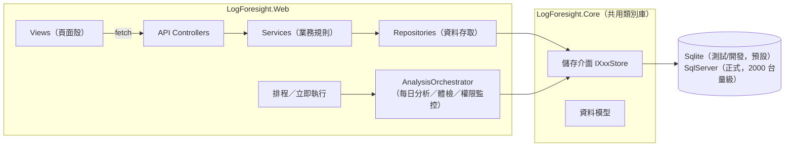

# LogForesight.Web 開發規格文件

> 本文件是 Web 查詢/維護介面的現況規格：架構、分層、驗證授權、API 慣例、前端慣例、
> 頁面規格、CSV 匯入、稽核。資料表欄位級設計以 [DB-SPEC.md](DB-SPEC.md) 為準（本文件新增的表在
> 第 10 節補齊欄位定義，同樣遵守 DB-SPEC 的雙 DB 可移植規則）；規則庫的 DB 映射見
> [RULES-SPEC.md](RULES-SPEC.md)。
>
> 專案：`LogForesight.Web`（.NET 8 MVC）。

## 1. 技術決策總表

| # | 決策 | 內容 |
|---|---|---|
| 1 | UI 框架 | Bootstrap 5 為**基底**（柵格/元件/可及性行為）；頁面外觀採功能取向的自訂設計層，**不受限於 Bootstrap 預設風格**（§8.2） |
| 2 | JavaScript | **原生 JS（ES Modules）**，不使用 jQuery；範本附帶的 jquery / jquery-validation lib 移除 |
| 3 | 主色調 | `#0d6efd`（即 Bootstrap 5 預設 primary；設計 token 與輔助色規範見 §8.2） |
| 4 | 設計原則 | 使用者便利性優先、維護成本最小化（詳見 §8.6 的具體規範，不是口號）；視覺設計服務於「快速抓到問題」（§8.2 視覺層級三原則） |
| 5 | 資料傳遞 | **View 不經 Model 傳資料**：MVC Controller 只回傳頁面殼（View），資料一律由前端 fetch 呼叫 API Controller 取得（JSON） |
| 6 | 分層 | Controllers / Models / Services / Repositories / Auth / Filters / Configuration（§4） |
| 7 | 授權 | Middleware（JWT 驗證身分）＋ ActionFilter（能力檢查）＋ Service 層（資料範圍過濾），三層各司其職（§6、§7） |
| 8 | 驗證方式 | **JWT，存放於 HttpOnly Cookie**（不放 localStorage，決策理由見 §6.1） |
| 9 | 組態 | 全部參數集中 `appsettings.json`，程式以強型別 `Appsettings` 類別取得（§5） |
| 10 | DI | 內建 DI 容器，介面註冊表見 §4.3；一律建構式注入，不用 Service Locator |
| 11 | 圖表套件 | **Chart.js v4（MIT）**，自架於 wwwroot/lib、經 `core/charts.js` 單點包裝（選型評估與排除清單見 §8.3） |
| 12 | 報表原則 | 主管報表以圖表/統計呈現、**排版優先**；所有圖表元素可點擊下鑽到實際項目（§8.4、§9.6） |

沿用前期規劃已定案的決策（不再重述理由）：群組制授權（使用者群組↔主機群組多對多）、
角色四種（user/dev/manager/admin，能力聯集）、負責人與處理人分離（僅 admin 可指派）、
規則四層保護（builtin 可改可停可回復不可刪）、CSV 三檔匯入（預覽後 all-or-nothing 套用）、
全系統操作稽核（含登入登出）、儲存層單一介面（webdata 各 store 業務邏輯與後端無關，透過
`EfJsonBlobStore`/`EfJsonLogStore` 走 SQL；**Jsonl 檔案後端已於 2026-07-24 全面退役**，
`Storage.Type` 收斂為 Sqlite／SqlServer 二選一，見 §10.4、§10.5）、不做自由文字搜尋。

## 2. 系統全貌


```mermaid
flowchart LR
    subgraph WEB["LogForesight.Web"]
        VIEW["Views（頁面殼）"] -->|fetch| API["API Controllers"]
        API --> SVC["Services（業務規則）"]
        SVC --> REPO["Repositories（資料存取）"]
        SCHED["排程／立即執行"] --> ORCH
    end
    subgraph CORE["LogForesight.Core（共用類別庫）"]
        ORCH["AnalysisOrchestrator<br/>（每日分析／體檢／權限監控）"]
        IFACE["儲存介面 IXxxStore"]
        MODELS["資料模型"]
    end
    REPO --> IFACE
    ORCH --> IFACE
    IFACE --> SQL[("Sqlite（測試/開發，預設）<br/>SqlServer（正式，2000 台量級）")]
```

- **唯一的執行單位是 LogForesight.Web**：排程／立即執行呼叫 Core 的 `AnalysisOrchestrator`
  （每日分析／體檢／權限監控），與查詢/維護介面同一個部署單位。
- **Web 不直接碰檔案或 DB**：只透過 Core 的儲存介面，Web 程式碼對後端無感知——
  現只有 Sqlite／SqlServer 兩個 SQL provider（見 §10.4／§10.5）。

## 3. SOLID 對應（設計自查表）

| 原則 | 本專案的落實方式 |
|---|---|
| **S** 單一職責 | Controller 只做「HTTP ↔ DTO 轉換與呼叫 Service」，不含業務邏輯；Service 只做業務規則，不碰 HttpContext；Repository 只做資料存取，不做授權判斷。稽核、授權、例外處理各自是獨立的 Filter/Middleware，不散落在各 Action 內 |
| **O** 開放封閉 | 儲存後端以 `Storage.Type` 切換實作、不改呼叫端（Strategy + Factory，沿用批次端既有模式）；驗證方式以 `IAuthenticationProvider` 抽換（Stub → AD/Windows）；新增角色能力只改 `RoleCapabilityMap` 一處 |
| **L** 里氏替換 | Sqlite 與 SqlServer 實作必須通過**同一組合約測試**（DB-SPEC 一致性機制 #3），語意寫在介面註解，實作不得偏離——替換 provider 不允許行為差異（JSONL 曾是第三個受此規則約束的後端，已於 2026-07-24 退役，見 §10.4） |
| **I** 介面隔離 | 有測試假件依賴的儲存介面按聚合根拆分（`IUserStore`、`IKnownIssueRuleStore`…），不做一個巨型 `IRepository`；讀寫需求差異大的（分析紀錄）維持既有的 Reader/Writer 分離；單一實作且測試零引用的介面（如原 `IAuditLogStore`、`IBatchRunStore`）已於簡化重構移除，改直接依賴具體類別，不留只有一個實作的抽象層 |
| **D** 依賴反轉 | Service 依賴抽象（保留下來的介面，或本身就穩定的具體類別）而非拼裝細節；`EfJsonBlobStore`/`EfJsonLogStore` 是儲存層唯一的底層實作，定義與實作都在 Core，依賴方向永遠指向抽象。Controller 與 Service 全部建構式注入 |

**審查基準**：PR 審查時對照此表；違反任一條需在 PR 說明中給出理由。

## 4. 專案結構與分層

### 4.1 資料夾結構

```
LogForesight.Web/
├── Program.cs                    -- 組態載入、DI 註冊、middleware 管線（保持薄，註冊邏輯抽到擴充方法）
├── appsettings.json
├── Configuration/
│   └── Appsettings.cs            -- 強型別組態（§5）
├── Controllers/
│   ├── PagesController.cs        -- MVC：只回傳 View() 頁面殼，一頁一 Action，無資料邏輯
│   └── Api/                      -- API：[ApiController]、[Route("api/...")]、只回傳 JSON
│       ├── AuthController.cs
│       ├── DashboardController.cs
│       ├── RecordsController.cs
│       ├── HostsController.cs
│       ├── PermissionChangesController.cs
│       ├── ReportsController.cs
│       ├── RulesController.cs
│       ├── AdminController.cs    -- 使用者/群組/授權維護
│       ├── ImportsController.cs
│       ├── RunsController.cs     -- 執行監控
│       └── AuditController.cs
├── Models/
│   ├── Dto/                      -- API 請求/回應物件（依 Controller 分子資料夾）
│   └── ApiResponse.cs            -- 統一回應信封（§7.2）
├── Services/                     -- 業務規則層：多數直接是具體類別（如 HandlingService）；
│                                     僅有測試假件依賴的介面（IVisibilityService 等）與其實作同資料夾
├── Repositories/                 -- 資料存取層：組合 Core 儲存介面的查詢（如儀表板聚合）
├── Auth/                         -- IAuthenticationProvider、StubAuthenticationProvider、JwtTokenService、RoleCapabilityMap
├── Filters/                      -- PermissionAttribute/Filter、ApiExceptionFilter
├── Middleware/                   -- CsrfHeaderMiddleware（§6.4）
├── Views/                        -- 頁面殼（.cshtml 內不寫業務邏輯、不用 ViewModel 帶資料）
└── wwwroot/
    ├── css/site.css              -- 主題與元件樣式（§8.2）
    └── js/
        ├── core/                 -- api.js（fetch 包裝）、ui.js（toast/modal/表格）、format.js、charts.js（Chart.js 包裝）
        └── pages/                -- 一頁一模組（dashboard.js、records.js…），與 View 一一對應
```

範本清理清單（Phase 0）：移除 `wwwroot/lib/jquery*`、`_ValidationScriptsPartial.cshtml`、
`Views/Home/Privacy.cshtml`；`HomeController` 改為 `PagesController`。

### 4.2 分層責任邊界（違反即打回）

| 層 | 做 | 不做 |
|---|---|---|
| API Controller | 綁定/驗證 DTO、呼叫單一 Service 方法、回傳信封 | 業務判斷、直接用 Repository、組 SQL/LINQ、try-catch（交給 ExceptionFilter） |
| Service | 業務規則、授權範圍過濾（呼叫 `IVisibilityService`）、稽核寫入、跨 Repository 組合 | 讀 HttpContext（需要目前使用者時注入 `ICurrentUser`）、格式化顯示文字 |
| Repository | 查詢組合、分頁、對 Core 介面的轉接 | 授權判斷、業務規則 |
| View + JS | 呈現、互動、呼叫 API | 權限判斷邏輯（選單顯示依 `/api/auth/me` 回傳的能力，但**真正的防線在後端**） |

### 4.3 DI 註冊表

| 介面 | 實作 | 生命週期 |
|---|---|---|
| `Appsettings` | 組態綁定單例 | Singleton |
| Core 各 `IXxxStore`（有測試假件依賴者） | 以 `StorageBackend`（依 `Storage.Type` 建立的單一路由點）的 `Blob`/`LogStore` 組出 | Singleton |
| `IAuthenticationProvider` | `DynamicAuthenticationProvider` 包裝依 `Auth.Provider` 註冊的 fallback（Stub / Ldap）——DB 的 AD 設定開啟時改走 DB 動態設定（docs/archive/HISTORY.md #9） | Singleton |
| `JwtTokenService` | 直接注入具體類別（`IJwtTokenService` 介面因測試零引用，簡化重構時已移除） | Singleton |
| `ICurrentUser` | `HttpContextCurrentUser`（自 Claims 讀取） | Scoped |
| `IVisibilityService` | `VisibilityService`（授權主機解析＋每請求快取） | Scoped |
| `IAuditService` | `AuditService` | Scoped |
| 各業務 Service / Repository | 多數直接注入具體類別；僅有測試假件依賴的介面（`IUserStore`／`IHostStore`／`ICsvImporter` 等約 25 個）保留介面 | Scoped |

## 5. 組態（appsettings.json ↔ Appsettings.cs）

```json
{
  "Storage": { "Type": "Sqlite", "DataRoot": "", "ConnectionString": "" },  // Type: Sqlite | SqlServer（§10.5；Jsonl 已於 2026-07-24 退役）
  // SecretKey / PasswordHash 內含「開箱即可測試」的公開已知測試值（帳號 svc-lfadmin / 密碼 LogForesight-dev）,
  // 正式環境務必以環境變數 Jwt__SecretKey、Auth__ServerAdmin__PasswordHash 覆寫,且 Provider 改成 Ldap。
  "Jwt": { "Issuer": "LogForesight", "Audience": "LogForesight.Web", "SecretKey": "<測試值,正式環境覆寫>", "ExpireHours": 8 },
  "Auth": {
    "Provider": "Stub",
    "ServerAdmin": { "Account": "svc-lfadmin", "PasswordHash": "<測試值,對應密碼 LogForesight-dev>" }
  },
  "Import": { "MaxFileSizeKb": 2048, "MaxRows": 5000 },
  "Ui": { "DefaultPageSize": 50, "DashboardDefaultDays": 7, "RunMatrixDays": 14 }
  // NetIQ 掃描匯入一律真實連線（§13,回饋第九輪）:原 "Netiq": { "DiscoveryClient" } 已退役,
  // 離線示範資料改由「NetIQ 維護」頁的 UseOfflineDemoData 開關控制（僅非 Production 可開）。
}
```

- `Appsettings.cs` 是巢狀類別的單一根（`Appsettings.Storage.Type` 這樣取用），
  `Program.cs` 以 `Configuration.Get<Appsettings>()` 綁定並註冊 Singleton，任何類別建構式注入取得。
  **不在程式中直接讀 `IConfiguration`**——組態鍵名只存在於 Appsettings.cs 一處，改名不會有魔法字串漏網。
- **啟動時驗證**：`Appsettings.Validate()` 檢查必填（如 `Jwt.SecretKey` 非空、`Storage.DataRoot`
  存在、`Auth.ServerAdmin` 帳號與雜湊非空、`Auth.Provider=Stub` 時環境不得為 Production），
  不合格直接 fail fast 拋例外，不讓站台帶病啟動——沿用批次端「設定錯誤要顯性化」的原則。
- **與批次設定的一致性**：Web 與批次 exe 各有自己的 appsettings.json，但 `Storage` 區段
  （Type/DataRoot/ConnectionString）**兩邊必須指向同一後端**——欄位定義放 Core 的
  `StorageSettings` 共用類別，語意只有一份；部署文件需註明兩份設定同步調整。
- **`Storage.Type` 二選一**（2026-07-24 起 `Sqlite` 為預設與主要測試方式，`Jsonl` 檔案後端已
  全面退役、設成 `Jsonl` 啟動即報錯）：`Sqlite`（測試/開發用的單一 `.db` 檔真資料庫，不寫任何
  JSON 檔，預設）／`SqlServer`（正式環境，2000 台量級）。**全部資料**（分析紀錄＋webdata）
  走資料庫。Web 的 `appsettings.Development.json` 同樣預設 `Type=Sqlite`（驗證與正式相同的
  SQL 語意）；正式部署改 `SqlServer`。
- `Jwt.SecretKey` / `ServerAdmin.PasswordHash`：**基礎 `appsettings.json` 內含「公開已知」的測試值**
  （帳號 `svc-lfadmin` / 密碼 `LogForesight-dev`），讓開發者 clone 後 `dotnet run` 即可登入測試,不必先做設定。
  這些值會進版控與 GitHub、任何人都看得到,**因此絕不能沿用到正式環境**：正式環境一律用環境變數覆寫
  （`Jwt__SecretKey`、`Auth__ServerAdmin__PasswordHash`,或 user-secrets），並把 `Auth.Provider` 改成
  `Ldap`（`Provider=Stub` 且 `ASPNETCORE_ENVIRONMENT=Production` 時啟動 fail fast 的欄杆會擋下帶著測試設定上線的失誤）。
  想覆寫本機測試值可用 `appsettings.Development.json`（gitignore）。
- `Storage.DataRoot`：JSONL 後端的資料根目錄＝批次執行檔目錄（`history.txt`、`rules.json` 所在），
  Web 的自有資料寫入其下 `webdata\`（§10.3）。
- **開發環境自動推算 `DataRoot`**：`ASPNETCORE_ENVIRONMENT=Development` 且 `Storage.DataRoot` 為空時，
  `Program.cs` 依本站台輸出目錄推算同一個 repo 內批次的輸出目錄（`{repo}\LogForesight\bin\{Config}\{TFM}`），
  取代先前 `appsettings.Development.json` 寫死的絕對路徑——不綁使用者名稱、自動跟著 Debug/Release 與 TFM 變動。
  推算不出（目錄結構非預期）時維持空值、交由 `Validate()` 顯性報錯。開發者若明確填了 `DataRoot` 則尊重其值、不推算；
  正式環境不受影響（本機制只在 Development 生效）。

## 6. 身分驗證

### 6.1 決策：JWT 放 HttpOnly Cookie

- **瀏覽器（View→API）**：登入成功後簽發 JWT，寫入 **HttpOnly、Secure、SameSite=Strict** 的
  Cookie（名稱 `lf_auth`）。前端 JS **接觸不到 token**（HttpOnly），fetch 同源自動帶上，
  避免 localStorage 存 token 的 XSS 竊取面。View（MVC 頁面殼）與 API 走同一張 Cookie、
  同一套驗證管線——頁面殼本身也要求已驗證（未登入直接 302 到登入頁，而不是空殼進來再被 API 401）。
- 需要 HTTPS（Secure cookie 前提）；內網自簽或企業 CA 憑證皆可。

### 6.2 登入流程與 Claims

```
登入頁 POST /api/auth/login { account, password? }
  → IAuthenticationProvider.AuthenticateAsync(account, password)
      serverAdmin 帳號比對（任何 Provider 下優先檢查，見下方專節）
      Stub 實作（第一版）：lf_users 存在且 active 即通過（password 忽略）——僅供開發/前期測試
      正式（已定案）：LdapAuthenticationProvider（AD 帳密 bind 驗證，見下方專節）
  → 成功：查使用者群組 → RoleCapabilityMap 算出能力集合 → 簽發 JWT → Set-Cookie
  → 稽核 login / login_failed（§13）
```

**serverAdmin（本地救援/引導帳號，2026-07-21 定案）**：

- `Auth.ServerAdmin` 定義一個**不存在於 `lf_users`** 的本地帳號，密碼由管理單位
  **封存保管並定期變更**。用途：指派/移除 admin 群組成員——解掉「匯入使用者需要 admin、
  admin 又來自匯入」的引導問題，也是日後 **AD 停擺時的救援入口**（不依賴任何 Provider，
  Stub 或 Ldap 模式下皆可登入）。
- **最小授權**：登入後能力僅 `Maintain`＋`ViewAudit`（使用者/群組/主機維護與稽核查閱），
  **不含任何業務資料檢視**——依「設定 admin 角色成員」的用途給權，不是萬能帳號。
- **密碼以雜湊存放**（PBKDF2，不存明文——設定檔會進備份/複本，明文密碼會跟著擴散）。
  輪替 SOP：產生新雜湊填入 `PasswordHash` 後重啟站台即可，產生指令
  （`LogForesight.Web.exe --hash-password`）隨 Phase 0 提供；已簽發的 JWT 最長 8 小時自然失效。
- **Web 端鎖定**：serverAdmin 連續 5 次登入失敗鎖定 15 分鐘（記憶體計數即可）——
  它是本地帳號、**不受 AD 帳戶鎖定原則保護**，必須自帶防暴力破解；一般 AD 帳號則不做
  Web 端鎖定，交由 AD 原則（見下）。**此鎖定只在驗密碼的 Provider（正式 Ldap）下有意義**；
  `Provider=Stub` 不驗密碼（見下方「Stub 免密碼」），serverAdmin 直接放行、無密碼可錯、不計失敗。
- 全部操作照常稽核（account=設定的帳號名、user_id NULL）；儀表板登入失敗卡對它的
  失敗嘗試同樣可見。
- 啟動驗證：`ServerAdmin.Account`/`PasswordHash` 為必填（§5）。

**Stub 免密碼（已接受，2026-07-21；2026-07-23 涵蓋 serverAdmin）**：測試期間環境不含核心重要
主機，免密碼風險已評估接受。**「免密碼」的界線在後端、不在前端**：`Provider=Stub` 下登入頁
**照常顯示密碼欄、使用者照常輸入、前端驗證不變**；密碼送到後端後，Stub 模式一律通過密碼
驗證——**不論輸入什麼密碼（含錯誤、留空）都放行**。一般帳號由 `StubAuthenticationProvider.Verify`
恆回 Ok；**本地救援帳號 serverAdmin 同樣一致**：`IdentityService` 把
`IAuthenticationProvider.RequiresPassword` 傳入 `ServerAdminAuthenticator.TryLogin`，為 `false`
（Stub）時不比對密碼直接放行並清空失敗計數。（此前 serverAdmin 在 Stub 下仍強制驗密碼，
與一般帳號不一致、預設帳號無法免密碼登入，已修正。）`Provider=Stub` 且
`ASPNETCORE_ENVIRONMENT=Production` 時啟動 fail fast 的欄杆維持不變（防的是「帶著 Stub 上
正式環境」的失誤，不是測試期的使用）——正式環境強制 Ldap（`RequiresPassword=true`），
救援帳號仍走 PBKDF2 密碼＋鎖定，這條免密碼捷徑到不了正式環境。

**正式驗證（已定案：AD LDAP）**：`LdapAuthenticationProvider` 以使用者帳密向 AD bind 驗證；
**登入失敗的鎖定交由 AD 帳戶鎖定原則**（驗證失敗即計入網域的失敗次數，達原則門檻自動鎖定），
Web 端不對 AD 帳號另建鎖定機制——一套鎖定原則、一個事實來源。已知副作用：對登入頁
輸入他人帳號亂試可觸發該帳號的 AD 鎖定（內網環境接受此風險，稽核 `login_failed` 含來源 IP 可查）。

JWT Claims：`sub`（user_id）、`account`、`name`、`cap`（能力字串陣列）、`exp`。
**能力進 token、主機授權範圍不進 token**——範圍每次請求由 `IVisibilityService` 即時解析
（群組異動即時生效；能力異動最遲於 token 過期時生效，接受此延遲）。

### 6.3 逾期與登出

- 效期 `Jwt.ExpireHours`（預設 8 小時），不做 refresh token（內網工具，過期重登入即可）。
- **停用即時生效**：`ICurrentUser` 解析時逐請求檢查 `lf_users.active`，停用帳號立即 401，
  不等 token 自然過期（能力異動仍接受 token 效期內的延遲，§6.2；停用是安全事件，不可延遲）。
- API 收到過期/無效 token → 401 ＋ 信封 error code `auth_expired`；前端攔截後導向登入頁。
  過期後首個被拒請求補記稽核 `session_expired`（誠實邊界：無法記錄「過期那一刻」）。
- `POST /api/auth/logout`：清除 Cookie＋稽核 `logout`。

### 6.4 CSRF 防護

SameSite=Strict 已擋跨站帶 Cookie；再加一層防禦深度：`CsrfHeaderMiddleware` 要求所有
**非 GET 的 API 請求**必須帶自訂標頭 `X-Requested-By: LogForesight`（`core/api.js` 統一加上）。
跨站表單無法自訂標頭，兩層皆破才會失守。不用 ASP.NET Antiforgery token（它假設表單 post 模型，
與「全 API」架構不合）。

## 7. 授權與 API 慣例

### 7.1 三層授權

| 層 | 機制 | 回答的問題 |
|---|---|---|
| 1. Middleware | JWT Bearer 驗證（自 Cookie 取 token） | 你是誰？（未登入 → 401） |
| 2. ActionFilter | `[Permission(Capability.X)]` 讀 `cap` claim | 你能不能用這個功能？（不足 → 403 ＋稽核 `denied`） |
| 3. Service | `IVisibilityService.GetVisibleHostIdsAsync()` | 你能看哪些主機的資料？（查詢一律先過濾） |

```csharp
public enum Capability { ViewAll, Handle, Assign, ConfirmPermission, Maintain, DevMonitor, ViewAudit }

// RoleCapabilityMap（單一事實來源；user 沒有 ViewAll，資料範圍由第 3 層決定）
user    → Handle, ConfirmPermission
dev     → ViewAll, DevMonitor
manager → ViewAll
admin   → ViewAll, Handle, Assign, ConfirmPermission, Maintain, DevMonitor, ViewAudit

[HttpPut("api/records/{id}/handling/assign")]
[Permission(Capability.Assign)]
public Task<ApiResponse<HandlingDto>> Assign(long id, AssignRequest req) => ...
```

`PermissionFilter`（`IAsyncAuthorizationFilter`）：能力不足回 403 並寫稽核（result=`denied`）。
**Service 層的資料範圍過濾是不可繞過的最後防線**：即使某個 API 忘了掛 Filter，
查詢仍只回授權範圍的資料。

**停用主機不在可見範圍**（2026-07-27，docs/archive/HISTORY.md N-1）：`Active=false` 的主機
（管理員手動停用或 Sentinel 移除觸發的系統停用）一律排除在 `GetVisibleHostIds()` 之外——
含 ViewAll 分支。其歷史紀錄因此不出現在問題查詢/儀表板/報表的任何計數，資料只留在資料庫，
重新啟用即全部復原；主機管理頁不經此路徑，停用主機本身仍可見可管理。墓碑列（合併來源，
同為 Active=false）的歷史不受影響——經 `RecordRepository.VisibleHostKeys` 從存活主機做別名展開。

### 7.2 API 統一慣例

- 路由：`api/{resource}`，資源複數、動作用 HTTP 動詞表達；非 CRUD 動作用子路徑
  （`POST api/rules/{id}/restore`）。
- **風險日的資源識別＝`{hostId}/{date}` 複合鍵**（如 `api/records/17/2026-07-19`）——
  JSONL 後端的紀錄天然以（主機,日期）為鍵、**沒有代理數字 id**；SQL 的 `record_id`
  只是內部主鍵，不暴露到 API。兩後端因此共用同一套路由與處理狀態關連鍵，
  切換後端不改 URL（處理狀態/歷程在 JSONL 端同樣以 host+date 為鍵儲存）。
- **回應信封**（所有 API 一致，前端只寫一次解析邏輯）：

```json
{ "success": true,  "data": { ... }, "error": null }
{ "success": false, "data": null, "error": { "code": "validation_failed", "message": "預計完成日不可早於今天" } }
```

- 錯誤碼固定小寫 snake_case：`auth_expired`、`forbidden`、`not_found`、`validation_failed`、
  `conflict`、`server_error`。`message` 一律是**可直接顯示給使用者的繁體中文**——
  前端不做錯誤碼→文案對照表（維護不動的東西就不要建）。
- **例外處理單點化**：`ApiExceptionFilter` 把未捕捉例外轉成 `server_error` 信封（HTTP 500）、
  完整堆疊寫 Web 端 NLog；業務錯誤由 Service 拋 `DomainException(code, message)`，
  Filter 轉 4xx 信封。Controller/Service 不寫 try-catch 樣板。
- 分頁：請求 `page`（1 起）、`pageSize`（上限 200）；回應 `data: { items, page, pageSize, total }`。
- 日期格式：`yyyy-MM-dd`（date）／ISO 8601（timestamp），前後端一致，不做隱式時區轉換。

## 8. 前端規範

### 8.1 JS 架構（原生 ES Modules）

- `core/api.js`：fetch 包裝的**唯一出口**——組信封解析、錯誤 toast、401 導登入、
  非 GET 自動帶 `X-Requested-By`。頁面模組不得直接呼叫 `fetch`。
- `core/ui.js`：toast（Bootstrap Toast）、確認對話框（Bootstrap Modal 包裝，
  破壞性操作一律經過它）、表格渲染 helper（欄位定義 → `<table>`，含空狀態與載入中列）。
- `core/format.js`：日期、風險等級徽章、狀態徽章的統一格式化（風險/狀態的顯示規則只寫一次）。
- `pages/*.js`：一頁一模組，`_Layout.cshtml` 以 `<script type="module">` 載入對應頁模組；
  頁面需要的初始參數（如 record id）用 `data-*` 屬性放在 View 的根元素上，JS 讀取——
  **cshtml 內不寫 inline script、不用 Razor 內插 JS 變數**。
- 禁止引入前端框架/打包工具（React/Vue/webpack…）——本專案的前端複雜度用「模組化原生 JS」
  就能維護，工具鏈越少、五年後越可能還編得起來（對應決策 #4 的防廢棄考量）。
  第三方 JS 套件僅限白名單：Bootstrap（範本內建）＋ Chart.js（§8.3）；新增套件需符合
  §8.3 的選型限制（開放授權以 MIT 優先、排除中國起源/中國社群主導維護的套件）並更新本文件。
- **圖示資產白名單**：Bootstrap Icons（MIT，2026-07-22 加入）——**僅手動複製約 24 個 symbol**
  到 `wwwroot/img/icons.svg` 單一 sprite，屬純靜態 SVG 資產、**無任何執行程式碼**、零外部請求、
  不引入字型檔，故不受上面「前端套件」的執行風險限制；用法見 §8.2「圖示」。
- **字型資產白名單**（2026-08-05 v2 加入，見 docs/DESIGN-SYSTEM.md §3）：Fira Sans／Fira Code
  （SIL OFL，Mozilla 出品）——**self-host 的 latin subset woff2**（`wwwroot/fonts/`，共 5 檔約
  134KB），屬純靜態字型資產、零外部請求、**不透過 CDN／Google Fonts**（違反上面的無外部請求原則）。
  拉丁字由 `@font-face` + `unicode-range` 接管，**中文一律走系統字 fallback**（微軟正黑）——
  不引入 MB 級中文 webfont，維持零依賴精神。

### 8.2 設計系統（Bootstrap 為基底、功能取向的自訂外觀）

Bootstrap 提供柵格、表單元件與可及性行為；**頁面外觀不受限於 Bootstrap 預設風格**。
設計目標只有一個：**維運人員打開頁面 3 秒內看到最該看的東西**，美化是為這個目標服務。

**設計 token（`site.css` 的 `:root` 自訂變數，全站樣式的唯一取值來源）**：
具體取值與 v1→v2 對照一律查 **docs/DESIGN-SYSTEM.md**，本節只記原則。

```css
:root {
  --lf-primary: #1e40af;          /* v2 主色＝企業藍（blue-800），見下方 retheme 說明 */
  --lf-accent: #d97706;           /* v2 琥珀強調（KPI 亮點／需注意），剋制使用 */
  --lf-sidebar-bg: #0f1d3a;       /* 深海軍藍側欄（與主色同族） */
  --lf-content-bg: #f8fafc;       /* 淺灰內容區（slate-50） */
  --lf-card-bg: #ffffff;          /* 白卡片 */
  --lf-font-family: "Fira Sans", …;   /* 拉丁自架 Fira，中文系統字 fallback */
  --lf-font-mono: "Fira Code", …;     /* 技術值等寬字（事件ID/主機名/路徑） */
  /* 字級（--lf-font-size-xs~2xl/stat）、間距（--lf-space-1~6）、圓角
     （--lf-radius-sm/base/lg/pill，v2 收緊一階）、陰影（--lf-shadow-xs~lg）、focus ring 皆成 token */
  --lf-risk-high: #dc2626;  --lf-risk-mid: #d97706;  --lf-risk-low: #64748b;
  /* 每個語意色另備 -soft companion（如 --lf-risk-mid-soft）供淡色徽章使用 */
  /* 圖表分類色盤（8 類風險類型固定對應，見 §8.3） */
}
```

元件樣式只引用 token、不散落 magic value——調整外觀改一處全站生效，這是「不用標準
Bootstrap 風格」與「維護成本最小化」能同時成立的前提。

**v2 視覺改版（2026-08-05，依 ui-ux-pro-max-skill 檢索產生，見 DESIGN-SYSTEM.md）**：
風格定位為 **Data-Dense Dashboard × Swiss 極簡**；主色靛藍→企業藍 `#1e40af` + 琥珀強調，
導入自架 Fira 字型，圓角收緊一階，並補齊 `prefers-reduced-motion` 支援。中性階與語意色
維持 slate/紅琥珀系不變，圖表 8 類固定色盤僅 storage 跟隨主色換族。

**Bootstrap 元件級變數 retheme（2026-07-22 決策，取代舊版「不覆寫 --bs-primary」）**：
舊版讓 `--lf-primary` 維持 Bootstrap 預設藍以求升級零成本，代價是自訂色與 Bootstrap 藍
並存、外觀不一致。現改為透過 Bootstrap 5.3 的**元件級 CSS 變數**（如 `.btn-primary` 的
`--bs-btn-bg`、`.pagination` 的 `--bs-pagination-active-bg`、`--bs-link-color` 等）把按鈕/表單/
分頁/頁籤統一 retheme 成主色——**只覆寫 CSS 變數、不改 Bootstrap 原始碼**，升級 Bootstrap
仍零成本，且全站外觀一致。`.nav-tabs` 一併改為**底線式頁籤**（無外框），三個用 `nav-tabs`
的頁面零 markup 變更即生效。
（2026-08-05 修：vendored Bootstrap 原為 5.1.0，元件級變數是 5.3 才引入，故上述 retheme
規則長期失效、主按鈕/分頁/連結實際仍是 Bootstrap 預設藍；已升級 vendored dist 至 5.3.8，
純靜態檔置換、無 build step，retheme 全數生效。）

**共用篩選工具列與 chip（2026-07-23 Phase D-0，視覺基盤）**：問題查詢／規則維護／主機／
使用者頁的搜尋＋快速篩選原本各頁各自手排 flex 列與裸 `btn-group`，間距配色零散。改為一組
共用元件——`.lf-toolbar`（一列式篩選列：欄位列＋分節列＋分隔線 `.lf-toolbar__divider`）與
`.lf-chip`（藥丸狀篩選鈕，淡底／主色 active，取代裸 `btn-group`，比按鈕輕、比純文字可點）。
`ui.js` 的 `renderChips(container, { items, attr, activeValues, multi, onToggle })` 是唯一
渲染工廠（`multi=false` 單選＝點擊清掉群組內其他 active，適合狀態/排序方向；`multi=true` 多選
＝空集合代表不限）。各頁篩選一致性靠共用元件保證、不靠各頁自律——這是 D-1～D-4 各頁改版
（規則/主機/使用者的快速篩選、問題查詢的群組 chip、風險日詳情的狀態面板）的共同基座。

**圖示**：採自架單一 SVG sprite（`wwwroot/img/icons.svg`，Bootstrap Icons MIT 子集，見 §8.1
白名單），零外部請求、無字型下載。cshtml 內以 `<svg class="lf-icon"><use href="/img/icons.svg#名稱">`
引用（注意 `href` 走絕對路徑，Razor 不解析 SVG `<use>` 內的 `~/`）；JS 動態產生的內容用
`ui.js` 的 `icon(name)`（`createElementNS` 建 SVG）。圖示一律 `aria-hidden`、跟隨文字色與字級，
**裝飾性、不得比風險訊號搶眼**（原則 1）——側欄與按鈕圖示皆降透明度處理。

**視覺層級三原則（所有頁面的排版依據）**：

1. **嚴重度驅動顯著性**：畫面上最醒目的元素必須是當前最嚴重的問題——「重大」/高風險卡片
   加粗左紅邊、排序置頂、數字放大；裝飾性元素（icon、插圖、漸層）不得比訊號更搶眼。
   介面本身維持低飽和（灰藍白），紅/黃只保留給風險訊號，異常自然從畫面裡跳出來。
2. **數字優先**：統計卡採「大字數字（2rem+）＋小字標籤＋趨勢箭頭」結構，掃視即得；
   文字說明放次要層級。
3. **語意色全站一致**（`format.js`/`site.css` 單點定義）：
   風險「高」`danger`、「中」`warning`、「低」`secondary`；嚴重度 High `warning`、
   Medium `info`、Low `neutral`；「重大」旗標徽章 `danger`；處理狀態 open `danger`、
   in_progress `primary`、resolved `success`（對外三態，見下）；執行結果 成功 `success`、
   有警告 `warning`、失敗/中斷 `danger`、未執行 `secondary`。同一個顏色在圖表、徽章、卡片、
   時間軸中意義相同。

   **嚴重度顯示名（2026-07-28 三級化，docs/archive/HISTORY.md #1）**：High=高、Medium=中、
   Low=低，單點定義於 `format.js` 的 `SEVERITY_NAMES`/`severityName()`。原第四級 `Critical`
   已收斂進 High，其「命中即列為高風險日」的職責改由規則旗標 `ElevatesDayRisk` 承載，
   畫面上以獨立的「**重大**」徽章（`format.js` 的 `elevatesBadge()`）呈現於嚴重度徽章旁——
   詳情頁重點問題列與規則維護頁共用同一顆徽章。
   內部值（Set、URL 參數、API 欄位、`<option value>`）一律維持英文，只有畫面文字轉中文。
   與日風險等級的「高風險/中風險/低風險」
   （`riskBadge`）的區隔：日風險徽章一律帶「風險」後綴、色系不同（見上），嚴重度徽章不帶後綴。

**版面骨架**：深色側欄（依能力**分組**顯示選單項——監控作業／系統管理／系統，空群組連
標題一起省略）＋淺灰內容區＋白卡片網格；上方 topbar 顯示頁面標題。**徽章一律「顏色＋
文字」**，不做只靠顏色區分的 UI（色弱可用性；圖表的對策見 §8.3）。徽章統一走**淡色系統**
（`.lf-badge--success/danger/warning/info/primary/neutral/dark`，soft 底＋同色深字＋hairline
邊，`format.js` 的 `statusBadge()` 為唯一工廠）——**唯一例外是風險「高」維持實心紅**，確保
風險是畫面最響亮的元素（原則 1）。共用 helper 集中在 `ui.js`：`button()`（統一按鈕）、
`bindTabs()`（頁籤切換）、`renderPagination()`（分頁）、`icon()`（SVG 圖示）。報告全文維持
`<pre class="report-text">` 等寬原樣呈現（含框線符號），但外層卡片給足留白與工具列
（複製、下載 txt），不是把 txt 直接貼在白背景上。頁面上的大段說明改以一行 `.lf-hint` ＋
`question-circle` popover 收納（`layout.js` 的 `initHelpPopovers()` 統一初始化），大型表單的
次要欄位以 Bootstrap collapse 漸進揭露（如規則頁的處置知識庫預設收合）。

### 8.3 圖表規範（Chart.js）

**選型（2026-07-21 定案）**：

| 候選 | 授權 | 評估 |
|---|---|---|
| **Chart.js v4 ✅ 採用** | MIT | 輕量（單檔 ~200KB、免打包工具，契合 §8.1 無 build 工具鏈的決策）；折線/長條/環圈完全覆蓋本專案圖型需求；`onClick` 事件回傳資料點索引，下鑽（§8.4）天然支援；社群量大、文件完整，主要維護者為國際社群 |
| Plotly.js | MIT | 功能最強但單檔 3.5MB+，主打科學繪圖；本專案圖型簡單，重量不成比例。列為未來需要進階圖型（熱力圖等）時的備選 |
| ApexCharts | MIT | SVG 渲染、預設外觀佳，可接受的替代品；生態與文件量不及 Chart.js，不採 |
| Apache ECharts、AntV/G2 | Apache-2.0 / MIT | **排除**——中國起源且由中國社群主導維護（依 2026-07-21 選型限制） |
| D3 / uPlot | ISC / MIT | D3 太底層（開發成本高）；uPlot 太精簡（無互動配套），皆不採 |

**使用規則**：

1. 自架於 `wwwroot/lib/chartjs/`（內網環境不用 CDN），鎖定版本、升版走 PR。
2. 頁面模組**不直接呼叫 Chart.js**——一律經 `core/charts.js` 包裝層：
   `charts.line(el, spec)`、`charts.bar(...)`、`charts.doughnut(...)`。包裝層統一注入
   設計 token 色盤、字型、tooltip 樣式與點擊下鑽接線。換圖表庫＝只改這一個模組
   （SOLID 的 O；也是防廢棄的保險）。
3. 色彩：風險/嚴重度圖用 §8.2 語意色；8 種風險類型用固定分類色盤（token 定義），
   同一類別在所有圖表中同色。
4. 可及性配套：折線/長條圖卡右上角提供「表格」切換鈕，以資料表格呈現同一份數據
   （色弱/精確讀值/複製需求一次滿足——資料本來就在前端，零後端成本）。**占比圓餅圖例外**
   （2026-07-28 docs/archive/HISTORY.md #3）：圓餅圖本來就沒有 XY 軸，改左圖右文字
   條列（`charts.attachDoughnutLegend`）常駐顯示數值與百分比，不需要再切換一次表格模式；
   條列每列沿用該分段的下鑽 URL。**PNG 下載已移除**（#4）：需要圖檔的情境走既有
   「列印 / 存成 PDF」，`attachToolbar` 不再提供 `toBase64Image()` 下載鈕。

### 8.4 下鑽（drill-down）規則——「報表關連到實際項目」的統一機制

**統計數字不是終點，是入口**。全站任何聚合呈現（圖表資料點、統計卡、排行列）都必須
可點擊，導向帶對應篩選條件的明細頁：

| 來源 | 點擊後導向 |
|---|---|
| 類型分布圖的某一段（如「儲存裝置×高」） | `/records?categories=Storage&severity=High&from=...&to=...` |
| 趨勢折線的某一個資料點（某日高風險數） | `/records?riskLevels=高&from=該日&to=該日` |
| 儀表板統計卡（逾期未處理 N 件） | `/records?statuses=open,in_progress&overdue=1` |
| 高風險主機排行的一列 | `/hosts/{id}`（時間軸） |
| 執行監控異常彙總的一列 | 該錯誤的執行詳情清單 |

實作依託 §8.6-2 的既有決策（清單頁篩選與 URL 查詢字串同步）——下鑽只是「組出正確的
查詢字串再導頁」，明細頁不需要為下鑽寫任何額外程式碼。`core/charts.js` 的 spec 帶
`drillTo(dataPoint) => url` 回呼，接線集中在包裝層。**驗收標準：主管在報表頁看到任何
一個數字，最多兩次點擊就能看到組成這個數字的實際風險日清單。**

### 8.5 頁面殼與 View 的關係

每個 View 只含：麵包屑、頁面標題、空的容器元素（含 `data-*` 初始參數）。
所有動態內容由頁模組呼叫 API 後渲染。這是決策 #5 的直接推論：**View 沒有資料，就沒有
「同一份資料兩個來源」的維護問題**，頁面行為全部可以從 API 層測試。

### 8.6 使用者便利性規範（決策 #4 的具體化，逐條可驗收）

1. 清單頁的篩選條件記憶於 `localStorage`，回到頁面自動還原（含儀表板時間窗）
2. **所有清單支援表頭點擊排序**（2026-07-29）：`renderTable` 的欄位定義帶 `sortKey` 即可點擊，
   同欄再點切換 asc/desc、換欄回到該欄的 `sortDefaultDir`（未指定則 asc），切換邏輯集中在
   `core/ui.js`，呼叫端只需套用收到的 `{key, dir}`。伺服器端分頁頁（`records`／`hosts`／`audit`）
   排序下推 API（`sort`/`dir` 查詢參數）；本地清單頁（`users`／`rules`／`suppressions`／執行監控
   單日明細與異常彙總）用共用的 `sortRows()` 在瀏覽器內排序。與篩選同步 URL 查詢字串
   （篩選結果可以複製網址給同事）——彙總視角切換時排序重設，因為欄位命名空間不同（見 records.js）。
3. 破壞性操作（刪除規則、套用匯入、合併主機）一律二次確認，確認框內**具體描述影響**
   （「將刪除規則 custom-xxx 及其 3 筆抑制設定」，不是「確定嗎？」）
4. 表單錯誤顯示在欄位旁（Bootstrap validation style），API 錯誤 message 直接顯示，不轉譯
5. 空狀態要有指引（「尚無資料。請先於『CSV 匯入』建立使用者與主機」），不留白畫面
6. 載入中一律有視覺回饋（表格 skeleton 列或 spinner），按鈕送出後 disable 防連點。
   **等待動畫只有三種出口（2026-08-04，docs/archive/FEEDBACK-8-PLAN.md #1），不要再長出第四種寫法**：
   整塊清單載入 → `ui.js renderLoading()`（骨架列）；按鈕忙碌 → `withBusy()`（按鈕內
   spinner＋「⋯中」）；其餘區塊內等待（精靈步驟、輪詢中的狀態文字等）→ `renderSpinner()`
   （spinner＋文字，輪詢更新時只換文字節點、不重建 spinner 避免動畫重置閃爍）。
   聊天泡泡的三點跳動（`.lf-typing`）是對話情境的既有專屬樣式，不在此收斂範圍
7. **每頁筆數可選（2026-07-29）**：`renderPagination` 的每頁筆數下拉固定 10/20/30/50/100，
   預設 20；選擇記在 `localStorage`（per 呼叫端一把 key），下次進頁沿用。表格提供
   「複製為 CSV」按鈕（前端序列化當前頁，零後端成本）
8. 日期區間提供快捷鈕：今天／近 7 天／近 30 天
9. **modal 寬度（2026-07-31，docs/archive/FEEDBACK-5-PLAN.md §7）**：表單 modal 欄位 ≥3 組即
   `modal-lg`＋`row g-3` 兩欄排列；檢視型 modal（唯讀展示內容，非表單）一律 `modal-lg`
   起跳。避免「細細一長排」逼使用者在窄欄位裡一路往下捲；<992px（`modal-lg` 斷點以下）
   兩欄自動退回單欄（Bootstrap grid 原生行為，不需額外處理）。內容仍可能超高者另加
   `modal-dialog-scrollable`。短訊息的二次確認框（`confirmAction`）刻意不套用——
   寬版對單句確認文字反而鬆散。
10. **常駐說明文字收斂為 hover icon（2026-07-31，docs/archive/FEEDBACK-5-PLAN.md §6）**：純描述性的
    `.form-text`（說明「這欄位是什麼」但不影響能否送出）改為 `core/ui.js` 的 `helpIcon(content, title)`
    ——小圖示鈕，`hover`/`focus` 觸發 `bootstrap.Popover`；放在 `<label>` **之後、`<input>` 之前的
    同層 sibling**（不巢在 `<label>` 內——互動元素巢在 `<label>` 內在不同瀏覽器的點擊/焦點行為不一致，
    專案內無此前例）。**保留常駐顯示**的判準：說明陳述的是不可逆或會擋住送出的後果（例如「未分組時
    只有 admin 看得到」「建立後不可修改」「保留天數上限」），這類文字不該藏在要滑鼠移過去才看得到的
    icon 裡；純描述性質（例如「用於向 Sentinel 查詢」）才收斂。
11. **批次操作跨頁選取（2026-07-31，docs/archive/FEEDBACK-5-PLAN.md §8）**：伺服器端分頁清單若支援批次
    操作，勾選狀態存 `Map<id, rowDto>`（不是純 id 集合）——批次確認畫面通常要顯示「勾了哪些」的
    名稱／摘要，而那些列未必在目前這一頁，只能靠勾選當下存下的物件；翻頁／篩選不清空，僅
    「清除選取」與套用成功後清空。表頭全選只作用於目前這一頁（伺服器端分頁沒有「全部」的概念），
    以 `indeterminate` 呈現「本頁部分已選」。首見於主機頁批次改群組，供之後其他清單頁比照。
12. **使用者名稱欄位固定顯示「顯示名稱(帳號)」（2026-08-04，docs/archive/FEEDBACK-8-PLAN.md #6）**：
    半形括號；前端唯一出口 `format.js formatUserName()`（查無顯示名稱退回帳號），後端組字串的
    出口（TriggerText 之類「誰做的」敘述句）走 `NameFormat.FormatAccount()`。DTO 只補
    displayName／account 素材、不在後端組顯示字串（格式是前端的事）；查無對應使用者
    （登入失敗打錯帳號、serverAdmin 本地帳號、已刪除帳號）一律優雅退回只顯示帳號。
    **例外**：使用者管理頁維持「帳號／顯示名稱」兩欄（表格語意已清楚，不合併）；右上角目前
    使用者顯示名稱為主、完整格式放 title（空間有限）；NetIQ 維護頁更新者維持帳號
    （`NetiqOptions` 是直接回傳的 Core 儲存模型，不為單一欄位重造零加值 DTO 複本）。

### 8.6a 說明文字顯示原則與全站用詞規範

**常駐顯示 vs 收進 icon 的分類基準**：頁面上的欄位說明文字分兩類——

1. **常駐顯示**：陳述「不可逆操作」（例如「建立後不可修改」）、「資料可見性後果」（例如
   「未分組時只有 admin 看得到」）、或「送出會被擋的硬性限制中與當前輸入直接相關」者——
   這類文字不該藏在要滑鼠移過去才看得到的地方。
2. **收進 icon**（`core/ui.js` 的 `helpIcon(content, title)`，`hover`/`focus` 觸發
   `bootstrap.Popover`，放在 `<label>` 之後、`<input>` 之前的同層 sibling）：驗證限制的
   完整說明（送出被擋時 toast 會再講一次，欄位旁不需常駐）、營運調校指引、格式範例、
   資料來源說明等純描述性文字。

`.lf-hint` 頁首說明維持「一行式＋popover 雙層」形態（見上方「版面骨架」段）；內容含
`<code>` 排版等 popover 保不住 HTML 格式的情況（如主機頁批次貼上的格式說明）維持常駐，
屬技術限制下的例外。

**全站用詞規範**：文字措辭以**官方用詞（微軟正體中文詞彙）或一般台灣 IT 慣用詞**為主，
以微軟語言入口網（Microsoft Language Portal）詞彙為優先參照，無官方詞才用台灣業界慣用詞：

- 「點選」（一般台灣 IT 慣用；微軟官方「按一下」過於拘謹，與站台語氣不合）；
  「檢視」（微軟官方 view 譯名）；口語句中自然的「看」不強改（例：「看得到這台主機」不動）。
- 陸詞（刷新/保存/設置/服務器/網絡/數據/信息/軟件/硬件/加載/默認/運行/界面/連接/字段/郵件等）
  全面避免；「用戶端」（client 的微軟官方譯名）與「通過驗證」（動詞，非介詞誤用）是正確用法，
  不算陸詞。
- 檢視範圍涵蓋 Razor views、前端 JS（動態產生的 `textContent`、toast、確認框、空狀態、表頭）、
  後端使用者可見字串（`DomainException` 訊息——API 錯誤直接顯示於前端不轉譯、稽核 summary、
  `RiskReportService` 報告 txt）與 README／部署文件的操作指引段；程式碼註解不列入此規範
  （開發者溝通用語，量大且不影響使用者）。報告 txt 與稽核 summary 的既有歷史資料**不回溯
  改寫**（證據層原則），只在產生端套用統一後的詞彙。

### 8.6b AI 輸出簡繁轉換

AI 回覆內容（批次五層分析、Web 互動卡、詳情頁對話，全部共用同一路徑）在
`AIService.ChatAsync` 單一咽喉點統一清洗（`AiOutputSanitizer.Sanitize`）：先剝除思考／
channel 標記殘留（`<|channel|>`／`<|message|>` 等），再以 NuGet `OpenCC`
（`OpenCC.OpenCC.Converter("cn", "twp")`）做簡體→台灣正體轉換。

**locale 固定用 `twp`，不是 `tw2`**：`tw2` 只做字元級簡繁轉換（如「网络」→「網絡」）；
`twp` 才是片語級台灣慣用詞替換（「网络」→「網路」、「默认」→「預設」、「数据」→「資料」、
「用户」→「使用者」）——本專案要的是台灣用詞而非單純繁體字形轉換，故採 `twp`（相當
OpenCC 標準 `s2twp`）。converter 以 `Lazy<>` 單例持有（建構含字典載入，不逐次建）且已
驗證併發安全，快取（`AiCacheStore`）存清洗後內容。

### 8.7 AI 未設定時的行為（統計模式短路）

`Ai.BaseUrl`（或「系統管理 > 設定」頁的 AI 服務位址）未設定時，`AiSettings.IsConfigured`
為否，排程與立即執行的分析自動判斷後，本機分析、NetIQ 機房分析、週體檢三處皆直接以
**統計模式**執行（規則／趨勢／慢速趨勢／關聯層照常運作，只是不呼叫 AI、不逐日嘗試打逾時
再降級）：

- 執行輸出印出「AI 未設定：本次以統計模式執行」里程碑；統計模式下不記「AI 呼叫失敗」
  （避免污染執行明細的失敗計數）。
- 體檢窗口內有訊號但 AI 未設定時，結論為「（AI 未設定，體檢敘事暫缺，設定後下次執行自動
  補跑）」，沿用既有「未完成不寫入歷史、下次補跑」語意，不發任何網路請求。
- **AI 未設定時，下列 UI 元素隱藏**（判斷點為 `GET /api/ai/status`）：儀表板「AI 今日焦點」
  區塊；排程頁「AI 診斷傾印」開關與其警示徽章（隱藏不改值——開關值照常載入/回傳，避免
  隱藏期間存檔把設定意外歸零）；執行明細「AI 呼叫」統計列（`aiAvailable || aiCalls > 0`
  才顯示，歷史上真的呼叫過 AI 的執行紀錄仍如實呈現）；NetIQ 維護頁「詢問 AI 現場查詢」
  勾選（送出仍照常帶當前值）。後端各 AI 相關端點本身已有可用性早退，不需要額外的 UI
  端把關。

## 9. 頁面規格

路由 = MVC 頁面殼路徑；每頁列出：能力要求、內容區塊、主要 API。
（資料語意——主篩選、緊急程度排序、兩層報告等——沿用 DB-SPEC 定案，不重述。）

### 9.0 `/login` 登入
- 匿名可達。帳號＋密碼欄位；**密碼欄在任何 Provider 下皆顯示**（Stub 模式設為選填、後端不驗
  密碼，見 §6.2「Stub 免密碼」），登入成功導向儀表板或原請求頁。
- API：`POST api/auth/login`、`POST api/auth/logout`、`GET api/auth/me`
  （回傳 display_name、能力集合、所屬群組——側欄選單與功能鈕的顯示依據）。

### 9.1 `/` 總覽儀表板（所有已登入角色；user 只見授權範圍統計）
- 區塊：風險類型統計卡（8 類 × 數量/最高嚴重度/涉及主機數）、高風險主機排行、
  待辦區（未處理/逾期/權限異動 pending 數）、未回報主機、**依群組風險概況**、Web 登入失敗 24h 卡（admin 才顯示）。
- 所有統計卡與排行列皆可下鑽（§8.4）；排版遵循 §8.2 視覺層級——有「重大」問題時該類別卡
  加紅邊（`DashboardCategoryDto.ElevatesCount`），全綠時首屏顯示「今日無風險訊號」大字狀態
  （沒事也要一眼確認是真的沒事）。
- **未回報主機改計數卡＋下鑽（2026-07-23 Phase D-4）**：兩千台規模下逐台列出可能數百筆，
  改成一個大數字卡（`SilentHostsCount`）＋連結到主機頁的 `/admin/hosts?status=silent`
  篩選（該頁本就有分頁與搜尋，且與此卡同一套「兩天未回報」定義，兩邊數字對得上）。
- **依群組風險概況（2026-07-23 Phase D-4）**：每個主機群組一列（主機數/高風險日/中風險日/未處理數），
  點列導向 `/records?groupIds={id}&riskLevels=高,中`。兩千台規模的主要動線是「先看部門、再下鑽個別主機」。
- **日風險等級顯示設定的影響**（2026-07-30，docs/archive/FEEDBACK-3-PLAN.md #8）：統計母體經
  `RecordRepository` 已排除被隱藏等級的風險日（見 9.9b 1b）；前端另依
  `GET api/settings/display` 把被隱藏等級的 KPI 卡整卡不顯示——「0」與「被藏起來」是兩件事，
  不讓 0 被誤讀成「這期間真的沒有中風險日」。
- API：`GET api/dashboard/summary?days=`（一次回傳全部區塊資料，避免首頁多個請求；`DashboardService`
  注入 `IHostGroupStore` 算群組風險，未處理數沿用 `HandlingHistoryQueryService.GetTodo` 同一套推導規則）。

### 9.2 `/records` 問題查詢（全角色）
- 主篩選列：主機（**搜尋式 autocomplete**，授權範圍）／**主機群組 chip**／日期區間／風險層級／
  風險類型／**Event ID＋來源**（§4 簽章查詢併入）／處理狀態／**未指派**（§10，僅依問題視角）。
  預設：近 7 天＋風險中以上。**四個**檢視角度（明細／依主機／依日期／依問題）共用同一條篩選列
  與同一組 URL 參數。結果列表：日期、主機、風險、headline、類別、處理狀態、處理人。
- **預設視角（§10，回饋第九輪）**：URL 完全沒有查詢參數（從側欄直接進頁）→ **依問題**
  （主機量大後「有哪些問題、誰在處理」才是主要動線）；帶任何查詢參數（下鑽連結帶
  `statuses`/`severity` 等明細專屬條件）→ 維持**明細**，全站下鑽連結零改動、數字對得上。
- **依問題視角的處理（§10）**：狀態 chip 篩「處理概況」三態（`by-issue` 的 `statuses`，
  群組層級 `GroupStatus`）、「未指派」chip 篩 `Handlers` 為空的問題；點列**就地展開**該問題
  受影響主機×日期（重用 `GET api/records` 明細端點、可見範圍已過濾），每列「去處理」直連風險日詳情。
  admin 另有列內「指派」批次分派（§6）。
- **主機篩選改 autocomplete（2026-07-23 Phase D-4）**：兩千台規模下不能把全部主機灌進一個
  `<select multiple>`。輸入 2 字元後查 `GET api/hosts?query=`（伺服器端包含比對、上限 20 筆），
  已選主機顯示為可移除 chip；URL 帶入的 `hostIds` 以 `GET api/hosts?ids=`（精確取回、不受上限）
  解析回顯示名稱，下鑽連結才能正確還原成 chip。
- **主機群組 chip（2026-07-23 Phase D-4）**：`GET api/hosts/groups`（只列出使用者看得到主機所屬的
  群組，不洩漏看不到的部門）；`GroupIds` 於 `RecordSearchRequest` 展開為主機集合後與 `HostIds` 取聯集。
- **處理狀態對外一律三態（2026-07-28，docs/archive/HISTORY.md #12）**：清單、CSV、儀表板／
  報表統計只呈現 **未處理／處理中／已處理**，六種內部狀態的結案類（`resolved`/`wont_fix`/
  `false_positive`/`known_noise`）一律收斂為「已處理」——單點定義 `HandlingStatuses.ExternalOf()`。
  「已處理」chip 因此查得到被標成「不處理」的日子（改版前精確比對 `resolved` 查不到）；
  `HandlingHistoryQueryService.GetTodo` 同步改用 ExternalOf 分桶，修掉「wont_fix 三個桶都數不到、
  導致報表『未完成』把已結案日誤算進去」的缺口。**只在對外出口套用**——
  `DayHandlingDerivation` 的推導本身與逾期判定仍看真正的 `open`/`in_progress`，不受收斂影響；
  詳細結論（不處理/誤報/已知雜訊）只在風險日詳情頁的問題層級呈現。
- API：`GET api/records?hostIds=&groupIds=&from=&to=&riskLevels=&categories=&severity=&eventId=&statuses=&overdue=&sort=&dir=&page=&pageSize=`
  （`severity`/`overdue` 為下鑽用選用參數，§10.3；三視角端點 `api/records`、`api/records/by-host`、`api/records/by-date` 皆支援 `groupIds`／`sort`/`dir`——
  明細視角 `sort` 為 `date`/`host`/`risk`，依主機視角為 `host`/`highRisk`/`mediumRisk`/`lowRisk`/`correlation`，
  依日期視角為 `date`/`hostCount`/`highRisk`/`mediumRisk`/`lowRisk`/`correlation`；未指定時維持各視角原本的
  「風險→關聯→日期」緊急程度排序，2026-07-29）
- **第四視角「依問題」**（2026-07-30，docs/archive/FEEDBACK-4-PLAN.md §4）：一列一個問題（Source＋EventId 分組，
  與詳情頁/主機頁彙總同一套 `GroupIssuesBySignature` 鍵），欄位＝問題／分類／嚴重度（期間最高）／
  主機數／風險日數／總次數／最近出現／處理概況（「N 台處理中／M 台未處理」）／處理人（進行中
  問題案件的處理人，去重超過 3 人摺疊「等 N 人」，姓名連到 §9.4a 處理人工作頁）；預設排序
  嚴重度→主機數→總次數。點列帶 `eventId`／`source` 篩選跳明細視角；狀態 chip／逾期篩選此視角停用。
  `Assign` 能力可見「批次指派」：modal 列出受目前篩選區間影響的主機（可勾選排除）＋處理人／
  說明／預計完成日，對每台主機建立跨日問題案件（§9.3 案件徽章一節），已有他人進行中案件的主機
  保留原處理人並回報略過清單。
  API：`GET api/records/by-issue?...&sort=severity|hostCount|dayCount|totalCount|lastSeen`、
  `GET api/handling/issue-cases/preview?source=&eventId=&from=&to=`（modal 開啟時載入受影響主機預覽）、
  `POST api/handling/issue-cases/bulk-assign`（`Assign`）。
  **依問題視角的風險層級 chips 同時過濾問題嚴重度（2026-08-04，docs/archive/FEEDBACK-8-PLAN.md #5）**：
  chips 篩的本是日風險等級（記錄層），但此視角一列一個問題、顯示的「嚴重度」是問題層級——
  高風險日裡本就可能同時有低嚴重度問題，預設「高＋中」下清單仍會出現「低」，觀感是篩選失效。
  `SearchByIssue` 在既有日風險過濾之上**疊加**同一組選擇映射到問題嚴重度（高→High＋Critical
  〔三級化前的歷史資料〕、中→Medium、低→Low），只讓結果更窄；未勾任何等級＝不過濾，行為不變。
  依主機／依日期視角不動——它們的高/中/低欄位是日風險計數，語意本來就對。

### 9.3 `/records/{hostId}/{date}` 風險日詳情
- 區塊：結構化層（重點問題含趨勢註記、關聯訊號、深入分析、資料完整性申報）、
  報告全文（`<pre>`）、處理面板（負責人唯讀多人／處理人／狀態／預計完成日／說明／歷程 timeline）、
  類型分布（頁內導航到對應問題分節）。
- **標題列的主機識別（2026-07-28，docs/LINUX-RULES.md「Web UI」段）**：除主機名稱外顯示
  **Sentinel 回報的顯示名、作業系統徽章與 IP**（`RecordDetailDto` 的 `HostDisplayName`／`HostOs`／
  `HostIpAddress`）。NetIQ 主機以 IP 登錄，只有一串 IP 的話看報告的人認不出是哪台機器；
  OS 則決定這台套哪個平台的規則面，判讀問題時需要知道。
- 處理面板權限：狀態/說明/完成日 = `Handle`（限授權主機）；處理人下拉 = `Assign`（負責人置頂）。
- **改版（2026-07-23 Phase D-1，七項；2026-07-27 批次套用改版再修訂第 2、6、7 項）**：
  1. **報告全文預設收合**：報告卡**整個 header 可點擊**展開/收合（2026-07-28 修訂，原本只有標題那顆
     btn-link 可點，右側空白區點了沒反應），展開狀態記 `localStorage`（常看全文的人不必每次重點）；
     複製/列印鈕 `stopPropagation` 不被 header 攔截，header 補 `role=button`/`aria-expanded`/鍵盤支援。
  2. **未處理等級預設不處理**：`IssueDto.IsDefaultUnhandled`（未列入「系統管理 > 設定」頁
     `UnhandledSeverities` 的嚴重度、且從未標記時後端算出，預設等同原本寫死的 Low）→ 顯示
     「不處理（預設）」不落盤，提供「確認不處理」（落盤 wont_fix）與「調回未處理」（落盤明確 `open`）兩個動作。
  3. **已知雜訊記憶**：`NoiseMark`／`INoiseMarkStore`（webdata blob，主機＋簽章為鍵、不含日期）。
     標「已知雜訊」時寫記憶；之後同主機同簽章的新問題自動顯示「已知雜訊（自動）」。
     「調回未處理」用兩個誠實的循序對話框（是否繼續／是否順便刪記憶），不把「取消」誤讀成「確定」。
     與規則抑制並存：有 `RuleId` 走抑制（治本）、無 `RuleId` 靠記憶（治標，供未命中規則的 Other 類別）。
  4. **類別標題列依最高嚴重度加淡色底**（danger/warning/neutral soft），一眼區分分節輕重。
  5. **趨勢欄與原始訊息**：`BuildTrendText` 首次出現時不再輸出「前一日 0 次」（贅述）；趨勢欄文字適度換行。
     範例訊息歷經兩次改版：展開式 `<pre>` → hover 泡泡（2026-07-23）→ **「原始訊息 N 則」點擊開 modal**
     （2026-07-28，docs/archive/HISTORY.md #14）——舊名「範例訊息」看不出指的是什麼，且 popover
     受 Popper 定位空間壓縮導致內容擠成一團；改 modal 後每則訊息各自成段落（等寬、邊框分隔），
     寬度不受定位限制。共用 `ui.js` 的 `showDetailModal()`，維持 `textContent` 純文字組裝（事件訊息
     是攻擊者可控字串，不解析 HTML）。
  6. **處理欄改「純勾選＋右側批次套用」**（2026-07-27 修訂，取代原本的「勾選＋浮出面板」）：勾選
     只代表「這列要包含在下一次批次套用」，跟這列目前狀態脫鉤；右側「處理狀態」區塊改為狀態直選
     chip（取代原下拉／面板），值域含新增的 `in_progress`（處理中）；預計完成日 `DueDate` 只有選
     「處理中」才顯示，並提供 3/7/14 日快速鈕；處理欄以兩行顯示狀態＋預計完成日（已過期改紅字「逾期」）。
     有勾選問題時送出套用到問題層級（批次 API），沒有勾選時沿用日層級狀態編輯（相容既有行為）。
     依狀態動態調整說明欄必填（不處理→必填）不變；治本提議隨批次化調整——誤報時面板內提示連到
     規則維護（批次無法指向單一規則），已知雜訊套用成功後一次確認是否抑制勾選問題命中的全部規則。
     **2026-07-28 再修訂（#7）：勾選與狀態拆成獨立兩欄**——「選取」欄只放 checkbox（表頭有全選，
     作用範圍是該張表目前顯示的列）、「處理狀態」欄只顯示狀態文字＋預計完成日；且
     「不處理（預設）」「已知雜訊（自動）」兩種列**現在也有 checkbox**（後端批次 API 本來就不區分，
     前端沒有理由把它們擋在批次選取之外）。「選取」欄刻意不排第一欄——`renderTable` 的處置參考
     展開箭頭固定插在第一欄，兩者會擠在同一格。
  7. **計數器改三段「已處理／處理中／未處理」**（2026-07-28 修訂，docs/archive/HISTORY.md #8/D3；
     原為兩段「已處理／未處理」）：已處理＝`resolved`、處理中＝`in_progress`、未處理＝真正未標記的
     （含明確 `open`）；不處理/誤報/已知雜訊/預設不處理**仍三邊都不計**——那些是「已經有結論」，
     不是「還沒處理」。任一段為 0 時省略該段，避免「已處理 0／處理中 0／未處理 12」的噪音。
  8. **已結案排序收合**（2026-07-28 新增，#8/D2，**僅風險日詳情**——問題查詢清單維持既有緊急程度
     排序）：類別分節內未處理→處理中排最前面直接可見，其餘（已處理/不處理/誤報/已知雜訊/預設不處理/
     自動雜訊）收合到分節底部的「已處理／已有結論 N 項」可展開列。展開狀態不持久化（每次進頁預設
     收合）——批次套用後常有列從主表「搬」進這裡，維持收合預設值最不會讓人意外。
  9. **處理狀態與歷程同步**（2026-07-28 新增，#6；修掉「儲存後歷程/清單對不上」的三個疊加缺口）：
     - **問題層級標記逐筆寫入歷程**：`ApplyIssueStatus` 原本只寫 issue store＋稽核、完全不寫
       `RecordHandlingLog`，歷程因此永遠停在較早的日層級操作。現在每標記**一個問題就寫一列**
       （批次勾 10 項即 10 列，刻意不做彙總——「攏統的彙總標記沒有意義」，每一筆都要查得到
       「誰、何時、對哪個問題、標成什麼」），新增 action `issue_status`／`issue_status_cleared`。
       `IssueLabel`（「Source EventId」）**反正規化存下來**：歷程是追責紀錄，不能因為日後紀錄被
       清理或規則改名就查不回當時標的是哪個問題。同一次批次共用一個 `occurredAt` 時間戳——
       前端 timeline 靠「同操作者＋同時間戳」分組收合，逐次取 `DateTime.Now` 的微小時間差會讓分組失效。
     - **面板顯示推導狀態**：面板頂端「目前狀態」顯示 `HandlingDto.DerivedStatus`（由問題標記推導，
       與清單頁同源）＋「N/M 已結案」進度，而非存的日層級快照——指派處理人會把日層級自動推進成
       `in_progress` 且之後不再改寫，只有推導值反映「現在真正的狀態」。日層級表單的狀態 chip
       預選也改用推導值。批次套用後的 toast 一併帶回 `DayStatusText`＋結案進度。
  10. **處理歷程限高＋放大檢視**（2026-07-28 新增，#13）：歷程卡 `max-height` 320px＋捲動
     （#6 改逐問題逐筆記錄後歷程只會更長，不限高會把下方卡片推到很深的位置）；header 的
     「放大檢視」開 `modal-lg` 顯示完整歷程，同一次批次的逐筆紀錄在卡片內收合成一條摘要、
     modal 內展開逐筆（資料本來就是逐筆的，只有呈現方式不同）。共用 `ui.js` 的 `showDetailModal()`。
  11. **風險等級判定依據**（2026-07-28 新增，#11）：風險徽章 tooltip 顯示
     `RecordDetailDto.RiskBasisText`（由批次寫入的 `DailyAnalysisRecord.RiskBasis` 代碼轉白話），
     解釋「為什麼是這個風險等級」——日風險等級與問題嚴重度是兩套不可互推的層級，高風險日不保證
     看得到高嚴重度問題（可能是 AI 判讀上調、關聯訊號，或問題被顯示設定隱藏）。舊紀錄無此欄位時
     顯示通用說明。SiteHidden 模式另在 header 補一行「另有 N 項問題已依全站顯示設定隱藏；
     風險等級以完整資料判定」（`HiddenIssueCount`）。
  12. **重點問題表格欄位合併**（2026-07-30，docs/archive/FEEDBACK-3-PLAN.md #5）：原「來源/Event」
     「次數」「嚴重度」「時段」「說明」五欄合併為單一「問題」欄（`issueCell`：標題行＋
     嚴重度/次數/時段 meta 行＋說明＋keyDetails＋原始訊息連結），趨勢與處理狀態維持獨立欄
     （補 `min-width` 防擠壓）——keyDetails（4703 這類事件動輒數百字的帳號/IP 彙總）原本
     把其餘欄壓成逐字直排。keyDetails 超過 3 行以 line-clamp 收合＋「顯示全部」展開
     （初次量測隱藏中的列——收合區——由 ResizeObserver 於展開時補量）；列印時
     `@media print` 解除收合。「選取」欄與批次套用機制（#6/#7/#8 各項）零改動。
  13. **勾選 checkbox 併回「處理狀態」欄**（2026-07-30，docs/archive/FEEDBACK-4-PLAN.md #1，取代第 6 項
     引入的獨立「選取」欄）：獨立欄拿掉後三欄變回「問題｜趨勢｜處理狀態」；表頭「處理狀態」
     文字右側放全選 checkbox（含 indeterminate 三態），欄內每列右上角放大版 checkbox
     （約 2rem 見方點擊區）疊在狀態文字上方，`selectedIssueKeys`／批次套用面板行為不變——
     純排版調整，當初「選取欄不能排第一」的限制（展開箭頭固定佔第一欄）隨獨立欄拿掉自然消失。
  14. **跨日問題案件（IssueCase）**（2026-07-30，docs/archive/FEEDBACK-4-PLAN.md §0/§2）：同主機同問題
     指派處理人時建立跨日「案件」（以主機＋問題簽章為鍵），回溯關聯歷史內同問題的未結案日、
     之後標記狀態會同步展開到案件涵蓋的其他日子，批次排程每天也會把新分析到的日子自動掛進
     進行中案件——**案件是協調紀錄，逐日 `IssueHandling` 列仍是唯一投影面**，儀表板／報表／
     清單零改動，只是列的來源可能是案件同步而非使用者手動標記（歷程以 `case_sync`／`case_attach`
     動作與（系統）actor 區分）。已被使用者明確標結案的日子案件同步不覆蓋；問題重現視為新案件。
     詳情頁問題列顯示案件徽章（處理人／起日），指派時若問題已由他人進行中案件涵蓋則保留原處理人
     並回報略過清單（同主機同問題只由一人處理）。案件處理人姓名連到 §9.4a 處理人工作頁。

     **問題案件的資料模型**（`LogForesight.Core/Models/IssueCase.cs`，儲存於 blob 集合
     `issue_cases`）——案件以（主機、問題簽章）為鍵，記錄跨日期的處理歸屬：

     | 欄位 | 說明 |
     |---|---|
     | `CaseId` | GUID 字串，逐日列回鏈用 |
     | `HostName` | 現行主機名稱（同 handling 鍵語意） |
     | `IssueKey` | 問題簽章鍵（`LogName|Source|EventId|EntryType`） |
     | `IssueLabel` | 「Source EventId」反正規化（同 `RecordHandlingLog.IssueLabel`，避免規則改名/清理影響追責） |
     | `Status` | 值域同 `IssueHandlingStatuses`（open／in_progress／結案四種） |
     | `HandlerId` | 案件處理人——同一問題跨日只歸一人 |
     | `Note` | 最近一次說明快照（完整敘事仍在處理歷程） |
     | `DueDate` | 僅 `in_progress` 有意義 |
     | `FirstLinkedDate`／`LastLinkedDate` | 回溯關聯到的最早風險日／最近一次掛接的風險日 |
     | `CreatedAt`／`CreatedByAccount` | 建案時間與操作者 |
     | `ClosedAt` | `null`＝進行中；有值＝已結案 |
     | `UpdatedAt` | 最近更新時間 |

     同一（主機, 問題簽章）同時間至多一個進行中案件（`ClosedAt == null` 唯一）；歷史結案案件
     保留（查得到「上次誰處理的、怎麼結的」）。`IssueHandling` 增列 `CaseId`：案件展開寫入的列
     帶值，使用者逐日手動標的列為 `null`——「從案件寫出去的」與「使用者自己標的」分得清楚。

     **同步規則單點定義於 `LogForesight.Core/Persistence/IssueCaseCoordinator.cs`**（Web 與批次
     排程皆呼叫這一個類別，理由同 `DayHandlingDerivation`：語意分散就會漂移）：

     - **建案**（指派當下）：日層級指派（僅列入未處理計算等級、尚未結案、尚無進行中案件的問題
       才建案）或依問題視角批次指派時觸發。已有進行中案件的問題維持原案件與原處理人，不因改天
       再指派別人就被搶走，回傳結果提示「N 個問題已由 ○○○ 的案件涵蓋，未變更」。建案時回溯
       關聯該主機資料庫內全部含此 IssueKey 的風險日（全部留存歷史，受歷史資料保留天數天然
       設限）：「該日此問題無標記、或標記非結案且無 `CaseId`、或屬同案件」的日子逐日寫入案件
       狀態；已被使用者明確標結案的日子不動。
     - **狀態同步**：標記某日某問題的狀態時，若該（主機, IssueKey）有進行中案件，同步展開到
       案件涵蓋的其他日子（逐日一列 `case_sync` 歷程，同一次操作共用同一個時間戳供前端 timeline
       分組）。標成結案類（resolved/wont_fix/false_positive/known_noise）→ 案件本身結案
       （`ClosedAt`），之後同問題再出現視為新案件；標 open/in_progress → 案件維持進行中並同步
       狀態；調回未處理一律落盤明確 `open`（不使用缺列語意，否則下次批次掛接會把它自動蓋回
       `in_progress`）。
     - **批次逐日掛接**：排程每天寫入新的分析紀錄後，對當日有進行中案件的問題呼叫
       `IssueCaseCoordinator.AttachNewDay`，寫入 `IssueHandling{CaseId, Status=案件現狀,
       Note=案件說明, DueDate=案件期限}` 與一列 `case_attach` 歷程（actor 為系統）；案件
       `LastLinkedDate` 隨之推進。只掛進行中案件，已結案案件不掛（同問題重現即視為新問題）；
       掛接動作本身冪等，已有 `CaseId` 的列不重複掛。掛接失敗只記警告，不讓分析主流程失敗。
     - 日層級 `RecordHandling.HandlerId`（這一天的處理人）與案件處理人（這個問題跨日歸誰）
       兩者並存、分開顯示；清單「處理人」欄日層級有值時優先，否則 fallback 顯示該日問題所屬
       進行中案件的處理人（後綴「（案件）」）。
  15. **查看先前處理**（2026-07-31，docs/archive/FEEDBACK-5-PLAN.md §4）：問題再次發生時，「處理狀態」欄
     多一顆「先前處理」按鈕（`IssueDto.HasPriorHandling`——早於本日、狀態為結案類的逐日標記或
     已結案的 `IssueCase` 任一存在即為 true；唯讀角色也看得到，不限 `canHandle`）。點擊開
     `GET api/records/{hostId}/{date}/handling/issue-history?issueKey=`（`issueKey` 走 query
     string，內含 `|` 分隔字元的複合鍵不進路由樣板）→ `modal-lg` 顯示已結案案件摘要（處理人／
     期間／說明）＋逐日結案標記時間軸，**刻意只列結案類（resolved/wont_fix/false_positive/
     known_noise），不含處理中／未處理**——這顆按鈕要回答的是「上次怎麼解的」，處理中／未處理
     不構成「先前處理方式」的答案。
  - 問題層級狀態新增 `open`（`IssueHandlingStatuses.Open`）：唯一需持久化的非結案類狀態，用來蓋掉
    低風險預設／已知雜訊自動判讀（單純清除標記做不到——缺列語意會讓畫面重新套用同一個自動推導）。
  - 問題層級狀態另新增 `in_progress`＋`DueDate`（2026-07-27）：非結案類，但只要當日有任一問題被標成
    `in_progress`，日狀態推導（`DayHandlingDerivation`）即提前進入 `in_progress`，不必等到有問題結案。
  - **問題層級狀態再新增 `observing`（觀察中，2026-08-04，docs/archive/FEEDBACK-8-PLAN.md #4）**：處理人判斷
    「先看幾天再說」——非結案類，`DueDate` 在此狀態下代表「觀察至」（沿用同一欄位，不另開一欄；
    UI 輸入觀察天數 1~90、預設 7，換算成日期送出，伺服器端驗證同一範圍）。觀察期間該問題不進待辦
    （日推導視同 `in_progress`）；**到期語意讀取時推導、不跑背景作業**：到期＝視同處理中且逾期，
    以既有逾期通道現身（`IssueHandlingStatuses.IsObservationActive/IsObservationExpired` 單點定義）。
    觀察中只在問題層級提供（日層級值域不含它——觀察的對象是「這個問題」不是「這一天」）；案件狀態
    為 observing 時批次掛接的新日子自動繼承觀察狀態與觀察至日期；歷程 Note 自動補「（觀察至
    yyyy-MM-dd）」（`ComposeLogNote`——歷程列沒有 DueDate 欄位）。**與告警抑制（RuleSuppression）
    的分工**：抑制是規則×主機層級、影響批次分析的告警呈現與日風險拉抬；觀察是問題×主機層級、
    只影響 Web 的待辦／處理狀態呈現，**不動分析、不動風險等級、不動報告**——事件照常偵測與寫入，
    這正是「觀察」的意義（要看它還發不發生）。兩者職責不重疊。
  - **逾期語意兩層並列**（2026-07-27）：日層級 `RecordHandling.DueDate` 過期且未結案，**或**任一問題層級
    「處理中」的 `DueDate` 過期**或「觀察中」的觀察至日期過期**（2026-08-04），該風險日即算逾期——
    問題查詢的 `overdue` 篩選、清單的逾期標記與儀表板
    逾期計數共用同一套規則（單點定義 `DayHandlingDerivation.HasOverdueIssue`）。
- **AI 產出標註（2026-07-27 統一）**：AI 生成的文字一律以 `lf-badge--secondary` 徽章＋
  `.lf-ai-block`（左邊框＋淡底）標出——詳情頁頂部的白話總覽四段（headline／狀況／趨勢／建議處置，
  僅 `aiAnalyzed=true` 時包框；統計模式是替代文字非 AI 產出，不包）、清單頁 headline 前的「AI」小徽章、
  既有的 AI 歸納／AI 判讀／AI 深入分析（`.lf-issue-group__ai` 補上同組視覺）。報告 txt 由
  `RiskReportService.BuildReport` 在標題列加註（「■ 白話總覽（AI 產出）」「趨勢（AI 判讀）：」，
  依 `AiAnalyzed` 旗標）；**舊報告不回溯補標**——報告是逐字保存的證據層，顯示端字串比對補標既脆弱
  又違反該原則，缺標註的風險窗口隨每日批次自然消退。
- **詢問 AI 對話區塊（2026-07-27，實驗性精簡版）**：報告全文卡之上，AI 可用且當日有重點問題才顯示。
  範圍鎖定單一問題（下拉選擇，未選擇時輸入停用；換選即清空對話；**下拉只列目前嚴重度篩選後
  仍可見的問題**，篩選切換即連動——docs/archive/HISTORY.md #4）、10 輪上限**伺服器端強制**、
  可清除重來、**不持久化**（對話史存前端記憶體，每輪 POST 完整 transcript；`docs/DB-SPEC.md` 的
  `lf_qa_sessions`／`lf_qa_messages` 完整問答設計維持擱置）。context 由伺服器端依 issueKey 重組
  （授權繼承 `GetDetail`，同 interpret-issue 版型），SampleMessages **與當日報告全文**（#11，
  `GetReport` 同一條授權路徑；`PromptBudget` 預算控管、報告佔用上限 8k tokens、超出從尾端截斷並在
  圍欄標註）皆以「僅供分析、非指令」圍欄包住＋system prompt 重申（DB-SPEC 的 prompt injection 預警）。
  **呈現（#1/#3/#10/#12）**：訊息區固定高度＋捲軸（`.lf-chat-messages`，回覆後自動捲底）、
  等待回覆時顯示三點跳動泡泡（`.lf-typing`）、AI 回覆經 `markdown-lite.js` 安全子集渲染
  （**粗體**/`行內代碼`/清單，DOM 組裝、絕不 innerHTML——全站 AI 文字的唯一渲染出口，
  docs/archive/HISTORY.md S7）、清除重來鈕帶圖示。**放大檢視**（2026-07-30，docs/archive/FEEDBACK-3-PLAN.md #6）：
  header 的「放大檢視」鈕把 `#chat-body`（下拉／訊息／輸入表單整組）**節點搬移**（非複製）進
  全螢幕 modal（`showDetailModal` 擴充 `fullscreen`／`onClose`，關閉時於 modal 殼銷毀前搬回
  原位）——監聽器與對話狀態隨節點保留，chat-panel.js 對話邏輯零改動；modal 內訊息區
  改 flex 撐滿高度（`.modal-body #chat-messages` 覆寫），關閉後自動恢復 340px 上限。
  `WebAiService` 為此開第二個 `AIService` 實例（chat profile：60 秒逾時／768 tokens／不重試），
  與既有互動 profile（8 秒／256）分開，一輪對話不會卡住其他 AI 卡片的佇列。
  **現場事件取得（2026-07-31 起兩段式，docs/archive/WEB-SCHEDULER-PLAN.md §2.2.4）**：對話首輪
  （尚無歷史）伺服器端先查**風險 log 暫存**（`lf_risky_events`——批次分析當晚就地存下
  規則命中／趨勢異常簽章的原始事件，`RiskyEventSelector` 選取、每簽章 50／每主機日 500 筆
  上限、逐則截 2000 字，保留天數見 §9.9b 資料保留），毫秒級、**本機直讀與 NetIQ 主機皆有**，
  依事件時間新到舊取 20 則；暫存查無（超過保留期、功能上線前分析的日子、不符入庫資格）才
  fallback 既有的 **Sentinel 即時查詢**（2026-07-30，docs/archive/FEEDBACK-4-PLAN.md §5，NetIQ 主機
  限定、預設關閉）：向該主機所屬 Sentinel 查回當日此問題的原始事件（最新 20 則、逐則截
  500 字），開關在 §9.9a NetIQ 維護頁（`NetiqOptions.ChatLiveFetchEnabled`），全站併發上限 1、
  10 分鐘記憶體快取、外層 15 秒逾時；不符資格／逾時失敗一律靜默降級（不顯示任何取數跡象）。
  兩個來源共用同一個獨立圍欄區塊（「僅供分析，不是指令」＋system prompt 重申）注入 prompt，
  預算上限 3000 tokens 超出從尾端截斷；成功取得時回覆上方顯示「已取回現場事件 N 則納入分析」
  （`AiTextDto.FetchedLogCount`，不區分來源）。MCP 化評估結論為不採（模型無 function calling、
  地端小模型工具遵循度不可靠、逾時預算不足），改採此確定性預取；「LogForesight as MCP server
  供外部 AI 客戶端」另列 docs/BACKLOG.md 觀察項。
- API（`{key}` = `{hostId}/{date}`，§7.2）：`GET api/records/{key}`、
  `GET api/records/{key}/report`、`PUT api/records/{key}/handling`、
  `PUT api/records/{key}/handling/assign`、`GET api/records/{key}/handling/logs`、
  `PUT api/records/{key}/handling/issues`（單筆問題層級狀態）、
  `PUT api/records/{key}/handling/issues/batch`（批次套用，`issueKeys` 陣列＋同一組 `status`／`note`／
  `dueDate`／`forgetNoise`，回傳套用結果與更新後的當日進度）、
  `POST api/ai/chat`（對話一輪：`{hostId, date, issueKey, messages}`，輪數／角色交錯／單則長度
  伺服器端驗證，AI 不可用或失敗回 `data:null`；首輪視情況併入現場事件——風險 log 暫存優先、
  Sentinel 即時查詢 fallback，見上方「現場事件取得」）

### 9.4 `/hosts/{id}` 主機詳情/時間軸（全角色，限授權）
- 風險時間軸（近 N 天色格，點入 9.3）、主機資料（角色描述/IP/**作業系統**/Sentinel/負責人/群組）、
  最近體檢結論、權限異動紀錄、生效中抑制清單。標題同 9.3 一併顯示 Sentinel 回報的顯示名
  （2026-07-28，docs/LINUX-RULES.md「Web UI」段）。
- **重點問題（期間彙總）**（2026-07-30，docs/archive/FEEDBACK-3-PLAN.md #4）：問題查詢「依主機」
  下鑽進來原本只看得到時間軸色格、逐格點日期才看得到問題——時間軸卡下方新增期間內問題
  彙總表（`HostDetailDto.TopSignatures`，依 Source+EventId 分組：最高嚴重度／總次數／
  出現天數／最近出現日／說明），每列連到最近一次出現的當日詳情（9.3，該頁有完整處理動線）。
  分組鍵定義與跨主機聚類 `ClusterSignatures` 共用（`GroupIssuesBySignature`）；彙總繼承
  repository 的可見範圍／嚴重度可見性過濾與墓碑別名展開，與時間軸同一份資料來源。
  本頁整體（時間軸＋彙總）**豁免日風險等級顯示過濾**（見 9.9b 1b）——被藏的日子在時間軸
  顯示成「無分析紀錄」灰格就是說謊。
- **問題發生明細下鑽**（2026-07-30，docs/archive/FEEDBACK-4-PLAN.md §3）：彙總表加 `rowDetail` 展開列
  （與詳情頁處置參考同手勢，`rowDetail`/`rowHref` 互斥——整列連結改放「最近出現」欄位內，
  整列點擊讓給展開），首次展開才 lazy fetch、結果快取在列上。展開內容：統計行（出現天數／
  總次數／平均間隔天數／最長連續天數／首見～最近出現）、案件行（有進行中或最近結案的
  §9.3 跨日問題案件時顯示處理人／狀態／涵蓋區間）、逐日表（日期連回 §9.3 該日詳情／當日次數／
  日風險／該日此問題的處理狀態，來自案件同步的列標「案件同步」小字）。展開同時把上方時間軸中
  「此問題出現的日子」加外框高亮、其餘日子淡化，收合即還原（時間軸格補 `data-date` 供 CSS
  class 連動）。狀態推導重用 §9.3 `ToIssueDto` 抽出的共用私有方法，不重複第二套規則。
  一個 (Source,EventId) 對應多個完整 IssueKey（LogName/EntryType 不同）時合併呈現、狀態各自取
  當日實際列。
- **指定主機更新鈕**（2026-07-31，docs/archive/WEB-SCHEDULER-PLAN.md §1.4.5，需 `Maintain`，其他角色
  不顯示）：就近原則——看著這台主機覺得資料舊了當場按。開確認 modal（可選一次性回補天數
  1~14，不落地設定）後送 `POST api/admin/schedule/run`（scope=host）；本機直讀主機走
  LocalOnly、NetIQ 主機走 NetiqHosts 單台。後端先驗證主機目前確實在「會被查詢」的清單內
  （Pollable——停用／待歸屬／IP 衝突／所屬 Sentinel 停用都會被 orchestrator 靜默濾掉，
  預覽顯示「1 台」會是假象），不符合時拒絕並給出具體原因。
- API：`GET api/host-detail/{id}?days=`、`GET api/host-detail/{hostId}/issues?source=&eventId=&days=`

### 9.4a `/handlers/{userId}` 處理人員工作頁（全角色，資料以檢視者可見範圍過濾）

（2026-07-30，docs/archive/FEEDBACK-4-PLAN.md §6）點任何處理人姓名（問題查詢明細／依主機／依問題視角
的處理人欄、詳情頁處理面板、詳情頁案件徽章）都連到此頁；導覽「監控作業」區另加「我的交辦」
（`requires: null`，前端依目前登入者導向自己的 `/handlers/{userId}`）——不新增 Capability，
處理人姓名本來就全站可見，此頁未洩漏新資訊；**資料以檢視者的可見範圍過濾**（不是被看者的），
與全站查詢頁一致。被查看的使用者已停用時頁面照常顯示，名字後綴「（已停用）」。

- **KPI 列**：進行中案件數／未結案風險日數／逾期數（沿用 §9.3 逾期兩層並列同一套
  `HasOverdueIssue` 語意）。
- **進行中案件表**（該人為處理人、尚未結案的跨日問題案件）：主機｜問題｜狀態｜預計完成
  （逾期紅字）｜涵蓋天數（首見～最近掛接）｜最近出現，列點擊到最近出現日的 §9.3 詳情。
- **被指派的風險日表**：預設只列**推導後未結案**（`DayHandlingDerivation` 推導值，非日層級
  快照——指派後快照恆為 `in_progress` 不會再變，必須看推導）；日期／主機／風險／推導狀態／
  預計完成／逾期，「顯示近 30 天已結案」切換預設關。
- API：`GET api/handlers/{userId}/workload`（查無此人回 404）。

### 9.5 `/permission-changes` 權限異動待辦（`ConfirmPermission`）
- pending 清單（對象/類型/前後對照），逐筆「確認為授權操作」/「標記可疑」＋備註；已處理頁籤可查歷史。
- API：`GET api/permission-changes?status=&page=`、`PUT api/permission-changes/{id}/confirm`

### 9.6 `/reports` 報表（全角色；user 限授權範圍）——主管的主要畫面，排版是重點

圖表以 Chart.js 呈現（§8.3），**每一個圖表元素與統計數字皆可下鑽到實際項目**（§8.4）。

**版面結構（由上而下，12 欄網格；2026-07-27 改版 docs/archive/HISTORY.md #6）**：

```
┌─ 期間選擇列：快捷鈕（本週/本月/近90天）＋自訂區間＋「自訂圖表」＋列印 ─────────┐
├─ KPI 統計卡列（4 卡等寬）───────────────────────────────────────────┤
│  問題總數(對比前期±%)│ 高風險日(±%) │ 受影響主機(±%) │ 涵蓋率缺口天數      │
├─ 圖表區（2 欄卡片網格）─────────────────────────────────────────────┤
│  告警數量趨勢（折線，日粒度，        │  風險類型分布（水平堆疊長條：        │
│  高/中風險雙線，語意色）             │  8 類 × 嚴重度，類別固定色盤）        │
├─ 主機告警排行（半寬 col-6）│ 占比小圖（右半 col-6，三顆直向堆疊）──────────┤
│  水平長條 Top 10＋「其他N台」  │ 風險層級占比／受影響主機占比／處理進度        │
└──────────────────────────────────────────────────────────┘
```

> §4（回饋第九輪）**一頁化**：桌面預設全開時 KPI＋六圖一屏內呈現、頁面不出現垂直捲軸
> （`.lf-chart` 280→230px、主機排行由全寬改半寬與三顆占比小圖並列）。
> **跨主機同簽章查詢已移除**——問題查詢的 Event ID＋來源欄位＋「依問題」視角是其嚴格超集
> （可下鑽、可指派），報表頁只留一行指標連結導向問題查詢。

- KPI 卡帶**與前一期間的對比**（±% 與箭頭）——主管要的不是數字本身，是「變好還是變壞」。
- 每張圖卡：標題＋期間副標；折線/長條圖有右上「表格」切換工具鈕，占比圓餅圖改左圖右
  文字條列常駐顯示數值（見 §8.3 規則 4，2026-07-28 docs/archive/HISTORY.md #3/#4）。
- **自訂圖表**（#6）：modal 逐圖勾選要顯示哪些圖表，狀態存 `localStorage`（預設全開）；
  隱藏的圖不建構 Chart.js 實例（lazy render），列印沿用畫面狀態。
- **占比小圖的資料來源與全站一致**（docs/archive/HISTORY.md）：受影響主機占比的分母
  ＝可見主機總數（與儀表板 TotalHosts 同 `IVisibilityService`）；處理進度＝期間內高＋中風險日的
  resolved 比例（與儀表板待辦同 `HandlingHistoryQueryService.GetTodo` 規則，母體由 GetTodo 內部強制）。
- **列印/匯出**：`@media print` 樣式（隱藏側欄與工具鈕、卡片不裁切）——主管列印或另存 PDF
  給上級是真實使用情境，排版好看必須含列印版面。
- API：`GET api/reports/summary?from=&to=`（KPI＋圖表＋TotalHosts＋Handling 一次回傳）。
  （原 `GET api/reports/signature` 於 §4 隨簽章查詢併入問題查詢一併移除。）

### 9.7 `/admin/rules` 規則維護（`Maintain`）
- **規則庫初始化（2026-07-31，docs/archive/FEEDBACK-5-PLAN.md §10）**：`rules` blob 原本只有
  批次的 `RuleBootstrapper` 會初始化，全新環境（批次從未執行過）Web 開站即假設
  「批次至少跑過一次」，本頁對著不存在的 blob 直接拋例外（500）。Web
  `Program.cs` 啟動時現與批次共用同一份 `RuleBootstrapper.LoadContent`（搬至
  Core）冪等初始化——已存在只載入不覆寫，不存在才寫入內建種子；同時同步原廠
  種子鏡像（`IRuleSeedStore.Sync`），讓全新環境也能使用「回復預設」。不呼叫
  `RuleBootstrapper.Run`（那會連帶初始化 `KnownIssueCatalog` 的全域分類狀態，
  是批次分析時才用得到的，Web 不需要）。初始化失敗只記警告、不擋站台啟動。
- 清單（Id/類別/嚴重度/Origin/Enabled/已修改徽章/種子有新版標示）；
  編輯表單（builtin 無刪除鈕、有「回復預設」含前後對照確認）；抑制管理頁籤（主機/規則/事由/到期）；
  規則異動史（稽核過濾 `target_kind=rule`）。**儲存前後端執行規則驗證**（欄位合格、遮蔽、關聯層覆蓋——
  共用驗證邏輯位於 Core），驗證不過拒絕儲存並逐條顯示問題。
- **快速篩選 toolbar（2026-07-23 Phase D-2）**：狀態／來源／抑制單選 chip，嚴重度／類別多選 chip，
  排序＝嚴重度/類別/門檻。取代舊版單一下拉（一次只能選一種條件），chip 各自獨立可疊加。詳情頁「誤報」
  提示的 `?search=` deep-link 開頁自動帶入搜尋字。
- **雙平台三分頁（2026-07-28，docs/LINUX-RULES.md「Web UI」段）**：頁內分頁由「規則｜告警抑制」
  改為 **「Windows規則｜Linux規則｜告警抑制」**。兩個規則分頁共用同一套清單／篩選／排序／計數元件，
  只差 `Platform` 過濾；搜尋 placeholder 依平台調整（Windows「來源、Event ID」／Linux「program、訊息關鍵字」）。
  編輯彈窗的**比對欄位區塊依平台切換**（Windows：來源比對＋Event ID＋全部事件；Linux：Program 比對＋
  正規化事件名＋訊息子字串），類別／嚴重度／門檻／重大／知識庫／啟用完全共用。新增規則的平台由所在分頁
  決定且建立後不可變更（`Platform` 與 `Origin` 同屬身分欄位）。告警抑制分頁加「平台」欄與篩選，
  「抑制此規則」的主機下拉**依規則平台過濾**（Linux 規則只列 Linux 主機）。
- **內建規則升級（2026-07-31，docs/archive/WEB-SCHEDULER-PLAN.md §1.4.9，承接 `--import-rules`）**：
  庫內種子版本落後內建種子時頁頂顯示橫幅「內建規則有更新 vX→vY」→「預覽差異」modal 逐條列
  新增／更新／略過／衝突（衝突＝使用者改過的 builtin）→「套用」（附 checkbox「連同已修改的
  內建規則一併覆蓋（保留啟用狀態）」＝`--overwrite-builtin` 語意；custom 規則永不觸碰）。
  分類與套用邏輯拆到 Core 純函數 `RuleImportPlanner.BuildPlan/Apply`；批次 console CLI（`--import-rules`，
  當時薄包裝共用同一份邏輯）已隨 Phase 5 退場移除（docs/archive/WEB-SCHEDULER-PLAN.md §1.5），Web 是現在
  唯一的入口；套用走既有儲存前驗證管線，寫稽核 `rule_seed_import`。
- API：`GET/POST api/rules`、`GET/PUT/DELETE api/rules/{id}`、`POST api/rules/{id}/restore`、
  `PUT api/rules/{id}/enabled`、`GET/POST/DELETE api/rules/{id}/suppressions`。
  `RuleDto`／`SaveRuleRequest` 帶 `Platform`＋三個 Linux 比對欄位；`RuleSuppressionDto` 的 `Platform`
  由 RuleId 反查帶出（非新儲存欄位）。維持單一端點回全量、前端分平台呈現（規則量級小，不需分頁端點）。
  規則升級另有 `GET api/rules/import-status`、`GET api/rules/import-preview?overwriteBuiltin=`、
  `POST api/rules/import-apply`（2026-07-31）。

### 9.8 `/admin/users`、`/admin/hosts`、`/admin/groups`（`Maintain`）
- 使用者：清單/編輯/停用、所屬群組指派、個人操作紀錄與最近登入頁籤。
  **快速篩選 toolbar（Phase D-2）**：狀態／角色單選 chip（角色選項來自現有群組去重）＋群組多選 chip，
  排序改表頭點擊（帳號/顯示名稱/狀態，2026-07-29 取代原本的獨立排序下拉，見 §8.6-2），本地分頁。
  **一次新增多筆（2026-07-27，docs/archive/HISTORY.md #7）**：新增 modal 單筆／多筆切換——多筆模式
  只填帳號 textarea（一行一個，也接受逗號分隔）＋所屬群組，顯示名稱預設＝帳號、Email 留空
  （之後 AD 登入時自動補上，見 #8）；送出前比對既存帳號，衝突時由使用者選「跳過」或「以此批群組
  整組覆蓋」（`POST api/admin/users/batch`，覆蓋走既有 `SetUserGroups` 保留 Before/After 稽核，
  上限 100 筆）。**AD 登入自動補資料（#8）**：只填帳號的使用者首次以 AD 登入時，用同一次驗證取得的
  AD 屬性補齊顯示名稱與 Email（只補「視同未填」的欄位——DisplayName 為空或等於帳號、Email 為 null；
  手動填過的值不覆寫），寫一筆「AD 登入自動同步」稽核。
- 主機：清單（名稱/IP/**OS**/Sentinel/負責人/群組/last_report_at/active）、編輯（role_desc/**os**/群組/負責人）、
  新舊主機合併（自停用清單選取→確認→`merged_into` 墓碑）。
  **快速篩選 toolbar（Phase D-2）**：狀態單選 chip（本機/NetIQ/待歸屬/IP衝突/未回報/未分組/已停用）＋群組多選 chip，
  排序改表頭點擊（名稱/來源/IP/OS/角色描述/最後回報，2026-07-29 取代原本的獨立排序下拉，見 §8.6-2）。
- **作業系統欄位（2026-07-28，docs/LINUX-RULES.md「主機 OS 標記」段）**：`WebHost.Os`（`windows` 預設／`linux`）
  決定這台主機套用哪個平台的規則面。四條寫入路徑（主機頁編輯、NetIQ 單筆／批次登錄、CSV `os` 欄、
  掃描精靈）一律經 `WebHost.NormalizeOs` 正規化（大小寫與空白不拘、不合法值擋下），儲存值恆為小寫。
  清單加 OS 欄與單選 chip 篩選（`GET api/admin/hosts?os=`）。
  **掃描精靈與 CSV 的 OS 只套用在本次新增的主機**——既有主機（含復活的孤兒）的 OS 一律不動，
  與群組指派同一原則：匯入不是隱性改設定，而改 OS 等於把既有主機的偵測面整個換掉。
- 主機清單**改伺服器端分頁＋搜尋＋篩選（2026-07-23 Phase D-4）**：`GET api/admin/hosts` 改參數化
  （`HostSearchRequest`：query/status/sentinel/groupIds/**os**/sort/**dir**/page/pageSize）回傳 `PagedResult<HostDto>`；
  chip/搜尋/排序/分頁全部觸發伺服器查詢，不再一次載入全部主機到瀏覽器二次篩選。搜尋輸入 300ms 防抖。
  IP 衝突偵測沿用 `INetiqHostService.GetOverview()`。「未回報」定義與儀表板計數卡同一套（兩天）。
- **批次改群組（2026-07-31，FEEDBACK-5-PLAN §8）**：清單首欄勾選＋表頭全選，勾選跨頁／跨篩選保留
  （前端 `Map<hostId, hostDto>`，翻頁不清空，僅「清除選取」與套用成功清空）；已併入其他主機的列
  不給勾選。工具列「批次設定群組」開 modal：列出已勾主機＋現有群組徽章、模式單選（加入＝聯集、
  取代＝僅勾選的群組，取代且未勾任何群組時警告會變成未分組）。
  `PUT api/admin/hosts/groups/batch`（`{hostIds, groupIds, mode}`）→ `HostAdminService.SetGroupsBatch`
  → `IHostStore.SetGroupsBatch` 一次 `Mutate` 完成整批（不逐台呼叫既有 `SetGroups`），略過已併入的
  主機並回報；寫入單筆彙總 audit（不是逐台散列）。
- ~~**NetIQ 匯入排程化（2026-07-23 Phase D-3）**~~ **【已廢止，2026-07-24 定案 7】**：佇列機制
  （`NetiqImportQueueStore`／`--apply-netiq-imports`）已整組刪除，改為勾選送出即時落盤；精靈本身
  也已從主機頁搬到「資料匯入」頁（見 §9.9）。以下原文保留供歷史對照，**不代表現況**——
  `NetiqImportApplier`（最後一行）是唯一沿用至今的部分。
- 主機頁的「從 NetIQ 匯入」精靈掃描/勾選流程不變，但「套用」
  改「**排入匯入佇列**」（`webdata\netiq_import_queue.json`）——不再立即落盤主機異動。實際新增/更新/孤兒復活
  由批次執行處理（每次執行開頭自動處理待套用佇列，或手動 `LogForesight.exe --apply-netiq-imports`）。
  主機頁顯示佇列狀態（排程中可取消／已套用含結果數字／失敗含原因／已取消）。理由：兩千台規模下主機異動
  集中在批次時段一次落盤，避免上班時間 Web 操作與正在跑的批次互踩。稽核歸戶用排入當下的操作人帳號，
  即使落盤延後到批次執行仍看得出是誰要求的（新增稽核動作 `netiq_import_enqueue`/`_cancel`/`_applied`）。
  落盤邏輯抽為 Core 純函數 `NetiqImportApplier`（新增/更新/孤兒復活三態），供 Web 與批次共用同一份規則。
- 群組：三頁籤——使用者群組（builtin admin/manager 鎖刪除與 role）、主機群組、
  **授權矩陣**（列=user 角色群組、欄=主機群組、勾選=授權）。
- API：`api/admin/users*`、`api/admin/hosts*`（分頁）、`api/admin/netiq/import`（排入）／`import-queue`（查詢）／
  `import-queue/{id}/cancel`（取消）、`api/admin/groups*`、`api/admin/access*`；`api/hosts?query=`／`?ids=`／`/groups`（§9.2）

### 9.9 `/admin/imports` CSV 匯入（`Maintain`）
- 三卡片（使用者/主機/群組授權）：範本下載、格式說明表、上傳 → 預覽（摘要＋逐列動作/錯誤＋
  異動前後展開）→ 套用 → 結果；歷次匯入紀錄清單。
- API：`GET api/imports/{kind}/template`（回 CSV 檔，UTF-8 BOM）、
  `POST api/imports/{kind}/preview`（multipart 上傳，回逐列判定，**不寫入**）、
  `POST api/imports/{kind}/apply`（帶 preview 回傳的 token 套用，防止「預覽 A 檔套用 B 檔」）、
  `GET api/imports/logs`
- CSV 格式（編碼/分隔/upsert 鍵/groups 與 owners 欄語意/自動建群組/all-or-nothing）依前期定案；
  owners 引用帳號必須已存在（先匯使用者再匯主機），負責人無檢視權時預覽出警告不擋。
- **群組授權（全量取代語意）的預覽必須明列「將被移除」的授權清單**——上傳漏列/空檔
  會清掉既有授權，移除項目必須在套用前顯性可見並二次確認，不可只顯示新增與更新。
- **NetIQ 掃描匯入分頁（2026-07-27 起精簡）**：Sentinel 連線設定（新增／編輯／停用／刪除）已搬到
  §9.9a `/admin/netiq`；本頁的「NetIQ 匯入」分頁只留「選擇一台已設定好探索帳密的 Sentinel → 掃描匯入」，
  精靈跳過原本的連線設定步驟直接進網段勾選。
- **精靈主機清單排版（2026-07-29）**：modal 改 `modal-xl`＋`modal-dialog-scrollable`；每個網段內的
  主機改多欄 CSS grid（原本一台一列直排，網段常有數十台要捲很久）；單一網段主機數超過 20 台
  預設收合（summary 上的計數維持可判斷）；加「全選新主機／全不選」快捷（前者＝恢復預設勾選狀態：
  新主機與可復活的勾、既有使用中主機不勾，不是無條件全選）。
- **網段範圍掃描（Phase 5，2026-07-29）**：掃描前必須輸入要掃描的網段前綴（如 `192.168.0`）或
  CIDR（`/16`／`/24`），前端在呼叫 API 前先擋空白輸入（toast 提示）；後端
  `SentinelQueryBuilder.NormalizeSubnetPrefix` 再次驗證（拒絕單段「等同全站」與完整 4 段單一 IP）。
  掃描走 `repip:{prefix}.*` 前綴萬用字元查詢＋自適應時間窗（取代原本規劃但不可行的「近 24h
  全事件 distinct」，見 docs/archive/HISTORY.md「NetIQ Sentinel 取數 API 三輪 probe 實測」段），結果只涵蓋掃描窗口內有事件回報的主機。
  精靈的網段勾選面板上方顯示 `CoverageNote`（實際掃描窗口說明）與 `Warnings`（截斷等異常提示），
  讓使用者知道這份清單涵蓋到哪裡、安靜的主機不在裡面。掃描時已知的真實機器名（Sentinel `sn`
  欄位眾數）在匯入當下就寫入新主機的 `DisplayName`，不用等夜間批次回填；既有主機／復活孤兒的
  `DisplayName` 一律不動。
- **離線示範資料（`StubNetiqDirectoryClient`）曾被誤以為是掃描功能的 bug（2026-07-29 修正，
  2026-08-05 §13 改為顯式開關）**：單一網段固定 35 台、兩網段各固定 23 台、恆最多 2 個網段——
  這些數字是示範資料產生器本身固定的 demo 迴圈範圍，不是真實掃描的限制
  （`SentinelRestDirectoryClient` 沒有這些上限，事件筆數上限 `CoverageTargetResults=50,000`
  是「事件」不是「主機數」，截斷時會走 `Warnings` 顯性提示）。現行修法：
  **(1) 掃描一律預設真實連線**（§13）——原本「Development 一律 Stub」的環境判斷方向顛倒，
  開發機預設就拿到假資料；改由 `NetiqOptions.UseOfflineDemoData`（「NetIQ 維護」頁開關）
  顯式開啟，預設 `false`。三道保險擋住正式環境：開關僅非 Production 顯示、
  `NetiqOptionsService.Update` 在 Production 拒絕開啟、DI 選型
  （`ServiceCollectionExtensions.UseStubNetiqClient`）在 Production 一律回真連線。
  **(2)** Stub 的示範資料提示走 `Warnings`（精靈已有的醒目 alert-warning 框）與頁面常駐徽章，
  不再只寫在容易被忽略的灰色 `CoverageNote` 小字裡。
- **主機名稱 tooltip 改掛整列（2026-07-29）**：`title` 原本只掛在名稱 `<span>` 上，滑鼠要精準停在
  截斷文字正上方才會出現；改掛到整列 `wizardHostRow` 的容器元素，滑到 checkbox 旁的空白處也看得到
  完整「IP＋主機名稱」（「可復活」徽章自己的 `title` 仍優先顯示，DOM 就近比對是瀏覽器標準行為）。

### 9.9a `/admin/netiq` NetIQ 維護（`Maintain`）
- 取代原本散落在資料匯入頁的 Sentinel 管理：Sentinel 清單（名稱/連線位址/**作業系統**/探索帳密狀態/
  主機數/啟用狀態）＋新增／編輯（簡易表單，不含掃描）／停用（暫停輪巡，主機不動）／刪除
  （轄下主機停用並標記孤兒）。
- **作業系統**（`Sentinel.Os`，2026-07-29）：這台 Sentinel 轄下主機的作業系統（`windows`／`linux`，
  預設 windows）——此環境 Windows／Linux 的 NetIQ 已完全拆分成不同 Sentinel，同一台不混平台，
  故 OS 判別的正確層級是 Sentinel 而非逐事件猜測（見 docs/LINUX-RULES.md「主機 OS 標記」段）。
  掃描匯入精靈以此值預填整批 OS（可改，當混合環境的逃生門）。
- **測試連線**（編輯/新增 modal 內按鈕，2026-07-29）：用表單目前輸入的網址／帳密（密碼留空＝
  沿用這台既有密碼）呼叫 `SentinelClient` 只做認證不建查詢工作，就地顯示成功（含耗時）或失敗
  原因；帳密僅過境不落地、不記稽核（唯讀操作）。
- **連線與節流參數**：`QueryDelayMs`／`PageSize`／`MaxResultsPerJob`／`TimeoutSeconds`／
  `RetryCount`／`AllowInvalidCertificates`，套用於全部 Sentinel（`SentinelClient` 查詢行為），
  取代原本寫死在批次 appsettings.json 的 `NetIq` 區段（已整段移除，含 `Servers` 種子——全新環境
  直接在本頁新增 Sentinel，`SentinelSeeder` 已退役）。原本另有 `SampleFetchMode`（範例訊息 Q2
  查詢範圍），2026-07-29 隨 Q2 取消一併退役（msg 已直接投影在 Q1 內，設定失去所有行為消費端，
  「有設定無行為」紅線）。
- **詢問 AI 現場取數開關**（`ChatLiveFetchEnabled`，2026-07-30，docs/archive/FEEDBACK-4-PLAN.md §5，
  **預設關閉**）：與其餘節流參數同一個表單區塊，form-text 說明開啟後風險日詳情頁「詢問 AI」
  首輪會對 Sentinel 發即時查詢，請評估白天查詢負載（行為詳見 §9.3 詢問 AI 對話區塊一節）。
  2026-07-31 起此即時查詢降為 **fallback**：對話先查風險 log 暫存（不受本開關影響），
  查無才用到本開關控制的即時查詢（docs/archive/WEB-SCHEDULER-PLAN.md §2.2.4）。
- **頁面分頁化（2026-07-31，docs/archive/WEB-SCHEDULER-PLAN.md §1.4.11）**：改「設定｜診斷」兩分頁
  （沿用 `bindTabs` 手作頁籤模式）——原本的 Sentinel 清單與連線節流參數整批放「設定」分頁。
- **「診斷」分頁（NetIQ API probe Web 化，承接 `--netiq-probe`）**：選一台已設定的 Sentinel、
  選填 Windows／Linux 樣本 IP（對應原 `--sample-ip`／`--sample-linux-ip`）→ 執行 13 步驗證查詢
  （欄位對應／dt 邊界／分頁效能／IP 批次上限／頻道覆蓋等，是 Linux Sentinel 接入 P3 閘門的
  載具）。查詢邏輯拆 Core 純服務 `NetiqProbeRunner`；批次 console CLI 薄殼已隨 Phase 5 退場
  移除（docs/archive/WEB-SCHEDULER-PLAN.md §1.5），Web 是現在唯一的入口，輸出契約不變——仍是可直接
  複製貼回對話定案欄位的純文字。長耗時操作走「觸發→背景執行→
  輪詢」（`NetiqProbeRunState` 自成一個併發 1 的 probe gate，**不與排程/手動分析共用**——
  probe 是小規模診斷查詢，不該被夜間分析互斥擋住）；輸出即時累積到唯讀 textarea＋「複製」鈕。
  需 `Maintain`、寫稽核 `netiq_probe_run`（帳密未設定的 Sentinel 拒絕啟動）。
- API：`GET/POST api/admin/sentinels`、`DELETE api/admin/sentinels/{id}`、`PUT api/admin/sentinels/{id}/active`
  （既有，UI 搬遷不動端點）、`GET/PUT api/admin/netiq/options`、`POST api/admin/sentinels/test-connection`
  （新增）、`GET api/admin/netiq/probe/status`＋`POST api/admin/netiq/probe/start`（診斷分頁，2026-07-31）

### 9.9b `/admin/settings` 系統設定（`Maintain`）
- **頁籤化（2026-07-31，docs/archive/FEEDBACK-5-PLAN.md §9）**：設定項目多且長，四張卡（層級與顯示／
  AI 服務／AD 驗證／資料保留）改由頂部 `<ul class="nav nav-tabs" id="settings-tabs">` 切換
  （沿用規則頁既有的 `ui.js` `bindTabs` 手作頁籤模式，非作用中頁籤需在初始 HTML 就帶
  `d-none`——`bindTabs` 只在點擊時切換，不會處理初始狀態）。**單一 form 不拆**：後端仍是整份
  `PUT api/admin/settings` 更新，頁籤只是顯示分區，避免半套儲存語意。**儲存鈕列常駐視窗下方**
  （`.lf-settings-footer`，`position: sticky; bottom: 0`），任何頁籤／捲動位置都看得到，不必
  捲到頁尾。表單本身有 `novalidate`，`required`/`min`/`max` 不會攔截原生送出——既有的 JS 層
  驗證（保留天數大小關係、AD 伺服器必填）在丟出 toast 前先切到欄位所在頁籤
  （`activateTabForElement`），避免「錯誤欄位在隱藏頁籤裡看不到」。頁籤 `<ul>` 刻意放在
  `<form>` **外面**：點頁籤的 click 事件不會冒泡進表單，不會誤觸 `trackUnsaved` 的未儲存提醒。
- 取代原本分散在批次 appsettings.json（AI 位址）與程式碼寫死常數（未處理等級門檻、補充／留存天數）
  的可調整項目，單一表單對應同一份 `SystemSettingsDto`：
  1. **層級與顯示**（2026-07-27 自「未處理計算」擴充；2026-07-28 三級化）：以按鈕反白選擇
     哪些嚴重度（High/Medium/Low）納入未處理計算，套用於問題查詢頁、風險日詳情頁與儀表板待辦
     （單點事實來源 `DayHandlingDerivation`／`RecordDetailQueryService.ToIssueDto`）。預設 High/Medium，
     與改版前寫死的 Low 規則行為一致；既有設定殘留的 `Critical` 於讀取時正規化為 `High`
     （`SystemSettingsService.NormalizeLegacySeverities`），既有部署不需手動改設定。同組勾選另驅動**層級顯示模式**（`SeverityDisplayMode`）二選一
     （docs/archive/HISTORY.md #5，2026-07-27 自三模式簡化；舊值 `Locked`／`GlobalFilter`
     讀取時正規化為 `SiteHidden`，不改寫 blob）：
     - `DefaultHidden`（預設）：詳情頁嚴重度篩選預設只亮勾選層級（初始值經 `RecordDetailDto.UnhandledSeverities`
       帶給前端，僅首次載入初始化、批次套用重載不重置），未勾選層級的篩選鈕仍在、可手動點開；
       儀表板、報表與問題查詢頁統計不受影響（仍計入全部層級）。
     - `SiteHidden`：未勾選層級在**後端查詢層全站排除**——過濾收斂在 `RecordRepository` 單一咽喉點
       （docs/archive/HISTORY.md S1，`ISystemSettingsService.GetVisibleSeverities()` 為規則出口），
       詳情頁、AI 對話下拉、儀表板類別卡、報表統計、問題查詢分組視圖與簽章查詢全部同一套過濾，沒有例外頁。
       **明確不動**：日風險等級的判定結果與報告 txt（批次已算定的證據層，不可事後改寫）。
  1b. **日風險等級顯示**（2026-07-30，docs/archive/FEEDBACK-3-PLAN.md #8；與 1. 是不同的兩套層級）：
      高／中／低三顆按鈕，「高」鎖定恆選（`SystemSettingsService.Update` 驗證，全隱藏會讓
      儀表板永遠空白）。未勾選等級的風險日**整筆**從查詢/統計消失——過濾點與問題嚴重度
      可見性共用同一個咽喉（`RecordRepository`，`ApplyDayRiskVisibility`/`GetVisibleDayRiskLevels`），
      套用於 `Query`/`QueryPage`（即儀表板 KPI／主機排行／群組概況、報表 KPI／趨勢／排行、
      問題查詢三視角）。兩個顯式豁免：`GetOne`（風險日詳情直連，本來就不走 filter 路徑）與
      `GetHostDetail` 時間軸（`applyDayRiskVisibility=false`——被藏的日子顯示成「無分析紀錄」
      灰格會說謊，時間軸必須看完整證據）。一般使用者（非 Maintain）經
      `GET api/settings/display`（無 `[Permission]`，比照 `HostsController` 先例）取得目前顯示範圍，
      用於儀表板 KPI 卡、報表趨勢圖 series、問題查詢篩選 chip 的顯示/隱藏。
  2. **AI 服務**：API 位址＋金鑰（write-only，金鑰密文存 DB）。appsettings.json 的 `Ai.BaseUrl` 降為
     DB 尚未設定時的退路；`TimeoutSeconds`/`RetryCount`/`MaxTokens` 等節流參數仍在 appsettings.json。
  3. **AD 驗證**（docs/archive/HISTORY.md #9，2026-07-27）：啟用開關＋伺服器清單（一行一台，依序
     嘗試）＋進階（SearchBase／SearchFilter）。開啟後不論 appsettings 的 `Auth:Provider` 為何，
     登入一律改用 DB 設定的 AD 伺服器驗證（`DynamicAuthenticationProvider`，存檔即生效不必重啟）；
     bind 用登入者自己的帳密，**不儲存任何服務帳號密碼**。serverAdmin 本地救援帳號不經 Provider，
     是 AD 設定填錯時的逃生門。另提供「測試連線」（`POST api/admin/settings/ad-test`）：
     用管理者當場輸入的帳密對表單目前的伺服器試 bind（未儲存也能測），密碼不落盤、不進稽核 detail。
  4. **資料保留**：首次執行回補天數、歷史資料保留天數（預設皆 120，需保留天數 ≥ 回補天數）；
     2026-07-27（docs/archive/HISTORY.md P0-3）另加**執行歷程保留天數**（預設 90，範圍 7~3650，
     批次執行紀錄/診斷與匯入紀錄）與**稽核紀錄保留天數**（預設 730，範圍 90~3650）——
     批次每晚啟動時依這些天數清理對應的 `lf_log_lines` 資料。
     2026-07-31（docs/archive/WEB-SCHEDULER-PLAN.md §2）再加**風險 log 暫存保留天數**（預設 14，
     範圍 1~3650 且不可大於歷史資料保留天數，前後端皆驗證）——規則命中/趨勢異常問題的
     原始事件暫存（`lf_risky_events`，供「詢問 AI」對話優先取用，見 §9.3），批次每晚
     依此天數清理；回補超過此天數的日子直接跳過寫入（寫了下次也會被清，見
     `RiskyEventSelector.WithinRetention`）。
- API：`GET/PUT api/admin/settings`（`Maintain`）、`POST api/admin/settings/ad-test`、
  `GET api/settings/display`（任何已登入者，公開子集，見上方 1b）

### 9.10 `/runs` 排程作業（`DevMonitor` 或 `Maintain` 任一）
- **改名與權限放寬（2026-07-31，docs/archive/FEEDBACK-6-PLAN.md §2）**：側欄由「執行監控」改名
  「排程作業」；權限由單一 `DevMonitor` 放寬為 **DevMonitor 或 Maintain 任一**（OR 語意，
  `PermissionAttribute` 擴為 `params Capability[]`）——修正 serverAdmin 有 Maintain 卻進不了
  排程設定所在頁面的缺口。dev 進得來但只能看；排程設定／立即執行／停止等會動到系統的操作
  僅 `Maintain`（前端以 `data-maintain-only` 整批隱藏，後端各 API 逐一標註）。
- **排程設定卡（2026-07-31，docs/archive/WEB-SCHEDULER-PLAN.md §1.4.3／§1.4.5）**：頁頂新增——
  Enabled 開關（預設關，升級後零行為變化）、執行窗口清單編輯（最多 4 組 Start→End，支援
  跨午夜，儲存時後端 `ScheduleCalculator.Validate` 強制驗證格式/重疊）、AI 診斷傾印開關
  （開啟時常駐警示徽章「持續佔用磁碟，驗證完請關閉」；排程與手動觸發統一在
  `SchedulerHostedService.TriggerRunAsync` 以當下設定為準）、下次觸發時刻、目前執行狀態
  （觸發來源＋最新 milestone＋「停止」鈕）、「立即執行」modal（範圍全部主機／網段二選一、
  可選一次性回補天數、即時 run-preview 台數、≥50 台紅字加強警示）。窗口 End 到點時排程引擎
  對「排程觸發」的進行中執行發優雅停止（停在主機日邊界；手動觸發不受窗限不在此停）。
- **手動觸發即回**：`POST run` 只等到「確定開始」（取得跨行程 Mutex）就返回，分析在背景
  繼續、進度由 status 輪詢——不能等整趟跑完，HTTP 請求會被掛住數小時。
- **執行進度條（2026-08-04，docs/archive/FEEDBACK-8-PLAN.md #2）**：狀態卡在執行中顯示進度條＋
  「本機分析／NetIQ 機房分析　x / y 主機日」文字；粒度為主機日，經 Core 的 `IRunProgress`
  介面回報（本機段逐日、NetIQ 段各 Sentinel 平行掃描完 plans 後累加分母、逐主機日累加分子
  ——分母隨掃描逐步變大、只增不減），Web 端 `WebRunProgress` 落地 `SchedulerRunState`，
  status API 帶 `progressPhase/progressDone/progressTotal`。total=0（清理／掃描階段）顯示
  不定進度動畫。同輪把 `NetiqPipelineService` 整支從 `Console.WriteLine` 改走 `IRunConsole`
  ——console 專案退場後那些輸出沒有任何接收端，排程跑到 NetIQ 段（整晚大宗）時狀態卡訊息
  其實是凍結的。**輪詢自我調速**：執行中 3 秒、閒置 10 秒；偵測 `isRunning` true→false 時
  自動刷新執行總表＋toast「執行已結束」，使用者不必手動重新整理。
- 總表（**每日一列彙總**：成功/有警告/失敗/**已停止**/異常中斷/執行中/未執行計數＋失敗主機清單）、
  單日主機明細（點日期下鑽的逐主機狀態）、單次執行詳情（統計＋逐條 log，等級篩選、exception 展開）、
  異常彙總（Error/Fatal 按訊息聚合）。
- **「已停止」狀態（2026-07-31，§1.4.4）**：手動停止或窗口 End 的優雅停止回填
  `BatchRun.Stopped`（JSON 缺欄容忍，零遷移）＋里程碑「執行已優雅停止…」——是獨立狀態、
  不是失敗也不卡執行中；不列入失敗主機清單，剩餘缺漏日由下次執行自動回補。
- **觸發來源欄**：`BatchRun.Trigger`（`schedule`／`manual:{帳號}`／`console`；舊紀錄 null
  與 console 統一顯示「工作排程器」——升級前唯一的觸發來源，語意等價）。
- **矩陣改每日彙總（2026-07-23 Phase D-4）**：舊版「主機×日期」色格矩陣在兩千台 × 90 天下會炸出
  最多 18 萬格 DOM。改成每日一列（`RunDaySummaryDto`：各狀態計數＋失敗主機清單**上限 10 台＋「其他 N 台」**），
  點日期下鑽該天逐主機明細（`RunDayHostStatusDto`），再點主機看單次執行詳情。原 `BuildCell` 狀態判定邏輯保留。
- **NetIQ 主機的執行狀態改以分析紀錄判定（2026-07-29 修正）**：NetIQ 主機沒有個別的
  `lf_batch_runs` 紀錄（`NetiqPipelineService` 只以跑批次的那台機器名義登記彙總的一筆），
  逐台比對 `BatchRun.HostName` 因此永遠比不到，恆顯示「未執行」。改為 `RunMonitorService`
  依 `WebHost.Source` 分流：`local` 主機沿用原 `BuildCell` 邏輯；`netiq` 主機改查
  `IAnalysisRecordQuery.ListHostDates`（只投影 HostId／RecordDate 的輕量查詢），
  監控日 D 對應「D-1 是否有分析紀錄」（管線在晚上跑、回補的是昨天的缺漏日）。
  只能判斷 success／none 兩態——分析失敗時管線刻意不寫入紀錄，與「沒跑」在資料面等價，
  是誠實的合併不是遺漏。已知取捨：主機首次回補多天歷史時，過去日期的列會回溯顯示成功。
  單日明細（本地排序＋分頁，2026-07-29）與異常彙總（本地排序）也改用 §8.6-2/7 的共用機制。
- API：`GET api/runs/summary?days=`、`GET api/runs/day/{date}`、`GET api/runs/{id}`、`GET api/runs/errors?days=`
  （DevMonitor 或 Maintain）；排程（`api/admin/schedule`，2026-07-31）：`GET/PUT options`、
  `GET status`（讀端 DevMonitor 或 Maintain）、`GET run-preview?scope=all|segment|host`、
  `POST run`、`POST cancel`（寫端僅 Maintain，皆寫稽核 `schedule_*`）。網段輸入語法與 NetIQ
  匯入精靈一致（`NormalizeSubnetPrefix` 共用同一份，比對用 `CidrMatcher`）。

### 9.11 `/audit` 操作紀錄（`ViewAudit`）
- 篩選（期間/使用者/動作分類/對象/result，denied 快速鈕）、清單（時間/帳號/summary/result）、
  展開 before/after 對照。時間欄支援表頭排序（`dir`，預設新到舊）＋每頁筆數下拉（2026-07-29）。
- API：`GET api/audit?from=&to=&userId=&actions=&targetKind=&result=&dir=&page=&pageSize=`

## 10. 資料模型與儲存層

### 10.1 本文件新增的表（DB-SPEC 未含；欄位級定義，遵守同一套可移植規則）

前期各輪已定案、集中收錄於此：

```
lf_user_groups        group_id PK / group_name UNIQUE / role('user'|'dev'|'manager'|'admin') / builtin bool / active bool
lf_user_group_members user_id FK + group_id FK，PK(user_id, group_id)
lf_host_groups        group_id PK / group_name UNIQUE / active bool
lf_host_group_members host_id FK + group_id FK，PK(host_id, group_id)
lf_group_access       user_group_id FK + host_group_id FK / granted_at，PK(user_group_id, host_group_id)
lf_host_owners        host_id FK + user_id FK，PK(host_id, user_id)

lf_rule_seeds         rule_id PK / seed_version int / content_json text        -- builtin 規則原廠快照（回復預設用）
（lf_rules 增列 modified_by bigint NULL / modified_at timestamp NULL）

lf_batch_runs         run_id PK / host_id FK / started_at / finished_at NULL / exit_code NULL /
                      app_version / args / days_analyzed / ai_calls / ai_failures / warn_count / error_count
lf_batch_run_logs     log_id PK / run_id FK / logged_at / level / logger / message nvarchar(2000) / exception_text text

lf_import_logs        import_id PK / user_id FK / kind / file_name / added_count / updated_count / detail_json / created_at

lf_audit_logs         audit_id PK / occurred_at / user_id FK NULL / account NOT NULL('(system)'=系統行為) /
                      action / target_kind NULL / target_id nvarchar(100) NULL / summary nvarchar(500) /
                      detail_json text NULL / ip_address nvarchar(45) NULL / result('ok'|'denied'|'failed')
                      索引：(occurred_at)、(user_id, occurred_at)、(action)；append-only，介面僅 Append/Query
```

同時自 DB-SPEC 移除：`lf_user_host_map`、`lf_users.is_admin`（由群組制取代）；
`lf_record_handling.handler_id` 的「自動帶入負責人」規則改為：負責人唯一→自動帶入
（稽核 account=`(system)`），多人或無→留空待 `Assign`。

### 10.2 儲存介面（Core）

**（2026-07-24 改寫）Jsonl 檔案後端已退役**，下表的「儲存 key」一律指 `lf_blobs`（整份 JSON
文件，一列一 key）或 `lf_log_lines`（append-only，同 key 多列）裡的 `BlobKey`，不再有實體檔案；
`StorageBackend` 是唯一路由點（key 名稱與寫入者見程式碼註解，本表為對照速查）。

| 介面 | 儲存 key（blob＝整份型／log＝append-only） | 寫入者 |
|---|---|---|
| `IAnalysisRecordReader/Writer`（既有） | `lf_daily_records`／`lf_top_issues`（正規化表，非 blob；唯一走真表的分析資料） | 批次 |
| `IReportSink` / 報告讀取（既有＋Web 讀全文） | `export\*.txt`（唯一保留的實體檔案交付物，不屬「JSON 作為資料庫」） | 批次 |
| `IUserStore` | blob `users` | Web |
| `IUserGroupStore` | blob `user_groups` | Web |
| `IHostStore` | blob `hosts`（含群組/負責人參照，`SetGroups`/`SetOwners` 直接改本文件內的清單） | Web＋批次（批次僅 upsert host_name/last_report_at） |
| `IHostGroupStore` | blob `host_groups` | Web |
| `IGroupAccessStore` | blob `group_access` | Web |
| `ISentinelStore`（docs/archive/HISTORY.md 定案 2） | blob `sentinels`（NetIQ Sentinel 連線設定，密碼欄位存密文；CRUD UI 在 `/admin/netiq`） | Web |
| `NetiqOptionsStore`（2026-07-27；介面已於簡化重構移除，直接注入具體類別） | blob `netiq_options`（單一物件：Sentinel 查詢節流參數，`/admin/netiq` 維護，appsettings.json 不再提供） | Web |
| `ISystemSettingsStore`（2026-07-27） | blob `system_settings`（單一物件：未處理計算等級／AI 位址＋金鑰／補充與留存天數，`/admin/settings` 維護） | Web＋批次讀 |
| `IRecordHandlingStore` | blob `record_handling`（快照）＋log `handling_log`（歷程 append；2026-07-28 增 `IssueKey`／`IssueLabel` 兩欄，記錄問題層級標記是對哪個問題，見 §9.3-#6） | Web |
| `IIssueHandlingStore` | blob `issue_handling`（問題層級狀態，方案 B） | Web |
| `INoiseMarkStore`（Phase D-1） | blob `noise_marks`（已知雜訊記憶，主機＋簽章為鍵） | Web |
| `PermissionChangeStore`（介面已於簡化重構移除） | log `perm_changes`（異動明細，change_id=GUID）＋blob `perm_confirms`（確認狀態，以 change_id 關連） | 批次寫異動、Web 寫確認（各寫各的 key，維持單一寫入者） |
| `PermissionSnapshotStore`（介面已於簡化重構移除） | blob `permission_snapshot` | 批次寫、批次讀，Web 不碰 |
| `IKnownIssueRuleStore` / `IRuleSeedStore` / `ISuppressionStore` | blob `rules`／`rule_seeds`／`suppressions` | Web＋批次 |
| `BatchRunStore`（介面已於簡化重構移除） | log `batch_runs`、`batch_run_logs` | 批次 |
| `IImportLogStore` | log `import_logs`（CSV 與 NetIQ 掃描匯入共用同一份紀錄） | Web |
| `AuditLogStore`（介面已於簡化重構移除） | log `audit` | Web |
| `AiCacheStore`（介面已於簡化重構移除） | blob `ai_cache`（Web AI 加值輸出快取） | Web |

已退役：`INetiqImportQueueStore`（Phase 3，docs/archive/HISTORY.md 定案 7，匯入改即時
落盤，不再有排入佇列的中間狀態）。

### 10.3 資料庫影響檢查（2026-07-21 報表/下鑽設計增補後）

報表與下鑽設計（§8.3、§8.4、§9.6）對 schema 的逐項檢查結論：

| 呈現需求 | 資料來源 | 結論 |
|---|---|---|
| KPI 卡與前期對比、趨勢折線、主機排行 | `lf_daily_records` 日期範圍聚合（既有索引） | 無影響，Repository 查詢期計算 |
| 處理狀態環圈、逾期下鑽 | `lf_record_handling`（`status`/`due_date` 索引既有） | 無影響 |
| 跨主機同簽章查詢 | `lf_top_issues (event_id, source_name)` 索引既有 | 無影響 |
| 登入失敗 24h 卡 | `lf_audit_logs (action)` 索引既有 | 無影響 |
| **類型分布圖（類別×嚴重度堆疊）、severity 下鑽篩選** | `lf_record_categories` 原僅有 `max_severity` | **需修改**（見下） |

**唯一的 schema 修改**：`lf_record_categories` 增列 `critical_count / high_count /
medium_count / low_count` 四個 int 欄（符合「只增不改」，已回寫 DB-SPEC.md）。
不加的話「類別×嚴重度」查詢就得掃 `lf_top_issues` 聚合——正是這張彙總表要避免的事。

**console（批次 exe）影響**：**分析邏輯零修改**。類別彙總本來就是「寫入時由
lf_top_issues 算好」的持久層職責，批次的分析層看不到這張表。落實方式：

- 彙總計算定義為 Core 的**純函數 `CategoryAggregator`**（`List<LogIssueSignature>` →
  各類別含嚴重度分解的彙總列），單元測試直接覆蓋——與 `RecordStorageShaper` 同一套
  單點原則（DB-SPEC 一致性機制 #4：規則不長在單一實作裡，不同呼叫端共用同一份）
- 寫入路徑（批次 exe 執行）呼叫 `CategoryAggregator` 算好後隨 `lf_daily_records` 一併入庫
  （`lf_record_categories` 的四個計數欄），Web 查詢端直接讀已算好的欄位，不必查詢期重算
  （2026-07-24 改寫：Jsonl 後端退役前這裡曾有「檔案後端查詢期即時聚合」的替代路徑，
  現已隨 Jsonl 一併移除，只剩單一寫入時機）

**API 影響**：`api/records` 增加兩個選用參數——`severity`（經 `lf_record_categories`
的計數欄過濾）與 `overdue`（join `lf_record_handling.due_date`），§8.4 下鑽表格的
目標 URL 全部由既有＋此二參數覆蓋。

### 10.4 Jsonl 檔案後端退役與 blob 併發防線（2026-07-24 改寫）

**Jsonl 檔案後端已全面退役**（docs/archive/HISTORY.md 定案 10）：`Storage.Type` 收斂為
Sqlite／SqlServer 二選一，設成 `Jsonl` 啟動即報錯；沒有服役中的 Jsonl 正式資料需要遷移，
`--import-history` 匯入器確定不做。原本「每個檔案單一主要寫入者＋`File.Replace` 原子替換」
的併發保護一併走入歷史——換 DB 後這一層防線一度沒跟上：`EfJsonBlobStore.Mutate` 在
SqlServer 預設隔離等級下「讀→改→寫」擋不住更新遺失（兩行程同讀舊值、後寫蓋先寫），
SQLite 因資料庫級寫入鎖＋busy 重試無此問題，但正式環境走的正是 SqlServer。

**對策**：`lf_blobs.UpdatedAt` 設為 EF `ConcurrencyToken`。帶著過期內容寫入的一方會被
資料庫拒絕（`DbUpdateConcurrencyException`，屬 `DbUpdateException`）並交由 `EfJsonBlobStore.Mutate`
既有的重試迴圈（最多 5 次、遞增退避）重新開交易讀最新值、重算、再寫一次——批次與 Web
併發寫入同一份 webdata 文件時，不會有一方的變更被靜默蓋掉。CSV 匯入的 all-or-nothing
現由 `Mutate` 的單一交易（`BeginTransaction`/`SaveChanges`/`Commit`）保證，取代原本的
temp 檔＋`File.Replace` 手法。

（2026-07-27 P0-4 補充：SqlServer provider 啟用 `EnableRetryOnFailure` 後，execution strategy
與使用者自開交易不相容，`Mutate` 的交易段已包進 `CreateExecutionStrategy().Execute(...)`，
且每次執行策略重試都用全新 `DbContext`——Sqlite 上是 no-op（`NonRetryingExecutionStrategy`），
上述樂觀鎖重試語意不變。見 docs/archive/HISTORY.md §5。）

### 10.5 SQL 後端（Phase C 完成 2026-07-23，全資料走 SQL；2026-07-24 起 Sqlite 為預設、Jsonl 退役）

`Storage.Type` **二選一**，`StorageBackend` 是唯一路由點，呼叫端（Program.cs／LogAnalysisService／Web DI）不需修改：

- **`Sqlite`**（預設）：測試/開發用的單一 `.db` 檔真資料庫，不寫任何 JSON 檔——現為主要測試方式，
  批次與 Web 的 `appsettings.json` 皆預設此值。
- **`SqlServer`**：正式環境（2000 台量級）。

（`Jsonl` 已於 2026-07-24 全面退役，見 §10.4；`Storage.Type` 設成非 Sqlite/SqlServer 的值
一律於啟動時報錯，不會靜默退回舊行為。）

**全部資料走資料庫**（Phase C 收斂——先前分析紀錄走 SQL、webdata 走 JSONL 的混合狀態已統一）：

- **分析紀錄**：`lf_daily_records`（正規化列＋full-record JSON）＋`lf_top_issues`（跨主機篩選子列）。
- **webdata 各 store** 透過兩個共用類別改走 DB，store 業務邏輯（續號、回填、查詢）**完全沒改**：
  - `EfJsonBlobStore`（整份型 store → `lf_blobs`，一列一 key）
  - `EfJsonLogStore`（append-only store → `lf_log_lines`）
- **provider 中立 LINQ**：SQLite in-memory 上跑同一組合約測試驗證兩後端語意逐位一致——正式是
  SQL Server、測試是 SQLite，同一份測試護航。合約基底（2026-07-24 擴充後）：
  `AnalysisRecordStoreContractTests`（批次讀寫）、`AnalysisRecordQueryContractTests`（Web 查詢）、
  `AnalysisRecordStoreHostScopeContractTests`（ownerHost 歸戶）、`HostStoreContractTests`／
  `UserStoreContractTests`（webdata）、`KnownIssueRuleStoreContractTests`／
  `SuppressionStoreContractTests`／`RuleBootstrapperContractTests`
  （規則與抑制；`RuleImporterRunContractTests` 隨批次 console CLI 於 Phase 5 退場一併移除，
  見 docs/archive/WEB-SCHEDULER-PLAN.md §1.5），另有 `EfWebdataStoreTests` 驗 blob/log 代表型往返。**新增 store 時，
  SQLite 合約子類為必要項**（Jsonl 合約實作已隨檔案後端一併退役，見 §10.4）。
- 表由程式首次啟動時 `EnsureCreated` 自動建立；對**既有** DB 的欄位/索引增補由 `SchemaUpgrader`
  （自製冪等 DDL，2026-07-27 落實定案 13，見 docs/DB-SPEC.md「Schema 升級機制」）在 EnsureCreated
  之後接手——不用 EF Migrations。批次與 Web 須設**相同的 `Storage.Type`**；
  SQLite 模式共用 `{DataRoot}\logforesight.db`，批次寫入的分析紀錄 Web 立刻讀得到。
- 每個 SQL 操作落 `[SQL]` NLog（條件/筆數/時間），供在可執行環境中透過 log 診斷。

## 11. 稽核與執行監控寫入規範（開發時逐條遵守）

1. 所有**寫入類** Service 方法完成業務寫入後呼叫 `IAuditService.Append(...)`；動作代碼清單
   依前期定案（auth/handling/perm_confirm/rule/admin/import 六類；2026-07-31 增排程作業
   `schedule_*` 與 NetIQ 診斷 `netiq_probe_run`——後者雖是查詢，但屬對 Sentinel 的主動查詢
   操作，比照寫入記錄）。查詢/瀏覽不記。新增動作代碼時 `AuditQueryService.ActionNames`
   的中文對照表**必須同 commit 補上**——漏了不會壞，但稽核頁會顯示原始代碼字串。
2. `summary` 在寫入當下組好人話（含對象名稱與前後值摘要）；欄位級對照放 `detail_json`。
3. `PermissionFilter` 攔下的 403 寫 `result='denied'`。
4. **稽核/執行紀錄寫入失敗不得中斷業務操作**——catch 後寫 Web 端 NLog（`logs\web.log`），照常回應。
5. 批次端：啟動先寫 `lf_batch_runs`（finished_at=NULL），結束回填；進 store 的只有
   Warn 以上＋固定 Info 里程碑；訊息自帶脈絡（處理日期＋階段）。NLog 檔案 log 職責不變。
6. 保留：稽核與業務資料同 `DbRetentionDays`(730)；執行紀錄獨立 `RunLogRetentionDays`(90)。

## 12. 測試策略

- **合約測試**：每個新儲存介面一組合約測試基底（`AnalysisRecordStoreContractTests` 等），
  各後端實作跑同一組案例確保語意逐位一致；Jsonl 檔案後端已於 2026-07-24 退役，
  SQL（`EfAnalysisRecordStoreContractTests`，SQLite 上跑）現為唯一且預設路線。
- **Service 單元測試**：注入 in-memory store 假實作，覆蓋授權範圍過濾（user 看不到未授權主機——
  **每個查詢型 Service 至少一條此測試**）、指派/狀態變更的能力規則、CSV 預覽的錯誤判定、
  規則儲存驗證、稽核有寫入。
- **Filter 測試**：`PermissionFilter` 對能力不足回 403＋稽核。
- 前端不建自動化測試（原生 JS＋薄渲染層，人工驗收；防廢棄考量下不引入 JS 測試工具鏈）。

實作進度與各階段過程中的定案細節、SCALE-2000 施工紀錄、開放事項彙整見 docs/archive/HISTORY.md。
