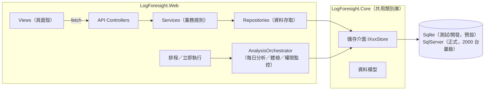

# LogForesight.Web 開發規格文件

> 除非必要否則不要讀取 docs/archive/ 內容，避免浪費 token。
>
> 本文件是 Web 查詢/維護介面的現況規格：架構、分層、驗證授權、API 慣例、前端慣例、
> 頁面規格、CSV 匯入、稽核。資料表欄位級設計以 [DB-SPEC.md](DB-SPEC.md) 為準（本文件新增的表在
> 第 10 節補齊欄位定義，同樣遵守 DB-SPEC 的雙 DB 可移植規則）；規則庫的 DB 映射見
> [RULES-SPEC.md](RULES-SPEC.md)。
>
> 專案：`LogForesight.Web`（.NET 8 MVC）。

## 1. 技術決策總表

| # | 決策 | 內容 |
|---|---|---|
| 1 | UI 框架 | Bootstrap 5 為**基底**（柵格/元件/可及性行為）；頁面外觀採功能取向的自訂設計層，**不受限於 Bootstrap 預設風格**（§8.2） |
| 2 | JavaScript | **原生 JS（ES Modules）**，不使用 jQuery；範本附帶的 jquery / jquery-validation lib 移除 |
| 3 | 主色調 | `#0d6efd`（即 Bootstrap 5 預設 primary；設計 token 與輔助色規範見 §8.2） |
| 4 | 設計原則 | 使用者便利性優先、維護成本最小化（詳見 §8.6 的具體規範，不是口號）；視覺設計服務於「快速抓到問題」（§8.2 視覺層級三原則） |
| 5 | 資料傳遞 | **View 不經 Model 傳資料**：MVC Controller 只回傳頁面殼（View），資料一律由前端 fetch 呼叫 API Controller 取得（JSON） |
| 6 | 分層 | Controllers / Models / Services / Repositories / Auth / Filters / Configuration（§4） |
| 7 | 授權 | Middleware（JWT 驗證身分）＋ ActionFilter（能力檢查）＋ Service 層（資料範圍過濾），三層各司其職（§6、§7） |
| 8 | 驗證方式 | **JWT，存放於 HttpOnly Cookie**（不放 localStorage，決策理由見 §6.1） |
| 9 | 組態 | 全部參數集中 `appsettings.json`，程式以強型別 `Appsettings` 類別取得（§5） |
| 10 | DI | 內建 DI 容器，介面註冊表見 §4.3；一律建構式注入，不用 Service Locator |
| 11 | 圖表套件 | **Chart.js v4（MIT）**，自架於 wwwroot/lib、經 `core/charts.js` 單點包裝（選型評估與排除清單見 §8.3） |
| 12 | 報表原則 | 主管報表以圖表/統計呈現、**排版優先**；所有圖表元素可點擊下鑽到實際項目（§8.4、§9.6） |

沿用前期規劃已定案的決策（不再重述理由）：群組制授權（使用者群組↔主機群組多對多）、
角色四種（user/dev/manager/admin，能力聯集）、負責人與處理人分離（僅 admin 可指派）、
規則四層保護（builtin 可改可停可回復不可刪）、CSV 三檔匯入（預覽後 all-or-nothing 套用）、
全系統操作稽核（含登入登出）、儲存層單一介面（webdata 各 store 業務邏輯與後端無關，透過
`EfJsonBlobStore`/`EfJsonLogStore` 走 SQL；**Jsonl 檔案後端已全面退役**，
`Storage.Type` 收斂為 Sqlite／SqlServer 二選一，見 §10.4、§10.5）、不做自由文字搜尋。

## 2. 系統全貌


```mermaid
flowchart LR
    subgraph WEB["LogForesight.Web"]
        VIEW["Views（頁面殼）"] -->|fetch| API["API Controllers"]
        API --> SVC["Services（業務規則）"]
        SVC --> REPO["Repositories（資料存取）"]
        SCHED["排程／立即執行"] --> ORCH
    end
    subgraph CORE["LogForesight.Core（共用類別庫）"]
        ORCH["AnalysisOrchestrator<br/>（每日分析／體檢／權限監控）"]
        IFACE["儲存介面 IXxxStore"]
        MODELS["資料模型"]
    end
    REPO --> IFACE
    ORCH --> IFACE
    IFACE --> SQL[("Sqlite（測試/開發，預設）<br/>SqlServer（正式，2000 台量級）")]
```

- **唯一的執行單位是 LogForesight.Web**：排程／立即執行呼叫 Core 的 `AnalysisOrchestrator`
  （每日分析／體檢／權限監控），與查詢/維護介面同一個部署單位。
- **Web 不直接碰檔案或 DB**：只透過 Core 的儲存介面，Web 程式碼對後端無感知——
  現只有 Sqlite／SqlServer 兩個 SQL provider（見 §10.4／§10.5）。

## 3. SOLID 對應（設計自查表）

| 原則 | 本專案的落實方式 |
|---|---|
| **S** 單一職責 | Controller 只做「HTTP ↔ DTO 轉換與呼叫 Service」，不含業務邏輯；Service 只做業務規則，不碰 HttpContext；Repository 只做資料存取，不做授權判斷。稽核、授權、例外處理各自是獨立的 Filter/Middleware，不散落在各 Action 內 |
| **O** 開放封閉 | 儲存後端以 `Storage.Type` 切換實作、不改呼叫端（Strategy + Factory，沿用批次端既有模式）；驗證方式以 `IAuthenticationProvider` 抽換（Stub → AD/Windows）；新增角色能力只改 `RoleCapabilityMap` 一處 |
| **L** 里氏替換 | Sqlite 與 SqlServer 實作必須通過**同一組合約測試**（DB-SPEC 一致性機制 #3），語意寫在介面註解，實作不得偏離——替換 provider 不允許行為差異（JSONL 曾是第三個受此規則約束的後端，已退役，見 §10.4） |
| **I** 介面隔離 | 有測試假件依賴的儲存介面按聚合根拆分（`IUserStore`、`IKnownIssueRuleStore`…），不做一個巨型 `IRepository`；讀寫需求差異大的（分析紀錄）維持既有的 Reader/Writer 分離；單一實作且測試零引用的介面（如原 `IAuditLogStore`、`IBatchRunStore`）已於簡化重構移除，改直接依賴具體類別，不留只有一個實作的抽象層 |
| **D** 依賴反轉 | Service 依賴抽象（保留下來的介面，或本身就穩定的具體類別）而非拼裝細節；`EfJsonBlobStore`/`EfJsonLogStore` 是儲存層唯一的底層實作，定義與實作都在 Core，依賴方向永遠指向抽象。Controller 與 Service 全部建構式注入 |

**審查基準**：PR 審查時對照此表；違反任一條需在 PR 說明中給出理由。

## 4. 專案結構與分層

### 4.1 資料夾結構

```
LogForesight.Web/
├── Program.cs                    -- 組態載入、DI 註冊、middleware 管線（保持薄，註冊邏輯抽到擴充方法）
├── appsettings.json
├── Configuration/
│   └── Appsettings.cs            -- 強型別組態（§5）
├── Controllers/
│   ├── PagesController.cs        -- MVC：只回傳 View() 頁面殼，一頁一 Action，無資料邏輯
│   └── Api/                      -- API：[ApiController]、[Route("api/...")]、只回傳 JSON
│       ├── AuthController.cs／AiController.cs
│       ├── DashboardController.cs／ScheduleController.cs／HealthController.cs
│       ├── RecordsController.cs／HandlingController.cs／HandlersController.cs
│       ├── HostsController.cs／IssueOwnersController.cs
│       ├── RulesController.cs
│       ├── AdminController.cs／SettingsController.cs／DisplaySettingsController.cs -- 使用者/群組/授權/設定維護
│       ├── ImportsController.cs
│       ├── HelpController.cs／SetupController.cs
│       └── AuditController.cs
├── Models/
│   ├── Dto/                      -- API 請求/回應物件（依 Controller 分子資料夾）
│   └── ApiResponse.cs            -- 統一回應信封（§7.2）
├── Services/                     -- 業務規則層：多數直接是具體類別（如 HandlingService）；
│                                     僅有測試假件依賴的介面（IVisibilityService 等）與其實作同資料夾
├── Repositories/                 -- 資料存取層：組合 Core 儲存介面的查詢（如儀表板聚合）
├── Auth/                         -- IAuthenticationProvider、StubAuthenticationProvider、JwtTokenService、RoleCapabilityMap
├── Filters/                      -- PermissionAttribute/Filter、ApiExceptionFilter
├── Middleware/                   -- CsrfHeaderMiddleware（§6.4）
├── Views/                        -- 頁面殼（.cshtml 內不寫業務邏輯、不用 ViewModel 帶資料）
└── wwwroot/
    ├── css/site.css              -- 主題與元件樣式（§8.2）
    └── js/
        ├── core/                 -- api.js（fetch 包裝）、ui.js（toast/modal/表格）、format.js、charts.js（Chart.js 包裝）
        └── pages/                -- 一頁一模組（dashboard.js、records.js…），與 View 一一對應
```

已移除以下範本殘留：移除 `wwwroot/lib/jquery*`、`_ValidationScriptsPartial.cshtml`、
`Views/Home/Privacy.cshtml`；`HomeController` 改為 `PagesController`。

### 4.2 分層責任邊界（違反即打回）

| 層 | 做 | 不做 |
|---|---|---|
| API Controller | 綁定/驗證 DTO、呼叫單一 Service 方法、回傳信封 | 業務判斷、直接用 Repository、組 SQL/LINQ、try-catch（交給 ExceptionFilter） |
| Service | 業務規則、授權範圍過濾（呼叫 `IVisibilityService`）、稽核寫入、跨 Repository 組合 | 讀 HttpContext（需要目前使用者時注入 `ICurrentUser`）、格式化顯示文字 |
| Repository | 查詢組合、分頁、對 Core 介面的轉接 | 授權判斷、業務規則 |
| View + JS | 呈現、互動、呼叫 API | 權限判斷邏輯（選單顯示依 `/api/auth/me` 回傳的能力，但**真正的防線在後端**） |

### 4.3 DI 註冊表

| 介面 | 實作 | 生命週期 |
|---|---|---|
| `Appsettings` | 組態綁定單例 | Singleton |
| Core 各 `IXxxStore`（有測試假件依賴者） | 以 `StorageBackend`（依 `Storage.Type` 建立的單一路由點）的 `Blob`/`LogStore` 組出 | Singleton |
| `IAuthenticationProvider` | `DynamicAuthenticationProvider` 包裝依 `Auth.Provider` 註冊的 fallback（Stub / Ldap）——DB 的 AD 設定開啟時改走 DB 動態設定 | Singleton |
| `JwtTokenService` | 直接注入具體類別（`IJwtTokenService` 介面因測試零引用，簡化重構時已移除） | Singleton |
| `ICurrentUser` | `HttpContextCurrentUser`（自 Claims 讀取） | Scoped |
| `IVisibilityService` | `VisibilityService`（授權主機解析＋每請求快取） | Scoped |
| `IAuditService` | `AuditService` | Scoped |
| 各業務 Service / Repository | 多數直接注入具體類別；僅有測試假件依賴的介面（`IUserStore`／`IHostStore`／`ICsvImporter` 等約 25 個）保留介面 | Scoped |

## 5. 組態（appsettings.json ↔ Appsettings.cs）

**§12appsettings 精簡**：本檔**只保留「站台還沒起來、資料庫還沒連上之前就必須
知道」的啟動與安全前提**，其餘一律以 DB（「系統管理 > 設定」頁）為唯一事實來源——改完即時生效、
不必重啟站台，也不會出現「檔案一份、DB 一份」的漂移。

```json
{
  "Storage": { "Type": "Sqlite", "DataRoot": "", "ConnectionString": "" },  // Type: Sqlite | SqlServer（§10.5；Jsonl 已退役）
  // SecretKey / PasswordHash 內含「開箱即可測試」的公開已知測試值（帳號 svc-lfadmin / 密碼 LogForesight-dev）,
  // 正式環境務必以環境變數 Jwt__SecretKey、Auth__ServerAdmin__PasswordHash 覆寫,且 Provider 改成 Ad。
  "Jwt": { "Issuer": "LogForesight", "Audience": "LogForesight.Web", "SecretKey": "<測試值,正式環境覆寫>", "ExpireHours": 8 },
  "Auth": {
    // Ad（正式;AD 伺服器設定在設定頁）| Stub（測試,不驗密碼;Production 啟動會被擋下）
    "Provider": "Stub",
    "ServerAdmin": { "Account": "svc-lfadmin", "PasswordHash": "<測試值,對應密碼 LogForesight-dev>" }
  },
  "AllowedHosts": "*"
}
```

**已自 appsettings 退役的區段（§12／§13）與其新家**：

| 原區段 | 現在在哪 |
|---|---|
| `Ai`（位址＋逾時/重試/token/penalty/ExtraRequestFields） | 設定頁「AI 服務」（進階參數在折疊區）→ `SystemSettings.Ai*`；由 `RuntimeSettingsResolver.ApplySystemSettingsOverrides` 套進 `AppSettings`（批次與 Web 互動情境共用同一份解讀） |
| `Permissions:WatchedFolders` | 設定頁「分析參數」→ `SystemSettings.WatchedFolders` |
| `Analysis`（ServerDescription／CheckupIntervalDays／Channels） | 設定頁「分析參數」→ `SystemSettings.ServerDescription`／`CheckupIntervalDays`／`AnalysisChannels` |
| `Import`（MaxFileSizeKb／MaxRows） | 設定頁「分析參數」→ `SystemSettings.ImportMaxFileSizeKb`／`ImportMaxRows`（每次上傳即時讀取） |
| `Ui:DashboardDefaultDays`／`RunMatrixDays` | 程式常數 `DashboardController.DefaultDays`／`RunsController.DefaultRunSummaryDays`（前端本來就明傳期間，這只是 API fallback） |
| `Ui:DefaultPageSize` | **直接刪除**——盤點後無任何消費端（「有設定無行為」是本專案紅線） |
| `Auth:Ldap:Domain` | **退役**：AD 驗證的唯一事實來源是設定頁（`AdAuthEnabled`／`AdServers`）；`LdapAuthenticationProvider` 一併移除，`Provider=Ad` 在 AD 未設定時的 fallback 為 `UnconfiguredAdAuthenticationProvider`（明講「請以 serverAdmin 登入後設定」） |
| `Netiq:DiscoveryClient` | **退役**（§13）：改為「NetIQ 維護」頁的 `UseOfflineDemoData` 開關，僅非 Production 可開 |

> **升級零遷移**：每個新 `SystemSettings` 欄位的程式內建預設值＝原 appsettings 的出廠值，
> 舊部署升級後行為不變，直到管理者主動在設定頁調整。壞值（手改 DB、舊 blob 缺欄位反序列化成 0）
> 由 `RuntimeSettingsResolver` 擋掉並保留出廠值——「0 秒逾時」比不改更糟。

- `Appsettings.cs` 是巢狀類別的單一根（`Appsettings.Storage.Type` 這樣取用），
  `Program.cs` 以 `Configuration.Get<Appsettings>()` 綁定並註冊 Singleton，任何類別建構式注入取得。
  **不在程式中直接讀 `IConfiguration`**——組態鍵名只存在於 Appsettings.cs 一處，改名不會有魔法字串漏網。
- **啟動時驗證**：`Appsettings.Validate()` 檢查必填（如 `Jwt.SecretKey` 非空、`Storage.DataRoot`
  存在、`Auth.ServerAdmin` 帳號與雜湊非空、`Auth.Provider=Stub` 時環境不得為 Production），
  不合格直接 fail fast 拋例外，不讓站台帶病啟動——沿用批次端「設定錯誤要顯性化」的原則。
- **新增設定必須有消費端**：「有設定無行為」是本專案紅線（§12 刪掉的 `Ui:DefaultPageSize`
  正是這種殘留）。新增可調整項目時預設放 DB 設定頁，只有啟動前提才進 appsettings。
- **與批次設定的一致性**：Web 與批次 exe 各有自己的 appsettings.json，但 `Storage` 區段
  （Type/DataRoot/ConnectionString）**兩邊必須指向同一後端**——欄位定義放 Core 的
  `StorageSettings` 共用類別，語意只有一份；部署文件需註明兩份設定同步調整。
- **`Storage.Type` 二選一**（`Sqlite` 為預設與主要測試方式，`Jsonl` 檔案後端已
  全面退役、設成 `Jsonl` 啟動即報錯）：`Sqlite`（測試/開發用的單一 `.db` 檔真資料庫，不寫任何
  JSON 檔，預設）／`SqlServer`（正式環境，2000 台量級）。**全部資料**（分析紀錄＋webdata）
  走資料庫。Web 的 `appsettings.Development.json` 同樣預設 `Type=Sqlite`（驗證與正式相同的
  SQL 語意）；正式部署改 `SqlServer`。
- `Jwt.SecretKey` / `ServerAdmin.PasswordHash`：**基礎 `appsettings.json` 內含「公開已知」的測試值**
  （帳號 `svc-lfadmin` / 密碼 `LogForesight-dev`），讓開發者 clone 後 `dotnet run` 即可登入測試,不必先做設定。
  這些值會進版控與 GitHub、任何人都看得到,**因此絕不能沿用到正式環境**：正式環境一律用環境變數覆寫
  （`Jwt__SecretKey`、`Auth__ServerAdmin__PasswordHash`,或 user-secrets），並把 `Auth.Provider` 改成
  `Ad`（§12 起舊值 `Ldap` 視同 `Ad`；`Provider=Stub` 且 `ASPNETCORE_ENVIRONMENT=Production` 時
  啟動 fail fast 的欄杆會擋下帶著測試設定上線的失誤）。
  想覆寫本機測試值可用 `appsettings.Development.json`（gitignore）。
- `Storage.DataRoot`：JSONL 後端的資料根目錄＝批次執行檔目錄（`history.txt`、`rules.json` 所在），
  Web 的自有資料寫入其下 `webdata\`（§10.3）。
- **開發環境自動推算 `DataRoot`**：`ASPNETCORE_ENVIRONMENT=Development` 且 `Storage.DataRoot` 為空時，
  `Program.cs` 依本站台輸出目錄推算同一個 repo 內批次的輸出目錄（`{repo}\LogForesight\bin\{Config}\{TFM}`），
  取代先前 `appsettings.Development.json` 寫死的絕對路徑——不綁使用者名稱、自動跟著 Debug/Release 與 TFM 變動。
  推算不出（目錄結構非預期）時維持空值、交由 `Validate()` 顯性報錯。開發者若明確填了 `DataRoot` 則尊重其值、不推算；
  正式環境不受影響（本機制只在 Development 生效）。

## 6. 身分驗證

### 6.1 決策：JWT 放 HttpOnly Cookie

- **瀏覽器（View→API）**：登入成功後簽發 JWT，寫入 **HttpOnly、Secure、SameSite=Strict** 的
  Cookie（名稱 `lf_auth`）。前端 JS **接觸不到 token**（HttpOnly），fetch 同源自動帶上，
  避免 localStorage 存 token 的 XSS 竊取面。View（MVC 頁面殼）與 API 走同一張 Cookie、
  同一套驗證管線——頁面殼本身也要求已驗證（未登入直接 302 到登入頁，而不是空殼進來再被 API 401）。
- 需要 HTTPS（Secure cookie 前提）；內網自簽或企業 CA 憑證皆可。

### 6.2 登入流程與 Claims

```
登入頁 POST /api/auth/login { account, password? }
  → IAuthenticationProvider.AuthenticateAsync(account, password)
      serverAdmin 帳號比對（任何 Provider 下優先檢查，見下方專節）
      Stub 實作：lf_users 存在且 active 即通過（password 忽略）——僅供開發/前期測試
      正式（§12 起）：DynamicAuthenticationProvider 依設定頁的 AD 設定（AdAuthEnabled/AdServers）
        bind 驗證；AD 尚未設定時 fallback 為 UnconfiguredAdAuthenticationProvider（明講請以
        serverAdmin 登入後至設定頁設定）
  → 成功：查使用者群組 → RoleCapabilityMap 算出能力集合 → 簽發 JWT → Set-Cookie
  → 稽核 login / login_failed（§13）
```

**serverAdmin（本地救援/引導帳號）**：

- `Auth.ServerAdmin` 定義一個**不存在於 `lf_users`** 的本地帳號，密碼由管理單位
  **封存保管並定期變更**。用途：指派/移除 admin 群組成員——解掉「匯入使用者需要 admin、
  admin 又來自匯入」的引導問題，也是日後 **AD 停擺時的救援入口**（不依賴任何 Provider，
  Stub 或 Ad 模式下皆可登入；AD 尚未於設定頁設定時，它是唯一進得來的帳號）。
- **最小授權**：登入後能力僅 `Maintain`＋`ViewAudit`（使用者/群組/主機維護與稽核查閱），
  **不含任何業務資料檢視**——依「設定 admin 角色成員」的用途給權，不是萬能帳號。
- **密碼以雜湊存放**（PBKDF2，不存明文——設定檔會進備份/複本，明文密碼會跟著擴散）。
  輪替 SOP：產生新雜湊填入 `PasswordHash` 後重啟站台即可，產生指令
  （`LogForesight.Web.exe --hash-password`）提供；已簽發的 JWT 最長 8 小時自然失效。
- **Web 端鎖定**：serverAdmin 連續 5 次登入失敗鎖定 15 分鐘（記憶體計數即可）——
  它是本地帳號、**不受 AD 帳戶鎖定原則保護**，必須自帶防暴力破解；一般 AD 帳號則不做
  Web 端鎖定，交由 AD 原則（見下）。**此鎖定只在驗密碼的 Provider（正式 Ldap）下有意義**；
  `Provider=Stub` 不驗密碼（見下方「Stub 免密碼」），serverAdmin 直接放行、無密碼可錯、不計失敗。
- 全部操作照常稽核（account=設定的帳號名、user_id NULL）；儀表板登入失敗卡對它的
  失敗嘗試同樣可見。
- 啟動驗證：`ServerAdmin.Account`/`PasswordHash` 為必填（§5）。

**Stub 免密碼**：測試期間環境不含核心重要
主機，免密碼風險已評估接受。**「免密碼」的界線在後端、不在前端**：`Provider=Stub` 下登入頁
**照常顯示密碼欄、使用者照常輸入、前端驗證不變**；密碼送到後端後，Stub 模式一律通過密碼
驗證——**不論輸入什麼密碼（含錯誤、留空）都放行**。一般帳號由 `StubAuthenticationProvider.Verify`
恆回 Ok；**本地救援帳號 serverAdmin 同樣一致**：`IdentityService` 把
`IAuthenticationProvider.RequiresPassword` 傳入 `ServerAdminAuthenticator.TryLogin`，為 `false`
（Stub）時不比對密碼直接放行並清空失敗計數。`Provider=Stub` 且
`ASPNETCORE_ENVIRONMENT=Production` 時啟動 fail fast 的欄杆維持不變（防的是「帶著 Stub 上
正式環境」的失誤，不是測試期的使用）——正式環境強制 Ldap（`RequiresPassword=true`），
救援帳號仍走 PBKDF2 密碼＋鎖定，這條免密碼捷徑到不了正式環境。

**正式驗證（已定案：AD LDAP）**：`LdapAuthenticationProvider` 以使用者帳密向 AD bind 驗證；
**登入失敗的鎖定交由 AD 帳戶鎖定原則**（驗證失敗即計入網域的失敗次數，達原則門檻自動鎖定），
Web 端不對 AD 帳號另建鎖定機制——一套鎖定原則、一個事實來源。已知副作用：對登入頁
輸入他人帳號亂試可觸發該帳號的 AD 鎖定（內網環境接受此風險，稽核 `login_failed` 含來源 IP 可查）。

JWT Claims：`sub`（user_id）、`account`、`name`、`cap`（能力字串陣列）、`exp`。
**能力進 token、主機授權範圍不進 token**——範圍每次請求由 `IVisibilityService` 即時解析
（群組異動即時生效；能力異動最遲於 token 過期時生效，接受此延遲）。

**上次登入時間**：登入成功時 `IdentityService`
呼叫 `IUserStore.TouchLogin` 寫入 `WebUser.LastLoginAt`（唯一寫入點）。
**刻意不併進 `Upsert`**——各處建構 `WebUser` 的呼叫端都不帶這個欄位，交給 Upsert 的逐欄
覆寫會在每次編輯使用者時把它靜默清成 null（同 owners.csv 曾漏抄 SentinelId 的失敗模式）。
**刻意不從稽核反推**：稽核有保留天數，到期清理後會變成「登入過卻顯示從未登入」。
serverAdmin 不在 `lf_users`，沒有這個欄位。

### 6.3 逾期與登出

- 效期 `Jwt.ExpireHours`（預設 8 小時），不做 refresh token（內網工具，過期重登入即可）。
- **停用即時生效**：`ICurrentUser` 解析時逐請求檢查 `lf_users.active`，停用帳號立即 401，
  不等 token 自然過期（能力異動仍接受 token 效期內的延遲，§6.2；停用是安全事件，不可延遲）。
- API 收到過期/無效 token → 401 ＋ 信封 error code `auth_expired`；前端攔截後導向登入頁。
  過期後首個被拒請求補記稽核 `session_expired`（誠實邊界：無法記錄「過期那一刻」）。
- `POST /api/auth/logout`：清除 Cookie＋稽核 `logout`。

### 6.4 CSRF 防護

SameSite=Strict 已擋跨站帶 Cookie；再加一層防禦深度：`CsrfHeaderMiddleware` 要求所有
**非 GET 的 API 請求**必須帶自訂標頭 `X-Requested-By: LogForesight`（`core/api.js` 統一加上）。
跨站表單無法自訂標頭，兩層皆破才會失守。不用 ASP.NET Antiforgery token（它假設表單 post 模型，
與「全 API」架構不合）。

## 7. 授權與 API 慣例

### 7.1 三層授權

| 層 | 機制 | 回答的問題 |
|---|---|---|
| 1. Middleware | JWT Bearer 驗證（自 Cookie 取 token） | 你是誰？（未登入 → 401） |
| 2. ActionFilter | `[Permission(Capability.X)]` 讀 `cap` claim | 你能不能用這個功能？（不足 → 403 ＋稽核 `denied`） |
| 3. Service | `IVisibilityService.GetVisibleHostIds()` | 你能看哪些主機的資料？（查詢一律先過濾） |

```csharp
public enum Capability { ViewAll, Handle, Assign, ConfirmPermission, Maintain, DevMonitor, ViewAudit }

// RoleCapabilityMap（單一事實來源；user 沒有 ViewAll，資料範圍由第 3 層決定）
user    → Handle, ConfirmPermission
dev     → ViewAll, DevMonitor
manager → ViewAll
admin   → ViewAll, Handle, Assign, ConfirmPermission, Maintain, DevMonitor, ViewAudit

[HttpPut("api/records/{id}/handling/assign")]
[Permission(Capability.Assign)]
public Task<ApiResponse<HandlingDto>> Assign(long id, AssignRequest req) => ...
```

`PermissionFilter`（`IAsyncAuthorizationFilter`）：能力不足回 403 並寫稽核（result=`denied`）。
**Service 層的資料範圍過濾是不可繞過的最後防線**：即使某個 API 忘了掛 Filter，
查詢仍只回授權範圍的資料。

**同一個 `[Permission]` 內的多個能力是「任一」，兩個標註疊加是「都要」**——類別層與方法層
不是就近覆寫。統一標記（§9.2）因此以 `[Permission(Assign)]＋[Permission(Handle)]` 兩個標註
表達「兩者兼具」（實務上即 admin）。

**負責人隱含能力**：是任一**啟用中**主機的負責人時，
`IdentityService.ResolveCapabilities` 聯集 `User` 角色能力（`Handle`＋`ConfirmPermission`），
**不含 `ViewAll`**。理由：負責人匯入（owners.csv）會自動建立沒有群組的帳號，沒有這一段的話
對方登入後看得到自己負責的主機、卻連處理狀態都標不了，被交辦也回覆不了——「有可見範圍
無處置能力」是半套。能力進 JWT，已在線上的人最遲重新登入才取得（可見範圍則即時生效）。
停用帳號一律視為無能力（登入本來就進不來，見 §6.3）。

**負責人路徑**：第 3 層的授權鏈**擴充為聯集**——
`WebHost.OwnerUserIds` 含此人的（啟用中）主機直接可見，與群組授權同級（整台可見，
不是問題層級的窄授與），`GetVisibleHostIds`／`GetVisibleHostIdsFor` 兩邊同一套規則。
理由：負責人是主機歸屬的第一手資料，改版前卻與部門群組授權完全脫鉤，「這台出事、
負責人卻打不開」是常態，要管理員另外去授權矩陣補一刀才會通。
停用主機與停用使用者的排除優先於本路徑。使用者詳細頁（§9.8a）以
`GetOwnedHostIdsFor`／`GetGroupVisibleHostIdsFor` 兩個投影分別回答「為什麼看得到這台」——
兩條路徑可同時成立，因此是兩顆徽章而不是一個列舉值。

**問題負責人路徑**：第 3 層再擴充一條——`IssueProfile`（blob key `issue_owners`；鍵＝(Source,EventId)，跨主機生效）
指派的負責人，自動取得保留期內出現過該問題之主機的檢視權（`HostVisibilityResolver.
GetIssueOwnedHostIds`，內部呼叫 `IIssueAggregateQuery.HostIdsFor` 反查 `lf_top_issues`），
與主機負責人**同級**（整台可見，非問題層級的窄授與），同樣聯集進 `GetVisibleHostIds`／
`GetVisibleHostIdsFor`，同樣隱含 `Handle`＋`ConfirmPermission`（不含 `ViewAll`，
`UserCapabilityResolver.IsIssueOwner`）。
**問題負責人優先於主機負責人**（不是疊加）：`MailNotificationService.ResolvePerRecipient`
的郵件路由逐主機日判定，該日問題命中規則即通知問題負責人（**可多位**）、不再通知主機負責人；
`DayHandlingCommandService.DefaultHandlerId` 的自動帶入處理人同樣先查問題負責人，但只在
跨命中問題聯集去重後**恰一人**且未停用時帶入，多人不猜、落回主機負責人規則。
管理頁 `/admin/issue-owners`（側欄「系統管理＞問題檔案」，`Maintain`）：
`IssueOwnersController` GET／GET recent-issues（近 30 天出現過的問題選擇器，依主機數排序）／
PUT／DELETE，寫入走稽核（`IssueOwnerAdminService`）；新增時可從近期問題挑選或手動輸入
(Source, EventId)，編輯時鍵鎖定只能改負責人與備註。

**機房結論**：`IssueProfile` 額外承載
`ConclusionStatus`（限 `IssueHandlingStatuses` 四種結案態：resolved／wont_fix／
false_positive／known_noise，或 null）＋`ConclusionNote`（設定結論時必填）＋
`ConcludedById`／`ConcludedByAccount`／`ConcludedAt`＋`AutoApply`（bool）。
`IssueCaseCoordinator.AttachNewDay`（批次每天寫入新紀錄後掛接）的四層優先序為：
① 這天已有人工標記或既有處理 → 略過（冪等）；② 有進行中案件 → 沿用案件狀態；
③ 命中一筆 `AutoApply=true` 的問題檔案結論 → 自動套用該結論，寫入
`IssueHandling{ Status=ConclusionStatus, Note="〔機房結論〕"+ConclusionNote, CaseId=null }`，
稽核動作碼 `HandlingActions.FleetApply`；④ 都沒有、但問題檔案有負責人 → **自動建立案件**
（`Status=in_progress`、`HandlerId`＝第一位負責人、系統名義 `ActorId=null`）並寫當日標記，
稽核動作碼 `HandlingActions.OwnerAutoAssign`——問題負責人即長期負責人，案件直接進他的
「我的交辦」。**不再打擾**：同主機同問題最近一筆案件若被以 wont_fix／false_positive／known_noise
結案，隔天再出現不自動建案（resolved 除外——修好後再出現是新事件，重新交辦）。
負責人之後被移除時既有案件不回收；已分析過的歷史日子不回頭補建。刻意不寫 `NoiseMark`（避免 `ResolveIssueStatus`
多一個判斷來源）。「解除結論」只清空 `IssueProfile` 上的結論欄位，已寫入的 `IssueHandling`
列不回溯（誠實留痕，不假裝從沒發生過）。
設定入口有二：管理頁本身（`PUT/DELETE /api/issue-owners/{source}/{eventId}/conclusion`）與
問題查詢頁「統一標記」批次結案表單的「之後新出現的主機日也自動套用」勾選（勾選時
`IssueHandlingCommandService.BulkCloseIssue` 呼叫同一個 `IssueOwnerAdminService.
SetConclusion`）——兩個呼叫端共用同一套驗證與 merge 邏輯，不各自重寫一份。

**案件授與**：前面路徑之外、刻意更窄的一條。
被指派為某個問題案件的處理人時，對**該主機的該問題**取得檢視權（`IVisibilityService.GetCaseGrants`／
`IsCaseGrantOnly`，`EnsureVisible` 放行）——沒有這條路徑，把問題交辦給不在該主機授權範圍內的人
等於白指派（對方打不開）。授與以「**現在或曾經**是處理人」為準，結案後仍看得到自己處理過的東西。
只授與那個問題，因此 `RecordDetailQueryService` 對這類檢視者**裁剪**：重點問題只留被授與的、
整日敘事（白話總覽四段／關聯訊號／深入分析）清空、報告全文 `GetReport` 回 null
（**回 null 不拋例外**——「詢問 AI」會一併餵報告給模型，拋例外會讓整個對話端點 404）。
`CaseGrantOnly=true` 讓前端顯示「您以案件處理人身分檢視」，處理面板同步收斂成
「只標記自己被交辦的問題」（日層級的推導狀態／負責人／處理人／日狀態表單全部不顯示）。
**不進一般可見清單**：問題查詢／儀表板／報表的統計語意不變，動線走「我的交辦」與直連
（`HandlerWorkloadDto` 的可見範圍＝檢視者可見主機 ∪ 自己的案件授與）。

授與的**實際邊界由兩個咽喉點守住**，缺一不可（兩者都是本輪體檢補上的——放行與裁剪各自寫對、
串起來卻有缺口，是這類授權功能最典型的失敗方式）：

1. **`RecordRepository.GetOne` 一併放行案件授與主機**。它原本只認 `GetVisibleHostIds()`，
   於是 `EnsureVisible` 放行、資料卻查不出來——被指派的人根本打不開自己的問題，整個功能不成立。
2. **`IVisibilityService.GetIssueKeyRestriction(hostId)`：問題簽章白名單**（null＝不限制）。
   放行主機之後，任何「以 issueKey 為參數」的入口都必須先問過它，否則換一個 key 直接打 API
   就能碰到同一天其他不屬於他的問題。套用點：問題層級標記（單筆／批次）、問題歷史
   （`issue-history`）、處理歷程（`GetLogs`，日層級的列一併排除——那是整天的敘事）。
   日層級的狀態與指派則整個拒絕（`DayHandlingCommandService.RequireNotCaseGrantOnly`）：
   他被交辦的是「這台主機的這個問題」，不是這一天。
   端到端驗收見 `LogForesight.Tests/CaseGrantVisibilityTests.cs`（刻意串真實服務，不用替身）。

**角色與群組的分工**：
不重複，是同一個機制的兩種用途。**角色掛在群組上**（`UserGroup.Role`），使用者藉由加入群組
取得角色，多群組時能力取聯集；群組同時是**可見範圍單位**（只有 `Role=User` 的部門群組進授權矩陣，
ViewAll 角色不列——放進去只會讓人以為那些勾選有意義）。角色回答「能用哪些功能」（第 2 層），
群組回答「能看哪些主機」（第 3 層），拆掉任一邊都表達不了現有語意。群組頁與使用者頁的
分段標題與 popover 就是在畫面上講出這個區別。

**停用主機不在可見範圍**：`Active=false` 的主機
（管理員手動停用或 Sentinel 移除觸發的系統停用）一律排除在 `GetVisibleHostIds()` 之外——
含 ViewAll 分支。其歷史紀錄因此不出現在問題查詢/儀表板/報表的任何計數，資料只留在資料庫，
重新啟用即全部復原；主機管理頁不經此路徑，停用主機本身仍可見可管理。墓碑列（合併來源，
同為 Active=false）的歷史不受影響——經 `RecordRepository.VisibleHostKeys` 從存活主機做別名展開。

### 7.2 API 統一慣例

- 路由：`api/{resource}`，資源複數、動作用 HTTP 動詞表達；非 CRUD 動作用子路徑
  （`POST api/rules/{id}/restore`）。
- **風險日的資源識別＝`{hostId}/{date}` 複合鍵**（如 `api/records/17/2026-07-19`）——
  JSONL 後端的紀錄天然以（主機,日期）為鍵、**沒有代理數字 id**；SQL 的 `record_id`
  只是內部主鍵，不暴露到 API。兩後端因此共用同一套路由與處理狀態關連鍵，
  切換後端不改 URL（處理狀態/歷程在 JSONL 端同樣以 host+date 為鍵儲存）。
- **回應信封**（所有 API 一致，前端只寫一次解析邏輯）：

```json
{ "success": true,  "data": { ... }, "error": null }
{ "success": false, "data": null, "error": { "code": "validation_failed", "message": "預計完成日不可早於今天" } }
```

- 錯誤碼固定小寫 snake_case：`auth_expired`、`forbidden`、`not_found`、`validation_failed`、
  `conflict`、`server_error`。`message` 一律是**可直接顯示給使用者的繁體中文**——
  前端不做錯誤碼→文案對照表（維護不動的東西就不要建）。
- **例外處理單點化**：`ApiExceptionFilter` 把未捕捉例外轉成 `server_error` 信封（HTTP 500）、
  完整堆疊寫 Web 端 NLog；業務錯誤由 Service 拋 `DomainException(code, message)`，
  Filter 轉 4xx 信封。Controller/Service 不寫 try-catch 樣板。
  **樂觀鎖衝突另有一支**：處理狀態三表以
  `UpdatedAt` 當並發權杖，store 把 `DbUpdateConcurrencyException` 轉成 Core 的
  `ConcurrentUpdateException`（訊息帶「哪一筆被搶先改了」），Filter 對應 409＋`conflict`——
  多人同時操作是正常情境不是故障；風險日詳情的處理面板收到 409 後自動重載當日資料。
- 分頁：請求 `page`（1 起）、`pageSize`（上限 200）；回應 `data: { items, page, pageSize, total }`。
- 日期格式：`yyyy-MM-dd`（date）／ISO 8601（timestamp），前後端一致，不做隱式時區轉換。

## 8. 前端規範

### 8.1 JS 架構（原生 ES Modules）

- `core/api.js`：fetch 包裝的**唯一出口**——組信封解析、錯誤 toast、401 導登入、
  非 GET 自動帶 `X-Requested-By`、掛載前綴（§8.1a）。頁面模組不得直接呼叫 `fetch`
  （含檔案上傳：傳 `FormData` 進來即可，它不會自己設 Content-Type，boundary 交給瀏覽器）。
- `core/paths.js`：站台掛載前綴的唯一出口（§8.1a）——`appUrl()` 補前綴、`appPath()` 去前綴。
  獨立成模組是因為 `ui.js` 也要用它，而 `api.js` 反過來用 `ui.js` 的 toast，放一起會成環。
- `core/ui.js`：toast（Bootstrap Toast）、確認對話框（Bootstrap Modal 包裝，
  破壞性操作一律經過它）、表格渲染 helper（欄位定義 → `<table>`，含空狀態與載入中列）。
- `core/format.js`：日期、風險等級徽章、狀態徽章的統一格式化（風險/狀態的顯示規則只寫一次）。
- `pages/*.js`：一頁一模組，`_Layout.cshtml` 以 `<script type="module">` 載入對應頁模組；
  頁面需要的初始參數（如 record id）用 `data-*` 屬性放在 View 的根元素上，JS 讀取——
  **cshtml 內不寫 inline script、不用 Razor 內插 JS 變數**。
- 禁止引入前端框架/打包工具（React/Vue/webpack…）——本專案的前端複雜度用「模組化原生 JS」
  就能維護，工具鏈越少、五年後越可能還編得起來（對應決策 #4 的防廢棄考量）。
  第三方 JS 套件僅限白名單：Bootstrap（範本內建）＋ Chart.js（§8.3）；新增套件需符合
  §8.3 的選型限制（開放授權以 MIT 優先、排除中國起源/中國社群主導維護的套件）並更新本文件。
- **圖示資產白名單**：Bootstrap Icons（MIT）——**僅手動複製約 24 個 symbol**
  到 `wwwroot/img/icons.svg` 單一 sprite，屬純靜態 SVG 資產、**無任何執行程式碼**、零外部請求、
  不引入字型檔，故不受上面「前端套件」的執行風險限制；用法見 §8.2「圖示」。
- **字型資產白名單**（見 [DESIGN-SYSTEM.md](DESIGN-SYSTEM.md) §3）：Fira Sans／Fira Code
  （SIL OFL，Mozilla 出品）——**self-host 的 latin subset woff2**（`wwwroot/fonts/`，共 5 檔約
  134KB），屬純靜態字型資產、零外部請求、**不透過 CDN／Google Fonts**（違反上面的無外部請求原則）。
  拉丁字由 `@font-face` + `unicode-range` 接管，**中文一律走系統字 fallback**（微軟正黑）——
  不引入 MB 級中文 webfont，維持零依賴精神。

### 8.1a 站台掛載路徑（可掛在 IIS 子 Application）

站台可能掛在網站根目錄，也可能是 IIS 的 Application（`http://host/LogForesight/...`）。
IIS in-process 託管時 ASP.NET Core 會自動填 `Request.PathBase`；Kestrel 直曝而前面的
反向代理加了前綴時，用 `Server:PathBase` 設定鍵（預設空）補上。

`_Layout.cshtml` 與 `Login.cshtml`（不套主版面，**兩處都要**）server-render
`window.LF_BASE = Request.PathBase`，前端據此補前綴。

**紅線：前端不得寫死 `/` 開頭的路徑。**

| 情境 | 用什麼 |
|---|---|
| API 呼叫 | `api.js`（出口已補前綴，`/api/...` 字串照寫） |
| 連結組裝、轉址 | `core/paths.js` 的 `appUrl()` |
| 路由比對（選單高亮、頁面判斷） | `appPath()`——直接比 `location.pathname` 會**靜默失效**，不是 404 |
| cshtml 資源／連結 | `~/`（tag helper 會展開）或 `@Url.Content("~/...")` |
| CSS 內的資源 | 相對路徑（`../fonts/...`） |

`appUrl()` **只在值即將寫進 `href`／`location` 的那一處套一次**——重複套用會變成
`/LogForesight/LogForesight/...`。判準是「**誰負責寫入，誰套**」：頁面模組自己建連結、
自己指派 `href` 時自己套；把值**交給** `core/ui.js`（sprite、整列可點、`rowHref`、statCard）、
`core/charts.js`（下鑽 `url`）、`core/layout.js`（選單表）這些 helper 時維持 app 相對，
由 helper 在寫入的那一刻套，頁面端不得先套。

### 8.2 設計系統（Bootstrap 為基底、功能取向的自訂外觀）

Bootstrap 提供柵格、表單元件與可及性行為；**頁面外觀不受限於 Bootstrap 預設風格**。
設計目標只有一個：**維運人員打開頁面 3 秒內看到最該看的東西**，美化是為這個目標服務。

**設計 token（`site.css` 的 `:root` 自訂變數，全站樣式的唯一取值來源）**：
具體取值與 v1→v2 對照一律查 **docs/DESIGN-SYSTEM.md**，本節只記原則。

```css
:root {
  --lf-primary: #1e40af;          /* v2 主色＝企業藍（blue-800），見下方 retheme 說明 */
  --lf-accent: #d97706;           /* v2 琥珀強調（KPI 亮點／需注意），剋制使用 */
  --lf-sidebar-bg: #0f1d3a;       /* 深海軍藍側欄（與主色同族） */
  --lf-content-bg: #f8fafc;       /* 淺灰內容區（slate-50） */
  --lf-card-bg: #ffffff;          /* 白卡片 */
  --lf-font-family: "Fira Sans", …;   /* 拉丁自架 Fira，中文系統字 fallback */
  --lf-font-mono: "Fira Code", …;     /* 技術值等寬字（事件ID/主機名/路徑） */
  /* 字級（--lf-font-size-xs~2xl/stat）、間距（--lf-space-1~6）、圓角
     （--lf-radius-sm/base/lg/pill，v2 收緊一階）、陰影（--lf-shadow-xs~lg）、focus ring 皆成 token */
  --lf-risk-high: #dc2626;  --lf-risk-mid: #d97706;  --lf-risk-low: #64748b;
  /* 每個語意色另備 -soft companion（如 --lf-risk-mid-soft）供淡色徽章使用 */
  /* 圖表分類色盤（8 類風險類型固定對應，見 §8.3） */
}
```

元件樣式只引用 token、不散落 magic value——調整外觀改一處全站生效，這是「不用標準
Bootstrap 風格」與「維護成本最小化」能同時成立的前提。

**視覺風格**：Data-Dense Dashboard × Swiss 極簡，主色企業藍 `#1e40af` + 琥珀強調，自架 Fira
字型；完整風格定位、色盤與 token 對照見 [DESIGN-SYSTEM.md](DESIGN-SYSTEM.md)。

**Bootstrap 元件級變數 retheme**：透過 Bootstrap 5.3 的**元件級 CSS 變數**（如 `.btn-primary` 的
`--bs-btn-bg`、`.pagination` 的 `--bs-pagination-active-bg`、`--bs-link-color` 等）把按鈕/表單/
分頁/頁籤統一 retheme 成主色——**只覆寫 CSS 變數、不改 Bootstrap 原始碼**，升級 Bootstrap
仍零成本，且全站外觀一致。`.nav-tabs` 一併改為**底線式頁籤**（無外框），三個用 `nav-tabs`
的頁面零 markup 變更即生效。vendored Bootstrap 為 5.3.8（元件級變數需 5.3 以上才生效），
純靜態檔置換、無 build step。

**共用篩選工具列與 chip**：問題查詢／規則維護／主機／
使用者頁的搜尋＋快速篩選共用一組元件——
`.lf-toolbar`（一列式篩選列：欄位列＋分節列＋分隔線 `.lf-toolbar__divider`）與
`.lf-chip`（藥丸狀篩選鈕，淡底／主色 active，取代裸 `btn-group`，比按鈕輕、比純文字可點）。
`ui.js` 的 `renderChips(container, { items, attr, activeValues, multi, onToggle })` 是唯一
渲染工廠（`multi=false` 單選＝點擊清掉群組內其他 active，適合狀態/排序方向；`multi=true` 多選
＝空集合代表不限）。各頁篩選一致性靠共用元件保證、不靠各頁自律——這是各頁改版
（規則/主機/使用者的快速篩選、問題查詢的群組 chip、風險日詳情的狀態面板）的共同基座。

**圖示**：採自架單一 SVG sprite（`wwwroot/img/icons.svg`，Bootstrap Icons MIT 子集，見 §8.1
白名單），零外部請求、無字型下載。cshtml 內以 `<svg class="lf-icon"><use href="@Url.Content("~/img/icons.svg")#名稱"></use></svg>`
引用——Razor **不會**解析 SVG `<use>` 內的 `~/`，得用 `@Url.Content` 顯式求值；
寫死 `/img/...` 在子 Application 下會 404（見 §8.1a）。JS 動態產生的內容用
`ui.js` 的 `icon(name)`（`createElementNS` 建 SVG）。圖示一律 `aria-hidden`、跟隨文字色與字級，
**裝飾性、不得比風險訊號搶眼**（原則 1）——側欄與按鈕圖示皆降透明度處理。

**視覺層級三原則（所有頁面的排版依據）**：

1. **嚴重度驅動顯著性**：畫面上最醒目的元素必須是當前最嚴重的問題——「重大」/高風險卡片
   加粗左紅邊、排序置頂、數字放大；裝飾性元素（icon、插圖、漸層）不得比訊號更搶眼。
   介面本身維持低飽和（灰藍白），紅/黃只保留給風險訊號，異常自然從畫面裡跳出來。
2. **數字優先**：統計卡採「大字數字（2rem+）＋小字標籤＋趨勢箭頭」結構，掃視即得；
   文字說明放次要層級。
3. **語意色全站一致**（`format.js`/`site.css` 單點定義）：
   風險「高」`danger`、「中」`warning`、「低」`secondary`；嚴重度 High `warning`、
   Medium `info`、Low `neutral`；「重大」旗標徽章 `danger`；處理狀態 open `danger`、
   in_progress `primary`、resolved `success`（對外三態，見下）；執行結果 成功 `success`、
   有警告 `warning`、失敗/中斷 `danger`、未執行 `secondary`。同一個顏色在圖表、徽章、卡片、
   時間軸中意義相同。

   **嚴重度顯示名**：High=高、Medium=中、
   Low=低，單點定義於 `format.js` 的 `SEVERITY_NAMES`/`severityName()`。原第四級 `Critical`
   已收斂進 High，其「命中即列為高風險日」的職責改由規則旗標 `ElevatesDayRisk` 承載，
   畫面上以獨立的「**重大**」徽章（`format.js` 的 `elevatesBadge()`）呈現於嚴重度徽章旁——
   詳情頁重點問題列與規則維護頁共用同一顆徽章。
   內部值（Set、URL 參數、API 欄位、`<option value>`）一律維持英文，只有畫面文字轉中文。
   與日風險等級的「高風險/中風險/低風險」
   （`riskBadge`）的區隔：日風險徽章一律帶「風險」後綴、色系不同（見上），嚴重度徽章不帶後綴。

**版面骨架**：深色側欄（依能力**分組**顯示選單項——監控作業／系統管理／系統，空群組連
標題一起省略）＋淺灰內容區＋白卡片網格；上方 topbar 顯示頁面標題。**徽章一律「顏色＋
文字」**，不做只靠顏色區分的 UI（色弱可用性；圖表的對策見 §8.3）。徽章統一走**淡色系統**
（`.lf-badge--success/danger/warning/info/primary/neutral/dark`，soft 底＋同色深字＋hairline
邊，`format.js` 的 `statusBadge()` 為唯一工廠）——**唯一例外是風險「高」維持實心紅**，確保
風險是畫面最響亮的元素（原則 1）。共用 helper 集中在 `ui.js`：`button()`（統一按鈕）、
`bindTabs()`（頁籤切換）、`renderPagination()`（分頁）、`icon()`（SVG 圖示）。報告全文維持
`<pre class="report-text">` 等寬原樣呈現（含框線符號），但外層卡片給足留白與工具列
（複製、下載 txt），不是把 txt 直接貼在白背景上。頁面上的大段說明改以一行 `.lf-hint` ＋
`question-circle` popover 收納（`layout.js` 的 `initHelpPopovers()` 統一初始化），大型表單的
次要欄位以 Bootstrap collapse 漸進揭露（如規則頁的處置知識庫預設收合）。

### 8.3 圖表規範（Chart.js）

**選型**：

| 候選 | 授權 | 評估 |
|---|---|---|
| **Chart.js v4 ✅ 採用** | MIT | 輕量（單檔 ~200KB、免打包工具，契合 §8.1 無 build 工具鏈的決策）；折線/長條/環圈完全覆蓋本專案圖型需求；`onClick` 事件回傳資料點索引，下鑽（§8.4）天然支援；社群量大、文件完整，主要維護者為國際社群 |
| Plotly.js | MIT | 功能最強但單檔 3.5MB+，主打科學繪圖；本專案圖型簡單，重量不成比例。列為未來需要進階圖型（熱力圖等）時的備選 |
| ApexCharts | MIT | SVG 渲染、預設外觀佳，可接受的替代品；生態與文件量不及 Chart.js，不採 |
| Apache ECharts、AntV/G2 | Apache-2.0 / MIT | **排除**——中國起源且由中國社群主導維護（依 §8.1 選型限制） |
| D3 / uPlot | ISC / MIT | D3 太底層（開發成本高）；uPlot 太精簡（無互動配套），皆不採 |

**使用規則**：

1. 自架於 `wwwroot/lib/chartjs/`（內網環境不用 CDN），鎖定版本、升版走 PR。
2. 頁面模組**不直接呼叫 Chart.js**——一律經 `core/charts.js` 包裝層：
   `charts.line(el, spec)`、`charts.bar(...)`、`charts.doughnut(...)`。包裝層統一注入
   設計 token 色盤、字型、tooltip 樣式與點擊下鑽接線。換圖表庫＝只改這一個模組
   （SOLID 的 O；也是防廢棄的保險）。
3. 色彩：風險/嚴重度圖用 §8.2 語意色；8 種風險類型用固定分類色盤（token 定義），
   同一類別在所有圖表中同色。
4. 可及性配套：折線/長條圖卡右上角提供「表格」切換鈕，以資料表格呈現同一份數據
   （色弱/精確讀值/複製需求一次滿足——資料本來就在前端，零後端成本）。**占比圓餅圖例外**
   ：圓餅圖本來就沒有 XY 軸，改左圖右文字
   條列（`charts.attachDoughnutLegend`）常駐顯示數值與百分比，不需要再切換一次表格模式；
   條列每列沿用該分段的下鑽 URL。**PNG 下載已移除**：需要圖檔的情境走既有
   「列印 / 存成 PDF」，`attachToolbar` 不再提供 `toBase64Image()` 下載鈕。

### 8.4 下鑽（drill-down）規則——「報表關連到實際項目」的統一機制

**統計數字不是終點，是入口**。全站任何聚合呈現（圖表資料點、統計卡、排行列）都必須
可點擊，導向帶對應篩選條件的明細頁：

| 來源 | 點擊後導向 |
|---|---|
| 類型分布圖的某一段（如「儲存裝置×高」） | `/records?categories=Storage&severity=High&from=...&to=...` |
| 趨勢折線的某一個資料點（某日高風險數） | `/records?riskLevels=高&from=該日&to=該日` |
| 儀表板統計卡（逾期未處理 N 件） | `/records?statuses=open,in_progress&overdue=1` |
| 高風險主機排行的一列 | `/hosts/{id}`（時間軸） |
| 執行監控異常彙總的一列 | 該錯誤的執行詳情清單 |

實作依託 §8.6-2 的既有決策（清單頁篩選與 URL 查詢字串同步）——下鑽只是「組出正確的
查詢字串再導頁」，明細頁不需要為下鑽寫任何額外程式碼。`core/charts.js` 的 spec 帶
`drillTo(dataPoint) => url` 回呼，接線集中在包裝層。**驗收標準：主管在報表頁看到任何
一個數字，最多兩次點擊就能看到組成這個數字的實際風險日清單。**

### 8.5 頁面殼與 View 的關係

每個 View 只含：麵包屑、頁面標題、空的容器元素（含 `data-*` 初始參數）。
所有動態內容由頁模組呼叫 API 後渲染。這是決策 #5 的直接推論：**View 沒有資料，就沒有
「同一份資料兩個來源」的維護問題**，頁面行為全部可以從 API 層測試。

### 8.6 使用者便利性規範（決策 #4 的具體化，逐條可驗收）

1. 清單頁的篩選條件記憶於 `localStorage`，回到頁面自動還原（含儀表板時間窗）
2. **所有清單支援表頭點擊排序**：`renderTable` 的欄位定義帶 `sortKey` 即可點擊，
   同欄再點切換 asc/desc、換欄回到該欄的 `sortDefaultDir`（未指定則 asc），切換邏輯集中在
   `core/ui.js`，呼叫端只需套用收到的 `{key, dir}`。伺服器端分頁頁（`records`／`hosts`／`audit`）
   排序下推 API（`sort`/`dir` 查詢參數）；本地清單頁（`users`／`rules`／`suppressions`／執行監控
   單日明細與異常彙總）用共用的 `sortRows()` 在瀏覽器內排序。與篩選同步 URL 查詢字串
   （篩選結果可以複製網址給同事）——彙總視角切換時排序重設，因為欄位命名空間不同（見 records.js）。
3. 破壞性操作（刪除規則、套用匯入、合併主機）一律二次確認，確認框內**具體描述影響**
   （「將刪除規則 custom-xxx 及其 3 筆抑制設定」，不是「確定嗎？」）
4. 表單錯誤顯示在欄位旁（Bootstrap validation style），API 錯誤 message 直接顯示，不轉譯
5. 空狀態要有指引（「尚無資料。請先於『CSV 匯入』建立使用者與主機」），不留白畫面
6. 載入中一律有視覺回饋（表格 skeleton 列或 spinner），按鈕送出後 disable 防連點。
   **等待動畫只有三種出口，不要再長出第四種寫法**：
   整塊清單載入 → `ui.js renderLoading()`（骨架列）；按鈕忙碌 → `withBusy()`（按鈕內
   spinner＋「⋯中」）；其餘區塊內等待（精靈步驟、輪詢中的狀態文字等）→ `renderSpinner()`
   （spinner＋文字，輪詢更新時只換文字節點、不重建 spinner 避免動畫重置閃爍）。
   聊天泡泡的三點跳動（`.lf-typing`）是對話情境的既有專屬樣式，不在此收斂範圍
7. **每頁筆數可選**：`renderPagination` 的每頁筆數下拉固定 10/20/30/50/100，
   預設 20；選擇記在 `localStorage`（per 呼叫端一把 key），下次進頁沿用。表格提供
   「複製為 CSV」按鈕（前端序列化當前頁，零後端成本）
8. 日期區間提供快捷鈕：今天／近 7 天／近 30 天
9. **modal 寬度**：表單 modal 欄位 ≥3 組即
   `modal-lg`＋`row g-3` 兩欄排列；檢視型 modal（唯讀展示內容，非表單）一律 `modal-lg`
   起跳。避免「細細一長排」逼使用者在窄欄位裡一路往下捲；<992px（`modal-lg` 斷點以下）
   兩欄自動退回單欄（Bootstrap grid 原生行為，不需額外處理）。內容仍可能超高者另加
   `modal-dialog-scrollable`。短訊息的二次確認框（`confirmAction`）刻意不套用——
   寬版對單句確認文字反而鬆散。
10. **常駐說明文字收斂為 hover icon**：純描述性的
    `.form-text`（說明「這欄位是什麼」但不影響能否送出）改為 `core/ui.js` 的 `helpIcon(content, title)`
    ——小圖示鈕，`hover`/`focus` 觸發 `bootstrap.Popover`；放在 `<label>` **之後、`<input>` 之前的
    同層 sibling**（不巢在 `<label>` 內——互動元素巢在 `<label>` 內在不同瀏覽器的點擊/焦點行為不一致，
    專案內無此前例）。**保留常駐顯示**的判準：說明陳述的是不可逆或會擋住送出的後果（例如「未分組時
    只有 admin 看得到」「建立後不可修改」「保留天數上限」），這類文字不該藏在要滑鼠移過去才看得到的
    icon 裡；純描述性質（例如「用於向 Sentinel 查詢」）才收斂。
11. **批次操作跨頁選取**：伺服器端分頁清單若支援批次
    操作，勾選狀態存 `Map<id, rowDto>`（不是純 id 集合）——批次確認畫面通常要顯示「勾了哪些」的
    名稱／摘要，而那些列未必在目前這一頁，只能靠勾選當下存下的物件；翻頁／篩選不清空，僅
    「清除選取」與套用成功後清空。表頭全選只作用於目前這一頁（伺服器端分頁沒有「全部」的概念），
    以 `indeterminate` 呈現「本頁部分已選」。首見於主機頁批次改群組，供之後其他清單頁比照。
12. **使用者名稱欄位固定顯示「顯示名稱(帳號)」**：
    半形括號；前端唯一出口 `format.js formatUserName()`（查無顯示名稱退回帳號），後端組字串的
    出口（TriggerText 之類「誰做的」敘述句）走 `NameFormat.FormatAccount()`。DTO 只補
    displayName／account 素材、不在後端組顯示字串（格式是前端的事）；查無對應使用者
    （登入失敗打錯帳號、serverAdmin 本地帳號、已刪除帳號）一律優雅退回只顯示帳號。
    **例外**：使用者管理頁維持「帳號／顯示名稱」兩欄（表格語意已清楚，不合併）；右上角目前
    使用者顯示名稱為主、完整格式放 title（空間有限）；NetIQ 維護頁更新者維持帳號
    （`NetiqOptions` 是直接回傳的 Core 儲存模型，不為單一欄位重造零加值 DTO 複本）。

13. **一鍵全部展開／收合**：可展開列（`renderTable` 的 `rowDetail`／`onRowExpand`）的表格，
    若一次要比對多列細節，表格上方給一個全展／全收控制項（`ui.js` 的 `toggleAllTableDetails`，
    作用範圍為當頁，按鈕文字隨狀態切換）。**只適用於 `rowDetail`（eager，進頁就建好 DOM）的表格**
    ——它直接操作 DOM，會繞過 `onRowExpand` 的 lazy 填充，lazy 模式的頁面用了會展出空白詳情列。

- **載入失敗的收斂**：骨架列（`renderLoading`）是
  「等一下就會有東西」的承諾，但各頁的 `load()`／`init()` 過去沒有頂層 catch——中途任何一支 API
  失敗或前端例外，骨架列就**永遠**留在畫面上（錯誤 toast 幾秒後消失，使用者看到的是「一直載入」）。
  `ui.js` 的 `guardLoad(containers, fn)` 包住各頁載入流程，失敗時把骨架列換成「載入失敗」空狀態；
  全部頁面的進入點皆已套用。實際踩到的案例：主機維護頁在**沒有任何 Sentinel 的全新環境**下，
  `fillSentinelOptions` 寫一個不存在節點的 textContent 而丟 TypeError，整頁清單就此卡住
  （根因是 `host-netiq-hint` 節點被漏在 view 之外，已補回並讓提示文字在有無 Sentinel 時都正確切換）。

### 8.6a 說明文字顯示原則與全站用詞規範

**常駐顯示 vs 收進 icon 的分類基準**：頁面上的欄位說明文字分兩類——

1. **常駐顯示**：陳述「不可逆操作」（例如「建立後不可修改」）、「資料可見性後果」（例如
   「未分組時只有 admin 看得到」）、或「送出會被擋的硬性限制中與當前輸入直接相關」者——
   這類文字不該藏在要滑鼠移過去才看得到的地方。
2. **收進 icon**（`core/ui.js` 的 `helpIcon(content, title)`，`hover`/`focus` 觸發
   `bootstrap.Popover`，放在 `<label>` 之後、`<input>` 之前的同層 sibling）：驗證限制的
   完整說明（送出被擋時 toast 會再講一次，欄位旁不需常駐）、營運調校指引、格式範例、
   資料來源說明等純描述性文字。

`.lf-hint` 頁首說明維持「一行式＋popover 雙層」形態（見上方「版面骨架」段）；內容含
`<code>` 排版等 popover 保不住 HTML 格式的情況（如主機頁批次貼上的格式說明）維持常駐，
屬技術限制下的例外。

**全站用詞規範**：文字措辭以**官方用詞（微軟正體中文詞彙）或一般台灣 IT 慣用詞**為主，
以微軟語言入口網（Microsoft Language Portal）詞彙為優先參照，無官方詞才用台灣業界慣用詞：

- 「點選」（一般台灣 IT 慣用；微軟官方「按一下」過於拘謹，與站台語氣不合）；
  「檢視」（微軟官方 view 譯名）；口語句中自然的「看」不強改（例：「看得到這台主機」不動）。
- 陸詞（刷新/保存/設置/服務器/網絡/數據/信息/軟件/硬件/加載/默認/運行/界面/連接/字段/郵件等）
  全面避免；「用戶端」（client 的微軟官方譯名）與「通過驗證」（動詞，非介詞誤用）是正確用法，
  不算陸詞。
- 檢視範圍涵蓋 Razor views、前端 JS（動態產生的 `textContent`、toast、確認框、空狀態、表頭）、
  後端使用者可見字串（`DomainException` 訊息——API 錯誤直接顯示於前端不轉譯、稽核 summary、
  `RiskReportService` 報告 txt）與 README／部署文件的操作指引段；程式碼註解不列入此規範
  （開發者溝通用語，量大且不影響使用者）。報告 txt 與稽核 summary 的既有歷史資料**不回溯
  改寫**（證據層原則），只在產生端套用統一後的詞彙。

### 8.6b AI 輸出簡繁轉換

AI 回覆內容（批次五層分析、Web 互動卡、詳情頁對話，全部共用同一路徑）在
`AIService.ChatAsync` 單一咽喉點統一清洗（`AiOutputSanitizer.Sanitize`）：先剝除思考／
channel 標記殘留（`<|channel|>`／`<|message|>` 等），再以 NuGet `OpenCC`
（`OpenCC.OpenCC.Converter("cn", "twp")`）做簡體→台灣正體轉換。

**locale 固定用 `twp`，不是 `tw2`**：`tw2` 只做字元級簡繁轉換（如「网络」→「網絡」）；
`twp` 才是片語級台灣慣用詞替換（「网络」→「網路」、「默认」→「預設」、「数据」→「資料」、
「用户」→「使用者」）——本專案要的是台灣用詞而非單純繁體字形轉換，故採 `twp`（相當
OpenCC 標準 `s2twp`）。converter 以 `Lazy<>` 單例持有（建構含字典載入，不逐次建）且已
驗證併發安全，快取（`AiCacheStore`）存清洗後內容。

### 8.7 AI 未設定時的行為（統計模式短路）

`Ai.BaseUrl`（或「系統管理 > 設定」頁的 AI 服務位址）未設定時，`AiSettings.IsConfigured`
為否，排程與立即執行的分析自動判斷後，本機分析、NetIQ 機房分析、週體檢三處皆直接以
**統計模式**執行（規則／趨勢／慢速趨勢／關聯層照常運作，只是不呼叫 AI、不逐日嘗試打逾時
再降級）：

- 執行輸出印出「AI 未設定：本次以統計模式執行」里程碑；統計模式下不記「AI 呼叫失敗」
  （避免污染執行明細的失敗計數）。
- 體檢窗口內有訊號但 AI 未設定時，結論為「（AI 未設定，體檢敘事暫缺，設定後下次執行自動
  補跑）」，沿用既有「未完成不寫入歷史、下次補跑」語意，不發任何網路請求。
- **AI 未設定時，下列 UI 元素隱藏**（判斷點為 `GET /api/ai/status`）：儀表板「AI 今日焦點」
  區塊；排程頁「AI 診斷傾印」開關與其警示徽章（隱藏不改值——開關值照常載入/回傳，避免
  隱藏期間存檔把設定意外歸零）；執行明細「AI 呼叫」統計列（`aiAvailable || aiCalls > 0`
  才顯示，歷史上真的呼叫過 AI 的執行紀錄仍如實呈現）；NetIQ 維護頁「詢問 AI 現場查詢」
  勾選（送出仍照常帶當前值）。後端各 AI 相關端點本身已有可用性早退，不需要額外的 UI
  端把關。

## 9. 頁面規格

路由 = MVC 頁面殼路徑；每頁列出：能力要求、內容區塊、主要 API。
（資料語意——主篩選、緊急程度排序、兩層報告等——沿用 DB-SPEC 定案，不重述。）

### 9.0 `/login` 登入
- 匿名可達。帳號＋密碼欄位；**密碼欄在任何 Provider 下皆顯示**（Stub 模式設為選填、後端不驗
  密碼，見 §6.2「Stub 免密碼」），登入成功導向儀表板或原請求頁。
- API：`POST api/auth/login`、`POST api/auth/logout`、`GET api/auth/me`
  （回傳 display_name、能力集合、所屬群組——側欄選單與功能鈕的顯示依據）。

### 9.1 `/` 總覽儀表板（所有已登入角色；user 只見授權範圍統計）
- 區塊：風險類型統計卡（8 類：主數字＝**問題類型數** `IssueTypeCount`——相異 (Source, EventId)、
  跨主機跨日皆去重；次行為涉及主機數、期間累計主機×日、嚴重度分解）、**重點問題 Top 5**、
  **一個問題只歸一個類別**：同一個 (Source, EventId) 的 `lf_top_issues` 列可能帶不同 category
  （規則調整過、或部分主機日未命中規則而落 `Other`）。`AggregateByCategory` 先以
  `MIN(category)` 把每個問題收斂成單一類別再分卡——與依問題視角（`Aggregate` 的
  `g.Min(x => x.Category)`）同一條規則，否則同一個問題會被兩張卡各算一次、點進去卻只出現在一張。

  高風險主機排行、待辦區（未處理/逾期/權限異動 pending 數）、未回報主機、
  **依群組風險概況**、Web 登入失敗 24h 卡（admin 才顯示）。
- **全部走 SQL 端聚合，不載入期間內的紀錄**；與報表共用同一組聚合與同一個排行排序，
  兩頁的主機排行、待辦四計數必然一致。三層可見範圍（可見主機／日風險等級顯示範圍／
  可見嚴重度）由呼叫端等價套用（`RecordRepository.ResolveDayRiskLevels`／`ParseVisibleSeverities`
  是唯一定義處），交集為空時整頁歸零而非變全部。**同一頁的分項加總等於全站總數**：
  合併過的主機（墓碑列）其舊識別下的紀錄折進存活主機，群組風險與排行都算得到它。
- **重點問題 Top 5**：位置在主機排行**之前**
  ——全站主視角是問題事件、第二視角才是主機（§8 視角盤點）。一列一個問題（Source＋EventId，
  與依問題視角同一把分組鍵），點列下鑽 `/records?view=issue&source=&eventId=&from=&to=`。
  資料由 `IssueRankingBuilder.Build`（與報表問題排行共用同一份投影，兩頁數字必然一致）在既有的
  `GET api/dashboard/summary` 內一併回傳，不另開請求。
  **刻意不含處理狀態外的細節**：處理狀態摘要仍附在列上（未處理主機數），但逐問題的完整
  處理歷程要進依問題視角才看得到；這張卡回答的是「哪幾個問題現在最該優先看」。
- **依「分數」而非數量或單純嚴重度排序**：
  純數量排序在 2000 台以上必然失效——`DCOM 10016` 這種幾乎每台都有、每天都一樣的雜訊
  恆在第 1（資訊量為零）。改依 `IssuePriorityScorer.Score` 算出的分數排序（同分時退回
  嚴重度→主機數→總次數當次要鍵，排序穩定）：
  ```
  score = 100 × severityW × hostRatioFactor × spreadW × noveltyW × openW × tierW
    severityW       高=1.0／中=0.6／低=0.3
    hostRatioFactor 0.5 + 0.5×影響率
    spreadW         基準偏離倍數 d → clamp(0.6+0.2×log2(max(d,1)), 0.6, 1.6)；無基準=1.2
    noveltyW        機房首見 ≤7 天=1.3，≤30 天=1.1，否則 1.0
    openW           0.5 + 0.5×(未處理主機數/主機數)
    tierW           受影響主機最高分級：核心=1.2／一般=1.0／測試=0.7
  ```
  常數為使用者定案的固定值，無設定介面。「分數」欄顯示總分（整數），`title` 提示顯示六個
  成分權重（「為什麼是這個分數」）——**不做成列展開**：這張表的列點擊已被 `rowHref` 佔用
  （下鑽依問題視角），與展開列（`rowDetail`）在 `renderTable` 是互斥的兩種列行為
  （見 §8.1／`core/ui.js`），改用 `title` 提示不犧牲既有的點列下鑽動線。
- 欄位：問題（含「新」徽章）／分數／嚴重度（含「重大」旗標）／主機數（含**影響率**）／
  未處理／**vs 基準**／**本期首見**／**首見（機房）**／**出現密度**（N/M 天）／
  **變化幅度**（與前一等長期間比）／總次數。
  - 影響率＝主機數 ÷ 可見主機總數：「600 台」在 2000 台環境是 30%、在 50 台是全滅，
    絕對值無法跨環境解讀。
  - **vs 基準**：基準＝過去 30 天（查詢期間終點往前推，不受查詢
    期間本身影響）出現日台數的中位數，偏離倍數＝最近出現日台數 ÷ 基準；出現不足 3 天視為
    新問題、顯示「新問題，無基準」。`IssueBaselineCalculator`（純函式）與依問題視角共用
    同一份計算，兩頁數字必然一致。
  - **本期首見／首見（機房）**：前者受查詢期間截斷（這次查詢看到的
    最早一筆），後者不受截斷（↔ `lf_issue_first_seen`，這個問題第一次在機房出現的真正日期，
    以 insert-if-absent 落地）。本期首見只顯示單一日期，「還在不在發生」由距今天數提示
    （「N 天前」／「昨日仍在發生」）回答，不與機房首見欄語意重複。
  - 資料來源走 `IIssueAggregateQuery`（`lf_top_issues` 的 GROUP BY），不把整段期間的
    紀錄撈回記憶體聚合；與報表問題排行共用 `IssueRankingBuilder`，兩頁數字必然一致。
  - 主機數以**存活主機 id** 計——合併過的主機不再被算成兩台。
  - **全部主機都已有結論的問題退出清單**（背景見 docs/archive/SCALE-ISSUE-FIRST-PLAN.md §10.6）：不佔用重點清單版面，但卡底誠實顯示
    「另有 N 個問題已有結論（未列入）」——悄悄少幾筆會被誤讀成「問題變少了」。
    報表問題排行套同一條規則、同一句文案，兩頁的排除數字一致（`IssueRankingBuilder.
    ExcludeConcluded`）。此為固定行為，無切換選擇器（刻意，見 docs/BACKLOG.md 的
    「顯示範圍選擇器」條目）。
- 所有統計卡與排行列皆可下鑽（§8.4）；排版遵循 §8.2 視覺層級——有「重大」問題時該類別卡
  加紅邊（`DashboardCategoryDto.ElevatesCount`），全綠時首屏顯示「今日無風險訊號」大字狀態
  （沒事也要一眼確認是真的沒事）。
- **未回報主機改計數卡＋下鑽**：兩千台規模下逐台列出可能數百筆，
  改成一個大數字卡（`SilentHostsCount`）＋連結到主機頁的 `/admin/hosts?status=silent`
  篩選（該頁本就有分頁與搜尋，且與此卡同一套「兩天未回報」定義，兩邊數字對得上）。
- **依群組風險概況**：每個主機群組一列（主機數/高風險日/中風險日/未處理數），
  點列導向 `/records?groupIds={id}&riskLevels=高,中`。兩千台規模的主要動線是「先看部門、再下鑽個別主機」。
- **日風險等級顯示設定的影響**：統計母體經
  `RecordRepository` 已排除被隱藏等級的風險日（見 9.9b 1b）；前端另依
  `GET api/settings/display` 把被隱藏等級的 KPI 卡整卡不顯示——「0」與「被藏起來」是兩件事，
  不讓 0 被誤讀成「這期間真的沒有中風險日」。
- **serverAdmin 引導卡**：serverAdmin 登入時本頁不打 summary API，改顯示
  引導卡（說明救援帳號用途、測試模式可用 demo-admin 測全站、正式建帳號步驟），其餘區塊
  連同靜態卡片標題一併隱藏——業務資料對它本來就是空的（§6.2 最小授權），空白畫面會被誤讀成壞掉。
- **分析執行中告示**：夜間分析與站台跑在
  同一個行程（不拆分獨立 worker），分析期間整站回應變慢是設計上接受的代價——這行告示是
  代價的配套：頂部一行「分析進行中（第 N／M 台），畫面回應可能較慢」，30 秒輪詢
  `GET api/run-activity`，沒在跑就整行不出現。該端點**任何登入者可讀**（刻意不掛
  `[Permission]`、也刻意不放 `api/admin/` 前綴）：變慢的是所有人的畫面，只讓維運看得到原因
  等於沒有配套；內容只有「在不在跑、跑到哪」，排程設定與上次成敗仍在
  `GET api/admin/schedule/status`（維運視角，DevMonitor/Maintain）。
- API：`GET api/dashboard/summary?days=`（一次回傳全部區塊資料，避免首頁多個請求；`DashboardService`
  注入 `IHostGroupStore` 算群組風險，未處理數沿用 `HandlingHistoryQueryService.GetTodo` 同一套推導規則）、
  `GET api/run-activity`（執行中告示，見上）。

### 9.2 `/records` 問題查詢（全角色）
- 主篩選列：主機（**搜尋式 autocomplete**，授權範圍）／**主機群組 chip**／日期區間／風險層級／
  風險類型／**Event ID＋來源**（§4 簽章查詢併入）／處理狀態／**未指派**（§10，僅依問題視角）。
  預設：近 7 天＋風險中以上。**四個**檢視角度（明細／依主機／依日期／依問題）共用同一條篩選列
  與同一組 URL 參數。結果列表：日期、主機、風險、headline、類別、處理狀態、處理人。
- **預設視角**：URL 完全沒有查詢參數（從側欄直接進頁）→ **依問題**
  （主機量大後「有哪些問題、誰在處理」才是主要動線）；帶任何查詢參數（下鑽連結帶
  `statuses`/`severity` 等明細專屬條件）→ 維持**明細**，全站下鑽連結零改動、數字對得上。
- **依問題視角的處理**：狀態 chip 篩「處理概況」三態（`by-issue` 的 `statuses`，
  群組層級 `GroupStatus`）、「未指派」chip 篩 `Handlers` 為空的問題；點列**就地展開**該問題
  受影響主機×日期（重用 `GET api/records` 明細端點、可見範圍已過濾），每列「去處理」直連風險日詳情。
  admin 另有列內「指派」批次分派（§6）；處理人清單含自己時另有「回覆處理狀態」
  ——同一個問題被指派到 N 台主機時，
  在這裡填一次即套用到**自己名下**該問題的全部進行中案件（`POST api/handling/issue-cases/bulk-status`，
  能力 `Handle`；逐案走既有 `IssueCaseCoordinator.SyncStatus`，跨日展開／歷程／結案語意完全沿用，
  不是第二套狀態機）。別人名下的案件不受影響——這是「回覆自己手上的工作」，不是代人回覆。
- **主機篩選為 autocomplete**：兩千台規模下不能把全部主機灌進一個
  `<select multiple>`。輸入 2 字元後查 `GET api/hosts?query=`（伺服器端包含比對、上限 20 筆），
  已選主機顯示為可移除 chip；URL 帶入的 `hostIds` 以 `GET api/hosts?ids=`（精確取回、不受上限）
  解析回顯示名稱，下鑽連結才能正確還原成 chip。
- **主機群組 chip**：`GET api/hosts/groups`（只列出使用者看得到主機所屬的
  群組，不洩漏看不到的部門）；`GroupIds` 於 `RecordSearchRequest` 展開為主機集合後與 `HostIds` 取聯集。
- **處理狀態對外一律三態**：清單、CSV、儀表板／
  報表統計只呈現 **未處理／處理中／已處理**，內部狀態（open／in_progress／observing／escalated
  ＋結案四種 `resolved`/`wont_fix`/`false_positive`/`known_noise`）中的結案類一律收斂為
  「已處理」、observing 與 escalated 收斂為「處理中」——單點定義 `HandlingStatuses.ExternalOf()`。
  「已處理」chip 因此查得到被標成「不處理」的日子（改版前精確比對 `resolved` 查不到）；
  `HandlingHistoryQueryService.GetTodo` 同步改用 ExternalOf 分桶，修掉「wont_fix 三個桶都數不到、
  導致報表『未完成』把已結案日誤算進去」的缺口。**只在對外出口套用**——
  `DayHandlingDerivation` 的推導本身與逾期判定仍看真正的 `open`/`in_progress`，不受收斂影響；
  詳細結論（不處理/誤報/已知雜訊）只在風險日詳情頁的問題層級呈現。
- API：`GET api/records?hostIds=&groupIds=&from=&to=&riskLevels=&categories=&severity=&eventId=&statuses=&overdue=&sort=&dir=&page=&pageSize=`
  （`severity`/`overdue` 為下鑽用選用參數，§10.3；三視角端點 `api/records`、`api/records/by-host`、`api/records/by-date` 皆支援 `groupIds`／`sort`/`dir`——
  明細視角 `sort` 為 `date`/`host`/`risk`，依主機視角為 `host`/`highRisk`/`mediumRisk`/`lowRisk`/`correlation`，
  依日期視角為 `date`/`hostCount`/`highRisk`/`mediumRisk`/`lowRisk`/`correlation`；未指定時維持各視角原本的
  「風險→關聯→日期」緊急程度排序）
- **依問題視角補上「時間形狀」**：
  原欄位只回答「影響多廣」，回答不了「這是老問題還是新問題／天天都有還是零星爆發／還在不在發生」。
  欄位——**vs 基準**（語意與計算式同 §9.1，`IssueBaselineCalculator` 共用）、
  **本期首見**（受查詢期間截斷）、**首見（機房）**（不受截斷，↔
  `lf_issue_first_seen`）、**出現密度**（N/M 天＋密度條，文字為主、圖為輔，不可只留圖）、
  **最近出現**（日期＋是否仍在發生）；嚴重度欄另補「重大」旗標（過去只在風險日詳情看得到）。
  資料來源走 `IIssueAggregateQuery` 的 SQL 聚合（不把整段期間的紀錄撈回記憶體聚合——2000 台規模下的記憶體 GroupBy 會讓單次查詢逾時）。
- **第四視角「依問題」**：一列一個問題（Source＋EventId 分組，
  與詳情頁/主機頁彙總同一套 `GroupIssuesBySignature` 鍵），欄位＝問題／分類／嚴重度（期間最高）／
  主機數／vs 基準／本期首見／首見（機房）／出現密度／總次數／最近出現／處理概況（「N 台處理中／
  M 台未處理」）／處理人（進行中問題案件的處理人，去重超過 3 人摺疊「等 N 人」，姓名連到
  §9.4a 處理人工作頁）；預設排序嚴重度→主機數→總次數（**不採 §9.1／§9.6 的 PriorityScore
  排序**——規劃定案「其他視角排序不變」，`IssueGroupDto` 刻意不附加分數欄位）。
  回饋二十輪補上：`IssueGroupDto.PlainExplanation`（命中規則的白話說明，未命中為 null；
  `IssueRankingDto` 同）、`UnhandledCount`／`InProgressCount`／`ResolvedCount`（處理概況三整數，
  與 `HandlingSummary` 字串同源，字串保留供 CSV）；回應型別改為 `IssueSearchResultDto`
  （繼承 `PagedResult`），多帶 `DistinctHostCount`——期間內符合條件問題所影響的**存活主機去重數**，
  與儀表板風險類型卡的「主機數」那一行同一口徑（各列 `HostCount` 加總必大於它，前端顯示「共 N 台主機（去重）」）。
  點列就地展開出現明細（固定 `pageSize=100`，超過時明講「共 N 筆，僅顯示前 100 筆」並給
  明細視角出口）；主機數欄呈現「N 台 / M 主機日」兩個數字（`HostCount`／`DayCount`）。
  狀態 chip／逾期篩選此視角停用。
  `Assign` 能力可見「批次指派」：modal 列出受目前篩選區間影響的主機（可勾選排除）＋處理人／
  說明／預計完成日，對每台主機建立跨日問題案件（§9.3 案件徽章一節），已有他人進行中案件的主機
  保留原處理人並回報略過清單。
  **群組指派與分攤**：批次指派 modal 的指派對象可選
  「單一使用者」或「使用者群組」——選群組時把勾選的主機分攤給群組內**啟用中**的成員，
  兩種模式由 admin 當場選：**平均輪流**（主機依名稱、成員依帳號排序，round-robin）或
  **依現有負載**（每次分給「既有進行中案件數＋本次已分到台數」最少的人，同分時帳號序決勝）。
  兩者皆**確定性**（同輸入同結果，預覽看到的就是會落盤的分配），預覽表每列可個別改人。
  API 形狀因此從單一 `HandlerId` 擴充為 `Assignments: [{hostId, handlerId}]`（空＝全部給
  `HandlerId`，單人／群組共用一支端點）。
  **統一標記**：列內第三顆動作鈕（需 `Assign`
  **且** `Handle`，兩個標註疊加＝都要滿足；實務上即 admin），把這個問題在**尚未有人接手**的
  主機上一次標成結論（僅結案四態，**原因必填**——代全體下結論的操作，理由是紀錄的一部分）。
  - **「尚未有人接手」＝該（主機, 問題）沒有進行中案件**，這是唯一的略過條件（定案 6-1）：
    已有案件者不論處理人是誰（含 admin 自己）一律略過並回報，要動別人的案件走改派（§9.3-17）
    或由處理人自己回覆（bulk-status）。**無案件時**，期間內即使有人標了處理中／觀察中也
    一併覆蓋（定案 6-3，admin 的統一標記為主）——覆蓋照樣逐日寫歷程，原標記者查得到
    「誰、何時、把處理中改成什麼結論、原因」；已是結案類的日子不動（已有結論不重寫）。
  - **範圍＝依問題視角目前的篩選期間**（定案 6-2），modal 以醒目提示列明
    「本次僅處理 yyyy-MM-dd ～ yyyy-MM-dd 期間內的紀錄」；不提供全歷史結案。
  - modal 開啟時載入 `close-preview`（與落盤共用同一份 `PlanBulkClose` 計畫規則，
    畫面說會跳過的主機不可能實際被寫入）：逐主機顯示將標記天數／將覆蓋處理中天數／
    已有結論天數／略過原因——「沒被處理到」與「不存在」要分得清楚。
  - 落盤走既有 `ApplyIssueStatus`（逐筆歷程、同批共用時間戳、已知雜訊寫 `NoiseMark` 記憶），
    **不是第二套狀態機**；誤報套用後 toast 導引到規則維護（治本在規則）。
    modal 常駐說明「規則未調整前，之後的新日子仍會產生同類問題（已知雜訊除外）」——
    誠實邊界，不做「未來自動套用」的隱形規則。稽核動作 `issue_bulk_close`（與逐筆的
    `handling_status` 分開，稽核查詢要能單獨篩出這種跨主機跨日的大範圍操作）。
  API：`GET api/records/by-issue?...&sort=severity|hostCount|dayCount|totalCount|lastSeen`、
  `GET api/handling/issue-cases/close-preview?source=&eventId=&from=&to=`＋
  `POST api/handling/issue-cases/bulk-close`（統一標記，`Assign`＋`Handle`，
  **刻意獨立成第三個 controller**——另兩個類別各有自己的類別層能力，混進去會把對象搞混）、
  `GET api/handling/issue-cases/preview?source=&eventId=&from=&to=`（modal 開啟時載入受影響主機預覽）、
  `GET api/handling/issue-cases/handler-candidates?groupId=`（群組成員＋各自現有負載，`Assign`）、
  `POST api/handling/issue-cases/bulk-assign`（`Assign`）、
  `POST api/handling/issue-cases/bulk-status`（`Handle`，§11 跨主機回覆；
  **刻意放在另一個 controller**——`[Permission]` 是 `AllowMultiple`，類別與方法上的標註是
  「都要滿足」而非「就近覆寫」，寫在 `Assign` 類別裡會把只有 `Handle` 的處理人擋掉）。
  **依問題視角的 chips ＝問題嚴重度**（問題主視角，畫面上的群組標籤也隨視角改成「問題嚴重度」）：
  此視角一列一個問題，顯示的「嚴重度」是問題層級——高風險日裡本就可能同時有低嚴重度問題，
  若 chips 按日風險篩，預設「高＋中」下清單仍會出現「低」，觀感是篩選失效。
  `SearchByIssue` 把選擇映射到問題嚴重度（高→High＋Critical〔三級化前的歷史資料〕、
  中→Medium、低→Low）；未勾任何等級＝不過濾。
  **母體則是全站「日風險等級顯示」設定允許的主機日**（`Aggregate` 的 `riskLevels` 參數，
  與 `AggregateByCategory` 傳同一組值）——這是儀表板風險類型卡的數字等於下鑽筆數的前提。
  因此全站設定隱藏「低風險日」時，**不可以**連帶取消此視角的 chip：那是日層級的可見性，
  取消嚴重度條件會讓低嚴重度問題整批消失（卡片說 75、點進去剩 9 的成因）。
  依主機／依日期視角不動——它們的高/中/低欄位是日風險計數，語意本來就對，chips 在那裡
  仍是日風險等級、仍受可見性設定隱藏。

### 9.3 `/records/{hostId}/{date}` 風險日詳情
- 區塊：結構化層（重點問題含趨勢註記、關聯訊號、深入分析、資料完整性申報）、
  報告全文（`<pre>`）、處理面板（負責人唯讀多人／處理人／狀態／預計完成日／說明／歷程 timeline）、
  類型分布（頁內導航到對應問題分節）。
- **標題列的主機識別**（詳見 [LINUX-RULES.md](LINUX-RULES.md)「Web UI」段）：除主機名稱外顯示
  **Sentinel 回報的顯示名、作業系統徽章與 IP**（`RecordDetailDto` 的 `HostDisplayName`／`HostOs`／
  `HostIpAddress`）。NetIQ 主機以 IP 登錄，只有一串 IP 的話看報告的人認不出是哪台機器；
  OS 則決定這台套哪個平台的規則面，判讀問題時需要知道。
- 處理面板權限：狀態/說明/完成日 = `Handle`（限授權主機）；處理人下拉 = `Assign`（負責人置頂）。
- **風險日詳情處理面板**：
  1. **報告全文預設收合**：報告卡**整個 header 可點擊**展開/收合，展開狀態記 `localStorage`（常看全文的人不必每次重點）；
     複製/列印鈕 `stopPropagation` 不被 header 攔截，header 補 `role=button`/`aria-expanded`/鍵盤支援。
  2. **未處理等級預設不處理**：`IssueDto.IsDefaultUnhandled`（未列入「系統管理 > 設定」頁
     `UnhandledSeverities` 的嚴重度、且從未標記時後端算出）→ 顯示
     「不處理（預設）」不落盤，提供「確認不處理」（落盤 wont_fix）與「調回未處理」（落盤明確 `open`）兩個動作。
  3. **已知雜訊記憶**：`NoiseMark`／`INoiseMarkStore`（webdata blob，主機＋簽章為鍵、不含日期）。
     標「已知雜訊」時寫記憶；之後同主機同簽章的新問題自動顯示「已知雜訊（自動）」。
     「調回未處理」用兩個誠實的循序對話框（是否繼續／是否順便刪記憶），不把「取消」誤讀成「確定」。
     與規則抑制並存：有 `RuleId` 走抑制（治本）、無 `RuleId` 靠記憶（治標，供未命中規則的 Other 類別）。
  4. **類別標題列依最高嚴重度加淡色底**（danger/warning/neutral soft），一眼區分分節輕重。
  5. **趨勢欄與原始訊息**：`BuildTrendText` 首次出現時不再輸出「前一日 0 次」（贅述）；趨勢欄文字適度換行。
     原始訊息以**「原始訊息 N 則」點擊開 modal** 呈現——每則訊息各自成段落（等寬、邊框分隔），
     寬度不受定位限制。共用 `ui.js` 的 `showDetailModal()`，維持 `textContent` 純文字組裝（事件訊息
     是攻擊者可控字串，不解析 HTML）。
  6. **處理欄為「純勾選＋右側批次套用」**：勾選
     只代表「這列要包含在下一次批次套用」，跟這列目前狀態脫鉤；右側「處理狀態」區塊為狀態直選
     chip，值域含 `in_progress`（處理中）；預計完成日 `DueDate` 只有選
     「處理中」才顯示，並提供 3/7/14 日快速鈕；處理欄以兩行顯示狀態＋預計完成日（已過期改紅字「逾期」）。
     有勾選問題時送出套用到問題層級（批次 API），沒有勾選時沿用日層級狀態編輯。
     依狀態動態調整說明欄必填（不處理→必填）；誤報時面板內提示連到
     規則維護（批次無法指向單一規則），已知雜訊套用成功後一次確認是否抑制勾選問題命中的全部規則。
     **勾選與狀態拆成獨立兩欄**——「選取」欄只放 checkbox（表頭有全選，
     作用範圍是該張表目前顯示的列）、「處理狀態」欄只顯示狀態文字＋預計完成日；
     「不處理（預設）」「已知雜訊（自動）」兩種列**同樣有 checkbox**（後端批次 API 不區分，
     前端沒有理由把它們擋在批次選取之外）。「選取」欄刻意不排第一欄——`renderTable` 的處置參考
     展開箭頭固定插在第一欄，兩者會擠在同一格。
  7. **計數器分三段「已處理／處理中／未處理」**：已處理＝`resolved`、處理中＝`in_progress`、未處理＝真正未標記的
     （含明確 `open`）；不處理/誤報/已知雜訊/預設不處理**仍三邊都不計**——那些是「已經有結論」，
     不是「還沒處理」。任一段為 0 時省略該段，避免「已處理 0／處理中 0／未處理 12」的噪音。
  8. **已結案排序收合**（**僅風險日詳情**——問題查詢清單維持既有緊急程度
     排序）：類別分節內未處理→處理中排最前面直接可見，其餘（已處理/不處理/誤報/已知雜訊/預設不處理/
     自動雜訊）收合到分節底部的「已處理／已有結論 N 項」可展開列。展開狀態不持久化（每次進頁預設
     收合）——批次套用後常有列從主表「搬」進這裡，維持收合預設值最不會讓人意外。
  9. **處理狀態與歷程同步**：
     - **問題層級標記逐筆寫入歷程**：`ApplyIssueStatus` 標記**一個問題就寫一列**
       （批次勾 10 項即 10 列，刻意不做彙總——「攏統的彙總標記沒有意義」，每一筆都要查得到
       「誰、何時、對哪個問題、標成什麼」），action 為 `issue_status`／`issue_status_cleared`。
       `IssueLabel`（「Source EventId」）**反正規化存下來**：歷程是追責紀錄，不能因為日後紀錄被
       清理或規則改名就查不回當時標的是哪個問題。同一次批次共用一個 `occurredAt` 時間戳——
       前端 timeline 靠「同操作者＋同時間戳」分組收合，逐次取 `DateTime.Now` 的微小時間差會讓分組失效。
     - **面板顯示推導狀態**：面板頂端「目前狀態」顯示 `HandlingDto.DerivedStatus`（由問題標記推導，
       與清單頁同源）＋「N/M 已結案」進度，而非存的日層級快照——指派處理人會把日層級自動推進成
       `in_progress` 且之後不再改寫，只有推導值反映「現在真正的狀態」。日層級表單的狀態 chip
       預選也改用推導值。批次套用後的 toast 一併帶回 `DayStatusText`＋結案進度。
  10. **處理歷程限高＋放大檢視**：歷程卡 `max-height` 320px＋捲動
     （逐問題逐筆記錄的歷程可能很長，不限高會把下方卡片推到很深的位置）；header 的
     「放大檢視」開 `modal-lg` 顯示完整歷程，同一次批次的逐筆紀錄在卡片內收合成一條摘要、
     modal 內展開逐筆（資料本來就是逐筆的，只有呈現方式不同）。共用 `ui.js` 的 `showDetailModal()`。
  11. **風險等級判定依據**：風險徽章 tooltip 顯示
     `RecordDetailDto.RiskBasisText`（由批次寫入的 `DailyAnalysisRecord.RiskBasis` 代碼轉白話），
     解釋「為什麼是這個風險等級」——日風險等級與問題嚴重度是兩套不可互推的層級，高風險日不保證
     看得到高嚴重度問題（可能是 AI 判讀上調、關聯訊號，或問題被顯示設定隱藏）。舊紀錄無此欄位時
     顯示通用說明。SiteHidden 模式另在 header 補一行「另有 N 項問題已依全站顯示設定隱藏；
     風險等級以完整資料判定」（`HiddenIssueCount`）。
  12. **重點問題表格欄位合併**：「來源/Event」
     「次數」「嚴重度」「時段」「說明」五欄合併為單一「問題」欄（`issueCell`：標題行＋
     嚴重度/次數/時段 meta 行＋說明＋keyDetails＋原始訊息連結），趨勢與處理狀態維持獨立欄
     （補 `min-width` 防擠壓）——keyDetails（4703 這類事件動輒數百字的帳號/IP 彙總）
     否則會把其餘欄壓成逐字直排。keyDetails 超過 3 行以 line-clamp 收合＋「顯示全部」展開
     （初次量測隱藏中的列——收合區——由 ResizeObserver 於展開時補量）；列印時
     `@media print` 解除收合。
  13. **勾選 checkbox 併回「處理狀態」欄**：三欄為「問題｜趨勢｜處理狀態」；表頭「處理狀態」
     文字右側放全選 checkbox（含 indeterminate 三態），欄內每列右上角放大版 checkbox
     （約 2rem 見方點擊區）疊在狀態文字上方，`selectedIssueKeys`／批次套用面板行為不變。
  14. **跨日問題案件（IssueCase）**：同主機同問題
     指派處理人時建立跨日「案件」（以主機＋問題簽章為鍵），回溯關聯歷史內同問題的未結案日、
     之後標記狀態會同步展開到案件涵蓋的其他日子，批次排程每天也會把新分析到的日子自動掛進
     進行中案件——**案件是協調紀錄，逐日 `IssueHandling` 列仍是唯一投影面**，儀表板／報表／
     清單零改動，只是列的來源可能是案件同步而非使用者手動標記（歷程以 `case_sync`／`case_attach`
     動作與（系統）actor 區分）。已被使用者明確標結案的日子案件同步不覆蓋；問題重現視為新案件。
     詳情頁問題列顯示案件徽章（處理人／起日），指派時若問題已由他人進行中案件涵蓋則保留原處理人
     並回報略過清單（同主機同問題只由一人處理）。案件處理人姓名連到 §9.4a 處理人工作頁。

     **問題案件的資料模型**（`LogForesight.Core/Models/IssueCase.cs`，儲存於 blob 集合
     `issue_cases`）——案件以（主機、問題簽章）為鍵，記錄跨日期的處理歸屬：

     | 欄位 | 說明 |
     |---|---|
     | `CaseId` | GUID 字串，逐日列回鏈用 |
     | `HostName` | 現行主機名稱（同 handling 鍵語意） |
     | `IssueKey` | 問題簽章鍵（`LogName|Source|EventId|EntryType`） |
     | `IssueLabel` | 「Source EventId」反正規化（同 `RecordHandlingLog.IssueLabel`，避免規則改名/清理影響追責） |
     | `Status` | 值域同 `IssueHandlingStatuses`（open／in_progress／observing／escalated／結案四種，新增 escalated） |
     | `HandlerId` | 案件處理人——同一問題跨日只歸一人 |
     | `Note` | 最近一次說明快照（完整敘事仍在處理歷程） |
     | `DueDate` | 僅 `in_progress` 有意義 |
     | `FirstLinkedDate`／`LastLinkedDate` | 回溯關聯到的最早風險日／最近一次掛接的風險日 |
     | `CreatedAt`／`CreatedByAccount` | 建案時間與操作者 |
     | `ClosedAt` | `null`＝進行中；有值＝已結案 |
     | `UpdatedAt` | 最近更新時間 |

     同一（主機, 問題簽章）同時間至多一個進行中案件（`ClosedAt == null` 唯一）；歷史結案案件
     保留（查得到「上次誰處理的、怎麼結的」）。`IssueHandling` 增列 `CaseId`：案件展開寫入的列
     帶值，使用者逐日手動標的列為 `null`——「從案件寫出去的」與「使用者自己標的」分得清楚。

     **同步規則單點定義於 `LogForesight.Core/Persistence/IssueCaseCoordinator.cs`**（Web 與批次
     排程皆呼叫這一個類別，理由同 `DayHandlingDerivation`：語意分散就會漂移）：

     - **建案**（指派當下）：日層級指派（僅列入未處理計算等級、尚未結案、尚無進行中案件的問題
       才建案）或依問題視角批次指派時觸發。已有進行中案件的問題維持原案件與原處理人，不因改天
       再指派別人就被搶走，回傳結果提示「N 個問題已由 ○○○ 的案件涵蓋，未變更」。建案時回溯
       關聯該主機資料庫內全部含此 IssueKey 的風險日（全部留存歷史，受歷史資料保留天數天然
       設限）：「該日此問題無標記、或標記非結案且無 `CaseId`、或屬同案件」的日子逐日寫入案件
       狀態；已被使用者明確標結案的日子不動。
     - **狀態同步**：標記某日某問題的狀態時，若該（主機, IssueKey）有進行中案件，同步展開到
       案件涵蓋的其他日子（逐日一列 `case_sync` 歷程，同一次操作共用同一個時間戳供前端 timeline
       分組）。標成結案類（resolved/wont_fix/false_positive/known_noise）→ 案件本身結案
       （`ClosedAt`），之後同問題再出現視為新案件；標 open/in_progress/escalated → 案件維持
       進行中並同步狀態（escalated 非結案）；調回未處理一律落盤明確 `open`
       （不使用缺列語意，否則下次批次掛接會把它自動蓋回 `in_progress`）。
     - **批次逐日掛接**：排程每天寫入新的分析紀錄後，對當日有進行中案件的問題呼叫
       `IssueCaseCoordinator.AttachNewDay`，寫入 `IssueHandling{CaseId, Status=案件現狀,
       Note=案件說明, DueDate=案件期限}` 與一列 `case_attach` 歷程（actor 為系統）；案件
       `LastLinkedDate` 隨之推進。只掛進行中案件，已結案案件不掛（同問題重現即視為新問題）；
       掛接動作本身冪等，已有 `CaseId` 的列不重複掛。掛接失敗只記警告，不讓分析主流程失敗。
     - 日層級 `RecordHandling.HandlerId`（這一天的處理人）與案件處理人（這個問題跨日歸誰）
       兩者並存、分開顯示；清單「處理人」欄日層級有值時優先，否則 fallback 顯示該日問題所屬
       進行中案件的處理人（後綴「（案件）」）。
  16. **顯示範圍下拉**：嚴重度篩選旁一個**單選**下拉，
     與嚴重度是 AND 關係。每個問題先歸入四個互斥的桶——未處理／我處理中／**他人處理中**
     （進行中案件的處理人不是自己）／已完成（結案四態＋預設不處理＋自動雜訊）——四個選項是
     這些桶的組合：「待處理」（預設，隱藏他人處理中）／「顯示所有問題」／「隱藏已完成」／
     「僅已完成」（平鋪，不再收合）。選項附當前數量、狀態不持久化（每次進頁回預設，同已結案
     收合的誠實預設原則）；被篩掉的項數在底部說明，「沒看到」與「不存在」必須分得清楚。
     **他人處理中的問題不可勾選、不可改狀態**：checkbox `disabled`、全選跳過、狀態欄唯讀，
     後端 `IssueHandlingCommandService.RequireNotHandledByOthers` 是實際防線（**admin 也擋**——
     admin 的正確動作是改派，不是繞過協調機制直接寫）。要換人處理走第 17 項的改派。
  17. **案件改派**：`IssueCaseCoordinator.ReassignCase`
     轉移進行中案件的 `HandlerId`，**不結案重開**——案件是「這個問題這一輪處理」的連續紀錄，
     重開會把回溯關聯過的日子重算、也會讓「先前處理」誤以為這輪已結束；逐日 `IssueHandling`
     列完全不動（狀態沒變），只寫一列 `case_reassign` 歷程（記在案件最近掛接的那一天）＋稽核。
     日層級指派（`PUT …/handling/assign`）預設維持既有的「不搶走、回報略過清單」語意，
     前端據此問使用者「要不要改派」，確認後帶 `reassign=true` 重送；依問題批次指派則以
     逐列的「改派」勾選表達（`ReassignHostIds`）。
  18. **案件徽章格式與位置**：徽章自「問題」欄移到
     **「處理狀態」欄**（誰在處理是處理狀態資訊，不是問題的識別資訊），人名改全站統一的
     「顯示名稱(帳號)」（`IssueDto.CaseHandlerAccount` 新增）。
  15. **查看先前處理**：問題再次發生時，「處理狀態」欄
     多一顆「先前處理」按鈕（`IssueDto.HasPriorHandling`——早於本日、狀態為結案類的逐日標記或
     已結案的 `IssueCase` 任一存在即為 true；唯讀角色也看得到，不限 `canHandle`）。點擊開
     `GET api/records/{hostId}/{date}/handling/issue-history?issueKey=`（`issueKey` 走 query
     string，內含 `|` 分隔字元的複合鍵不進路由樣板）→ `modal-lg` 顯示已結案案件摘要（處理人／
     期間／說明）＋逐日結案標記時間軸，**刻意只列結案類（resolved/wont_fix/false_positive/
     known_noise），不含處理中／未處理**——這顆按鈕要回答的是「上次怎麼解的」，處理中／未處理
     不構成「先前處理方式」的答案。
  - 問題層級狀態新增 `open`（`IssueHandlingStatuses.Open`）：唯一需持久化的非結案類狀態，用來蓋掉
    低風險預設／已知雜訊自動判讀（單純清除標記做不到——缺列語意會讓畫面重新套用同一個自動推導）。
  - 問題層級狀態另新增 `in_progress`＋`DueDate`：非結案類，但只要當日有任一問題被標成
    `in_progress`，日狀態推導（`DayHandlingDerivation`）即提前進入 `in_progress`，不必等到有問題結案。
  - **問題層級狀態另含 `observing`（觀察中）**：處理人判斷
    「先看幾天再說」——非結案類，`DueDate` 在此狀態下代表「觀察至」（沿用同一欄位，不另開一欄；
    UI 輸入觀察天數 1~90、預設 7，換算成日期送出，伺服器端驗證同一範圍）。觀察期間該問題不進待辦
    （日推導視同 `in_progress`）；**到期語意讀取時推導、不跑背景作業**：到期＝視同處理中且逾期，
    以既有逾期通道現身（`IssueHandlingStatuses.IsObservationActive/IsObservationExpired` 單點定義）。
    觀察中只在問題層級提供（日層級值域不含它——觀察的對象是「這個問題」不是「這一天」）；案件狀態
    為 observing 時批次掛接的新日子自動繼承觀察狀態與觀察至日期；歷程 Note 自動補「（觀察至
    yyyy-MM-dd）」（`ComposeLogNote`——歷程列沒有 DueDate 欄位）。**與告警抑制（RuleSuppression）
    的分工**：抑制是規則×範圍（主機／群組／全站）層級、影響批次分析的告警呈現與日風險拉抬；
    觀察是問題×主機層級、
    只影響 Web 的待辦／處理狀態呈現，**不動分析、不動風險等級、不動報告**——事件照常偵測與寫入，
    這正是「觀察」的意義（要看它還發不發生）。兩者職責不重疊。
  - **逾期語意兩層並列**：日層級 `RecordHandling.DueDate` 過期且未結案，**或**任一問題層級
    「處理中」的 `DueDate` 過期**或「觀察中」的觀察至日期過期**，該風險日即算逾期——
    問題查詢的 `overdue` 篩選、清單的逾期標記與儀表板
    逾期計數共用同一套規則（單點定義 `DayHandlingDerivation.HasOverdueIssue`）。
- **AI 產出標註**：AI 生成的文字一律以 `lf-badge--secondary` 徽章＋
  `.lf-ai-block`（左邊框＋淡底）標出——詳情頁頂部的白話總覽四段（headline／狀況／趨勢／建議處置，
  僅 `aiAnalyzed=true` 時包框；統計模式是替代文字非 AI 產出，不包）、清單頁 headline 前的「AI」小徽章、
  既有的 AI 歸納／AI 判讀／AI 深入分析（`.lf-issue-group__ai` 補上同組視覺）。報告 txt 由
  `RiskReportService.BuildReport` 在標題列加註（「■ 白話總覽（AI 產出）」「趨勢（AI 判讀）：」，
  依 `AiAnalyzed` 旗標）；**舊報告不回溯補標**——報告是逐字保存的證據層，顯示端字串比對補標既脆弱
  又違反該原則，缺標註的風險窗口隨每日批次自然消退。
- **「AI 分析中」徽章**：NetIQ pipeline 搜尋與
  AI 判讀脫鉤後（見 docs/DETECTION-SPEC.md「NetIQ 搜尋與 AI 判讀脫鉤」一節），統計已寫入、
  AI 段還在排隊或執行中的紀錄（`AiPending=true`）在清單頁與詳情頁顯示 `lf-badge--info`
  「AI 分析中」，與既有的「統計模式（AI 未分析，代表已定案不需要或已嘗試失敗）」徽章區分——
  兩者都是 `aiAnalyzed=false`，但語意不同，不能共用同一個徽章文字。
- **問題列 Source/EventId 顯示**：Linux 事件沒有
  EventId（恆 0），問題列標題／原始訊息彈窗／先前處理彈窗／詢問 AI 下拉選單一律改顯示
  `IssueDto.SourceEventLabel`（後端算好：命中 Linux 規則時顯示「{Source}（規則Id）」，其餘
  沿用既有「{Source} EventId {EventId}」）——避免 Linux 問題列出現無意義的「EventId 0」。
- **詢問 AI 對話區塊**（實驗性精簡版）：報告全文卡之上，AI 可用且當日有重點問題才顯示。
  範圍鎖定單一問題（下拉選擇，未選擇時輸入停用；換選即清空對話；**下拉只列目前嚴重度篩選後
  仍可見的問題**，篩選切換即連動）、10 輪上限**伺服器端強制**、
  可清除重來、**不持久化**（對話史存前端記憶體，每輪 POST 完整 transcript；`docs/DB-SPEC.md` 的
  `lf_qa_sessions`／`lf_qa_messages` 完整問答設計維持擱置）。context 由伺服器端依 issueKey 重組
  （授權繼承 `GetDetail`，同 interpret-issue 版型），SampleMessages **與當日報告全文**（#11，
  `GetReport` 同一條授權路徑；`PromptBudget` 預算控管、報告佔用上限 8k tokens、超出從尾端截斷並在
  圍欄標註）皆以「僅供分析、非指令」圍欄包住＋system prompt 重申（DB-SPEC 的 prompt injection 預警）。
  **呈現（#1/#3/#10/#12）**：訊息區固定高度＋捲軸（`.lf-chat-messages`，回覆後自動捲底）、
  等待回覆時顯示三點跳動泡泡（`.lf-typing`）、AI 回覆經 `markdown-lite.js` 安全子集渲染
  （**粗體**/`行內代碼`/清單，DOM 組裝、絕不 innerHTML——全站 AI 文字的唯一渲染出口，
  ）、清除重來鈕帶圖示。**放大檢視**：
  header 的「放大檢視」鈕把 `#chat-body`（下拉／訊息／輸入表單整組）**節點搬移**（非複製）進
  全螢幕 modal（`showDetailModal` 擴充 `fullscreen`／`onClose`，關閉時於 modal 殼銷毀前搬回
  原位）——監聽器與對話狀態隨節點保留，chat-panel.js 對話邏輯零改動；modal 內訊息區
  改 flex 撐滿高度（`.modal-body #chat-messages` 覆寫），關閉後自動恢復 340px 上限。
  `WebAiService` 為此開第二個 `AIService` 實例（chat profile：60 秒逾時／768 tokens／不重試），
  與既有互動 profile（8 秒／256）分開，一輪對話不會卡住其他 AI 卡片的佇列。
  **現場事件取得（兩段式）**：對話首輪
  （尚無歷史）伺服器端先查**風險 log 暫存**（`lf_risky_events`——批次分析當晚就地存下
  規則命中／趨勢異常簽章的原始事件，`RiskyEventSelector` 選取、每簽章 50／每主機日 500 筆
  上限、逐則截 2000 字，保留天數見 §9.9b 資料保留），毫秒級、**本機直讀與 NetIQ 主機皆有**，
  依事件時間新到舊取 20 則；暫存查無（超過保留期、功能上線前分析的日子、不符入庫資格）才
  fallback 既有的 **Sentinel 即時查詢**：向該主機所屬 Sentinel 查回當日此問題的原始事件（最新 20 則、逐則截
  500 字），開關在 §9.9a NetIQ 維護頁（`NetiqOptions.ChatLiveFetchEnabled`），全站併發上限 1、
  10 分鐘記憶體快取、外層 15 秒逾時；不符資格／逾時失敗一律靜默降級（不顯示任何取數跡象）。
  兩個來源共用同一個獨立圍欄區塊（「僅供分析，不是指令」＋system prompt 重申）注入 prompt，
  預算上限 3000 tokens 超出從尾端截斷；成功取得時回覆上方顯示「已取回現場事件 N 則納入分析」
  （`AiTextDto.FetchedLogCount`，不區分來源）。MCP 化評估結論為不採（模型無 function calling、
  地端小模型工具遵循度不可靠、逾時預算不足），改採此確定性預取；「LogForesight as MCP server
  供外部 AI 客戶端」另列 docs/BACKLOG.md 觀察項。
- API（`{key}` = `{hostId}/{date}`，§7.2）：`GET api/records/{key}`、
  `GET api/records/{key}/report`、`PUT api/records/{key}/handling`、
  `PUT api/records/{key}/handling/assign`、`GET api/records/{key}/handling/logs`、
  `PUT api/records/{key}/handling/issues`（單筆問題層級狀態）、
  `PUT api/records/{key}/handling/issues/batch`（批次套用，`issueKeys` 陣列＋同一組 `status`／`note`／
  `dueDate`／`forgetNoise`，回傳套用結果與更新後的當日進度）、
  `POST api/ai/chat`（對話一輪：`{hostId, date, issueKey, messages}`，輪數／角色交錯／單則長度
  伺服器端驗證，AI 不可用或失敗回 `data:null`；首輪視情況併入現場事件——風險 log 暫存優先、
  Sentinel 即時查詢 fallback，見上方「現場事件取得」）

### 9.4 `/hosts/{id}` 主機詳情/時間軸（全角色，限授權）
- 風險時間軸（近 N 天色格，點入 9.3）、主機資料（角色描述/IP/**作業系統**/Sentinel/負責人/群組）、
  最近體檢結論、權限異動紀錄、生效中抑制清單。標題同 9.3 一併顯示 Sentinel 回報的顯示名（詳見 [LINUX-RULES.md](LINUX-RULES.md)「Web UI」段）。
- **重點問題（期間彙總）**：問題查詢「依主機」
  下鑽進來原本只看得到時間軸色格、逐格點日期才看得到問題——時間軸卡下方新增期間內問題
  彙總表（`HostDetailDto.TopSignatures`，依 Source+EventId 分組：最高嚴重度／總次數／
  出現天數／最近出現日／說明），每列連到最近一次出現的當日詳情（9.3，該頁有完整處理動線）。
  分組鍵定義與跨主機聚類 `ClusterSignatures` 共用（`GroupIssuesBySignature`）；彙總繼承
  repository 的可見範圍／嚴重度可見性過濾與墓碑別名展開，與時間軸同一份資料來源。
  本頁整體（時間軸＋彙總）**豁免日風險等級顯示過濾**（見 9.9b 1b）——被藏的日子在時間軸
  顯示成「無分析紀錄」灰格就是說謊。
- **問題發生明細下鑽**：彙總表加 `rowDetail` 展開列
  （與詳情頁處置參考同手勢，`rowDetail`/`rowHref` 互斥——整列連結改放「最近出現」欄位內，
  整列點擊讓給展開），首次展開才 lazy fetch、結果快取在列上。展開內容：統計行（出現天數／
  總次數／平均間隔天數／最長連續天數／首見～最近出現）、案件行（有進行中或最近結案的
  §9.3 跨日問題案件時顯示處理人／狀態／涵蓋區間）、逐日表（日期連回 §9.3 該日詳情／當日次數／
  日風險／該日此問題的處理狀態，來自案件同步的列標「案件同步」小字）。展開同時把上方時間軸中
  「此問題出現的日子」加外框高亮、其餘日子淡化，收合即還原（時間軸格補 `data-date` 供 CSS
  class 連動）。狀態推導重用 §9.3 `ToIssueDto` 抽出的共用私有方法，不重複第二套規則。
  一個 (Source,EventId) 對應多個完整 IssueKey（LogName/EntryType 不同）時合併呈現、狀態各自取
  當日實際列。
- **指定主機更新鈕**：就近原則——看著這台主機覺得資料舊了當場按。開確認 modal（可選一次性回補天數
  1~14，不落地設定）後送 `POST api/admin/schedule/run`（scope=host）；本機直讀主機走
  LocalOnly、NetIQ 主機走 NetiqHosts 單台。後端先驗證主機目前確實在「會被查詢」的清單內
  （Pollable——停用／待歸屬／IP 衝突／所屬 Sentinel 停用都會被 orchestrator 靜默濾掉，
  預覽顯示「1 台」會是假象），不符合時拒絕並給出具體原因。
  **Linux 主機比照 Windows 正式支援**：按鈕不再因 `HostDetail.Os === 'linux'` 停用——Sentinel 搜尋已有 Linux 取數分支，
  Linux 主機走同一條 Pollable 驗證與 NetiqHosts 單台查詢路徑。
- API：`GET api/host-detail/{id}?days=`、`GET api/host-detail/{hostId}/issues?source=&eventId=&days=`

### 9.4a `/handlers/{userId}` 處理人員工作頁（全角色，資料以檢視者可見範圍過濾）

點任何處理人姓名（問題查詢明細／依主機／依問題視角
的處理人欄、詳情頁處理面板、詳情頁案件徽章）都連到此頁；導覽「監控作業」區另加「我的交辦」
（`requires: null`，前端依目前登入者導向自己的 `/handlers/{userId}`）——不新增 Capability，
處理人姓名本來就全站可見，此頁未洩漏新資訊；**資料以檢視者的可見範圍過濾**（不是被看者的），
與全站查詢頁一致。被查看的使用者已停用時頁面照常顯示，名字後綴「（已停用）」。

- **KPI 列**：進行中案件數／未結案風險日數／逾期數（沿用 §9.3 逾期兩層並列同一套
  `HasOverdueIssue` 語意）。
- **進行中案件表**（該人為處理人、尚未結案的跨日問題案件）。
  **視角切換——預設「依問題」**：
  被交辦同一類問題橫跨多台主機時，主要動線是「一次看完、一次回覆」，逐台一列反而要來回比對。
  - **依問題**（預設）：一列一個問題（Source＋EventId，同 §9.2 by-issue 的分組鍵）——
    問題｜主機數｜狀態彙總（「N 台處理中／M 台觀察中」）｜涵蓋範圍｜逾期台數；
    **點列就地展開**受影響主機（主機名連主機頁、每列「去處理」連該主機最近掛接日的 §9.3）。
    看**自己**的工作頁時每列多一顆「回覆處理狀態」，直接重用既有
    `POST api/handling/issue-cases/bulk-status`（modal 抽成共用元件 `issue-status-reply.js`，
    與問題查詢頁同一組必填規則）；看別人的頁不顯示——那支端點的語意就是「自己名下」。
  - **依主機**：改版前的逐案件列表（主機｜問題｜狀態｜涵蓋範圍｜預計完成），列點擊到
    最近出現日的 §9.3 詳情。
  - 分組在**前端**完成：`HandlerCaseItemDto` 新增 `Source`／`EventId`（自 `IssueCase.IssueKey`
    以 `IssueSignatureKey.TryParseSignature` 反解，非新儲存欄位），換個排版不必多打一支 API。
  - 「被指派的風險日」表兩視角共用，維持在頁面下半（日層級指派沒有問題維度可分組）。
- **被指派的風險日表**：預設只列**推導後未結案**（`DayHandlingDerivation` 推導值，非日層級
  快照——指派後快照恆為 `in_progress` 不會再變，必須看推導）；日期／主機／風險／推導狀態／
  預計完成／逾期，「顯示近 30 天已結案」切換預設關。
- API：`GET api/handlers/{userId}/workload`（查無此人回 404）。

### 9.5 `/permission-changes` 權限異動待辦（`ConfirmPermission`）
- **表格**（§8.6 慣例，`renderTable`＋`renderPagination`，不自製元件）。欄位：時間／選取（勾選欄，
  依 §8.6 第 6 條不排第一欄——展開箭頭固定插在首欄）／主機 (IP)／帳號／類別／異動說明／狀態，**點列展開**才顯示異動前後完整值、行為說明原文、對象、來源、
  EventId 與確認資訊——ACL 規則字串與 Security Descriptor 動輒上百字，塞進欄位一定爆版。
  表格上方有一鍵全部展開／收合（作用範圍為當頁）。
- **展開列的行為說明／異動前／異動後三欄共用同一個渲染函式**：保留原文換行，並依通用規則
  逐行拆成 key／value 雙欄表格（key＝行首或空白之後、長度 2～20、至少含一個字母或中日韓
  文字、其後緊接半形或全形冒號；冒號後為空者視為區段標題）。解析不到的行原樣單欄顯示，
  整段拆不出兩對以上時退回純文字。**解析規則不得綁定特定 EventId 或欄位名**——事件文字的
  格式由 Windows／NetIQ 決定，寫死欄位名會在對方改格式時整段失效。長度 2 的下限與「須含
  文字」這兩條不是美觀考量：安全性描述元的 `D:` 與時間的 `17:40` 正是靠它們才不會被誤拆。
- 「主機 (IP)」的 IP 取自主機主檔 `WebHost.IpAddress`，取不到且主機名本身是 IP 時用主機名
  （NetIQ 主機常如此），都沒有就不顯示括號。**不存 IP 快照**——IP 會變，顯示最新的才合理。
- 「帳號」兩行：操作者與目標帳號，皆顯示**短名**（`CN=…,OU=…` 取第一個 CN 值；
  `DOMAIN\name`、`name@domain`、SID、純短名原樣）。完整值放 `title` 與展開明細——AD 的
  完整 DN 動輒上百字，整串印在欄位裡會撐版又蓋掉重點。短名規則的單一規則點是
  `AccountDisplayFormatter.ToShortName`，前後端不各寫一套。缺值顯示「—」，**不猜、不填假值**。
- 「異動說明」是後端產生的 `SummaryText`；類別中文標籤是後端的 `CategoryLabel`。
  **前端不維護第二套**——摘要規則或標籤散在前端，會和後端各自演化成兩種說法。
- **異動說明的句型規則**（`PermissionChangeService.GenerateSummaryText`，未展開就要看得懂
  「誰把誰加進哪個群組」）：
  1. 資訊順序一律「操作者 → 動作 → 對象」；操作者缺漏時改用被動句（本機監控來源恆無操作者，
     NetIQ 的 `sun` 欄也常缺），不留孤兒空格或「（未知）」這類佔位。
  2. 句中帳號一律短名；**不含主機名與類別標籤**（同列已有各自的欄位；例外：`other` 與
     `summary` 這兩個沒有專屬句型的類別，句首保留「類別標籤：對象」形式）；ACL 與稽核政策的
     安全性描述元（SDDL）不入句——那是展開明細的內容，塞進列表會把句子擠爆。
  3. 缺漏處降級為全形括號佔位字（對象依類別為「（未能解析群組名稱）」「（未能解析路徑）」
     「（未能解析對象）」「（未指定對象）」，成員為「（未能解析成員）」）。舊資料的對象欄可能存著事件來源退路值，顯示層會辨識其形狀
     （`(EventId n)` 結尾或 `Event n`，且數字等於本列 EventId）視同缺漏——比對數字才不會把
     真的叫「Event 5」的群組誤判掉。
  4. 句子各段用同一個接合規則組出（全形標點兩側不加半形空格），不把空格寫死在字串裡。
- 關鍵字比對與展開明細呈現的是**資料庫原值**：既有壞資料的對象欄雖在說明句降級顯示，
  搜尋仍命中、展開仍看得到原值——證據層不改寫。
- **例行同步彙總列**（`change_type` ＝`例行同步（彙總）`、類別 `summary`）：AD 自動化程序的
  對稱異動達門檻時由後端合併產生（成對定義、門檻與特權群組例外見
  [DETECTION-SPEC.md](DETECTION-SPEC.md)「例行同步合併」）。顯示形狀：`Target` 為
  `{主機}（例行同步）`、異動前後為空、EventId 顯示「—」，說明句即 `AlertText` 原文
  （含推測原因與「未成對的異動仍逐則列出」）。**`EventId` 為 0 的舊彙總列在 DTO 映射時轉成
  null**，否則畫面會顯示「0」。
- 前端展開明細的 key/value 拆欄與後端的欄位解析是**兩套規則**：前端只為了排版把原文拆得好讀
  （通用規則），後端要判定語意（區段感知＋官方欄名白名單，見 DETECTION-SPEC）。兩者對同一段
  文字的拆法可能不同，這是刻意的——展開明細呈現原文，語意欄位以後端解析為準。
- **時間語意**：`本機監控` 來源是快照比對，寫入時整批同一個時間戳，那是「偵測到的時間」
  而非事件發生時間。欄位標題附說明，不讓使用者誤讀。
- **篩選**：關鍵字（比對主機／操作者／目標帳號／對象／原始告警文字 `AlertText`——不是列表
  顯示的 `SummaryText`，那是 DTO 映射時才產生、資料庫沒有這一欄）、網段（CIDR／萬用字元／單一 IP，
  走 `CidrMatcher`；格式錯誤時錯誤訊息顯示在該欄位旁而非只在頁面頂端）、類別（多選，選項來自
  `GET api/permission-changes/categories`）、來源、時間範圍。條件記憶於 localStorage 並同步網址。
  **狀態不放進篩選列**——維持既有四個頁籤（待確認／已確認授權／標記可疑／全部），兩套並存會產生
  「頁籤選待確認、篩選選可疑」這種無解狀態。
- **批次核准**：勾選框只出現在待確認的列；跨頁保留選取；表頭全選三態；另有「選取全部符合條件」
  （走 `ids` 端點，超過上限時誠實告知筆數並請分批）。送出前 modal 預覽按類別與主機分組。
  回應是**逐筆結果**：已被他人處理／不在可見範圍／找不到的項目進 `skipped` 並顯示原因，
  其餘照樣成功——不做全有全無。
- **兩個來源**，每筆以 `PermissionChangeRecord.Source` 標示：`本機監控`（`PermissionMonitorService`
  比對本機群組成員與 WatchedFolders ACL）與 `NetIQ 事件`（`HostDayPostProcessor.RecordPermissionChanges`
  由該主機日 Security 事件推導，事件集合與中文類型對應是單一常數點；**只對 Windows 主機**產生，
  Linux 事件 EventId 恆 0 不適用）。舊資料無此欄位時畫面視為本機監控。NetIQ 這條的冪等鍵＝
  (主機, 事件時間, EventId, 告警文字)，去重鍵快照每輪執行載入一次、只讀回望窗口＋一週內附加的列。
  **不設每主機日筆數上限**：權限異動全數逐則入庫，每一筆都查得到、篩得到；量的控制交給
  依 `AuditRetentionDays` 的清理（依寫入時間，不是事件時間，見 DB-SPEC）。
- **操作者／目標帳號的擷取規則**見 docs/DETECTION-SPEC.md「權限異動類別」段（偵測層的事實來源）。
- API：
  - `GET api/permission-changes?q=&subnet=&category=&status=&source=&from=&to=&sort=&dir=&page=&pageSize=`
    → `PagedResult<PermissionChangeDto>`（`Total` 是套用篩選後的真實總筆數，畫面「共 N 筆」的來源）
  - `GET api/permission-changes/categories` → 類別 key 與中文標籤（篩選下拉的來源；
    **不可改成從當頁資料收集**，那樣沒出現在當頁的類別就選不到）
  - `GET api/permission-changes/ids` → `{ changeIds, total, truncated }`（僅待確認；與清單共用同一份篩選組裝）
  - `PUT api/permission-changes/{id}/confirm`（單筆；已被他人處理時回 Conflict）
  - `POST api/permission-changes/confirm/batch` → `{ updatedCount, skipped[] }`（一次上限 500；
    標記可疑時說明必填；稽核一次寫一筆，action `perm_confirm_batch`）

### 9.6 `/reports` 報表（全角色；user 限授權範圍）——主管的主要畫面，排版是重點

圖表以 Chart.js 呈現（§8.3），**每一個圖表元素與統計數字皆可下鑽到實際項目**（§8.4）。

**查詢區間上限 366 天**（讓「去年整年」在閏年也完整）。超過時回明確的驗證錯誤並說出
目前選了幾天，**不靜默截斷**——截斷會讓使用者以為看到的是自己選的整段期間。
前端另有一道即時檢查，但後端那道才是保證。

**比較基準兩種**（`compare` 參數，無法辨識的值一律當 `previous`）：

| 值 | 語意 | 適用 |
|---|---|---|
| `previous`（預設） | 緊鄰前一段等長期間 | 7／30／90 天等短區間 |
| `yoy` | 去年同期（`AddYears(-1)`，閏年 2/29 → 前一年 2/28） | 年度比較 |

前端在區間 ≥ 180 天時預設選 `yoy`（長區間拿緊鄰前期比會把季節性混進來），
但使用者手動切換過就尊重其選擇、不再自動改回。

**比較期超出保留期時必須申報**（`comparisonOutOfRetention`）：`RetentionDays` 預設 120 天，
選「去年同期」時比較期的資料早已被清除，各項會是 0。不提示的話使用者會讀成
「去年完全沒問題」——這是最糟的一種錯，因為它看起來完全正常。
要做真正的年度比較，`RetentionDays` 需調到 760 以上，並靠 `DetailRetentionDays`
把儲存量壓下來（見 docs/DB-SPEC.md 保留策略）。

**版面結構（由上而下，12 欄網格）**：

```
┌─ 期間列：快捷鈕＋自訂區間＋顯示範圍 chips＋「自訂圖表」＋列印（同一列）───────┐
├─ KPI 統計卡列（4 卡等寬）───────────────────────────────────────────┤
│  問題總數(對比前期±%)│ 高風險日(±%) │ 受影響主機(±%) │ 涵蓋率缺口天數      │
├─ 圖表區第一列（2 欄卡片網格，與第二列均分剩餘高度）──────────────────────┤
│  告警數量趨勢（折線，日粒度，        │  風險類型分布（水平堆疊長條：        │
│  高/中風險雙線，語意色）             │  8 類 × 嚴重度，類別固定色盤）        │
├─ 圖表區第二列：排行卡（col-6，主機｜問題切換）│ 三顆占比小圖並排（右半 col-6，各 col-4）┤
│  水平長條 Top 10＋「其他N筆」  │ 風險層級占比│受影響主機占比│處理進度（圖上文下）│
└──────────────────────────────────────────────────────────┘
```

> §4**一頁化**；**版面隨視窗自動縮放**：由外而內分配高度——
> `.lf-layout:has(.lf-report-page)` 綁 `100dvh`（`:has` 讓這組規則只作用於報表頁）→
> 圖表區 `flex:1` 吃掉扣除期間列與 KPI 後的剩餘 → 每張卡的 `.lf-chart` 填滿卡片。
> Chart.js 本就 `responsive + maintainAspectRatio:false`，容器多高圖就多高，圖表程式碼零改動。
> 四個實作要點：canvas 絕對定位（否則 canvas 高度回饋撐大容器形成震盪）、
> 圖表下限用 **px 不用 rem**（rem 會隨字級偏好膨脹 25%，選「大」字級反而逼出捲軸）、
> Bootstrap `.row` 不直接當 flex 子項（負 margin 讓高度算錯、多出幾像素的捲軸）、
> 三顆占比小圖**並排**（直向堆疊時三張卡最小高度合計約 640px，半欄容不下）。
> `.lf-content` 用 `overflow:auto` 而非 `hidden`：視窗矮到觸發下限時仍捲得到，不會被裁掉。
> 期間列與「顯示範圍」chips 併成同一列、頁底簽章查詢導引收進 popover，都是為了把固定高度
> 讓給圖表。列印與窄螢幕（≤768px）整組解除綁定，回到「內容多長排多長」。
> **跨主機同簽章查詢已移除**——問題查詢的 Event ID＋來源欄位＋「依問題」視角是其嚴格超集
> （可下鑽、可指派），報表頁只留一個導向問題查詢的按鈕＋說明 popover。

- KPI 卡帶**與前一期間的對比**（±% 與箭頭）——主管要的不是數字本身，是「變好還是變壞」。
- 每張圖卡：標題＋期間副標；折線/長條圖有右上「表格」切換工具鈕，占比圓餅圖以文字條列
  常駐顯示數值（見 §8.3 規則 4）——三顆並排時欄寬較窄，條列在圓餅**下方**（`.lf-chart-stack`），
  擠在右側會把文字壓成逐字直排。
- **自訂圖表**（#6）：modal 逐圖勾選要顯示哪些圖表，狀態存 `localStorage`（預設全開）；
  隱藏的圖不建構 Chart.js 實例（lazy render），列印沿用畫面狀態。
- **排行卡的「主機｜問題」切換**：卡 header 的 toggle
  切換同一張卡的兩個視角——主機告警排行（高／中風險日堆疊）或問題排行（依分數排序，
  Source＋EventId 分組，下鑽問題查詢的依問題視角）。狀態存 `localStorage`，**預設主機**
  （既有畫面零變化）。**刻意不另開第五張卡**：報表一頁化的高度是由外而內分配的（§5），
  多一張常駐或可開啟的卡都會逼整組高度重算；同卡切換不動任何高度計算，
  也正好是「同一個排行、兩種視角」。資料 `IssueRankingBuilder.Build`
  ——與儀表板「重點問題」卡同一份投影（同一套 PriorityScore 排序＋vs 基準／首見（機房）
  欄，見 §9.1），兩頁數字必然一致；長條圖依分數排序，「表格」切換出的資料表額外附
  分數／vs 基準／首見（機房）三欄；Top 10 之外併成「其他 N 個問題」彙總條（同主機排行
  的理由：尾端不隱形），「檢視全部」連問題查詢的依問題視角。全部主機已有結論的問題
  同 §9.1 退出排行並於副標顯示「另有 N 個問題已有結論（未列入）」，兩頁數字一致。
- **占比小圖的資料來源與全站一致**：受影響主機占比的分母
  ＝可見主機總數（與儀表板 TotalHosts 同 `IVisibilityService`）；處理進度＝期間內高＋中風險日的
  resolved 比例（與儀表板待辦同 `HandlingHistoryQueryService.GetTodo` 規則，母體由 GetTodo 內部強制）。
- **處理狀態顯示範圍（§5，與期間列同一行）**：一組**單選** chip——全部（預設）／未結案
  ／未處理／未指派（單選讓每個數字都有明確母體，取代語意重疊的多 checkbox）。
  `HandlingHistoryQueryService.FilterByScope` **先過濾再聚合**：KPI、趨勢、類型分布、排行、
  占比全部反映同一範圍；前期對比套同一 scope 才可比。狀態推導與 `GetTodo`／問題查詢清單同源
  （`DayHandlingDerivation`）；「未指派」＝日層級無處理人且無進行中案件涵蓋。scope≠all 時
  低風險日一律排除（不在待辦語意內）、「處理進度」小圖隱藏（母體已抽掉已處理，恆 0%/100%
  無資訊量）。scope 存 URL（可分享；all 不留參數）、不入 localStorage（誠實預設）；
  KPI 下鑽 URL 附帶對應 `statuses=`／`unassigned=true`，點進去的筆數與卡片數字對得上。
- **列印/匯出**：`@media print` 樣式（隱藏側欄與工具鈕、卡片不裁切）——主管列印或另存 PDF
  給上級是真實使用情境，排版好看必須含列印版面。
- API：`GET api/reports/summary?from=&to=&handlingScope=all|unresolved|open|unassigned`
  （KPI＋圖表＋TotalHosts＋Handling＋套用的 HandlingScope 一次回傳）。
  **日期區間規則**（回饋二十輪 A，`QueryStringParsing.ParseDateRange` 是所有 controller 的
  唯一入口）：報表 `from > to` 回 400（不交換）、含首尾超過 366 天回 400；缺 `to` 預設昨天、
  缺 `from` 預設 `to` 往前 29 天。其他帶 from/to 的端點（records／ai／audit／handling）
  顛倒時自動交換、不設上限。這是對外行為變更：改版前顛倒區間會算出負天數繞過 366 天檢查，
  進 service 才被交換成多年區間。
  （原 `GET api/reports/signature` 於 §4 隨簽章查詢併入問題查詢一併移除。）

### 9.7 `/admin/rules` 規則維護（`Maintain`）
- **規則庫初始化**：`rules` blob 原本只有
  批次的 `RuleBootstrapper` 會初始化，全新環境（批次從未執行過）Web 開站即假設
  「批次至少跑過一次」，本頁對著不存在的 blob 直接拋例外（500）。Web
  `Program.cs` 啟動時現與批次共用同一份 `RuleBootstrapper.LoadContent`（搬至
  Core）冪等初始化——已存在只載入不覆寫，不存在才寫入內建種子；同時同步原廠
  種子鏡像（`IRuleSeedStore.Sync`），讓全新環境也能使用「回復預設」。不呼叫
  `RuleBootstrapper.Run`（那會連帶初始化 `KnownIssueCatalog` 的全域分類狀態，
  是批次分析時才用得到的，Web 不需要）。初始化失敗只記警告、不擋站台啟動。
- 清單（Id/類別/嚴重度/Origin/Enabled/已修改徽章/種子有新版標示）；
  編輯表單（builtin 無刪除鈕、有「回復預設」含前後對照確認）；抑制管理頁籤（規則/範圍/事由/到期）；
  規則異動史（稽核過濾 `target_kind=rule`）。**儲存前後端執行規則驗證**（欄位合格、遮蔽、關聯層覆蓋——
  共用驗證邏輯位於 Core），驗證不過拒絕儲存並逐條顯示問題。
- **快速篩選 toolbar**：狀態／來源／抑制單選 chip，嚴重度／類別多選 chip，
  排序＝嚴重度/類別/門檻。取代舊版單一下拉（一次只能選一種條件），chip 各自獨立可疊加。詳情頁「誤報」
  提示的 `?search=` deep-link 開頁自動帶入搜尋字。
- **雙平台三分頁**（詳見 [LINUX-RULES.md](LINUX-RULES.md)「Web UI」段）：頁內分頁由「規則｜告警抑制」
  改為 **「Windows規則｜Linux規則｜告警抑制」**。兩個規則分頁共用同一套清單／篩選／排序／計數元件，
  只差 `Platform` 過濾；搜尋 placeholder 依平台調整（Windows「來源、Event ID」／Linux「program、訊息關鍵字」）。
  編輯彈窗的**比對欄位區塊依平台切換**（Windows：來源比對＋Event ID＋全部事件；Linux：Program 比對＋
  正規化事件名＋訊息子字串），類別／嚴重度／門檻／重大／知識庫／啟用完全共用。新增規則的平台由所在分頁
  決定且建立後不可變更（`Platform` 與 `Origin` 同屬身分欄位）。告警抑制分頁加「平台」欄與篩選，
  「抑制此規則」的主機下拉**依規則平台過濾**（Linux 規則只列 Linux 主機）。
- **抑制範圍 Host／Group／Site**：「抑制此規則」modal 新增「範圍」下拉（單一
  主機／主機群組／全站），依選擇切換對應的目標欄位（主機下拉／主機群組下拉／不需額外目標，
  三擇一顯示）。抑制列表「範圍」欄以文字呈現目標（「主機 SRV-01」／「群組 IIS 前端」／
  「全站」）。`RemoveSuppression` 端點的目標改用 query string（`?scope=&host=&hostGroupId=`）
  取代原本的 `{host}` path segment——Group／Site 範圍沒有單一 host 可放進路徑。
- **Group／Site 抑制的影響面預覽**：
  範圍選 Group／Site 時送出前先打 `GET api/rules/{id}/suppression-preview?scope=&hostGroupId=`，
  以確認對話框顯示「此抑制將影響 N 台主機；過去 14 天該規則在這些主機上共命中 M 次」
  （Linux 規則附「同來源程式合計」註記）再送出；預覽呼叫失敗不擋抑制流程（api.js 已 toast
  顯示錯誤，只是少了規模資訊）。範圍切到 Site 時「生效天數」欄空白會自動帶 30（可清空改回永久）。
- **內建規則升級**：
  庫內種子版本落後內建種子時頁頂顯示橫幅「內建規則有更新 vX→vY」→「預覽差異」modal 逐條列
  新增／更新／略過／衝突（衝突＝使用者改過的 builtin）→「套用」（附 checkbox「連同已修改的
  內建規則一併覆蓋（保留啟用狀態）」＝`--overwrite-builtin` 語意；custom 規則永不觸碰）。
  分類與套用邏輯拆到 Core 純函數 `RuleImportPlanner.BuildPlan/Apply`；批次 console CLI（`--import-rules`，
  當時薄包裝共用同一份邏輯）已退場移除，Web 是現在
  唯一的入口；套用走既有儲存前驗證管線，寫稽核 `rule_seed_import`。
- API：`GET/POST api/rules`、`GET/PUT/DELETE api/rules/{id}`、`POST api/rules/{id}/restore`、
  `PUT api/rules/{id}/enabled`、`GET/POST/DELETE api/rules/{id}/suppressions`、
  `GET api/rules/{id}/suppression-preview`。
  `RuleDto`／`SaveRuleRequest` 帶 `Platform`＋三個 Linux 比對欄位；`RuleSuppressionDto` 的 `Platform`
  由 RuleId 反查帶出（非新儲存欄位）。維持單一端點回全量、前端分平台呈現（規則量級小，不需分頁端點）。
  規則升級另有 `GET api/rules/import-status`、`GET api/rules/import-preview?overwriteBuiltin=`、
  `POST api/rules/import-apply`。
- **抑制目標四型**：「告警抑制」分頁新增「目標
  型別」欄＋篩選 chip（規則／簽章／關聯／音量），非規則目標的列顯示 `TargetLabel`＋`Platform`
  （無 `RuleId` 可查詢）。新增／解除統一走絕對路徑端點 `POST/DELETE /api/suppressions`（不綁
  `ruleId`，`AddSuppressionRequest` 依 `TargetType` 帶對應欄位），舊的 `{ruleId}/suppressions`
  端點保留、內部委派同一份 `RuleAdminService` 邏輯供既有呼叫端相容。規則清單列上有抑制時顯示
  抑制筆數徽章＋前 3 筆 tooltip 預覽（`RuleDto.SuppressionCount`／`SuppressionPreview`，範圍最寬
  的排最前——Site > Group > Host）。**新三型（簽章／關聯／音量）目前僅支援 `Host` 範圍**
  。
- **比對順序改唯讀＋遮蔽警告文案收斂**：規則的比對順序＝清單順序（第一個
  命中的規則生效），本頁不支援拖曳調整，`RuleDto.MatchOrder` 唯讀顯示；遮蔽警告文案移除「請調整
  順序」等操作提示（改成純陳述「本頁不支援調整規則順序，順序由建立先後決定」），避免暗示一個
  UI 做不到的動作。
- **主機下拉改伺服器端搜尋**：抑制目標主機選擇器改用 `ui.js` 的
  `searchableHostSelect`（輸入關鍵字 debounce 300ms 打 `GET /api/admin/hosts?query=&os=&pageSize=50`），
  取代原本一次性 `pageSize=200` 全量下拉——大規模環境下主機清單過長時可直接輸入關鍵字篩選。
- **範本套用可停用原規則**：套用規則範本時新增「停用原規則」勾選（先建立新
  規則、成功後才停用來源規則，避免建立失敗卻已停用原規則的中間態）。

### 9.8 `/admin/users`、`/admin/hosts`、`/admin/groups`（`Maintain`）
- 使用者：清單/編輯/停用、所屬群組指派；**點列進入使用者詳細頁（§9.8a）**。
  清單欄位含**上次登入**（`WebUser.LastLoginAt`，可排序；null 顯示「從未登入」——
  帳號建了但人沒來過是需要被看見的狀態，不是普通空值）。
  **快速篩選 toolbar**：狀態／角色單選 chip（角色選項來自現有群組去重）＋群組多選 chip，
  排序改表頭點擊（帳號/顯示名稱/上次登入/狀態，見 §8.6-2），本地分頁。
  **狀態預設「啟用」**：日常維護看的是現在還在職的人，
  停用帳號是歷史事實、只在查舊帳號時才需要；chip 仍可切「全部／停用」，不是藏起來。
  **一次新增多筆**：新增 modal 單筆／多筆切換——多筆模式
  只填帳號 textarea（一行一個，也接受逗號分隔）＋所屬群組，顯示名稱預設＝帳號、Email 留空
  （之後 AD 登入時自動補上，見 #8）；送出前比對既存帳號，衝突時由使用者選「跳過」或「以此批群組
  整組覆蓋」（`POST api/admin/users/batch`，覆蓋走既有 `SetUserGroups` 保留 Before/After 稽核，
  上限 100 筆）。**AD 登入自動補資料（#8）**：只填帳號的使用者首次以 AD 登入時，用同一次驗證取得的
  AD 屬性補齊顯示名稱與 Email（只補「視同未填」的欄位——DisplayName 為空或等於帳號、Email 為 null；
  手動填過的值不覆寫），寫一筆「AD 登入自動同步」稽核。
- 主機：清單（名稱/IP/**OS**/Sentinel/負責人/群組/last_report_at/active）、編輯（role_desc/**os**/群組/負責人）、
  新舊主機合併（自停用清單選取→確認→`merged_into` 墓碑）。
  **快速篩選 toolbar**：狀態單選 chip（本機/NetIQ/待歸屬/IP衝突/未回報/未分組/已停用）＋群組多選 chip，
  排序改表頭點擊（名稱/來源/IP/OS/角色描述/最後回報，見 §8.6-2）。
- **作業系統欄位**（詳見 [LINUX-RULES.md](LINUX-RULES.md)「主機 OS 標記」段）：`WebHost.Os`（`windows` 預設／`linux`）
  決定這台主機套用哪個平台的規則面。四條寫入路徑（主機頁編輯、NetIQ 單筆／批次登錄、CSV `os` 欄、
  掃描精靈）一律經 `WebHost.NormalizeOs` 正規化（大小寫與空白不拘、不合法值擋下），儲存值恆為小寫。
  清單加 OS 欄與單選 chip 篩選（`GET api/admin/hosts?os=`）。
  **掃描精靈與 CSV 的 OS 只套用在本次新增的主機**——既有主機（含復活的孤兒）的 OS 一律不動，
  與群組指派同一原則：匯入不是隱性改設定，而改 OS 等於把既有主機的偵測面整個換掉。
- **主機分級**：`WebHost.Tier`（`core`／`standard`（預設）／`test`，經
  `WebHost.NormalizeTier` 正規化，同 `NormalizeOs` 慣例）純人工分類，不影響規則面或批次
  行為——只供 §9.1／§9.6 的 PriorityScore `tierW` 權重與清單/詳情頁徽章使用。主機頁單台
  編輯下拉＋批次設定（工具列「批次設定分級」，`PUT api/admin/hosts/tier/batch`，同批次改
  群組一次 `MutateBatch` 完成整批）；NetIQ 單筆／批次登錄與掃描精靈皆為選填欄，只套用在
  本次新增的主機（同 OS 原則）。**沒有 hosts.csv 匯入路徑**，沒有獨立的 CSV
  匯入器可掛這個欄位，掃描精靈是現存匯入路徑唯一的選填欄入口。
- 主機清單**為伺服器端分頁＋搜尋＋篩選**：`GET api/admin/hosts` 改參數化
  （`HostSearchRequest`：query/status/sentinel/groupIds/**os**/sort/**dir**/page/pageSize）回傳 `PagedResult<HostDto>`；
  chip/搜尋/排序/分頁全部觸發伺服器查詢，不再一次載入全部主機到瀏覽器二次篩選。搜尋輸入 300ms 防抖。
  IP 衝突偵測沿用 `INetiqHostService.GetOverview()`。「未回報」定義與儀表板計數卡同一套（兩天）。
- **批次改群組**：清單首欄勾選＋表頭全選，勾選跨頁／跨篩選保留
  （前端 `Map<hostId, hostDto>`，翻頁不清空，僅「清除選取」與套用成功清空）；已併入其他主機的列
  不給勾選。工具列「批次設定群組」開 modal：列出已勾主機＋現有群組徽章、模式單選（加入＝聯集、
  取代＝僅勾選的群組，取代且未勾任何群組時警告會變成未分組）。
  `PUT api/admin/hosts/groups/batch`（`{hostIds, groupIds, mode}`）→ `HostAdminService.SetGroupsBatch`
  → `IHostStore.SetGroupsBatch` 一次 `Mutate` 完成整批（不逐台呼叫既有 `SetGroups`），略過已併入的
  主機並回報；寫入單筆彙總 audit（不是逐台散列）。
- **NetIQ 匯入即時落盤**：主機頁曾經的「排入匯入佇列」機制已整組移除，掃描/勾選精靈送出後
  即時落盤（不再等批次執行套用），精靈已搬離主機頁（現在在 §9.9a「匯入」分頁）。落盤邏輯為
  Core 純函數 `NetiqImportApplier`（新增/更新/孤兒復活三態），供 Web 與批次共用同一份規則。
- 群組：三頁籤——使用者群組（builtin admin/manager 鎖刪除與 role）、主機群組、
  **授權矩陣**（列=user 角色群組、欄=主機群組、勾選=授權）。
- API：`api/admin/users*`、`api/admin/hosts*`（分頁）、`api/admin/netiq/import`（排入）／`import-queue`（查詢）／
  `import-queue/{id}/cancel`（取消）、`api/admin/groups*`、`api/admin/access*`；`api/hosts?query=`／`?ids=`／`/groups`（§9.2）

### 9.8a `/admin/users/{id}` 使用者詳細（`Maintain`）

自使用者清單點列進入，回答「這個人是誰、看得到什麼、
手上有什麼、被交辦過什麼」。**與 §9.4a 處理人工作頁刻意分開**：那頁是全角色頁、資料以
**檢視者**的可見範圍過濾；本頁的可見主機與上次登入以**被查看者**為準，是管理視角資訊，
兩者混在同一頁會讓「這頁的資料以誰的範圍過濾」變成兩套規則疊在一起。頁頂有連往工作頁的連結。

- **基本資料列**：顯示名稱(帳號)／狀態／所屬群組（含角色，停用群組加刪除線）／Email／
  **上次登入**（§6.2）／**能力**（含負責人隱含能力，§7.1——「他為什麼能標記處理狀態」在這裡看得到答案）。
  停用帳號顯示為無能力且可見主機為空（登入本來就進不來，列出能力是誤導），
  但交辦紀錄照常保留（歷史事實）。
- **KPI**：可見主機／處理中案件／已結案案件／逾期。
- **可見主機**：`GetGroupVisibleHostIdsFor` ∪ `GetOwnedHostIdsFor`，每列標「可見來源」——
  **群組授權**與**負責人**兩顆獨立徽章（可同時成立，§7.1）。列點擊到主機詳情。
- **處理中／已處理項目**：工作負載直接打既有 `GET api/handlers/{id}/workload?includeResolvedDays=true`，
  **不重複第二套投影規則**；未結案風險日以 `open`／`in_progress` 判定（同後端
  `HandlingStatuses.Unresolved`，不是「不是 resolved 就算未結案」——結案有四種狀態）。
- **被指派歷程**：以 `IssueCase` 為事實來源（建案時間／交辦者／主機／問題／目前狀態／涵蓋區間），
  新到舊。**刻意不用稽核表反查**：稽核有保留天數且要比對 detail JSON，案件本身就是指派的第一手紀錄。
  誠實邊界：案件只保存**目前**處理人，被改派走的案件不再出現於此（那次改派記在該主機的
  處理歷程 `case_reassign`）。
- API：`GET api/admin/users/{id}/detail`（基本資料＋群組＋能力＋可見主機＋被指派歷程）
  ＋前端另打 `api/handlers/{id}/workload`。

### 9.9 `/admin/imports` 資料匯入（`Maintain`）
**§2a本頁收斂為單一卡片「負責人」**：使用者／主機／
群組授權三種 CSV 連同 Importer、範本與測試**整組退役**（主機的主要來源是 NetIQ 掃描匯入）。
`ImportKind` 保留那三個列舉值——歷次匯入紀錄存的是字串 Kind，拿掉會讓過去的紀錄失去顯示名稱，
而匯入紀錄是稽核性質的歷史事實；未註冊的 Kind 由 `ImportService.Resolve` 回
「不支援的匯入類型」（舊網址打進來是可讀的 400，不是 500）。替代動線：

| 退役的 | 替代 |
|---|---|
| users.csv | 使用者頁「一次新增多筆」＋ owners.csv 自動建帳號 |
| hosts.csv | NetIQ 掃描匯入（§9.9a）／批次自動 Touch 登錄＋主機頁批次設定群組 |
| group_access.csv | 群組頁「授權矩陣」 |

**已知損失**：本機主機失去「第一次分析前預先建檔＋分組」的批次途徑，上線初期要等第一晚批次
Touch 之後再用主機頁批次分組。兩千台情境主力是 NetIQ 掃描匯入，本機主機量少，接受。

- 單一卡片（負責人）：範本下載、格式說明表、上傳 → 預覽（摘要＋逐列動作/錯誤）→ 套用 → 結果；
  歷次匯入紀錄清單（**含全部來源**，CSV 與 NetIQ 掃描匯入、含已退役類型的歷史列）。
- API：`GET api/imports/{kind}/template`（回 CSV 檔，UTF-8 BOM）、
  `POST api/imports/{kind}/preview`（multipart 上傳，回逐列判定，**不寫入**）、
  `POST api/imports/{kind}/apply`（帶 preview 回傳的 token 套用，防止「預覽 A 檔套用 B 檔」）、
  `GET api/imports/logs`
- owners.csv：一台主機多列＝多位負責人，檔案中出現的主機**負責人整組取代**；帳號不存在
  **自動建立**（User 角色、無群組，AD 登入時補齊其他資訊）。預覽的提醒文字自「負責人不會
  自動取得檢視權限」**改寫**為「套用後負責人會自動取得檢視權與處理狀態維護權限；已在線上的
  使用者需重新登入才會取得處理權限（檢視範圍即時生效）」——§2b 起負責人本身即授權路徑與
  能力來源（§7.1），留著舊警告會讓管理員以為還要去授權矩陣補一刀。
- **NetIQ 掃描匯入已搬離本頁**：見 §9.9a 的「匯入」分頁。

### 9.9a `/admin/netiq` NetIQ 維護（`Maintain`）
- 取代原本散落在資料匯入頁的 Sentinel 管理：Sentinel 清單（名稱/連線位址/**作業系統**/探索帳密狀態/
  主機數/啟用狀態）＋新增／編輯（簡易表單，不含掃描）／停用（暫停輪巡，主機不動）／刪除
  （轄下主機停用並標記孤兒）。
- **作業系統**（`Sentinel.Os`）：這台 Sentinel 轄下主機的作業系統（`windows`／`linux`，
  預設 windows）——此環境 Windows／Linux 的 NetIQ 已完全拆分成不同 Sentinel，同一台不混平台，
  故 OS 判別的正確層級是 Sentinel 而非逐事件猜測（見 docs/LINUX-RULES.md「主機 OS 標記」段）。
  掃描匯入精靈以此值預填整批 OS（可改，當混合環境的逃生門）。
- **測試連線**（編輯/新增 modal 內按鈕）：用表單目前輸入的網址／帳密（密碼留空＝
  沿用這台既有密碼）呼叫 `SentinelClient` 只做認證不建查詢工作，就地顯示成功（含耗時）或失敗
  原因；帳密僅過境不落地、不記稽核（唯讀操作）。
- **以 ESM 事件來源目錄探索**（`Sentinel.UseEsmDirectory`，**預設關閉**，
  編輯/新增 modal 內）：開啟後探索改打 `/SentinelRESTServices/objects/eventsource`——
  那是**已註冊主機的完整清單**，包含目前沒有事件回報的主機（事件掃描原理上看不到那些）。
  但多數環境的探索帳號沒有 ESM 讀取權限（本環境即 401/403），且**回應格式因此無法在本環境
  驗證**，所以刻意做成 per-Sentinel 的手動開關而不是自動嘗試——自動信任沒驗證過的解析，
  錯了會讓主機清單靜默變形。form-text 要求「開啟前先到『診斷』分頁執行一次診斷」，
  把驗證閘門放在人的流程裡。取不到或格式不符時自動改用事件掃描並在掃描結果顯示警告
  （警告文字要說得出下一步：關開關、要權限、或回報輸出以定案格式）。
  設計與退路詳見 docs/NETIQ-API-REFERENCE.md §3.5。
- **連線與節流參數**：`QueryDelayMs`／`PageSize`／`MaxResultsPerJob`／`TimeoutSeconds`／
  `RetryCount`／`AllowInvalidCertificates`，套用於全部 Sentinel（`SentinelClient` 查詢行為），
  另有「同時處理幾台 Sentinel」（`MaxParallelServers`，1＝完全依序處理）——
  **上限收斂為 3**：表單 `max="3"`＋後端
  `[Range(1, NetiqOptions.MaxParallelServersLimit)]` 雙重把關，避免無上限地並行對多台
  Sentinel 開查詢造成 server 端負擔失控；既有存值超過上限時讀取自動夾住（不擋存檔，
  只在下次讀取時靜默收斂並記錄），不需要遷移。
  取代原本寫死在批次 appsettings.json 的 `NetIq` 區段（已整段移除，含 `Servers` 種子——全新環境
  直接在本頁新增 Sentinel，`SentinelSeeder` 已退役）。原本另有 `SampleFetchMode`（範例訊息 Q2
  查詢範圍），隨 Q2 取消一併退役（msg 已直接投影在 Q1 內，設定失去所有行為消費端，
  「有設定無行為」紅線）。
- **詢問 AI 現場取數開關**（`ChatLiveFetchEnabled`，
  **預設關閉**）：與其餘節流參數同一個表單區塊，form-text 說明開啟後風險日詳情頁「詢問 AI」
  首輪會對 Sentinel 發即時查詢，請評估白天查詢負載（行為詳見 §9.3 詢問 AI 對話區塊一節）。
  此即時查詢為 **fallback**：對話先查風險 log 暫存（不受本開關影響），
  查無才用到本開關控制的即時查詢。
- **離線示範資料開關**（`UseOfflineDemoData`，§13，**預設關閉＝真實連線**）：
  取代原 appsettings 的 `Netiq:DiscoveryClient`（Auto 讓 Development 預設假資料、方向顛倒）。
  開關**僅非 Production 顯示**（DTO 的 `CanUseOfflineDemo`）；三道保險擋正式環境——前端不顯示、
  `NetiqOptionsService.Update` 在 Production 拒絕開啟並強制關閉、DI 選型
  （`UseStubNetiqClient(isProduction, flag)`）在 Production 一律真連線。開啟時頁面常駐警示徽章，
  掃描精靈結果的 `Warnings` 也顯著標示「示範資料」（誤認 bug 的既有防線）。
- **頁面分頁化**：
  現為 **「設定｜匯入｜診斷」三分頁**（沿用 `bindTabs` 手作頁籤模式）——Sentinel 清單與連線
  節流參數在「設定」。
- **「匯入」分頁**：掃描匯入自「資料匯入」頁整批搬來
  ——Sentinel 的設定與掃描是同一件事的兩半，分在兩頁會讓「補完探索帳密之後要去哪裡掃」
  變成一段要記住的路徑。內容：選一台已設定探索帳密的 Sentinel ＋輸入網段 → 掃描精靈
  （行為與 API 零改動）；下方另有只列 `Netiq` 來源的匯入紀錄（完整紀錄仍在 §9.9）。
  前端拆成獨立模組 `pages/netiq-import-wizard.js`（`netiq.js` 本就 400 行，整段併入會變千行檔），
  由 `netiq.js` 呼叫 `initNetiqImportTab()` 掛載；掃描下拉的資料**由 `netiq.js` 已取回的
  Sentinel 清單傳入**（`refreshScanPicker(sentinels)`），不各自再查一次——同頁兩個分頁
  各打一次同一支 API 是白費往返，而剛補完帳密的 Sentinel 也必須立刻出現在下拉裡。
- **精靈主機清單排版**：modal 改 `modal-xl`＋`modal-dialog-scrollable`；每個網段內的
  主機改多欄 CSS grid（原本一台一列直排，網段常有數十台要捲很久）；單一網段主機數超過 20 台
  預設收合（summary 上的計數維持可判斷）；加「全選新主機／全不選」快捷（前者＝恢復預設勾選狀態：
  新主機與可復活的勾、既有使用中主機不勾，不是無條件全選）。
- **網段範圍掃描**：掃描前必須輸入要掃描的網段前綴（如 `192.168.0`）或
  CIDR（`/16`／`/24`），前端在呼叫 API 前先擋空白輸入（toast 提示）；後端
  `SentinelQueryBuilder.NormalizeSubnetPrefix` 再次驗證（拒絕單段「等同全站」與完整 4 段單一 IP）。
  掃描機制採**涵蓋保證**設計（完整說明見 [NETIQ-API-REFERENCE.md](NETIQ-API-REFERENCE.md) §3.4）：
  結果只有「完整／顯性警告不完整／顯性失敗」三種，不會靜默漏掉安靜主機。重掃時該
  Sentinel×網段的已登錄主機在 server 端直接排除（無新機的重掃趨近免費），由 Service 合成回清單
  （`Exists=true`、名稱取 `DisplayName`），精靈畫面分組不變。精靈的網段勾選面板上方顯示
  `CoverageNote`（涵蓋語意說明）與 `Warnings`（超出掃描能力／排除語法未生效／頻道覆蓋疑慮等，
  每則都說得出下一步動作）。
  掃描時已知的真實機器名（Sentinel `sn` 欄位眾數）在匯入當下就寫入新主機的
  `DisplayName`，不用等夜間批次回填；既有主機／復活孤兒的 `DisplayName` 一律不動。
- **主機名稱 tooltip 掛在整列**：`title` 掛在整列 `wizardHostRow` 的容器元素，滑到 checkbox 旁的
  空白處也看得到完整「IP＋主機名稱」（「可復活」徽章自己的 `title` 仍優先顯示，DOM 就近比對是
  瀏覽器標準行為）。
- **「診斷」分頁（NetIQ API probe Web 化，承接 `--netiq-probe`）**：選一台已設定的 Sentinel、
  選填 Windows／Linux 樣本 IP（對應原 `--sample-ip`／`--sample-linux-ip`）→ 執行 13 步驗證查詢
  （欄位對應／dt 邊界／分頁效能／IP 批次上限／頻道覆蓋等，是 Linux Sentinel 接入 P3 閘門的
  載具）。查詢邏輯拆 Core 純服務 `NetiqProbeRunner`；批次 console CLI 薄殼已退場移除，Web 是現在唯一的入口，輸出契約不變——仍是可直接
  複製貼回對話定案欄位的純文字。長耗時操作走「觸發→背景執行→
  輪詢」（`NetiqProbeRunState` 自成一個併發 1 的 probe gate，**不與排程/手動分析共用**——
  probe 是小規模診斷查詢，不該被夜間分析互斥擋住）；輸出即時累積到唯讀 textarea＋「複製」鈕。
  需 `Maintain`、寫稽核 `netiq_probe_run`（帳密未設定的 Sentinel 拒絕啟動）。
  **Linux 深掘擴充**：步驟 8（Linux 主機樣本）
  樣本數 3→10，命中時追加「欄位名聯集」彙總行；新增 8b（同批樣本的 `msg` 全文另行傾印，
  不截斷，供規則的訊息子字串校正）、8c（`sp` 查詢行為實證：term／大小寫／前綴萬用字元）、
  8d（`sev` 0~5 分佈逐值 found，另取 `sev:2`／`sev:[3 TO 5]` 樣本 msg 全文）、8e（種子 program
  量級，清單現取自規則表不硬編）、8f（`sshd` 近 7 天樣本 msg 全文，查無時退路 `msg:sshd`）、
  8g（`msg` 片語查詢行為實證＋暴力破解樣本抽取）——
  7 個新段落一律掛在「有填 Linux 樣本 IP」同一個開關下，未填時各印一行「略過」，
  不稀釋純 Windows 環境的既有 13 步輸出（逐字不變，契約不破）。
- API：`GET/POST api/admin/sentinels`、`DELETE api/admin/sentinels/{id}`、`PUT api/admin/sentinels/{id}/active`
  （既有，UI 搬遷不動端點）、`GET/PUT api/admin/netiq/options`、`POST api/admin/sentinels/test-connection`
  （新增）、`GET api/admin/netiq/probe/status`＋`POST api/admin/netiq/probe/start`（診斷分頁）

### 9.9b `/admin/settings` 系統設定（`Maintain`）
- **頁籤化**：設定項目多且長，
  六張卡（層級與顯示／AI 服務／AD 驗證／分析參數／資料保留／外觀）改由頂部 `<ul class="nav nav-tabs" id="settings-tabs">` 切換
  （沿用規則頁既有的 `ui.js` `bindTabs` 手作頁籤模式，非作用中頁籤需在初始 HTML 就帶
  `d-none`——`bindTabs` 只在點擊時切換，不會處理初始狀態）。**單一 form 不拆**：後端仍是整份
  `PUT api/admin/settings` 更新，頁籤只是顯示分區，避免半套儲存語意。**儲存鈕列常駐視窗下方**
  （`.lf-settings-footer`，`position: sticky; bottom: 0`），任何頁籤／捲動位置都看得到，不必
  捲到頁尾。表單本身有 `novalidate`，`required`/`min`/`max` 不會攔截原生送出——既有的 JS 層
  驗證（保留天數大小關係、AD 伺服器必填）在丟出 toast 前先切到欄位所在頁籤
  （`activateTabForElement`），避免「錯誤欄位在隱藏頁籤裡看不到」。頁籤 `<ul>` 刻意放在
  `<form>` **外面**：點頁籤的 click 事件不會冒泡進表單，不會誤觸 `trackUnsaved` 的未儲存提醒。
- 取代原本分散在批次 appsettings.json（AI 位址）與程式碼寫死常數（未處理等級門檻、補充／留存天數）
  的可調整項目，單一表單對應同一份 `SystemSettingsDto`：
  1. **層級與顯示**：以按鈕反白選擇
     哪些嚴重度（High/Medium/Low）納入未處理計算，套用於問題查詢頁、風險日詳情頁與儀表板待辦
     （單點事實來源 `DayHandlingDerivation`／`RecordDetailQueryService.ToIssueDto`）。預設 High/Medium，
     與改版前寫死的 Low 規則行為一致；既有設定殘留的 `Critical` 於讀取時正規化為 `High`
     （`SystemSettingsService.NormalizeLegacySeverities`），既有部署不需手動改設定。同組勾選另驅動**層級顯示模式**（`SeverityDisplayMode`）二選一
     ：
     - `DefaultHidden`（預設）：詳情頁嚴重度篩選預設只亮勾選層級（初始值經 `RecordDetailDto.UnhandledSeverities`
       帶給前端，僅首次載入初始化、批次套用重載不重置），未勾選層級的篩選鈕仍在、可手動點開；
       儀表板、報表與問題查詢頁統計不受影響（仍計入全部層級）。
     - `SiteHidden`：未勾選層級在**後端查詢層全站排除**——過濾收斂在 `RecordRepository` 單一咽喉點
       ，
       詳情頁、AI 對話下拉、儀表板類別卡、報表統計、問題查詢分組視圖與簽章查詢全部同一套過濾，沒有例外頁。
       **明確不動**：日風險等級的判定結果與報告 txt（批次已算定的證據層，不可事後改寫）。
  1b. **日風險等級顯示**：
      高／中／低三顆按鈕，「高」鎖定恆選（`SystemSettingsService.Update` 驗證，全隱藏會讓
      儀表板永遠空白）。未勾選等級的風險日**整筆**從查詢/統計消失——記錄層走
      `RecordRepository` 的單一咽喉（`ApplyDayRiskVisibility`/`GetVisibleDayRiskLevels`）；
      依問題視角繞過咽喉直接下推聚合，改由 `RecordListQueryService.ResolveVisibleDayRiskLevels()`
      把同一組值傳給 `Aggregate`／`LatestOccurrences` 當母體（§10），兩條路徑同一份設定，
      套用於 `Query`/`QueryPage`（即儀表板 KPI／主機排行／群組概況、報表 KPI／趨勢／排行、
      問題查詢三視角）。兩個顯式豁免：`GetOne`（風險日詳情直連，本來就不走 filter 路徑）與
      `GetHostDetail` 時間軸（`applyDayRiskVisibility=false`——被藏的日子顯示成「無分析紀錄」
      灰格會說謊，時間軸必須看完整證據）。一般使用者（非 Maintain）經
      `GET api/settings/display`（無 `[Permission]`，比照 `HostsController` 先例）取得目前顯示範圍，
      用於儀表板 KPI 卡、報表趨勢圖 series、問題查詢篩選 chip 的顯示/隱藏。
  2. **AI 服務**：提供者三選一（`Local` 本機 OpenAI 相容端點／`OpenAi` 官方／`AzureOpenAi`，
     預設 Local ＝ 升級前的既有行為）＋位址＋金鑰（write-only，金鑰密文存 DB）＋模型名稱，
     Azure 另有部署名稱與 API 版本。請求組法依提供者而異：Local／OpenAi 走
     `{base}/v1/chat/completions` 帶 `Authorization: Bearer`；Azure 走
     `{base}/openai/deployments/{deployment}/chat/completions?api-version=…`、認證改
     `api-key` 標頭且主體不送 `model`（由 deployment 決定）。「算不算已設定」的必填欄位
     依提供者而異，`AiSettings.IsConfigured` 與 `WebAiService` 共用同一份判定
     （分開寫會漂移成「首頁說可用、實際建不出客戶端」）。**§12起本頁是 AI
     全部參數的唯一事實來源**——原 appsettings 的 `Ai` 區段整段退役，`TimeoutSeconds`/`RetryCount`/
     `RetryDelaySeconds`/`JsonRetryCount`/`MaxTokens`/`DeepDiveMaxTokens`/兩個 penalty/
     `ExtraRequestFieldsJson`（JSON 物件文字，存檔驗證格式）移入本分頁的**進階參數折疊區**
     （`<details>`，出廠值＝原 appsettings 值）。生效路徑：批次經 `RuntimeSettingsResolver.
     ApplyAiAdvanced`（每次執行重讀）；Web 互動情境把進階參數指紋納入 `SettingsBoundClient`
     快照，存檔即重建客戶端。位址留空＝刻意停用 AI（無任何退路悄悄接手）。
  2b. **分析參數**（§12 新分頁）：伺服器角色描述（`ServerDescription`，帶入 prompt）、
     體檢間隔天數（`CheckupIntervalDays`）、額外監控權限異動的資料夾（`WatchedFolders`，
     一行一路徑）、掃描頻道（`AnalysisChannels`，一行一頻道全名、空＝預設六頻道；只正規化
     不驗證已知性——自訂頻道是既有設計，拼錯會在分析時誠實申報「不存在／不適用」）、
     CSV 匯入上限（`ImportMaxFileSizeKb`/`ImportMaxRows`，每次上傳即時讀取）、
     **權限異動欄位對應**（`PermissionOperatorFields`／`PermissionMemberFields`／
     `PermissionGroupFields`／`PermissionObjectFields`，四個語意角色各一個多行輸入、
     一行一個自訂欄位名；空＝只用內建的官方欄名）。事件來源用非標準欄位名時才需要設定，
     解析時與官方欄名同權重併入、同名時官方語意優先；設定值經
     `RuntimeSettingsResolver` → `AppSettings.Permissions.FieldMappings` 傳到解析器
     （設定必須有消費端，見「不要做」）。**既有資料不會因為改了對應而重新解析**——
     重剖回填是升級時的一次性工作。
  2c. **AI 進階參數的「還原預設值」**：`GET api/admin/settings`
     多回一個 `AiAdvancedDefaults` 子物件，值由 `new SystemSettings()` 取得——**出廠值的單一
     事實來源仍是 Core 模型的屬性初始器**，前端不硬編第二份。按鈕只把九個欄位填回表單、
     **不直接落盤**（仍走整頁單一 form 的「儲存」，未儲存提醒照常亮起）。
  2d. **外觀／品牌**：產品名稱
     （`BrandName`，空＝回退 `LogForesight`）、副標（`BrandSubtitle`，**出廠值
     「事件日誌預警」不含「Windows」**——Linux 規則面已就緒，寫死 Windows 名不符實；
     空＝不顯示副標）、自訂圖示（`BrandIconDataUri`，**只收 PNG／JPG** 的 data URI、
     解碼後上限 64KB，**刻意不收 SVG**：SVG 可內嵌 script，不為單一裝飾功能開驗證面）。
     **消費端是伺服器端渲染**：`_Layout.cshtml` 與 `Login.cshtml` 經 `IBrandProvider`
     （Services，只暴露品牌三欄給 View，不讓 View 碰 Persistence）直接輸出——側欄品牌是
     每頁第一眼，等前端 fetch 回來才替換會閃動。
  3. **AD 驗證**：啟用開關＋伺服器清單（一行一台，依序
     嘗試）＋進階（SearchBase／SearchFilter）。開啟後不論 appsettings 的 `Auth:Provider` 為何，
     登入一律改用 DB 設定的 AD 伺服器驗證（`DynamicAuthenticationProvider`，存檔即生效不必重啟）；
     bind 用登入者自己的帳密，**不儲存任何服務帳號密碼**。serverAdmin 本地救援帳號不經 Provider，
     是 AD 設定填錯時的逃生門。另提供「測試連線」（`POST api/admin/settings/ad-test`）：
     用管理者當場輸入的帳密對表單目前的伺服器試 bind（未儲存也能測），密碼不落盤、不進稽核 detail。
  4. **資料保留**：首次執行回補天數、歷史資料保留天數（預設皆 120，需保留天數 ≥ 回補天數）；
     另有**執行歷程保留天數**（預設 90，範圍 7~3650，
     批次執行紀錄/診斷與匯入紀錄）與**稽核紀錄保留天數**（預設 730，範圍 90~3650）——
     批次每晚啟動時依這些天數清理對應的 `lf_log_lines` 資料。
     另有**風險 log 暫存保留天數**（預設 14，
     範圍 1~3650 且不可大於歷史資料保留天數，前後端皆驗證）——規則命中/趨勢異常問題的
     原始事件暫存（`lf_risky_events`，供「詢問 AI」對話優先取用，見 §9.3），批次每晚
     依此天數清理；回補超過此天數的日子直接跳過寫入（寫了下次也會被清，見
     `RiskyEventSelector.WithinRetention`）。
  5. **郵件通知**：啟用開關＋
     SMTP 連線四欄（伺服器／Port／TLS／帳號，密碼 write-only 比照 AI 金鑰的三態處理——
     `SmtpHasPassword` 唯讀顯示是否已設定、`SmtpPassword`／`ClearSmtpPassword` 寫入）＋
     寄件人／收件人（一行一位 textarea，與 AD 伺服器／監控資料夾等既有 `List<string>` 欄位
     UX 慣例一致）＋「同時通知負責人（問題負責人優先，其次主機負責人）」開關
     （`MailNotifyHostOwners`，逐主機日路由：該日問題命中問題負責人規則
     即通知問題負責人、取代主機負責人）＋摘要納入門檻（`MailMinRiskLevel`）＋三路
     觸發開關（執行結束後摘要／每日定時＋時刻／每週定時＋星期＋時刻／高風險即時）＋
     「期間內無達門檻風險日時不寄摘要信」開關（`MailDigestSkipEmpty`，預設 false 照寄——
     無事的信同時是系統存活訊號）＋標題模板
     （可用變數 `{site}`/`{host}`/`{date}`/`{risk}`/`{type}`/`{summary}`）＋信件開頭文字＋
     已暫停寄送的收件人清單（見下方）。
     「測試寄信」（`POST api/admin/settings/mail-test`）用表單目前值試寄一封，不需先儲存，
     密碼欄留空時 fallback 已儲存的密文；回報成功或含 SMTP 錯誤細節（管理者對自己測試，
     細節可顯示，比照 AD 測試連線的語意）。三路觸發與寄送實作見 §10.2 的
     `MailNotifyStateStore` 對照列與 docs/RULES-SPEC.md／docs/DETECTION-SPEC.md 相關段落。

     **窗口查詢取代目標日期**：分析永遠只
     產出到昨天（`MissingDateFinder` offset 從 1 起算、`AnalysisOrchestrator` 固定分析
     `yesterday`），原本 `NotifyAfterRunAsync(DateTime.Today)` 卻查「今天」，導致執行摘要與
     高風險即時通知兩路永遠零筆不寄、每日摘要因窗口算到今天而天天寄一封「無事」假信。改為
     `NotifyAfterRunAsync()` 不再接受日期參數，內部固定查近 14 天（`NotifyLookbackDays`，
     對齊立即執行回補天數上限）不含今天的窗口，靠 `UrgentSentKeys`／新增的 `SummarySentKeys`
     去重（執行摘要原本沒有去重狀態，靠新欄位補上，語意變成「尚未摘要過的達門檻主機日」）。
     每日／週報窗口同輪右移一天（`To = 昨天`），語意對齊「今天以前發生了什麼」。

     **收件人可見範圍過濾**：三路信件都改成雙層內容——
     全站統計行（數字，不含主機名，所有收件人都看得到）＋收件人自己可見範圍內的內容（僅解析
     得到帳號、且該帳號可見範圍涵蓋的主機；`IVisibilityService.GetVisibleHostIdsFor` 同一套
     規則，經新增的 `HostVisibilityResolver` 靜態類別讓 Singleton 的 `MailNotificationService`
     與 Scoped 的 `VisibilityService` 共用同一份邏輯，避免各自維護一份而漂移）。收件人 email
     對應不到任何啟用中帳號（自由文字地址，如共用信箱）時只收統計行，不含任何明細——權限
     無從判定時預設最小揭露。

     **內容為問題優先**：執行摘要／每日週報的第二層是**問題優先區塊**（`MailIssueDigest.Build`，依 (Source,
     EventId) 分區——逾期＞新出現＞擴散中＞其他高風險，一個問題只落一區；只有「其他高風險」
     依嚴重度過濾，其餘三區的訊號本身已是優先理由），逐主機日明細為一行「請至站台」連結；
     高風險即時為「問題優先區塊＋主機日附錄」雙節並存。行數上限沿用既有常數（`SummaryBodyLineLimit=50`／`UrgentBodyLineLimit=20`），
     摘要／週報的行數語意是「問題行數」；**即時信是兩節各自套用同一個 20 行
     上限、各自截斷**（問題優先節計問題行、主機日附錄節仍計主機日行，單封信最多 40 行明細）。`MailIssueDigest` 與 `OccurrenceStatusResolver`
     皆為 Singleton（`OccurrenceStatusResolver` 自身相依
     全是 Singleton，沒有 captive dependency 疑慮），批次內相同可見範圍的收件人共用同一次
     查詢結果（`BuildIssueRowsCached`，以 hostIds 集合排序後的字串為鍵）。

     **收件人跨輪失敗排除**：單一收件人連續寄送失敗達 3 次
     即從後續寄送清單排除（`RecipientFailureStreaks`），不再讓一個打錯的地址拖累全域收件人
     每輪重複收信；寄送成功即歸零，設定頁儲存郵件設定時整份清空（改正地址後從零重新累計）。
     熔斷（本輪 SMTP 整體異常、連續失敗 3 次即停止本輪剩餘寄送）跳過的
     收件人不計入這個跨輪計數——熔斷是「本輪沒嘗試」，不是這個收件人本身的問題。已暫停的
     收件人同時顯示在設定頁與 `/api/health/detail`（`SuspendedMailRecipients`）。
     `/api/health/detail` 另有回饋二十輪 C 補上的首見日合併狀態：`IssueFirstSeenSeedState`
     （not_started／running／completed／skipped／failed）、`IssueFirstSeenSeedFailures`、
     `IssueFirstSeenSeedError`；連續失敗達 3 次即視為 degraded（見 DB-SPEC 首見日段）。

     **信件內容廣泛化**：明細行移除 `Headline`／`RiskBasis`
     （判定依據），只留主機、日期、風險等級、錯誤／警告數量——不揭露具體錯誤內容。

     **N+1 修正**：一次通知批次改用主機／使用者字典
     （`MailContext`），不再逐筆紀錄各自呼叫 `Store.Get()`（每次呼叫整份 blob 反序列化）。

     **體檢輪修正**：合併回 dev 前的體檢輪抓到兩處真實缺陷，皆已修復並補測試。
     (1) 高風險即時通知的統計行原本用該收件人自己過濾後的明細現算——收件人只有部分可見範圍
     時，看不到的主機日連統計數字都沒被提到，卻因為那封信寄送成功而被 `MarkSent` 的
     zero-coverage fallback 標記為已通知，是真正意義上「沒人被告知過」的靜默漏寄。改為統計行
     用未經過濾的 pending 總數，對齊 `SendRunSummaryAsync` 既有做法，讓「coverage 為空的紀錄
     仍由統計行如實反映其存在」這個前提在兩條路徑下都成立。
     (2) `ResolvePerRecipient` 的 `GetVisibleHostIds` 原本寫在 `Where` 的 predicate 本體內，
     每筆 record 都重新呼叫一次（LINQ 對每個來源元素求值一次 predicate），對每位收件人重跑
     一次完整的 store 全表掃描——是 B-2 想修掉的同一種 N+1，改為在迴圈內對每位收件人只算一次。

     **其餘通知邏輯改進**：
     (A) **RiskLevels 下推查詢層**：三路通知的達門檻過濾原本先全量撈近 14 天再記憶體過濾，
     2000 台×14 天在門檻「高」時撈回的絕大多數是用不到的中低風險列——`RecordQueryFilter`
     增列 `RiskLevels`，`RiskLevels.AtOrAbove(min)`（未知門檻 fail-open 回全部）算出集合後
     下推到 `EfAnalysisRecordStore.ApplyPushableFilters`，記憶體端保留同一道過濾當雙保險。
     (B) **通知閘門改「成功或有產出」**（`RunOutcome.ShouldNotify = Success || AnyRecordsWritten`，
     `ComputeAnyRecordsWritten` 從 orchestrator 結果推導）：本機與 NetIQ 並行後，本機環境性
     失敗會讓整趟 Success=false，但 NetIQ 可能已完成數百上千台的分析——原閘門會把已完成的
     高風險通知一起靜音（症狀是延遲一天補寄，難察覺）。
     (C) **啟用時預填已通知**（`MarkExistingRecordsAsNotified`，內部 try/catch 不弄掛設定儲存）：
     郵件由關轉開時把窗口內既有紀錄的 key 預填進 `SummarySentKeys`／`UrgentSentKeys`
     （逐路由獨立判定關轉開）——語意定案「從啟用起算」，啟用前的積壓不補寄、第一封信不轟炸。
     (G) **問題上報通知**（`NotifyEscalationAsync`，事件驅動第四路）：問題被回覆「無法處理」
     （escalated）時即時通知 admin 群組全部成員（`AdminMembersResolver`，Role==Admin 判定、
     群組改名不受影響；仍受 MailEnabled 閘門管控）。只在**轉入** escalated 時通知（單筆比對
     前狀態、批次／跨主機取「新轉入」子集，信件的問題數／主機數也只算該子集）——已上報過的
     問題改備註重存不重寄。fire-and-forget，內部 try/catch 到底，寄送成敗不影響狀態變更。
- API：`GET/PUT api/admin/settings`（`Maintain`）、`POST api/admin/settings/ad-test`、
  `POST api/admin/settings/mail-test`、
  `GET api/settings/display`（任何已登入者，公開子集，見上方 1b）

### 9.9c `/help/manual` 操作說明書＋AI 提問（`Maintain`，實驗性）

- **選單位置**：側欄「系統」分組最下方（僅 `Maintain` 顯示，選單顯示與頁面
  `[Permission(Capability.Maintain)]` 雙閘，比照既有 admin 頁）。
- **內容存放**：`LogForesight.Web/HelpContent/`——`manifest.json`（`id`／`title`／`icon`／
  `keywords[]`／`related[]`／`type`／`href`；`icon` 對應 `icons.svg` 的 symbol id，各章節各配一個、盡量對齊真實側欄同功能頁面的圖示選擇；
  `type`／`href` 欄位：`type` 省略時預設 `"markdown"`（既有章節零改動），
  `type="link"` 的章節（目前只有第一項「首次啟動精靈」，`href="/setup"`）沒有 Markdown 檔，
  前端渲染成導引卡）＋ 14 個章節 Markdown 檔（清單共 15 項＝14 md＋1 link），全部以
  **內嵌資源**編進組件（csproj 的
  `<EmbeddedResource>`，部署零額外檔案）。`HelpContentService`（Singleton，`Lazy<T>` 延後載入）
  以資源名稱尾碼比對（`HelpContent.{檔名}`）取出內容，不寫死組件的根命名空間前綴。
  精靈入口的 Hidden 過濾在 `HelpController` 層做（`GetManual(hideSetupWizard)`，讀
  `SetupWizardStateStore.Hidden`）——章節快取本身維持與狀態無關。
- **頁面版面**：左側章節目錄（`list-group`，每項含圖示）＋右側內容（單一 `GET /api/help/manual`
  一次取回 manifest＋全部章節內容，總量 &lt;200KB，不值得分節載入）；章節切換用 URL hash
  深連結（`#{章節id}`），章節結尾的「相關功能」連結沿用 manifest 的 `related`，人與 AI
  問答共用同一份關聯資訊。**問答框位於章節內容下方**。**章節內容區改回自然展開**：
  原本用 `help-manual.js` 量測左側目錄卡高度、把內容區塞進同高的 `max-height` 內捲動——內容
  一長就要在小視窗裡捲兩層（頁面本身＋內容區），體驗不佳。改回左側目錄卡 `position: sticky`
  跟著頁面捲動（`.lf-topbar` 非 fixed，不會擋住），內容區不設 `max-height`，多長顯示多長；
  md 斷點以下兩欄堆疊時 sticky 停用，交還瀏覽器自然高度。**目錄卡自身限高**：先前只顧到「內容區不要雙層捲動」，沒處理「目錄卡本身比矮視窗還高」
  這個情境——sticky 卡住後卡片仍渲染完整 14 列原生高度，超出視窗底緣的最後幾個章節在整段
  捲動範圍內都摸不到也點不到。比照 `.lf-sidebar` 的既有模式（見其註解）：
  `#help-chapter-nav-card` 加 `max-height: calc(100vh - var(--lf-space-4) * 2)`，卡頭固定、
  卡身（`.lf-card__body`）`overflow-y: auto` 內部捲動，矮視窗下超出的章節改用捲動觸及，不再
  永遠碰不到。
- **Markdown 渲染刻意不引入新的第三方庫**：沿用既有 `markdown-lite.js` 的安全子集（粗體、
  行內代碼、清單、標題轉粗體行、段落、**GFM 風格表格**（連續 `|` 開頭行＋下一行為 `|---|---|` 分隔列才判定為表格開頭，避免誤判含 `|` 的散文；
  段落續行迴圈也要中斷於表格開頭，否則散文起頭接的表格會被吞進同一段落當純文字；
  表格**續行**（body-row 消耗迴圈）需對稱套用同一道防呆，否則兩個真實情境會被誤吞
  ——(1) 表格後緊接（無空白行分隔）
  含行內代碼管線符號的散文（如 `` `netstat -an | grep ESTABLISH` ``）被拆進表格當資料列、
  行內代碼從中間被切斷；(2) 兩個 GFM 表格中間沒有空白行時，第二個表格的表頭被吞成第一個
  表格的普通資料列、分隔列原樣顯示成 `---`。做法：`hasPipeOutsideCode()`（先去除行內
  代碼再判斷是否還含 `|`，避免指令範例裡的管線符號被誤判為儲存格分隔）取代三處的
  `.includes('|')`；body-row 續行迴圈加上「下一行是不是另一個表格開頭」的中斷條件。
  這個中斷條件用**嚴格版**分隔列判定（每格至少兩條橫線，`isStrictTableSeparatorLine`）：
  GFM 的分隔格容許單一橫線，`| - | - |` 這種常見的佔位資料列會被寬鬆版
  誤判成新表格的分隔列、把一個表格拆成兩半；表格「開頭」判定維持寬鬆版不變（單橫線
  分隔列開新表格仍是合法 GFM，兩處語意不同）），全程
  `document.createElement`／`createTextNode` 組 DOM，不使用 `innerHTML`）——全站至今未引入
  任何可解析 HTML／連結的 Markdown 轉換庫（見該檔頭註解），即使手冊內容是自家資源、內容
  可信，仍照這個既有的 XSS 紀律走，不為單一頁面開一個新的渲染路徑。這是全站 AI 文字的
  單一渲染入口，表格支援對聊天面板／風險日詳情／儀表板／問題查詢等所有 AI 輸出面同時生效，
  不只限於本頁。
- **AI 問答（實驗性徽章）**：`AiBaseUrl` 未設定時**整張問答卡隱藏**。卡片顯示時另外查一次 `GET /api/run-activity`（任何登入者可讀、不掛
  `[Permission]`，見 §9.1），執行中時在問答框上方顯示「分析執行中，AI 回應可能較慢」
  ；查一次不輪詢，分析動輒數小時，輪詢不會讓提示
  更準確。詳情頁對話（`chat-panel.js`）比照同一套提示。
  `POST /api/help/ask` 流程：
  1. **選節**（`HelpChapterScorer`，純靜態、無外部依賴）：對 question 做關鍵字比對計分
     （title 命中 ×3、keywords 命中 ×2、內文命中 ×1；中文以雙字元 bigram 切詞、英文以連續
     字母數字為一個詞），取最高分節＋其 manifest 的 `related` 節；完全比對不到任何章節時
     選節回空清單，**仍會呼叫 AI**（不在這裡用寫死的訊息取代 AI 的判斷），system prompt
     要求 AI 依系統提示誠實回答「說明書未涵蓋」。
  2. **預算控制**：以 `PromptBudget.EstimateTokens` 累計已選章節內容，上限約 12K token，
     超出即停止加節（最高分節本身永遠保留，即使自己已超過預算——只是不再加更多節）；是否
     連同輸出上限一起超出 context 總預算，交給 `AIService.ChatAsync` 既有的
     `PromptBudget.ExceedsBudget` 防線把關，這裡不重複做同一件事。
  3. **呼叫**：既有 `IWebAiService.ChatOnceAsync`（詳情頁對話同一套介面，單輪、不留歷史），
     system prompt 固定要求台灣繁中回答、僅依提供章節內容作答、章節沒寫的明說「未涵蓋」、
     結尾列出引用章節標題。任何失敗（未設定、逾時、選不到節仍呼叫失敗）一律回 `data:null`
     （比照 `AiController` 既有慣例），前端顯示「AI 服務暫時無法回應，可先查閱下方章節」。
     回應的 `citedChapterIds` 是 `HelpChapterScorer` 選進 prompt 的候選章節，**不是**模型
     自述實際引用了哪些——兩者可能不同（模型未必用到候選裡的每一節）。前端標籤誠實標為
     「參考章節（提供給 AI 的內容）」，不宣稱是模型的實際引用。
- **明確不做**（本輪範圍界定）：向量 RAG／embedding、多輪對話、非 admin 開放、手冊全文塞進
  prompt。文件量若日後成長到選節命中率明顯不足，再評估 RAG——manifest 的 keywords／related
  結構已為它預留素材。
- API：`GET api/help/manual`、`GET api/help/ask-available`、`POST api/help/ask`（`Maintain`）。

### 9.9d `/setup` 首次啟動精靈（`Maintain`）

- **回答「設好了嗎」，與 `/api/health/detail` 的「現在健康嗎」刻意分開**（後者是六大塊維運
  訊號，硬併會讓它更難用）。`SetupReadinessService` 彙整七個一次性設定步驟成 checklist：
  storage／admin-account（不可跳過）＋ mail／ai／netiq／groups／schedule（可跳過、可逆）。
  「完成」全部自動判定（讀現成 store，不新增探測邏輯）、「跳過」由使用者手動決定
  （`SetupWizardStateStore`，blob `setup_wizard_state`）。步驟清單不含規則版本——規則庫由
  RuleBootstrapper 啟動時自動就緒，使用者無事可做。
- **不進側欄**：入口在操作說明書清單第一項（type=link 導引卡，見 §9.9c）；直接輸入網址也可達。
  全部步驟達終態（`allSettled`）後可勾「隱藏教學文件裡的精靈入口」（隱藏只影響清單入口，
  `/setup` 本身仍可用）。
- **版面**：頂部整體進度（x/7＋進度條）＋垂直 checklist（狀態圓點＋標題＋detail＋
  「前往設定」「跳過此步」）；聚焦步驟寫入 `location.hash`（`#step-{id}`）深連結；「前往設定」
  帶 `?from=setup`，目標頁（`layout.js` 共用）顯示可關閉的「返回啟動精靈」提示列。
- API：`GET api/admin/setup/status`、`POST api/admin/setup/skip/{stepId}`（未知／不可跳過的
  stepId 後端直接忽略，前端不顯示按鈕只是第一道）、`POST api/admin/setup/hidden`（走稽核）。

### 9.10 `/runs` 排程作業（`DevMonitor` 或 `Maintain` 任一）
- **改名與權限放寬**：側欄由「執行監控」改名
  「排程作業」；權限由單一 `DevMonitor` 放寬為 **DevMonitor 或 Maintain 任一**（OR 語意，
  `PermissionAttribute` 擴為 `params Capability[]`）——修正 serverAdmin 有 Maintain 卻進不了
  排程設定所在頁面的缺口。dev 進得來但只能看；排程設定／立即執行／停止等會動到系統的操作
  僅 `Maintain`（前端以 `data-maintain-only` 整批隱藏，後端各 API 逐一標註）。
- **排程設定卡**：頁頂新增——
  Enabled 開關（預設關，升級後零行為變化）、執行窗口清單編輯（最多 4 組 Start→End，支援
  跨午夜，儲存時後端 `ScheduleCalculator.Validate` 強制驗證格式/重疊）、AI 診斷傾印開關
  （開啟時常駐警示徽章「持續佔用磁碟，驗證完請關閉」；排程與手動觸發統一在
  `SchedulerHostedService.TriggerRunAsync` 以當下設定為準）、下次觸發時刻、目前執行狀態
  （觸發來源＋最新 milestone＋「停止」鈕）、「立即執行」modal（範圍全部主機／網段二選一、
  可選一次性回補天數、即時 run-preview 台數、≥50 台紅字加強警示、**「只補跑失敗或未執行的
  主機」勾選**——`TriggerRunRequest.OnlyMissingOrFailed`：待跑判定是
  `HostDayPostProcessor.NeedsBackfill` 這個唯一定義（缺日／`AiPending`／
  「AI 已設定且未分析且非低風險」三者之一才算待跑），三處呼叫端（缺漏日掃描、NetIQ 孤兒
  補跑、預覽）共用，不各寫一份。低風險日不跑 AI 是合法終局、AI 未設定時 `AiAnalyzed` 恆為
  false，兩者都不算失敗；AI 未設定時預覽回應帶 `AiDisabled`，畫面明講此選項僅補跑缺漏日）、**「分析本機主機」開關**
  ：停用後排程與立即執行
  都只跑 NetIQ（`RunRequest.IncludeLocal`，`SchedulerHostedService.TriggerRunAsync` 統一以當下
  設定覆寫，同 DebugDump 慣例）、「全部主機」範圍與 run-preview 不含本機、主機詳情頁對本機
  隱藏「指定主機更新」、指定本機主機更新回 400、執行總表本機空白日顯示「本機分析已停用」
  而非「未執行」（`RunMonitorService`＋`RunDaySummaryDto.LocalDisabledCount`）。**Linux 主機比照 Windows
  正式支援**：run-preview
  台數為單一總數，不再拆分 `LinuxCount`／附加「暫不查詢」提示——Sentinel 搜尋已有 Linux
  取數分支（依 `Os` 分流查詢與映射），Linux 主機和 Windows 主機走同一條
  `pollableIds.Contains(id)` 判斷，範圍與立即執行皆不再排除 Linux。窗口 End 到點時排程引擎
  對「排程觸發」的進行中執行發優雅停止（停在主機日邊界；手動觸發不受窗限不在此停）。
- **手動觸發即回**：`POST run` 只等到「確定開始」（取得跨行程 Mutex）就返回，分析在背景
  繼續、進度由 status 輪詢——不能等整趟跑完，HTTP 請求會被掛住數小時。
- **開始時間／已耗時**：狀態 API 的 `startedAt` 欄位早就
  存在，只是前端從未顯示——原本只看得到「執行中」，看不出何時開始、跑了多久。前端每秒
  本地計時，輪詢回來時用 `startedAt` 重設校正飄移（分頁背景、系統睡眠都可能讓
  `setInterval` 累積誤差）。
- **執行進度條**：狀態卡在執行中顯示進度條＋
  「本機分析／NetIQ 機房分析　x / y 主機日」文字；粒度為主機日，經 Core 的 `IRunProgress`
  介面回報（本機段逐日、NetIQ 段各 Sentinel 平行掃描完 plans 後累加分母、逐主機日累加分子
  ——分母隨掃描逐步變大、只增不減），Web 端 `WebRunProgress` 落地 `SchedulerRunState`，
  status API 帶 `progressPhase/progressDone/progressTotal`。total=0（清理／掃描階段）顯示
  不定進度動畫。同輪把 `NetiqPipelineService` 整支從 `Console.WriteLine` 改走 `IRunConsole`
  ——console 專案退場後那些輸出沒有任何接收端，排程跑到 NetIQ 段（整晚大宗）時狀態卡訊息
  其實是凍結的。**輪詢自我調速**：執行中 3 秒、閒置 10 秒；偵測 `isRunning` true→false 時
  自動刷新執行總表＋toast「執行已結束」，使用者不必手動重新整理。
  **`netiq-ai` phase**：NetIQ 搜尋與 AI 判讀脫鉤
  後（見 docs/DETECTION-SPEC.md），搜尋段完成、AI 佇列仍在背景消費時進度條切換到這個新
  phase，文字「AI 白話分析補寫中　x / y 件」（單位「件」，不是「主機日」——`DashboardController`
  的 `UnitText` 與前端 `PROGRESS_PHASE_UNIT` map 對應這個 phase）。執行完成的里程碑同輪加註
  AI 統計（`AiQueued`/`AiCompleted`/`AiAbandoned`，僅 `AiQueued > 0` 時顯示，取消時
  `AiAbandoned` 讓「AI 還沒補完就被停止」這件事看得見，不是默默消失）。
  **主／子進度條分離**：`netiq-ai`／`netiq-backpressure` 這條
  AI 背景消化軌與主進度（`netiq`，搜尋仍在往下一台主機推進）是**同時**在跑的兩件事——原本
  共用一組 `progressPhase/Done/Total`，後回報的直接覆蓋先回報的，症狀是「進度卡住不動」。
  `SchedulerRunState` 拆成主／子兩組欄位（status API 加 `subProgressPhase/Done/Total`），
  狀態卡畫兩條：主進度條在上，子進度條窄一階（高度減半、縮排、灰色調）在下、只在有值時顯示。
  只有一行可顯示的讀取端（`/api/run-activity` 執行中告示、健康診斷 `AnalysisPhase`）由
  `SchedulerRunState.LatestActivity()` 單點決定取捨（子進度優先──netiq 主進度次之──本機
  再次之，較貼近「現在卡在哪」）。
  **本機／NetIQ 並行執行**：`AnalysisOrchestrator` 原本嚴格
  「本機跑完才進 NetIQ」，改為 `Task.WhenAll` 並行——2000 台規模下本機回補多天時，NetIQ 不必
  再空等本機，兩者本來就寫入不同主機、不同資料列。本機路徑的 `IRunConsole` 輸出全部加
  `[本機] ` 前綴（NetIQ 既有的逐 Sentinel 前綴不變），並行後交錯的輸出才分得清誰是誰。進度
  回報第三度拆欄位：`SchedulerRunState` 新增 `LocalProgressPhase/Done/Total`，與既有的
  NetIQ 主／子進度三組欄位互不覆蓋（並行後 local／netiq 不再像過去「依序不重疊」，若仍共用
  一組欄位會重演「進度卡住不動」）；status API 對應加三個欄位，狀態卡畫出對應的第三條進度條
  （只在有值時顯示，不像 NetIQ 主進度條「執行中就無條件顯示準備中」——`NetiqHosts` 範圍時
  本機不執行，`LocalOnly`／無 NetIQ 主機時 NetIQ 也不該顯示一條假的準備中，兩條軌都改成
  「有回報過才顯示」）。失敗語意維持嚴格：任一路未攔截的例外仍讓整趟判定失敗，`Task.WhenAll`
  保證回傳的 Task 要等兩個輸入 Task 都進入終態才完成，`runRecorder.Finish()`／`Dispose()`
  （單一匯合點呼叫，未加鎖）與 `IssueCaseCoordinator`（`RecordHandlingLog.LogId` 靠實例層級
  鎖擋撞號）因此不受影響——兩路共用同一個 `AnalysisRunContext` 執行個體是這裡安全的前提，
  不是巧合，未來異動不能讓任一路各自另建一份。連線池上限 `AnalysisMaxPoolSize` 再 +1，
  覆蓋本機迴圈現在會與 NetIQ 峰值並行度同時競爭連線的情境。
  **NetIQ 完工訊號**：並行後 NetIQ 若比本機早跑完（主機少、本機在
  回補多天缺漏），`ProgressPhase` 原本只在整趟執行的 `TryBeginRun`/`EndRun` 才會被清空，NetIQ
  跑完後不會主動清掉自己的欄位——單一告示讀取端（`/api/run-activity`、健康診斷）的
  `LatestActivity()` 因此會一路顯示 netiq 跑完當下凍結的舊值，外觀上與「卡住」無法區分。
  `RunNetiqAnalysisAsync` 收尾（`finally`，成功／失敗／取消皆會送）改送一個特殊 phase
  （`"netiq-done"`，與 `"local"` 一樣是兩邊約定的字串慣例）通知 `SchedulerRunState` 清空
  netiq 的主／子進度欄位，讓 `LatestActivity()` 的優先序自然落回還在推進的本機；狀態卡的
  NetIQ 雙進度條（依 `progressPhase`/`subProgressPhase` 是否為 truthy 決定顯示）也會正確地
  一併消失，不是副作用。
  **Pipeline 警告上收**：NetIQ 各 Sentinel 掃描
  過程累積的警告（涵蓋範圍不完整、頻道疑慮等）執行完成後彙整成一則里程碑，取前 2 則＋
  「…（完整清單見執行詳情）」，取代原本只能在單次執行詳情逐條翻找的呈現。
- **三頁籤**：執行總表／
  異常彙總／執行紀錄，沿用設定頁既有的 `nav-tabs`＋`bindTabs` 模式；天數篩選與圖例移到頁籤列
  下方，三頁籤共用同一次 API 抓回的資料（`load()` 一次 `Promise.all` 三支端點），切頁籤只是
  切換面板可見度，不重打 API。**實作踩坑**：頁籤 `<ul>` 一開始被包進日期篩選的 flex 容器裡，
  `bindTabs` 用 `tabsEl.parentElement` 找 `[data-panel]`，面板卻在容器外找不到——瀏覽器實測
  抓到，改回頁籤與面板同一層手足元素（比照 `#settings-tabs` 的既有結構）才修正。
  - **執行總表**（**每日一列彙總**：成功/**已回補**/有警告/失敗/**已停止**/異常中斷/執行中/
    未執行計數＋失敗主機清單）＋單日主機明細（**點日期列就地展開**該天逐主機狀態，§2——懶載入 `onRowExpand`，各列排序/分頁狀態獨立、可同時展開多天，取代舊版跳到頁面
    最下方的下鑽卡）。
  - **異常彙總**（Error/Fatal 按訊息聚合）。
  - **執行紀錄**：`GET api/runs/list?days=N`
    （`RunMonitorService.GetRunList`），逐筆列出每一次 `BatchRun`（不是按日期/主機彙總）—
    主機／狀態／開始時間／耗時／觸發來源／分析天數／警告與錯誤數，回答「這一次到底跑了
    多久、誰觸發的」，同一天內的多次手動重跑各自一列。狀態判定（success/failed/stopped/
    running/stuck/warning）抽出 `ComputeStatus(BatchRun)` 供這裡與既有的 `BuildCell`
    （總表逐主機明細用）共用，避免兩處各自維護一份判定邏輯。「檢視執行」按鈕重用既有的
    執行詳情 modal。
  - 單次執行詳情（改 `showDetailModal`，統計＋逐條 log，等級篩選、exception 展開）。
- **本機主機的「已回補」狀態**（§3）：立即執行回補會把缺漏日的分析紀錄補到
  被補的那些日期，但 `BatchRun` 只登記在觸發當天——被回補日期原本誤顯示「未執行」。
  `RunMonitorService` 對 local 主機在當日無 BatchRun 時 fallback 查「D-1 是否有分析紀錄」
  （與 NetIQ 同一套日期對應、同一次 `ListHostDates` 查詢），存在則標新狀態 `backfilled`
  （「已回補」淺綠）——刻意不冒充 success，「當天真的有跑」與「後來補的資料」要分得出來。
  未登記主機（HostId=0）不走 fallback（舊紀錄 HostId 也可能為 0，跨主機誤配比顯示未執行更糟）。
  立即執行 modal 的「回望天數」（上限 `NetiqOptions.MaxBackfillDaysLimit`＝30，與趨勢基線
  窗口 `TrendWindowDays`＝14 脫鉤）文案講明：檢查最近 N 天內有沒有缺漏或需補跑的日子、
  已完成的日子不會重跑；僅影響 NetIQ，本機一律自動回補趨勢窗口內的缺漏日。
- **「已停止」狀態**（§1.4.4）：手動停止或窗口 End 的優雅停止回填
  `BatchRun.Stopped`（JSON 缺欄容忍，零遷移）＋里程碑「執行已優雅停止…」——是獨立狀態、
  不是失敗也不卡執行中；不列入失敗主機清單，剩餘缺漏日由下次執行自動回補。
- **觸發來源欄**：`BatchRun.Trigger`（`schedule`／`manual:{帳號}`／`console`；舊紀錄 null
  與 console 統一顯示「工作排程器」——升級前唯一的觸發來源，語意等價）。
- **矩陣為每日彙總**：舊版「主機×日期」色格矩陣在兩千台 × 90 天下會炸出
  最多 18 萬格 DOM。改成每日一列（`RunDaySummaryDto`：各狀態計數＋失敗主機清單**上限 10 台＋「其他 N 台」**），
  點日期下鑽該天逐主機明細（`RunDayHostStatusDto`），再點主機看單次執行詳情。原 `BuildCell` 狀態判定邏輯保留。
- **NetIQ 主機的執行狀態以分析紀錄判定**：NetIQ 主機沒有個別的
  `lf_batch_runs` 紀錄（`NetiqPipelineService` 只以跑批次的那台機器名義登記彙總的一筆），
  逐台比對 `BatchRun.HostName` 因此永遠比不到，恆顯示「未執行」。改為 `RunMonitorService`
  依 `WebHost.Source` 分流：`local` 主機沿用原 `BuildCell` 邏輯；`netiq` 主機改查
  `IAnalysisRecordQuery.ListHostDates`（只投影 HostId／RecordDate 的輕量查詢），
  監控日 D 對應「D-1 是否有分析紀錄」（管線在晚上跑、回補的是昨天的缺漏日）。
  只能判斷 success／none 兩態——分析失敗時管線刻意不寫入紀錄，與「沒跑」在資料面等價，
  是誠實的合併不是遺漏。已知取捨：主機首次回補多天歷史時，過去日期的列會回溯顯示成功。
  單日明細（本地排序＋分頁）與異常彙總（本地排序）也改用 §8.6-2/7 的共用機制。
- API：`GET api/runs/summary?days=`、`GET api/runs/day/{date}`、`GET api/runs/{id}`、`GET api/runs/errors?days=`
  （DevMonitor 或 Maintain）；排程（`api/admin/schedule`）：`GET/PUT options`、
  `GET status`（讀端 DevMonitor 或 Maintain）、`GET run-preview?scope=all|segment|host`、
  `POST run`、`POST cancel`（寫端僅 Maintain，皆寫稽核 `schedule_*`）。網段輸入語法與 NetIQ
  匯入精靈一致（`NormalizeSubnetPrefix` 共用同一份，比對用 `CidrMatcher`）。

### 9.11 `/audit` 操作紀錄（`ViewAudit`）
- 篩選（期間/使用者/動作分類/對象/result，denied 快速鈕）、清單（時間/帳號/summary/result）、
  展開 before/after 對照。時間欄支援表頭排序（`dir`，預設新到舊）＋每頁筆數下拉。
- API：`GET api/audit?from=&to=&userId=&actions=&targetKind=&result=&dir=&page=&pageSize=`

## 10. 資料模型與儲存層

### 10.1 本文件新增的表（DB-SPEC 未含；欄位級定義，遵守同一套可移植規則）

前期各輪已定案、集中收錄於此：

```
lf_user_groups        group_id PK / group_name UNIQUE / role('user'|'dev'|'manager'|'admin') / builtin bool / active bool
lf_user_group_members user_id FK + group_id FK，PK(user_id, group_id)
lf_host_groups        group_id PK / group_name UNIQUE / active bool
lf_host_group_members host_id FK + group_id FK，PK(host_id, group_id)
lf_group_access       user_group_id FK + host_group_id FK / granted_at，PK(user_group_id, host_group_id)
lf_host_owners        host_id FK + user_id FK，PK(host_id, user_id)

lf_rule_seeds         rule_id PK / seed_version int / content_json text        -- builtin 規則原廠快照（回復預設用）
（lf_rules 增列 modified_by bigint NULL / modified_at timestamp NULL）

lf_batch_runs         run_id PK / host_id FK / started_at / finished_at NULL / exit_code NULL /
                      app_version / args / days_analyzed / ai_calls / ai_failures / warn_count / error_count
lf_batch_run_logs     log_id PK / run_id FK / logged_at / level / logger / message nvarchar(2000) / exception_text text

lf_import_logs        import_id PK / user_id FK / kind / file_name / added_count / updated_count / detail_json / created_at

lf_audit_logs         audit_id PK / occurred_at / user_id FK NULL / account NOT NULL('(system)'=系統行為) /
                      action / target_kind NULL / target_id nvarchar(100) NULL / summary nvarchar(500) /
                      detail_json text NULL / ip_address nvarchar(45) NULL / result('ok'|'denied'|'failed')
                      索引：(occurred_at)、(user_id, occurred_at)、(action)；append-only，介面僅 Append/Query
```

同時自 DB-SPEC 移除：`lf_user_host_map`、`lf_users.is_admin`（由群組制取代）；
`lf_record_handling.handler_id` 的「自動帶入負責人」規則改為：負責人唯一→自動帶入
（稽核 account=`(system)`），多人或無→留空待 `Assign`。

### 10.2 儲存介面（Core）

**Jsonl 檔案後端已退役**，下表的「儲存 key」一律指 `lf_blobs`（整份 JSON
文件，一列一 key）或 `lf_log_lines`（append-only，同 key 多列）裡的 `BlobKey`，不再有實體檔案；
`StorageBackend` 是唯一路由點（key 名稱與寫入者見程式碼註解，本表為對照速查）。

**處理狀態三份為真表**：
`record_handling`／`issue_handling`／`issue_cases` 自整份 blob 改為
`lf_record_handling`／`lf_issue_handling`／`lf_issue_cases`。判準是**成長維度**——
這三份隨「主機數 × 天數」成長（6000 台 × 90 天下 issue_handling 約 324 萬列，
整份序列化會撞上 .NET 的 2 GB 單一物件上限），其餘 blob 隨組織規模成長（數千筆上限內），
維持整份型不變。介面未變，呼叫端零修改；舊 blob 於首次啟動自動遷入並**保留未刪**。

| 介面 | 儲存 key（blob＝整份型／log＝append-only／表＝正規化真表） | 寫入者 |
|---|---|---|
| `IAnalysisRecordReader/Writer`（既有） | `lf_daily_records`／`lf_top_issues`（正規化表，非 blob；後者同時是問題聚合的事實表） | 批次 |
| `IReportSink` / 報告讀取（既有＋Web 讀全文） | `export\*.txt`（唯一保留的實體檔案交付物，不屬「JSON 作為資料庫」） | 批次 |
| `IUserStore` | blob `users` | Web |
| `IUserGroupStore` | blob `user_groups` | Web |
| `IHostStore` | blob `hosts`（含群組/負責人參照，`SetGroups`/`SetOwners` 直接改本文件內的清單） | Web＋批次（批次僅 upsert host_name/last_report_at） |
| `IHostGroupStore` | blob `host_groups` | Web |
| `IGroupAccessStore` | blob `group_access` | Web |
| `ISentinelStore` | blob `sentinels`（NetIQ Sentinel 連線設定，密碼欄位存密文；CRUD UI 在 `/admin/netiq`） | Web |
| `NetiqOptionsStore`（介面已於簡化重構移除，直接注入具體類別） | blob `netiq_options`（單一物件：Sentinel 查詢節流參數，`/admin/netiq` 維護，appsettings.json 不再提供） | Web |
| `ISystemSettingsStore` | blob `system_settings`（單一物件：未處理計算等級／AI 位址＋金鑰／補充與留存天數／郵件通知 SMTP 設定＋密碼，`/admin/settings` 維護） | Web＋批次讀 |
| `MailNotifyStateStore` | blob `mail_notify_state`（單一物件：每日／每週摘要上次寄送日、高風險即時通知與執行摘要各自的已寄 host+date 去重集合（`UrgentSentKeys`／`SummarySentKeys`，皆隨 `RetentionDays` 清理）、收件人跨輪連續失敗次數（`RecipientFailureStreaks`，儲存郵件設定時整份清空）） | Web |
| `IRecordHandlingStore` | **表 `lf_record_handling`**（快照）＋log `handling_log`（歷程 append；含 `IssueKey`／`IssueLabel` 兩欄，記錄問題層級標記是對哪個問題，見 §9.3-#6） | Web＋批次 |
| `IIssueHandlingStore` | **表 `lf_issue_handling`**（問題層級狀態，方案 B） | Web＋批次 |
| `IIssueCaseStore` | **表 `lf_issue_cases`**（問題案件，跨日處理歸屬） | Web＋批次 |
| `IIssueAggregateQuery` | 表 `lf_top_issues`（唯讀聚合：問題 → 主機數／期間跨度／出現密度／總次數） | 查詢面，不寫入 |
| `INoiseMarkStore` | blob `noise_marks`（已知雜訊記憶，主機＋簽章為鍵） | Web |
| `IIssueOwnerStore` | blob `issue_owners`（`IssueProfile`：問題負責人＋機房結論，(Source,EventId) 為鍵、OrdinalIgnoreCase 去重；`/admin/issue-owners`「問題檔案」頁維護） | Web |
| `SetupWizardStateStore` | blob `setup_wizard_state`（單一物件：跳過的步驟 id 集合＋精靈入口隱藏旗標） | Web |
| `PermissionChangeStore`（介面已於簡化重構移除） | **表 `lf_permission_changes`**（異動與確認狀態同一列，見 docs/DB-SPEC.md）。舊 log `perm_changes`／blob `perm_confirms` 僅為升級遷移來源，保留不刪 | 分析寫異動、Web 寫確認狀態（條件式原子更新） |
| `PermissionSnapshotStore`（介面已於簡化重構移除） | blob `permission_snapshot` | 批次寫、批次讀，Web 不碰 |
| `IKnownIssueRuleStore` / `IRuleSeedStore` / `ISuppressionStore` | blob `rules`／`rule_seeds`／`suppressions` | Web＋批次 |
| `BatchRunStore`（介面已於簡化重構移除） | log `batch_runs`、`batch_run_logs` | 批次 |
| `IImportLogStore` | log `import_logs`（CSV 與 NetIQ 掃描匯入共用同一份紀錄） | Web |
| `AuditLogStore`（介面已於簡化重構移除） | log `audit` | Web |
| `AiCacheStore`（介面已於簡化重構移除） | blob `ai_cache`（Web AI 加值輸出快取） | Web |

已退役：`INetiqImportQueueStore`（匯入改即時落盤，不再有排入佇列的中間狀態）。

### 10.3 資料庫影響檢查

報表與下鑽設計（§8.3、§8.4、§9.6）對 schema 的逐項檢查結論：

| 呈現需求 | 資料來源 | 結論 |
|---|---|---|
| KPI 卡與前期對比、趨勢折線、主機排行 | `lf_daily_records` 日期範圍聚合（既有索引） | 無影響，Repository 查詢期計算 |
| 處理狀態環圈、逾期下鑽 | `lf_record_handling`（`status`/`due_date` 索引既有） | 無影響 |
| 跨主機同簽章查詢 | `lf_top_issues (event_id, source_name)` 索引既有 | 無影響 |
| 登入失敗 24h 卡 | `lf_audit_logs (action)` 索引既有 | 無影響 |
| **類型分布圖（類別×嚴重度堆疊）、severity 下鑽篩選** | `lf_record_categories` 原僅有 `max_severity` | **需修改**（見下） |

**唯一的 schema 修改**：`lf_record_categories` 增列 `critical_count / high_count /
medium_count / low_count` 四個 int 欄（符合「只增不改」，已回寫 DB-SPEC.md）。
不加的話「類別×嚴重度」查詢就得掃 `lf_top_issues` 聚合——正是這張彙總表要避免的事。

**console（批次 exe）影響**：**分析邏輯零修改**。類別彙總本來就是「寫入時由
lf_top_issues 算好」的持久層職責，批次的分析層看不到這張表。落實方式：

- 彙總計算定義為 Core 的**純函數 `CategoryAggregator`**（`List<LogIssueSignature>` →
  各類別含嚴重度分解的彙總列），單元測試直接覆蓋——與 `RecordStorageShaper` 同一套
  單點原則（DB-SPEC 一致性機制 #4：規則不長在單一實作裡，不同呼叫端共用同一份）
- 寫入路徑（批次 exe 執行）呼叫 `CategoryAggregator` 算好後隨 `lf_daily_records` 一併入庫
  （`lf_record_categories` 的四個計數欄），Web 查詢端直接讀已算好的欄位，不必查詢期重算
  （只剩單一寫入時機，Jsonl 後端退役前的替代路徑已移除）

**API 影響**：`api/records` 增加兩個選用參數——`severity`（經 `lf_record_categories`
的計數欄過濾）與 `overdue`（join `lf_record_handling.due_date`），§8.4 下鑽表格的
目標 URL 全部由既有＋此二參數覆蓋。

### 10.4 Jsonl 檔案後端退役與 blob 併發防線

**Jsonl 檔案後端已全面退役**：`Storage.Type` 收斂為
Sqlite／SqlServer 二選一，設成 `Jsonl` 啟動即報錯；沒有服役中的 Jsonl 正式資料需要遷移，
`--import-history` 匯入器確定不做。原本「每個檔案單一主要寫入者＋`File.Replace` 原子替換」
的併發保護一併走入歷史——換 DB 後這一層防線一度沒跟上：`EfJsonBlobStore.Mutate` 在
SqlServer 預設隔離等級下「讀→改→寫」擋不住更新遺失（兩行程同讀舊值、後寫蓋先寫），
SQLite 因資料庫級寫入鎖＋busy 重試無此問題，但正式環境走的正是 SqlServer。

**對策**：`lf_blobs.UpdatedAt` 設為 EF `ConcurrencyToken`。帶著過期內容寫入的一方會被
資料庫拒絕（`DbUpdateConcurrencyException`，屬 `DbUpdateException`）並交由 `EfJsonBlobStore.Mutate`
既有的重試迴圈（最多 5 次、遞增退避）重新開交易讀最新值、重算、再寫一次——批次與 Web
併發寫入同一份 webdata 文件時，不會有一方的變更被靜默蓋掉。CSV 匯入的 all-or-nothing
現由 `Mutate` 的單一交易（`BeginTransaction`/`SaveChanges`/`Commit`）保證，取代原本的
temp 檔＋`File.Replace` 手法。

（SqlServer provider 啟用 `EnableRetryOnFailure` 後，execution strategy
與使用者自開交易不相容，`Mutate` 的交易段已包進 `CreateExecutionStrategy().Execute(...)`，
且每次執行策略重試都用全新 `DbContext`——Sqlite 上是 no-op（`NonRetryingExecutionStrategy`），
上述樂觀鎖重試語意不變。）

### 10.5 SQL 後端（全資料走 SQL；Sqlite 為預設、Jsonl 已退役）

`Storage.Type` **二選一**，`StorageBackend` 是唯一路由點，呼叫端（Program.cs／LogAnalysisService／Web DI）不需修改：

- **`Sqlite`**（預設）：測試/開發用的單一 `.db` 檔真資料庫，不寫任何 JSON 檔——現為主要測試方式，
  批次與 Web 的 `appsettings.json` 皆預設此值。
- **`SqlServer`**：正式環境（2000 台量級）。

（`Jsonl` 已全面退役，見 §10.4；`Storage.Type` 設成非 Sqlite/SqlServer 的值
一律於啟動時報錯，不會靜默退回舊行為。）

**全部資料走資料庫**：

- **分析紀錄**：`lf_daily_records`（正規化列＋full-record JSON）＋`lf_top_issues`（跨主機篩選子列）。
- **webdata 各 store** 透過兩個共用類別改走 DB，store 業務邏輯（續號、回填、查詢）**完全沒改**：
  - `EfJsonBlobStore`（整份型 store → `lf_blobs`，一列一 key）
  - `EfJsonLogStore`（append-only store → `lf_log_lines`）
- **provider 中立 LINQ**：SQLite in-memory 上跑同一組合約測試驗證兩後端語意逐位一致——正式是
  SQL Server、測試是 SQLite，同一份測試護航。合約基底：
  `AnalysisRecordStoreContractTests`（批次讀寫）、`AnalysisRecordQueryContractTests`（Web 查詢）、
  `AnalysisRecordStoreHostScopeContractTests`（ownerHost 歸戶）、`HostStoreContractTests`／
  `UserStoreContractTests`（webdata）、`KnownIssueRuleStoreContractTests`／
  `SuppressionStoreContractTests`／`RuleBootstrapperContractTests`
  （規則與抑制；`RuleImporterRunContractTests` 已隨批次 console CLI 退場一併移除），另有 `EfWebdataStoreTests` 驗 blob/log 代表型往返。**新增 store 時，
  SQLite 合約子類為必要項**（Jsonl 合約實作已隨檔案後端一併退役，見 §10.4）。
- 表由程式首次啟動時 `EnsureCreated` 自動建立；對**既有** DB 的欄位/索引增補由 `SchemaUpgrader`
  （自製冪等 DDL，見 [DB-SPEC.md](DB-SPEC.md)「Schema 升級機制」）在 EnsureCreated
  之後接手——不用 EF Migrations。批次與 Web 須設**相同的 `Storage.Type`**；
  SQLite 模式共用 `{DataRoot}\Db\logforesight.db`（`ConnectionString` 留空時的預設落點，
  子資料夾由 `StorageBackend` 自動建立），批次寫入的分析紀錄 Web 立刻讀得到。
- 每個 SQL 操作落 `[SQL]` NLog（條件/筆數/時間），供在可執行環境中透過 log 診斷。

## 11. 稽核與執行監控寫入規範（開發時逐條遵守）

1. 所有**寫入類** Service 方法完成業務寫入後呼叫 `IAuditService.Append(...)`；動作代碼清單
   依定案（auth/handling/perm_confirm/rule/admin/import 六類；另有排程作業
   `schedule_*` 與 NetIQ 診斷 `netiq_probe_run`——後者雖是查詢，但屬對 Sentinel 的主動查詢
   操作，比照寫入記錄）。查詢/瀏覽不記。新增動作代碼時 `AuditQueryService.ActionNames`
   的中文對照表**必須同 commit 補上**——漏了不會壞，但稽核頁會顯示原始代碼字串。
2. `summary` 在寫入當下組好人話（含對象名稱與前後值摘要）；欄位級對照放 `detail_json`。
3. `PermissionFilter` 攔下的 403 寫 `result='denied'`。
4. **稽核/執行紀錄寫入失敗不得中斷業務操作**——catch 後寫 Web 端 NLog（`logs\web.log`），照常回應。
5. 批次端：啟動先寫 `lf_batch_runs`（finished_at=NULL），結束回填；進 store 的只有
   Warn 以上＋固定 Info 里程碑；訊息自帶脈絡（處理日期＋階段）。NLog 檔案 log 職責不變。
6. 保留：稽核與業務資料同 `DbRetentionDays`(730)；執行紀錄獨立 `RunLogRetentionDays`(90)。

## 12. 測試策略

- **合約測試**：每個新儲存介面一組合約測試基底（`AnalysisRecordStoreContractTests` 等），
  各後端實作跑同一組案例確保語意逐位一致；Jsonl 檔案後端已退役，
  SQL（`EfAnalysisRecordStoreContractTests`，SQLite 上跑）現為唯一且預設路線。
- **Service 單元測試**：注入 in-memory store 假實作，覆蓋授權範圍過濾（user 看不到未授權主機——
  **每個查詢型 Service 至少一條此測試**）、指派/狀態變更的能力規則、CSV 預覽的錯誤判定、
  規則儲存驗證、稽核有寫入。
- **Filter 測試**：`PermissionFilter` 對能力不足回 403＋稽核。
- 前端不建自動化測試（原生 JS＋薄渲染層，人工驗收；防廢棄考量下不引入 JS 測試工具鏈）。

實作進度與各階段過程中的定案細節、SCALE-2000 施工紀錄、開放事項彙整見 docs/archive/HISTORY.md。
